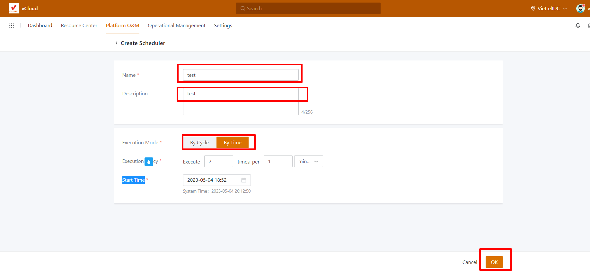
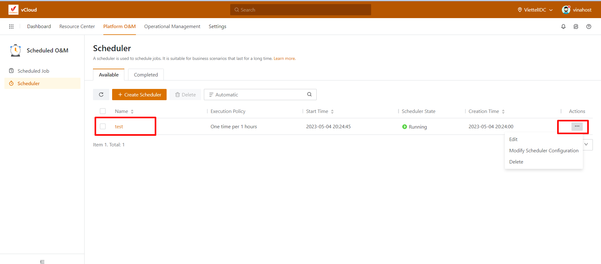
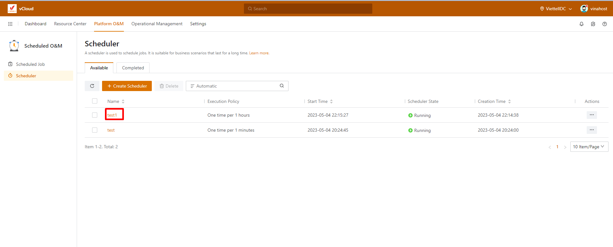
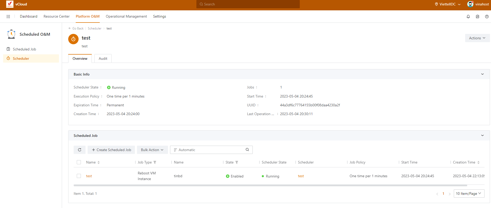
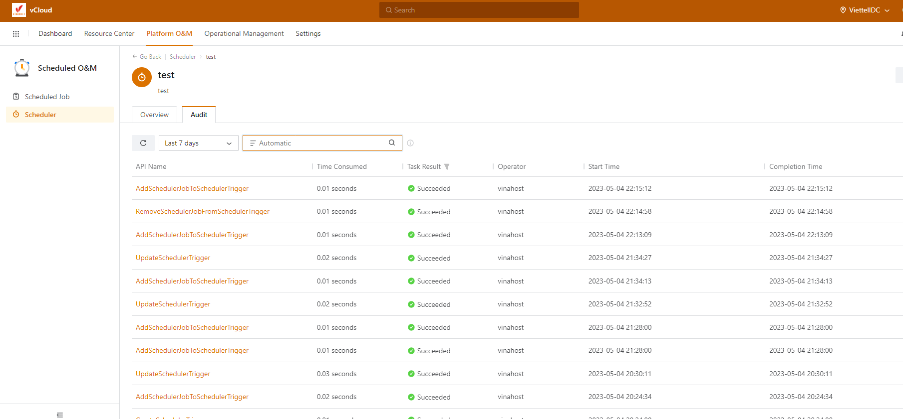

Bài viết này sẽ hướng dẫn bạn cách **Tạo Scheduler Trên vCloud VinaHost.** Nếu bạn cần hỗ trợ, xin vui lòng liên hệ VinaHost qua **Hotline 1900 6046 ext. 3**, email về [support@vinahost.vn](mailto:support@vinahost.vn) hoặc chat với VinaHost qua livechat [https://livechat.vinahost.vn/chat.php](https://livechat.vinahost.vn/chat.php).

Sau khi login vào hệ thông chọn Platform O&M và chọn chức năng Schedule & OM

Sau đó chọn schedule và chọn Create scheduler.

- Name: Đặt tên cho Scheduler.
- Description: mô tả công dụng của Scheduler đó.
- Execution Mode: Chọn chế độ thực hiên, ở đây chúng ta có hai chế độ By Cycle và By Time.
    - _By Cycle: Chế độ này thực hiện theo chu kì, VD: thực hiện một tác vụ nào đó  1 phút/giờ/ngày thực hiện 1 lần ._
    - _By Time: chế độ này thực hiện theo thời gian, VD: thực hiện một tác vụ nào đó 2-3 lần trên 1/phút/giờ/ngày._
- Execution Policy: Canh chỉnh thời gian và số lần thực hiện một tác vụ nào của Scheduler.
- Start Time: Thời gian bắt đầu của một Scheduler.

Đây là một Scheduler với name là test, chúng ta cũng có thể thây đổi các thông số của một Scheduler bằng cách nhấn vào đấu ba chấm.

 

- Edit: chúng ta có thể thẩy đổi thông tin của Name và Description của một Scheduler
- Modify Scheduler Configuration: chúng ta có thể thây đổi thông số của Execution Mode, Execution Policy và Start Time.

Chúng cũng có kiểm tra quá trình vận hành của một scheduler bằng cách nhấn vào tên của một scheduler.

Ở phần Overview chúng ta có thể kiểm tra được quá trình hoạt động của một scheduler. Ở đây scheduler đã được thêm vào Scheduler.

Job với tên là test, và VM đang hoạt động có tên là tinbd và các thông số khác.

Còn ở phần Audit chúng ta có theo dỗi quá trình vận hành của scheduler. Ví dụ như là tạo một scheduler, xóa một scheduler, chỉnh sửa một scheduler.

Chúc bạn thực hiện thành công!

> **THAM KHẢO CÁC DỊCH VỤ TẠI [VINAHOST](https://vinahost.vn/)**
> 
> **\>>** [**SERVER**](https://vinahost.vn/thue-may-chu-rieng/) **–** [**COLOCATION**](https://vinahost.vn/colocation.html) – [**CDN**](https://vinahost.vn/dich-vu-cdn-chuyen-nghiep)
> 
> **\>> [CLOUD](https://vinahost.vn/cloud-server-gia-re/) – [VPS](https://vinahost.vn/vps-ssd-chuyen-nghiep/)**
> 
> **\>> [HOSTING](https://vinahost.vn/wordpress-hosting)**
> 
> **\>> [EMAIL](https://vinahost.vn/email-hosting)**
> 
> **\>> [WEBSITE](http://vinawebsite.vn/)**
> 
> **\>> [TÊN MIỀN](https://vinahost.vn/ten-mien-gia-re/)**
