# Hướng dẫn tạo và thêm liên hệ từ file vào email marketing

!!! info 
     Bài viết này sẽ hướng dẫn bạn **Hướng dẫn tạo và thêm liên hệ từ file vào email marketing** ( hướng dẫn chuyển đổi file thành dạng csv, nội dung các trường: tên,email,ngày sinh..., phân tách như nào cho đúng định dạng). Nếu bạn cần hỗ trợ, xin vui lòng liên hệ VinaHost qua **Hotline 1900 6046 ext. 3**, email về [support@vinahost.vn](mailto:support@vinahost.vn) hoặc chat với VinaHost qua livechat [https://livechat.vinahost.vn/chat.php](https://livechat.vinahost.vn/chat.php).

## Hướng dẫn tạo và thêm liên hệ từ file vào email marketing

#### Chuẩn bị

1. Tạo danh sách liên hệ từ Excel. Bước này có thể thêm vào những thông tin đã thu thập được.

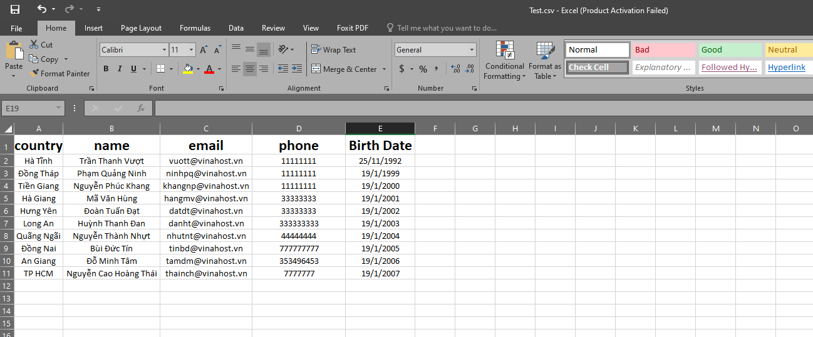

2. Lưu file này dưới dạng file csv

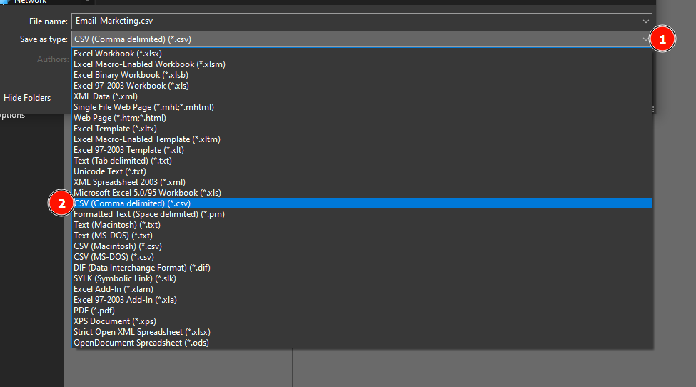

Vậy là ta đã có file chứa thông tin khách hàng để có thể import vào Email Marketing

#### Tiến hành thêm liên hệ và upload file lên Email Marketing

1. Đăng nhập vào tài khoảng Email Marketing và tiến hành tạo danh sách liên hệ.

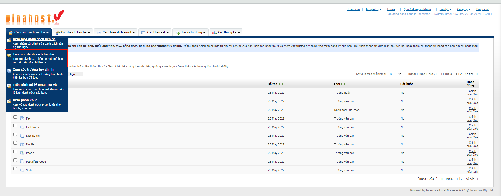

2. Tiến hành tạo một danh sách liên hệ mới.

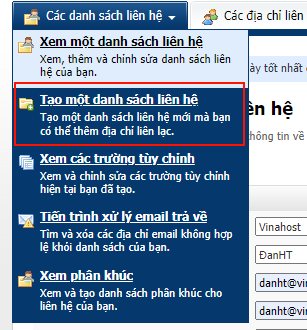

Tại đây bạn cần điền một số thông tin về danh sách đã được tạo.

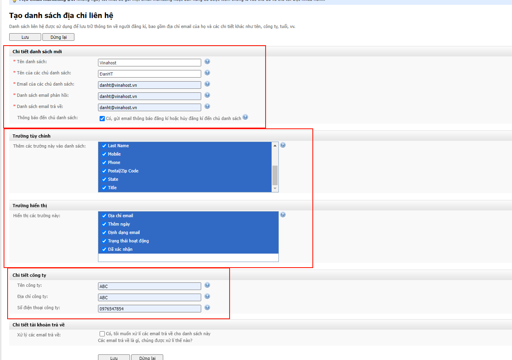

!!! note
    Đối với phần Trường tùy chỉnh đây chính là các trường bạn đã tạo trong file excel đã chuẩn bị từ trước.
    Ở đây mặc định Vinahost sẽ cung cấp sẳn một số trường tuỳ chỉnh có sẳn như: birth date, city, country, fax......
    Bạn cũng có thể thêm các trường tuỳ chỉnh này tuỳ theo như cầu của bạn tại phần **Xem các trường tuỳ chỉnh** và chọn vào **Tạo một trường tuỳ chỉnh**. Phần này mình sẽ hướng dẫn các bạn vào một bài hướng dẫn khác.

Quay trở lại với công việc thêm danh sách liên hệ của chúng ta. Sau khi nhập các thông tin trên các bạn chọn Lưu lại danh sách.
Sau khi lưu danh sách sẽ hiện ra dưới tên mà các bạn đã đặt.

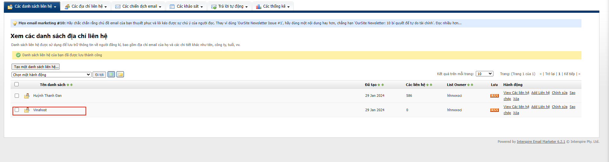

3. Sau khi đã có danh sách liên hệ ta tiến hành import thông tin từ file đã chuẩn bị vào danh sách liên hệ.
Ta vào phần **Các địa chỉ liên hệ >> Nhập các liên hệ từ file**
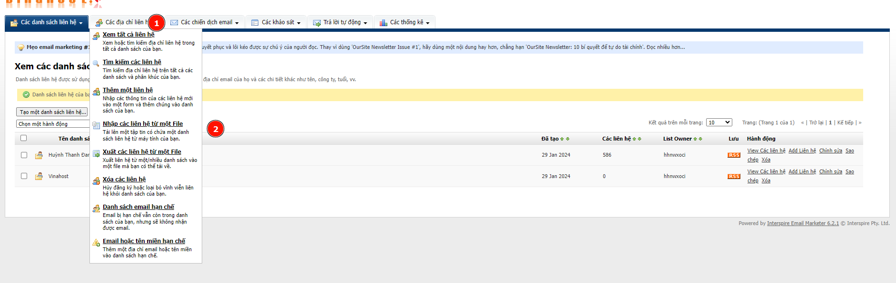

Sau đó ta chọn 1 danh sách liên hệ để import thông tin liên hệ vào sau đó chọn Next để qua bước kế tiếp.

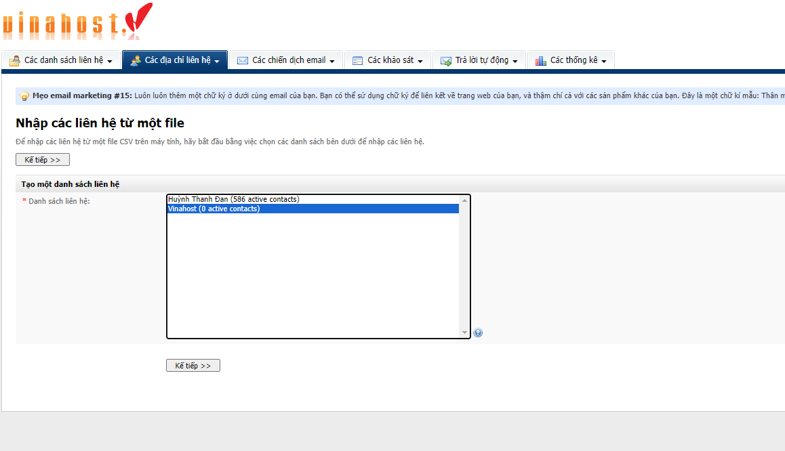

Tại bước này ta cần chú ý một số điểm như sau: 
- Định dạng file : Text. Do chúng ta sẽ import danh sách từ 1 file csv vào hệ thống nên định dạng chúng ta sẽ chọn là text.
- Chia tách trường: **,** . Mặc định các file csv sẽ ngăn cách các giá trị với nhau thông qua dấu "," khi mở ở dạng text nên phần này để chia cắt trường ta chọn dấu ","
- Sau đó chọn Upload để tiến hành tải file lên hệ thống ( Lưu ý : một lần chỉ có thể import 1 file tối đa 10MB nếu cần liên hệ nhiều hơn có thể chia nhỏ file ra để có thể import nhiều lần)
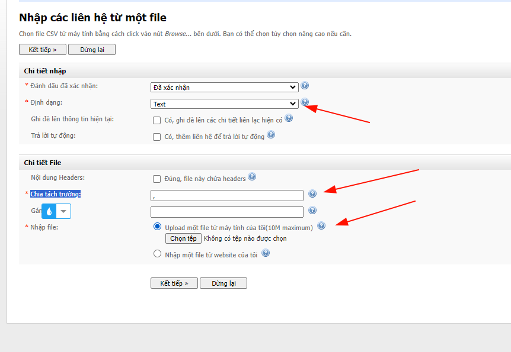

Tiếp theo ta sẽ quyết định các thông tin trên excel sẽ đóng vai trò là trường nào dữ liệu của email marketting ta đã import.

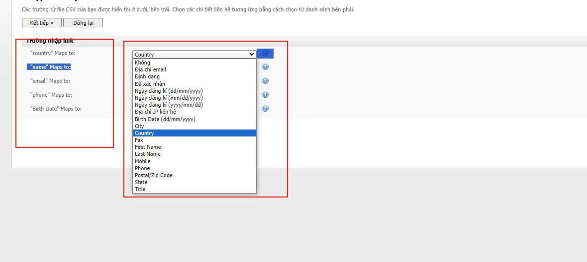

Trong hình trên các cột bên trái là các trường ta đã nhập trong file excel đã chuẩn bị từ trước. Ta sẽ chọn đúng format cho dữ liệu của Email Marketing ở cột bên phải sau cho tương ứng với nhau.
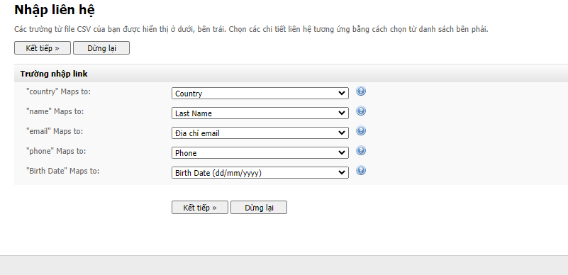

Sau đó chọn Next >> Bắt đầu nhập để tiến hành import.
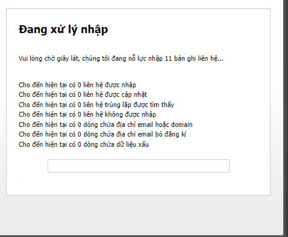

Sau khi đã nhận được thông tin nhập liên hệ thành công đồng nghĩa công việc đã hoàn thành.
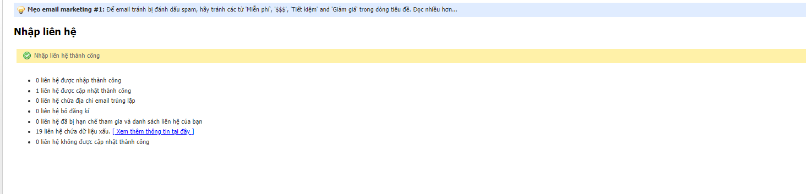
Để kiểm tra lại danh sách liện hệ có thể vào phần **Xem các danh sách liên hệ chọn View** của danh sách cần xem.

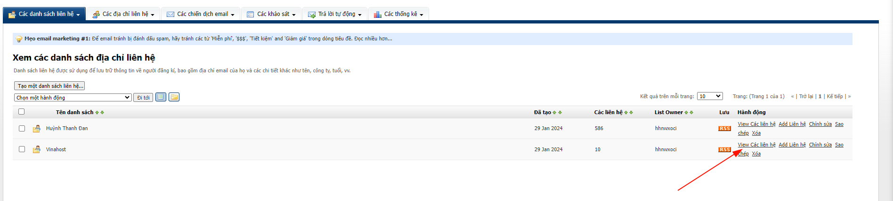

Đến đây là đã hoàn thành công việc import thông tin từ file lên Email Marleting và có thể sử dụng danh sách để gửi chiến dịch mail.

Chúc bạn thực hiện thành công!

> **THAM KHẢO CÁC DỊCH VỤ TẠI [VINAHOST](https://vinahost.vn/)**
> 
> **\>>** [**SERVER**](https://vinahost.vn/thue-may-chu-rieng/) **–** [**COLOCATION**](https://vinahost.vn/colocation.html) – [**CDN**](https://vinahost.vn/dich-vu-cdn-chuyen-nghiep)
> 
> **\>> [CLOUD](https://vinahost.vn/cloud-server-gia-re/) – [VPS](https://vinahost.vn/vps-ssd-chuyen-nghiep/)**
> 
> **\>> [HOSTING](https://vinahost.vn/wordpress-hosting)**
> 
> **\>> [EMAIL](https://vinahost.vn/email-hosting)**
> 
> **\>> [WEBSITE](http://vinawebsite.vn/)**
> 
> **\>> [TÊN MIỀN](https://vinahost.vn/ten-mien-gia-re/)**
