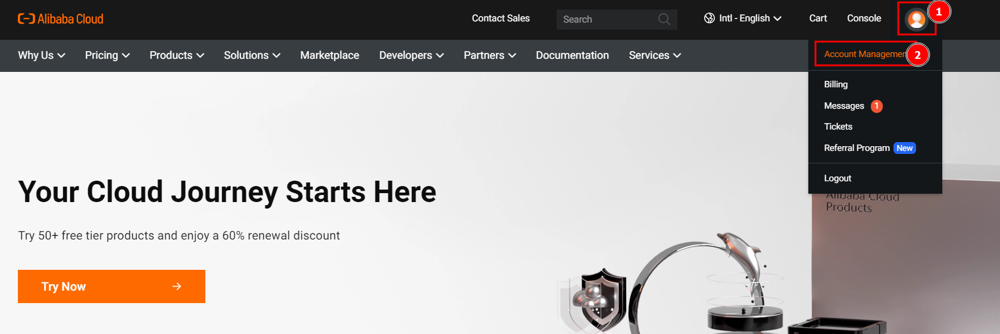
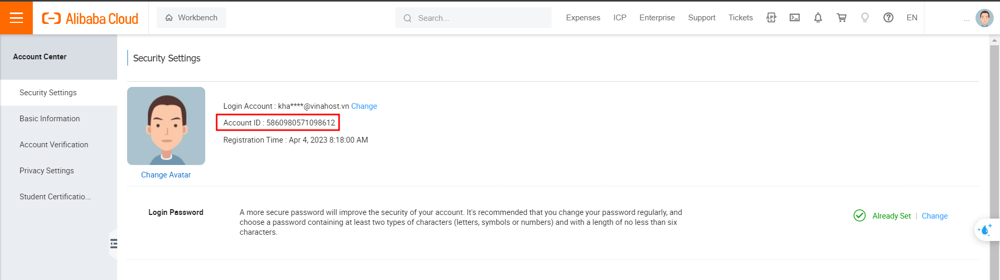
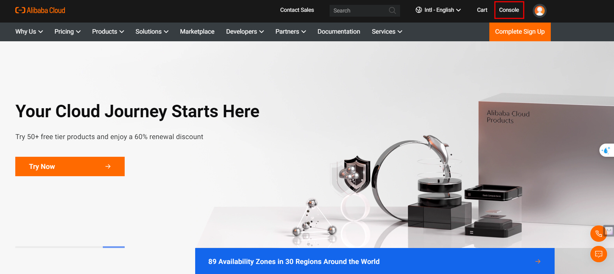
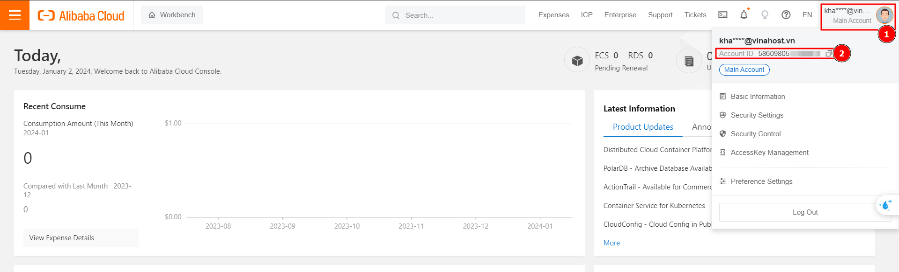

# Hướng dẫn tìm UID trên Alibaba Cloud
Bài viết này sẽ hướng dẫn bạn **Tìm UID của một account trên Alibaba Cloud**. Nếu bạn cần hỗ trợ, xin vui lòng liên hệ VinaHost qua **Hotline 1900 6046 ext. 3**, email về [support@vinahost.vn](mailto:support@vinahost.vn) hoặc chat với VinaHost qua livechat [https://livechat.vinahost.vn/chat.php](https://livechat.vinahost.vn/chat.php).

1. **UID là gì?**

	Trên nền tảng Alibaba Cloud, UID (hay  **Unique Identifier**) là một dãy khoảng 16 chữ số gắn liền với tài khoản của người dùng. Dãy số này là **duy nhất** và không trùng với bất kỳ tài khoản nào khác trên Alibaba Cloud. Có thể sử dụng nó để định danh tài khoản, kiểm tra các hóa đơn, các dịch vụ liên kết.
2. **Xem UID trên Dashboard**
	- Đăng nhập tài khoản Alibaba Cloud tại đường link: [account.alibabacloud.com](https://account.alibabacloud.com/).
	- Nhấn vào biểu tượng **Account** ở góc trên bên phải, chọn **Account Managerment**, trang **Account Center > Security Settings** sẽ hiển thị UID (mục **Account ID**).
	
	
	*
Bước 1: Truy cập Account Management
*
	
	 
	*
Bước 2: Xem Account ID trên dashboard
*
	
	- Ngoài ra, có thể xem UID trực tiếp bằng cách nhấn vào biểu tượng Account ở góc trên bên phải, nếu truy cập vào **Cloud Architect Design Tools (CADT) Console**:
	
	
	*
Bước 1: Truy cập giao diện CADT Console
*
	
	
	*
Bước 2: Xem UID (Account ID)
*
	
1. **Đọc thêm**
	1. [Obtain the UID of an Alibaba Cloud Account](https://www.alibabacloud.com/help/en/cadt/support/how-do-i-obtain-the-unique-identifier-of-an-alibaba-cloud-account)
