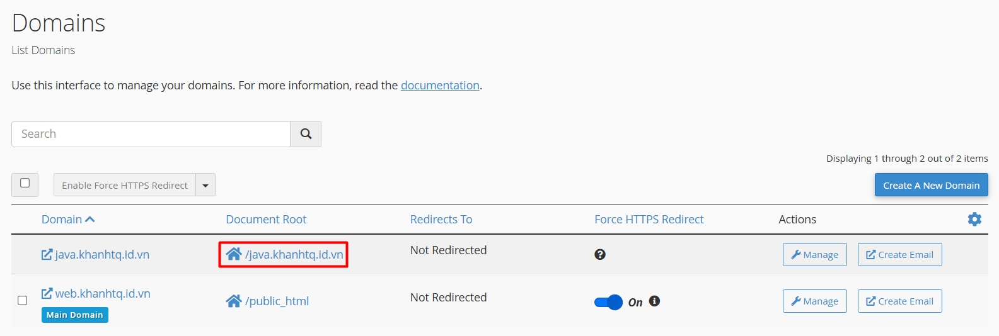
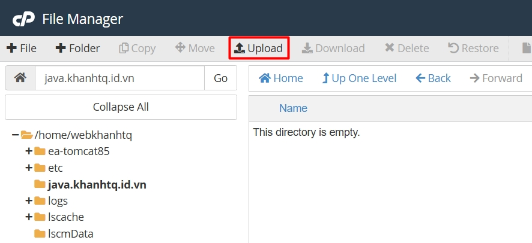
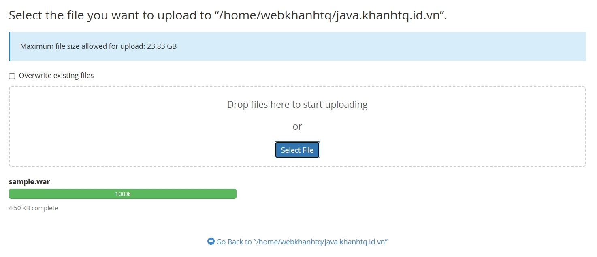
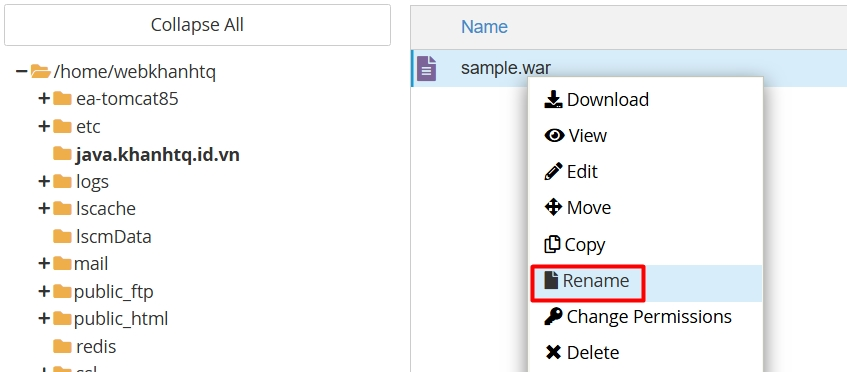
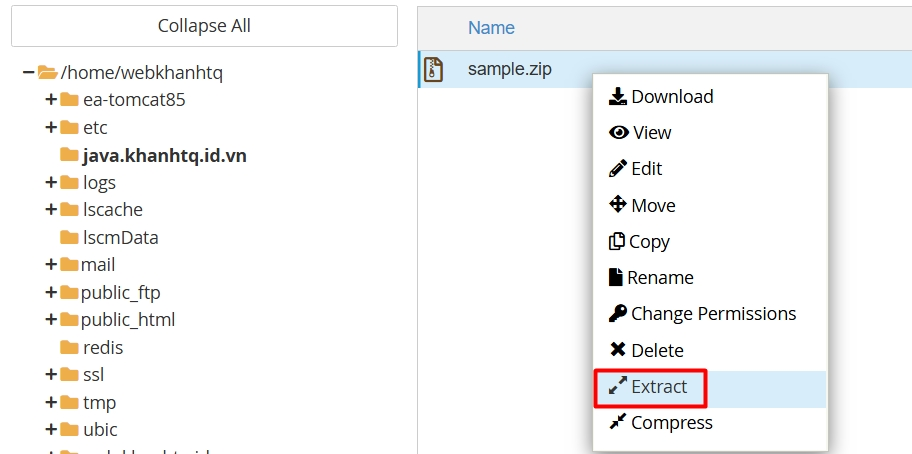
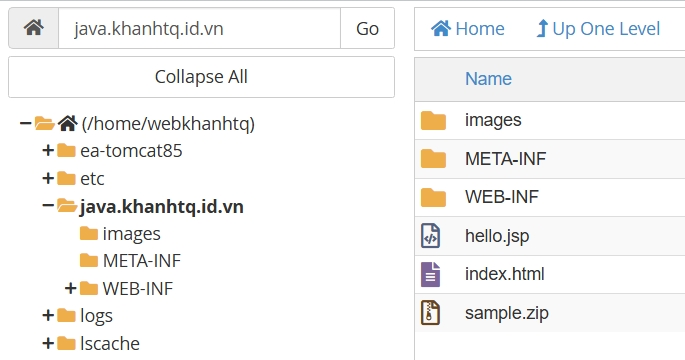
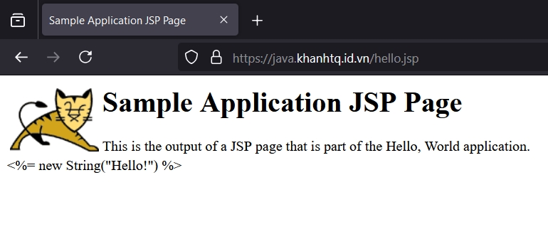
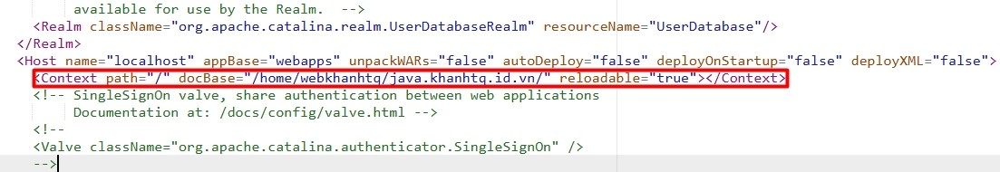
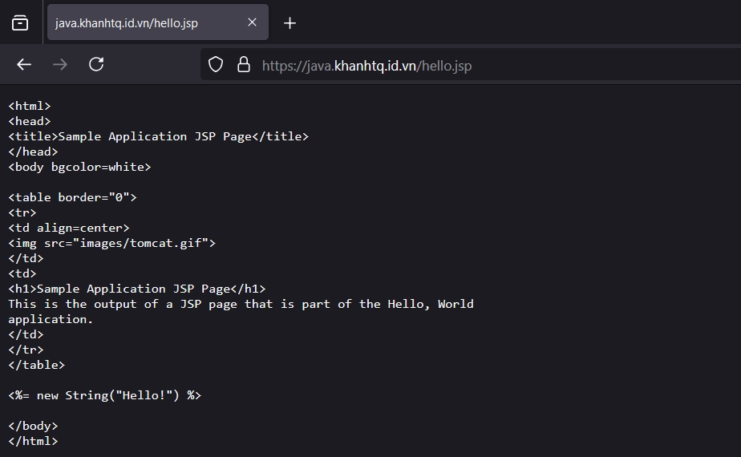
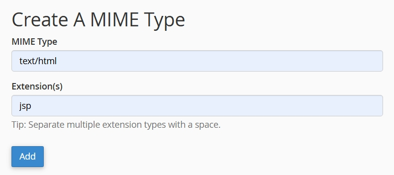

Hướng dẫn triển khai Java webapp trên cPanel
===

!!! info
    Bài viết này sẽ hướng dẫn bạn **triển khai Java webapp trên cPanel**. Nếu bạn cần hỗ trợ, xin vui lòng liên hệ VinaHost qua hotline **1900 6046 nhánh số 3**, gửi email đến địa chỉ [support@vinahost.vn](mailto:support@vinahost.vn) hoặc chat trực tiếp tại [https://livechat.vinahost.vn/chat.php](https://livechat.vinahost.vn/chat.php)

<hr>

# Các bước triển khai

**Mẹo:** Vui lòng tham khảo mục **[Gỡ lỗi](#gỡ-lỗi)** khi gặp trục trặc trong quá trình triển khai.

## Bước 1: Xác định thư mục gốc

Trong giao diện cPanel, thư mục gốc của các tên miền được hiển thị tại tính năng **Domains**.



Nhấn vào thư mục gốc của tên miền cần triển khai Java webapp.

**Mẹo:** Để tạo một tên miền mới, chọn **Create A New Domain**.

## Bước 2: Tải mã nguồn lên hosting

Tại giao diện **File Manager**, nhấn **Upload** và tải lên tệp mã nguồn có phần mở rộng là ***.war***.





Sau khi tải lên thành công, đổi phần mở rộng của tệp từ ***.war*** thành ***.zip***.



Giải nén tệp vừa đổi tên.





## Bước 3: Khởi động lại Tomcat

Trong giao diện cPanel, truy cập **Terminal** và chạy lệnh sau để áp dụng các thay đổi:

```
ubic restart ea-tomcat85
```

Để xem trạng thái của Tomcat, chạy lệnh:

```
ubic status ea-tomcat85
```

Đảm bảo Tomcat có trạng thái **running**.

## Bước 4: Kiểm tra

Truy cập **https://tên_miền_của_bạn/hello.jsp** trên trình duyệt và đảm bảo nó được hiển thị như ảnh sau:



Như vậy là chúng ta đã triển khai thành công Java webapp.

<hr>

# Gỡ lỗi

Trong quá trình triển khai, bạn có thể gặp một số lỗi sau đây.

## Lỗi 1: Không tìm thấy lệnh `ubic`

Khi chạy các lệnh ở **[Bước 3](#bước-3-khởi-động-lại-tomcat)**, bạn có thể gặp phải lỗi:

```
ubic: command not found
```

Tại giao diện cPanel, truy cập **Terminal**, mở tệp **~/.bashrc** để chỉnh sửa:

```
vi ~/.bashrc
```

Thêm dòng sau vào cuối tệp **~/.bashrc** và lưu lại:

```
export PATH=$(dirname $(readlink /usr/local/cpanel/3rdparty/bin/perl)):$PATH
```

Để áp dụng ngay sự thay đổi, chạy lệnh:

```
source ~/.bashrc
```

## Lỗi 2: Truy cập 404

Tại **[Bước 4](#bước-4-kiểm-tra)** nếu gặp lỗi 404, nguyên nhân có thể là:

- Không tồn tại tệp mã nguồn
- Sai quyền truy cập thư mục/tệp mã nguồn
- Sai đường dẫn thư mục gốc

Cách khắc phục:

- Kiểm tra xem tệp mã nguồn đã được tải lên hay chưa
- Đặt lại quyền: 755 đối với thư mục và 644 đối với tệp
- Chỉ định đường dẫn cụ thể đến webapp:
  - Trong **File Manager**, mở tệp **ea-tomcat85/conf/server.xml**
  - Thêm dòng:
    ```
    <Context path="/" docBase="/home/username/docroot/" reloadable="true"></Context>
    ```
    **username:** tên người dùng cPanel<br>
    **docroot:** thư mục gốc (xem tại **[Bước 1](#bước-1-xác-định-thư-mục-gốc)**)<br>
    vào dưới dòng sau:
    ```
    <Host name="localhost" appBase="webapps" unpackWARs="false" autoDeploy="false" deployOnStartup="false" deployXML="false">
    ```
  - Tệp sau khi thêm:
    
  - Lưu tệp và khởi động lại Tomcat.

## Lỗi 3: Hiển thị mã HTML

Tại **[Bước 4](#bước-4-kiểm-tra)**, khi truy cập trang web có thể hiển thị các đoạn mã HTML thay vì giao diện. 



Trong giao diện cPanel, truy cập **MIME Types** và thêm *MIME type* như sau:



Nhấn **Add** để thêm rồi kiểm tra lại.

**Chúc bạn thực hiện thành công!** 🥳

> **THAM KHẢO CÁC DỊCH VỤ TẠI [VINAHOST](https://vinahost.vn/)**
> 
> **\>>** [**SERVER**](https://vinahost.vn/thue-may-chu-rieng/) **–** [**COLOCATION**](https://vinahost.vn/colocation.html) – [**CDN**](https://vinahost.vn/dich-vu-cdn-chuyen-nghiep)
> 
> **\>> [CLOUD](https://vinahost.vn/cloud-server-gia-re/) – [VPS](https://vinahost.vn/vps-ssd-chuyen-nghiep/)**
> 
> **\>> [HOSTING](https://vinahost.vn/wordpress-hosting)**
> 
> **\>> [EMAIL](https://vinahost.vn/email-hosting)**
> 
> **\>> [WEBSITE](http://vinawebsite.vn/)**
> 
> **\>> [TÊN MIỀN](https://vinahost.vn/ten-mien-gia-re/)**
