Bài viết này sẽ hướng dẫn bạn cách **Hướng dẫn upload source code và database lên VPS sử dụng Directadmin** Nếu bạn cần hỗ trợ, xin vui lòng liên hệ VinaHost qua **Hotline 1900 6046 ext. 3**, email về [support@vinahost.vn](mailto:support@vinahost.vn) hoặc chat với VinaHost qua livechat [https://livechat.vinahost.vn/chat.php](https://livechat.vinahost.vn/chat.php).

# Hướng dẫn tạo user và domain trên Directadmin

**Bước 1** Login vào giao diện Directadmin

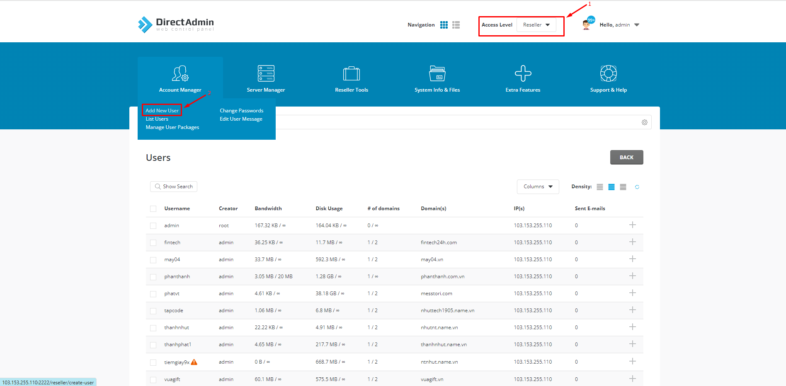

**Bước 2** Chọn **Access Level Reseller** ==> Chọn mục **Account Manager** ==> Chọn **Add New User** 

**Bước 3** Điền các thông tin cần thiết như: Username, E-mail, Password và Domain cần tạo

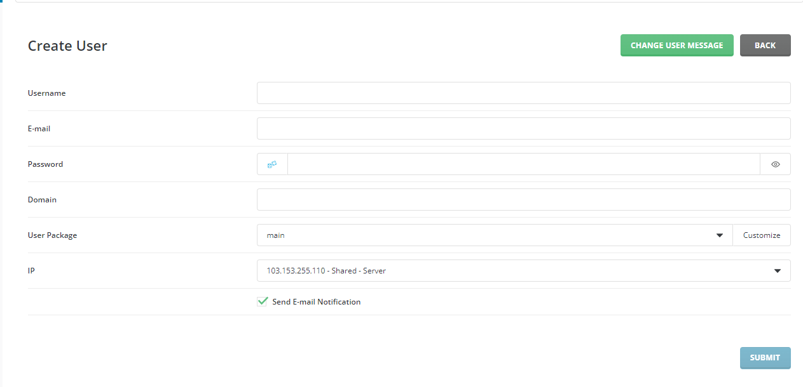

Chọn **Submit** để tạo user và domain

# Login vào Directadmin bằng Username và Domain

**Bước 1** Truy cập vào địa chỉ IP đang sử dụng Directadmin có cấu trúc như sau: http://IP:2222.

Nhập thông tin username và password muốn login vào

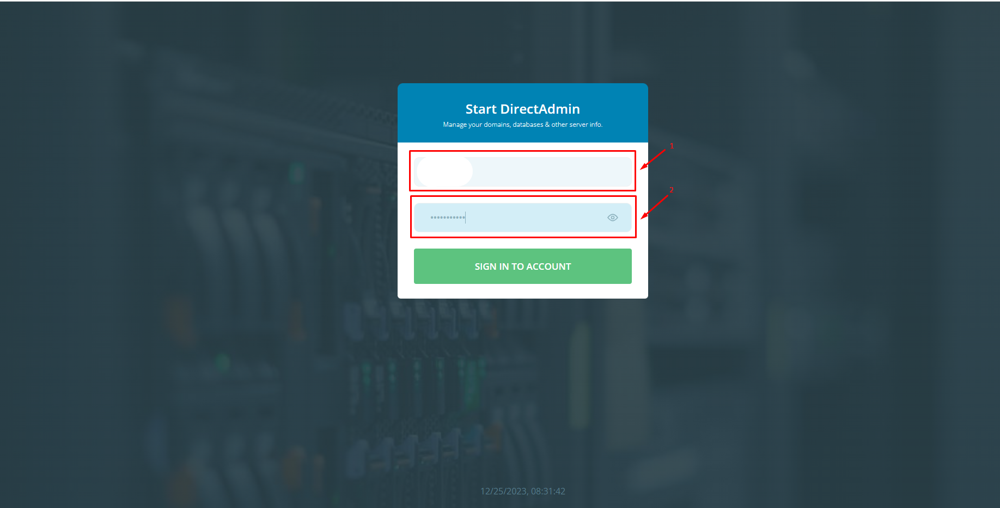

# Upload Source Lên Directadmin

Sau khi login vào user và domain vừa tạo ta tiến hành upload source để có thể deploy website ta thao tác theo các bước sau

**Bước 1** Chọn **System Info & Files** ==> Chọn **File Manager** ==> Chọn thư mục **public_html**

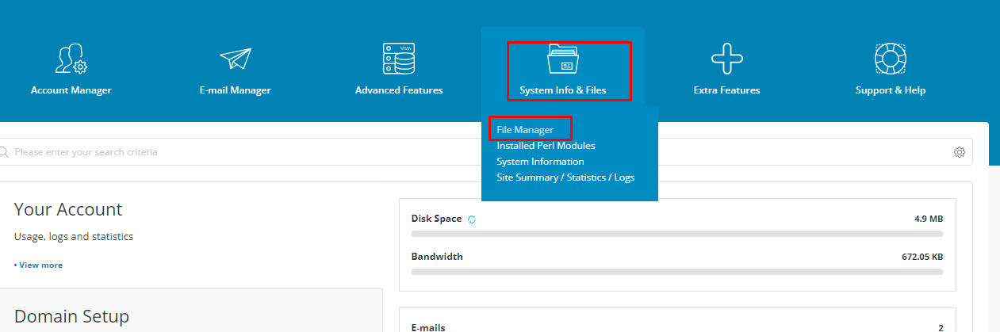

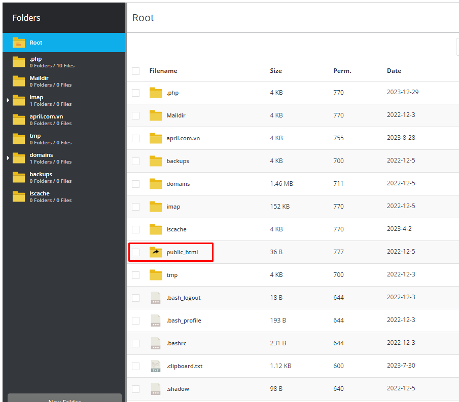

**Bước 2** Xóa tất cả các file cũ bên trong **public_html** để upload source code mới vào.
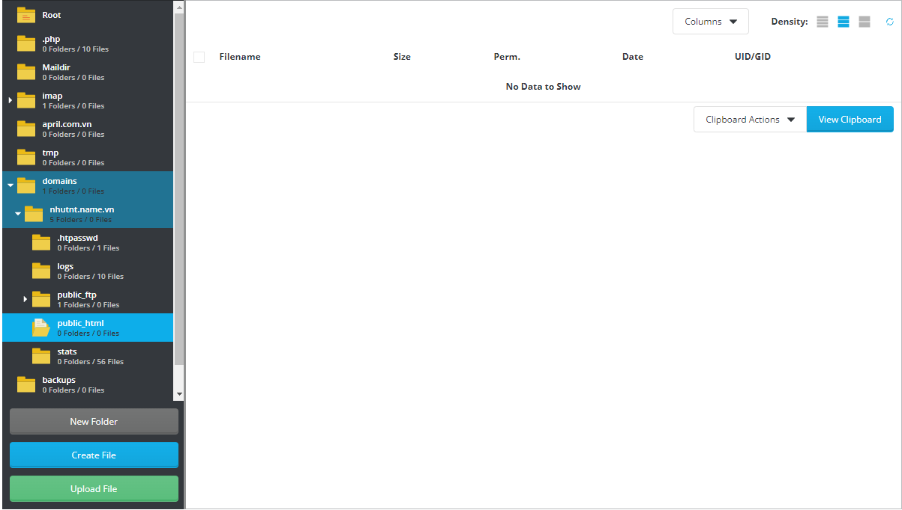

**Bước 3** Chọn **Upload File** để upload source code của mình lên

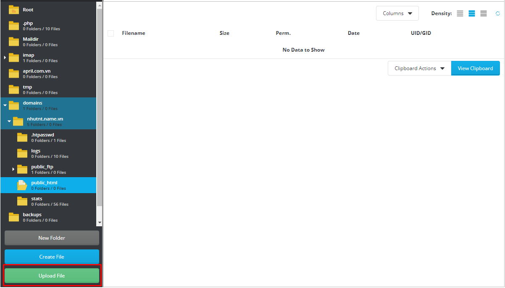

**Bước 4** Sau khi upload source code lên ta đưa con trỏ chuột vào file nén. Sau đó chọn **Extract** để giải nén source code

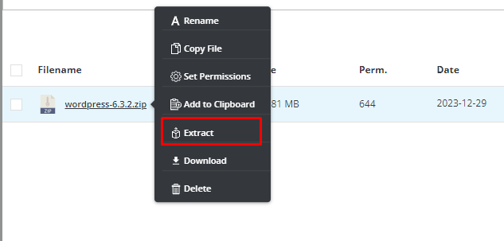

Sau khi hoàn thành quá trình upload source code ta thực hiện bước tiếp theo đó là **Tạo và Import Database**

# Tạo và Import Database trên Directadmin

**Bước 1** Chọn vào mục **Account Manager** ==> Chọn mục **MySQL Management**

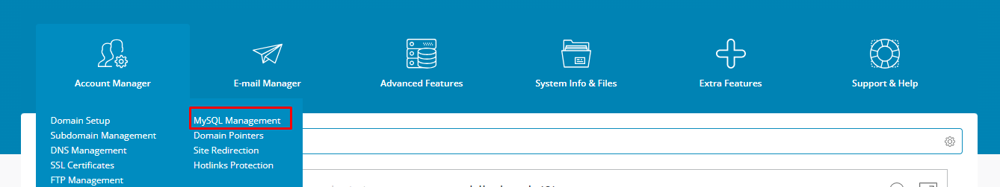

**Bước 2** Chọn **Create New Database** để tạo database mới

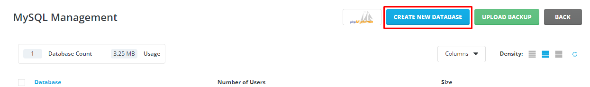

**Bước 3** Điền thông tin và Password mà mình muốn tạo.

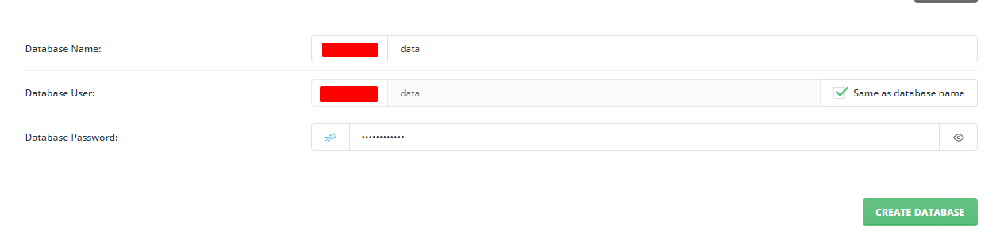

Chọn **Create Database** để khởi tạo.

**Bước 4** Sau khi tạo Database hoàn thành. Chúng ta sẽ truy cập vào **PhpMyAdmin** để Import Database.

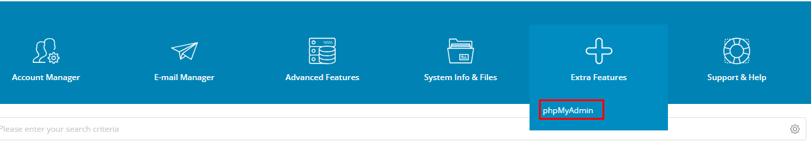

**Bước 5** Login vào phpMyAdmin bằng tài khoản đã tạo trước đó.

Sau đó ta thao tác như sau: Chọn vào **chọn vào bảng database mà ta muốn Import database lên** ==> Chọn **Nhập** ==> Chọn **Chọn Tệp** để Import Database. Sau đó chọn **Nhập** để thực hiện.

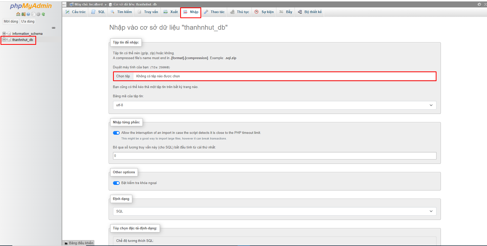

Chúc bạn thực hiện thành công!

> **THAM KHẢO CÁC DỊCH VỤ TẠI [VINAHOST](https://vinahost.vn/)**
> 
> **\>>** [**SERVER**](https://vinahost.vn/thue-may-chu-rieng/) **–** [**COLOCATION**](https://vinahost.vn/colocation.html) – [**CDN**](https://vinahost.vn/dich-vu-cdn-chuyen-nghiep)
> 
> **\>> [CLOUD](https://vinahost.vn/cloud-server-gia-re/) – [VPS](https://vinahost.vn/vps-ssd-chuyen-nghiep/)**
> 
> **\>> [HOSTING](https://vinahost.vn/wordpress-hosting)**
> 
> **\>> [EMAIL](https://vinahost.vn/email-hosting)**
> 
> **\>> [WEBSITE](http://vinawebsite.vn/)**
> 
> **\>> [TÊN MIỀN](https://vinahost.vn/ten-mien-gia-re/)**