Hướng dẫn xóa DNS cache trên Windows và trình duyệt
===================================================

Bạn có bao giờ gặp phải tình huống không thể vào được một trang web quen thuộc dù mạng vẫn hoạt động tốt? Có thể máy tính của bạn đang gặp một "**trục trặc nhỏ**". Bài viết này sẽ giúp bạn hiểu rõ hơn về nguyên nhân và cách khắc phục vấn đề này một cách đơn giản

## Cách xóa DNS cache trên Windows

Vinahost sẽ hướng dẫn các bước để xóa DNS cache cho máy tính sử dụng hệ điều hành **Windows**.

**Bước 1:** Click chuột vào biểu tượng **Windows** trên màn hình hoặc phím **Windows** trên bàn phím.

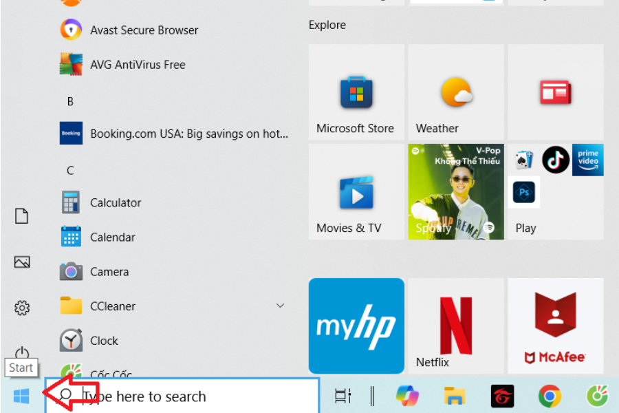

**Bước 2:** Gõ lệnh `cmd` vào ô tìm kiếm.

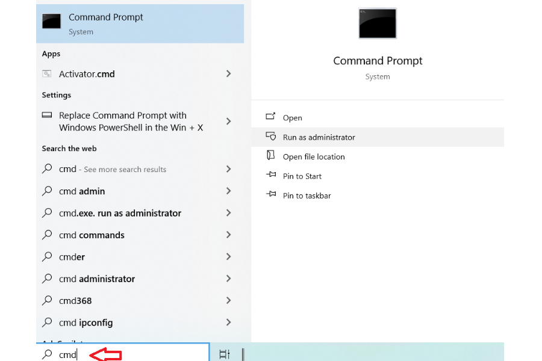

**Bước 3:** Chọn `Command Prompt`, sau đó chọn `Run as administrator`.

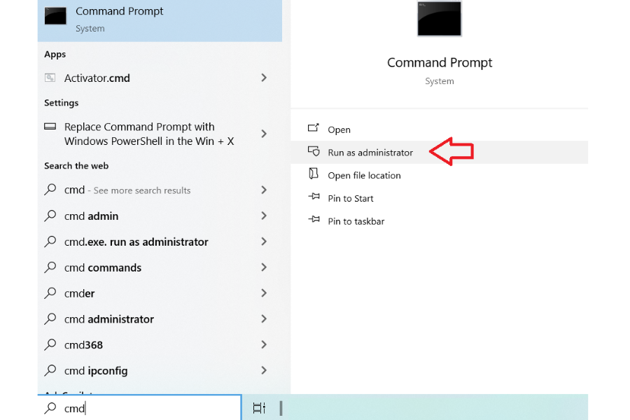

**Bước 4:** Khi cửa sổ Command Prompt xuất hiện, nhập `ipconfig /flushdns`, sau đó nhấn Enter.

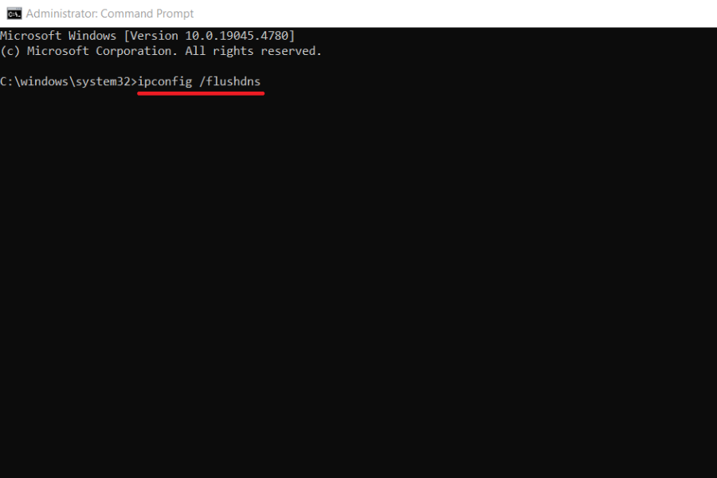

Nếu kết quả trong bảng hiện lên như trong hình, thì bạn đã xóa DNS cache trên Windows thành công.

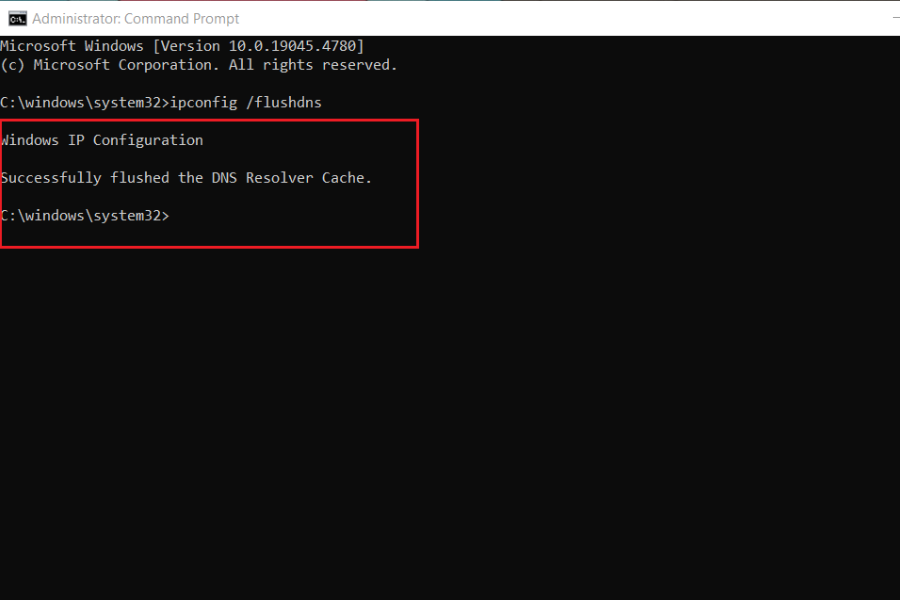

## Cách xóa DNS cache trên Chrome

Ngoài cách xóa DNS cache trên hệ điều hành, bạn còn có thể xóa trực tiếp trên trình duyệt. Sau đây là cách flush DNS trên trình duyệt **Chrome**.

**Bước 1:** Click vào ký hiệu ba dấu chấm ở góc phía trên bên phải màn hình Chrome.

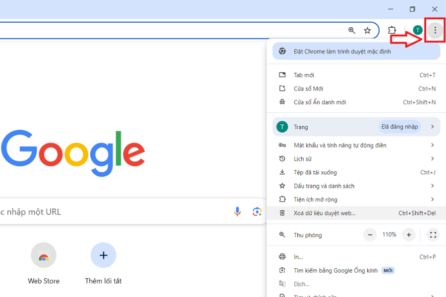

**Bước 2:**

\- Chọn `Xóa dữ liệu duyệt web…`.

\- Nếu trình duyệt của bạn không hiển thị trực tiếp dòng `Xóa dữ liệu duyệt web…`, chọn `Công cụ khác`, sau đó chọn `Xóa dữ liệu duyệt web…`.

\- Bạn có thể nhấn tổ hợp phím tắt `Ctrl + Shift + Del`.

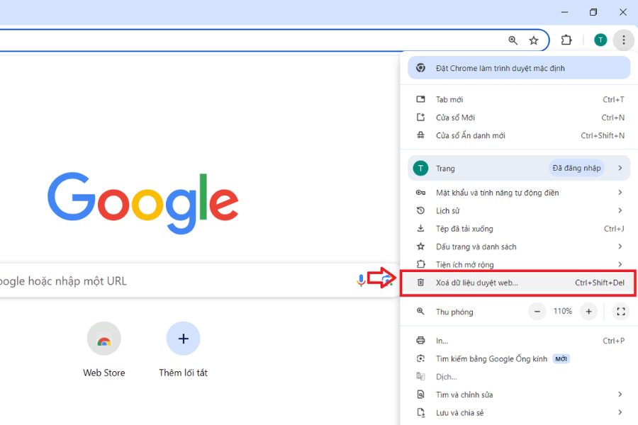

**Bước 3:** Màn hình sẽ hiển thị như hình bên dưới. Bạn cần chọn `Phạm vi thời gian` và các nội dung cần xóa, sau đó nhấn `Xóa dữ liệu`.

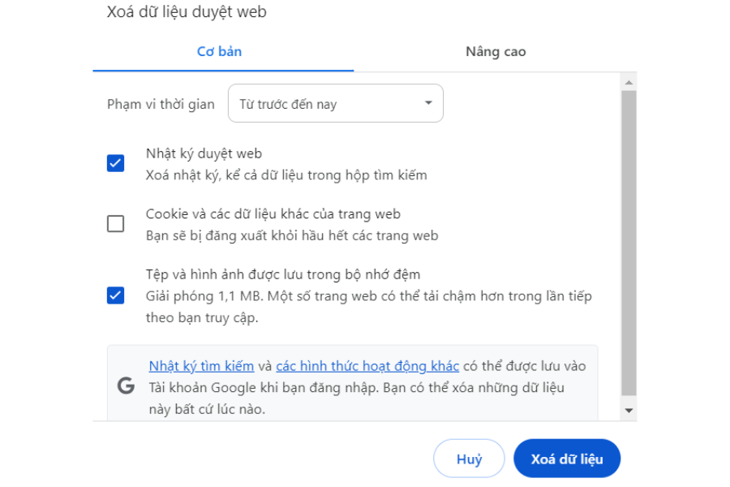

Vậy là bạn đã xóa DNS cache thành công.

## Cách xóa DNS cache trên Firefox

**Bước 1:** Mở trình duyệt **Firefox**, sau đó nhập lên thanh tìm kiếm nội dung như sau: `about:preferences#privacy`.

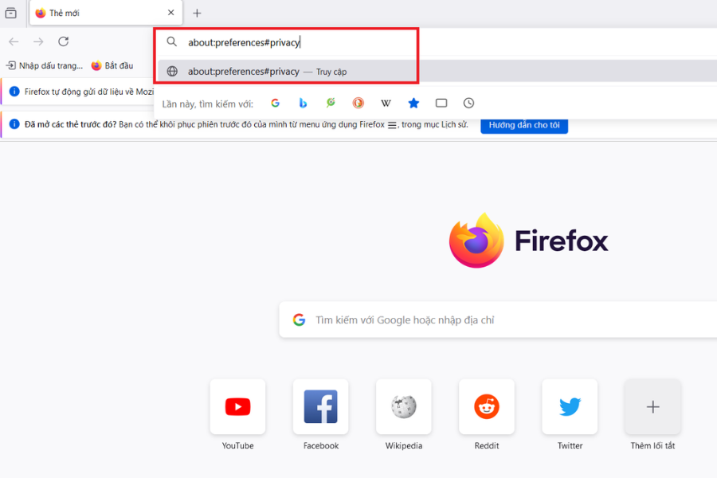

**Bước 2:** Màn hình sẽ hiển thị trang `Riêng tư & bảo mật` như hình dưới đây. Sau đó, tìm phần `Cookie và dữ liệu trang` và chọn `Xóa dữ liệu`.

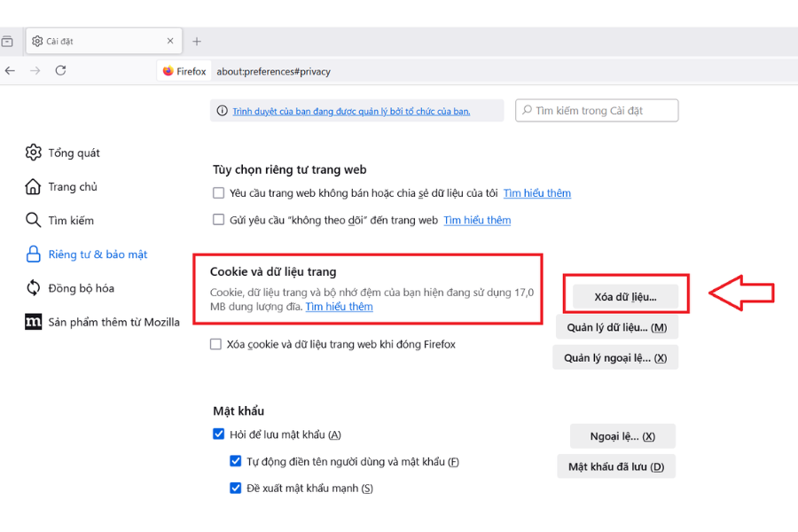

**Bước 3:** Chọn `Nội dung web lưu vào cache` hoặc `Các tập tin và trang được lưu trong bộ nhớ đệm tạm thời`, và chọn phạm vi thời gian muốn xóa; sau đó nhấn `Xóa`.

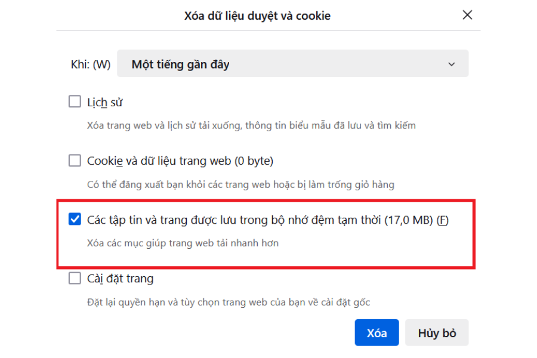

## Cách xóa DNS cache trên Microsoft Edge

**Bước 1:** Mở **Microsoft Edge**, sau đó nhấn tổ hợp phím `Ctrl + H` để mở lịch sử trình duyệt.

**Bước 2:** Chọn `Clear history` hoặc biểu tượng thùng rác như trong hình dưới đây.

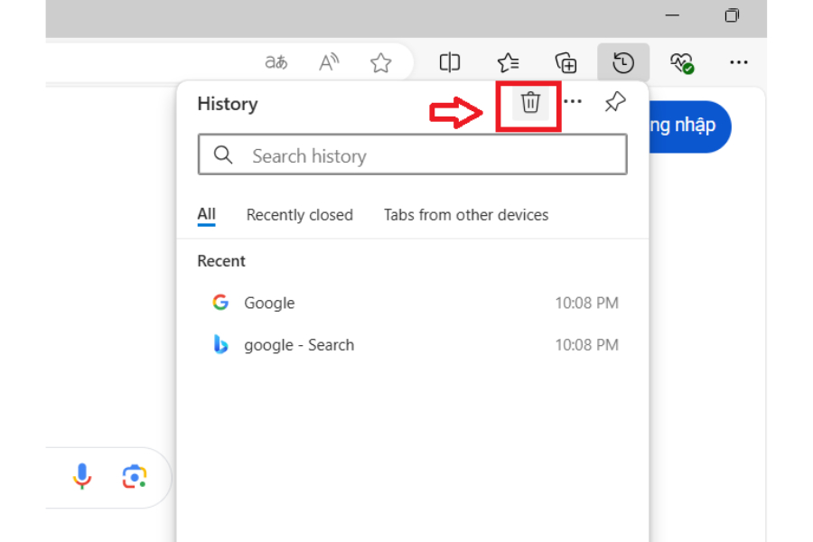

**Bước 3:** Tick chọn như hình bên dưới và ấn `Clear now`.

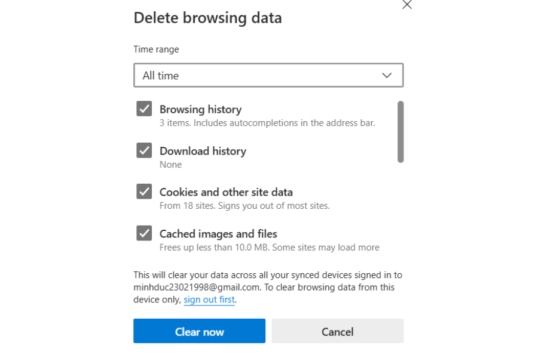

## Cách xóa DNS cache trên Cốc Cốc

**Bước 1:** Mở **Cốc Cốc**, sau đó nhấn tổ hợp phím `Ctrl + H` để mở lịch sử trình duyệt.

**Bước 2:** Nhấn `Xóa dữ liệu web`.

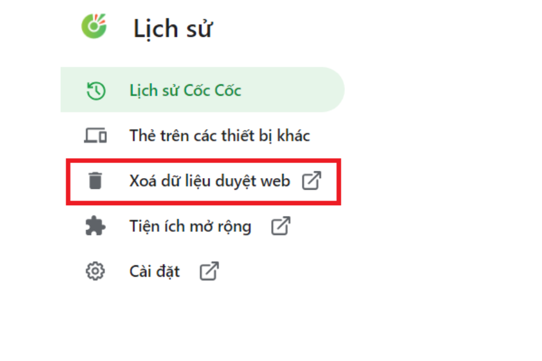

**Bước 3:** Chọn phạm vi thời gian và tick chọn như hình bên dưới, sau đó nhấn `Xóa dữ liệu`.

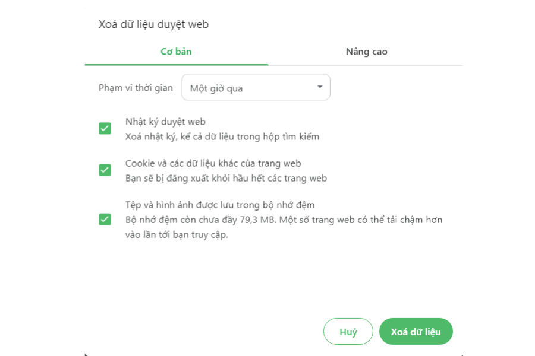

**Tổng kết**

Vinahost đã cung cấp hướng dẫn chi tiết về cách xóa bộ nhớ đệm DNS, giúp người dùng giải quyết hiệu quả lỗi DNS thường gặp. Việc xóa bộ nhớ đệm DNS sẽ giúp làm mới thông tin về địa chỉ IP và tên miền của website, đảm bảo truy cập diễn ra suôn sẻ.

Để tối ưu hóa hiệu suất và độ ổn định của website, các doanh nghiệp nên lựa chọn một nhà cung cấp hosting uy tín như Vinahost. Dịch vụ Web Hosting của Vinahost không chỉ cung cấp không gian lưu trữ mà còn đảm bảo website của bạn luôn sẵn sàng phục vụ khách hàng 24/7.

**Chúc bạn thực hiện thành công!** 🥳

> **THAM KHẢO CÁC DỊCH VỤ TẠI [VINAHOST](https://vinahost.vn/)**
> 
> **\>>** [**SERVER**](https://vinahost.vn/thue-may-chu-rieng/) **–** [**COLOCATION**](https://vinahost.vn/colocation.html) – [**CDN**](https://vinahost.vn/dich-vu-cdn-chuyen-nghiep)
> 
> **\>> [CLOUD](https://vinahost.vn/cloud-server-gia-re/) – [VPS](https://vinahost.vn/vps-ssd-chuyen-nghiep/)**
> 
> **\>> [HOSTING](https://vinahost.vn/wordpress-hosting)**
> 
> **\>> [EMAIL](https://vinahost.vn/email-hosting)**
> 
> **\>> [WEBSITE](http://vinawebsite.vn/)**
> 
> **\>> [TÊN MIỀN](https://vinahost.vn/ten-mien-gia-re/)**
