# Hướng dẫn sử dụng dịch vụ Public Cloud Vinahost

## 1. Đăng nhập vào Control Panel
Để biết thông tin đăng nhập vào hệ thống, Quý khách vui lòng kiểm tra hộp mail (bao gồm junk/spam box).

Để đăng nhập vào hệ thống, Quý khách thực hiện các bước sau:
- **Bước 1**: Mở trình duyệt web như CocCoc, Google Chrome, Firefox… và truy cập vào địa chỉ https://cs.vinahost.vn.
- **Bước 2**: Nhập Username (tên tài khoản) và Password (mật khẩu) VinaHost đã cấp trước đó cho Quý khách vào hai ô tương ứng ở trang https://cs.vinahost.vn và chọn Login.

Sau khi đăng nhập thành công thì Quý khách sẽ nhận được thông tin như hình bên dưới:

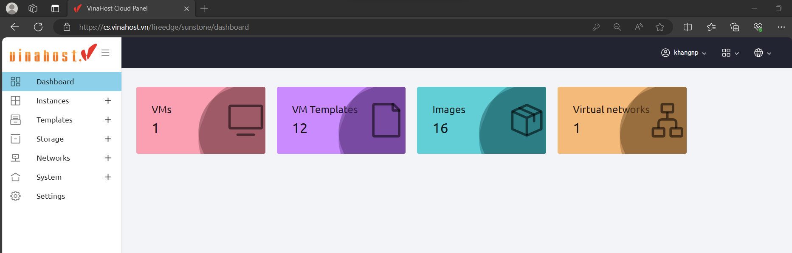
*
Hình 1: Giao diện quản trị Public Cloud
*

Nếu có vấn đề trong quá trình đăng nhập hoặc cần khôi phục lại mật khẩu truy cập, Quý khách vui lòng gửi yêu cầu hỗ trợ tới support@vinahost.vn hoặc truy cập địa chỉ https://vinahost.vn/ho-tro

## 2. Thay đổi mật khẩu và thêm Public Key

Quý khách có thể thay đổi mật khẩu đăng nhập, hoặc cấu hình thêm **Public Key**. Nếu **SSH Public Key** được cấu hình từ trước thì khi tạo VM, các template có sẵn sẽ hỗ trợ thêm **public ssh key của user này vào file authorized_keys trong VM**. User có thể dùng private key tương ứng để truy cập ssh vào VM ngay khi VM được tạo mà không cần password. Ngoài ra, có thể thêm Private Key, và Passphrase, để cho phép mở truy cập ssh vào VM ngay trên giao diện web (nhưng điều này không được khuyến khích):

- **Bước 1**: Đăng nhập vào https://cs.vinahost.vn
- **Bước 2**: Điều hướng đến **System** -> **User** 
- **Bước 3**: User name sẽ hiển thị trên màn hình, nhấn vào đó sẽ hiển thị thông tin chi tiết của User, như Info, Quota và Authentication. Hãy chọn tab **Authentication**.
- **Bước 4**: Chọn **Edit Public SSH Key**, thêm Public key đã chuẩn bị sẵn, sau đó nhấn **Save Change** để lưu lại Public Key.
- **Bước 5**: Password được hiện thị dưới dạng mã hash, và không có cách nào để xem bản plain-text của password. Tại ô Password, nhập mật khẩu cần đổi, nhấn Save change, thì Password sẽ tự động được thay đổi, lưu và có mã hash mới.

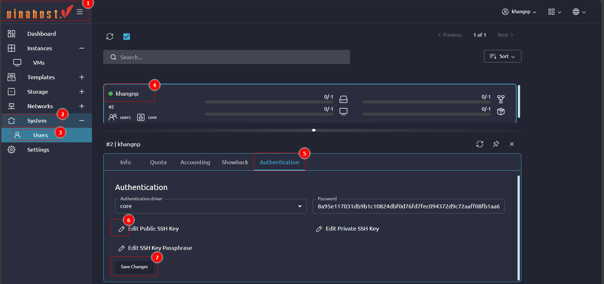
*
Hình 2: Thay đổi Public Key hay password
*

## 3. Khởi tạo Virtual Machine

Giao diện web hỗ trợ Quý khách khởi tạo nhiều Virtual Machine (VM) với OS khác nhau dựa trên các Template (như Ubuntu, CentOS,...) có sẵn. Quý khách cần **chọn Template**, **cấp tài nguyên** như **CPU**, **RAM**, **Disk**, và **Network** để tạo VM. Nếu các Template có sẵn không đáp ứng được nhu cầu của Quý khách (không có hệ điều hành mong muốn, hoặc VM không có sẵn các ứng dụng), xin hãy liên hệ chúng tôi, chúng tôi sẽ hỗ trợ tạo thêm Template theo yêu cầu. Ngoài ra Quý khách có thể upload các "images" có sẵn của mình lên để tạo VM. Chi tiết các bước như sau:

- **Bước 1**: Khởi tạo VM. Truy cập vào **Instances** -> **VMs**, chọn **Create**.  

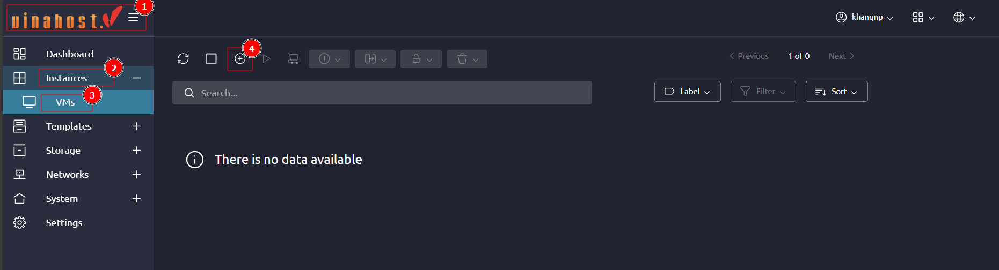
*
Hình 3: Tạo Virtual Machine
*

- **Bước 2**: Lựa chọn Template. Khi chọn nút Create, giao diện khởi tạo VM sẽ hiện ra, Quý khách cần lựa chọn một trong các Template có sẵn để khởi tạo VM, chúng tôi cung cấp một số Template có sẵn như: Windows, Ubuntu 22.04, CentOS 7,... 

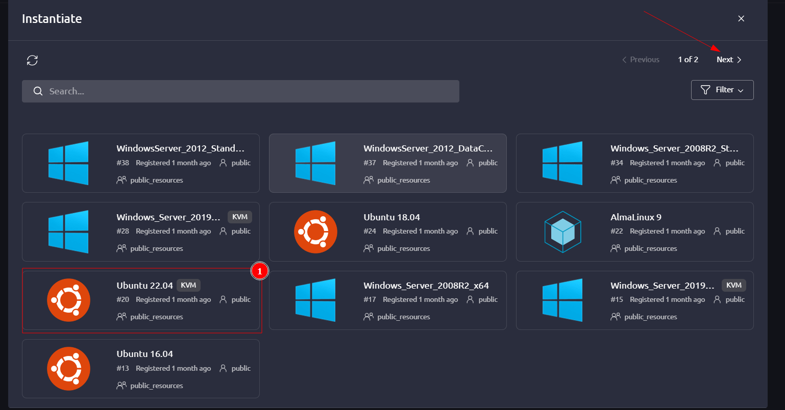
*
Hình 4: Lựa chọn Template khi tạo VM
*

- **Bước 3**: Sau khi chọn Template, cần điền thêm thông tin về **tên VM**, **Memory** (hay RAM ở đơn vị MB), số lượng **Virtual CPU** (tỉ lệ Virtual CPU và Physical CPU là 1:1, 1 core Virtual CPU = 1 core Physical CPU). Cloud VM có thể thay đổi tài nguyên *sau khi khởi tạo* mà không cần restart lại VM. Các cấu hình còn lại nên để ở mặc định. Sau khi cấu hình xong, nhấn **Next** để sang cấu hình tiếp theo.

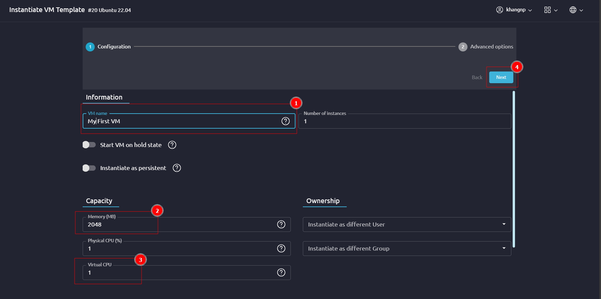
*
Hình 5: Tạo Virtual Machine
*

- Bước 4: Cấu hình Storage. Tại **tab Storage** có hiển thị *base image* là disk chứa OS đã được build sẵn và được quy định trong Template (ở bước 2), chọn mục **Edit**. Tại đây, có danh sách các image có sẵn, nhưng không nên thay đổi các image này, do Template đã quy định tên Image, nếu thay đổi sẽ dẫn đến các vấn đề tương thích. Chọn **Next** để qua tab **Advanced Options**. Tại đây cần thay đổi **dung lượng disk** phù hợp (đơn vị tính là MB, **1 GB = 1024MB**), các thông số khác nên để mặc định do các cấu hình này đã được tối ưu. Cuối cùng nhấn **Finish** để lưu cấu hình.

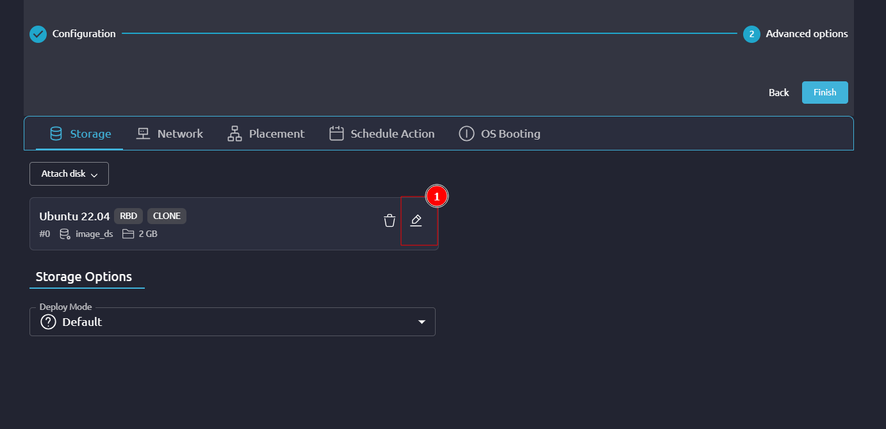
*
Hình 6: Edit Storage
*

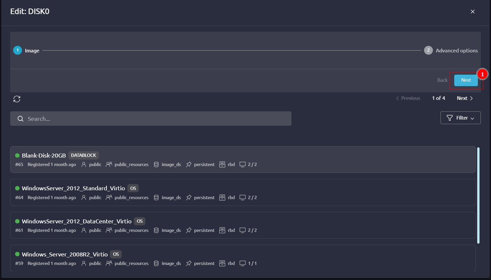
*
Hình 7: Danh sách các Image có sẵn
*

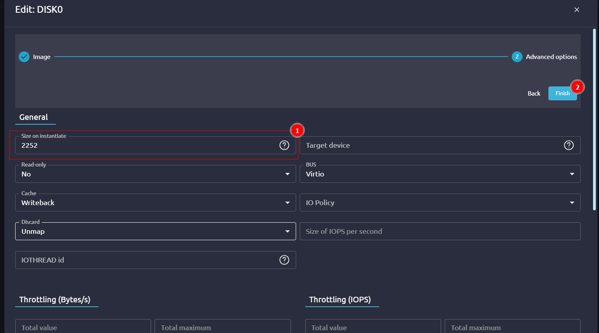
*
Hình 8: Thay đổi dung lượng của disk hiện tại
*

- **Bước 5**: Cấu hình Network. Điều hướng đến **tab Network**, chọn **Attach Nic** để thêm card mạng vào VM. Tại giao diện **Attach Nic** chọn Network **public1226**. Nhấn **Next** để qua Advanced Options, tại đây có thể thêm cấu hình IP, gateway. Nhưng khuyến nghị nên để mặc định, vì platform sẽ cấp IP tự động và cấu hình sẵn subnetmask cùng gateway, nếu thay đổi có thể dẫn đến lỗi hoặc mạng không hoạt động được. Mục RDP và SSH connection **không cần bật**. Vì khi VM được tạo có thể truy cập thông qua VNC để điều chỉnh phù hợp. Nhấn **Next** và cuối cùng nhấn **Finish** để hoàn tất cấu hình mạng. Ở bước này, chỉ cần chọn mạng **public1226**, các cấu hình khác không nên thay đổi.

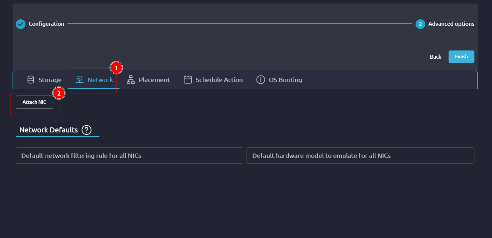
*
Hình 9: Thêm network device
*

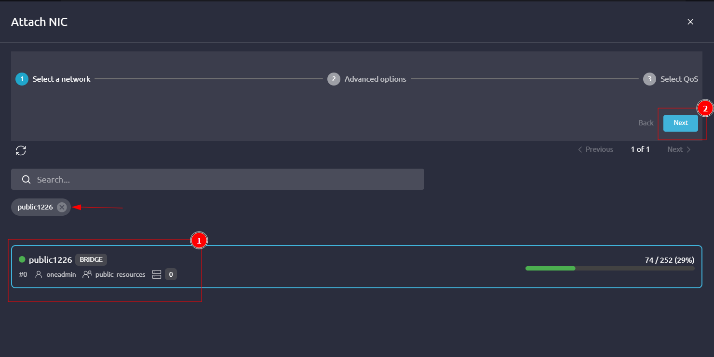
*
Hình 10: Lựa chọn public network có sẵn 
*

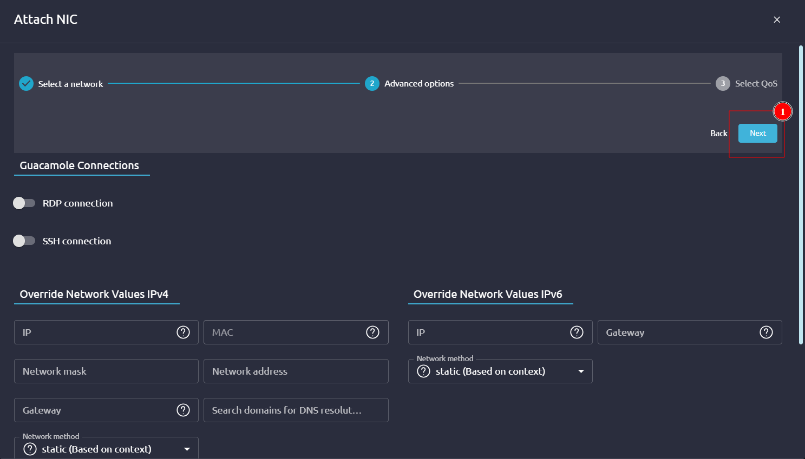
*
Hình 11: Các thiết lập mặc định 
*

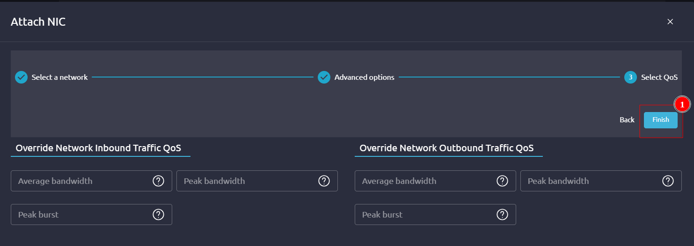
*
Hình 12: Các thiết lập mặc định 
*

- **Bước 6**: Mục Placement và Schedual Action không nên thay đổi. các mục này chỉ định host mà VM sẽ được khởi tạo, thời gian khởi tạo hay hủy VM. 
- **Bước 7**: Lựa chọn disk sẽ được boot, nếu chỉ có 1 image thì không cần chỉ định, chỉ dùng trong trường hợp đặc biệt.
- **Bước 8**: Sau khi nhấn **Finish**, VM sẽ được tự động khởi tạo, theo dõi quá trình khởi tạo trên dashboard. Sau khoảng 30s đến 1 phút, VM sẽ ở trạng thái **Running**, lúc này đã khởi tạo VM thành công. Tiếp theo là truy cập và cấu hình VM.

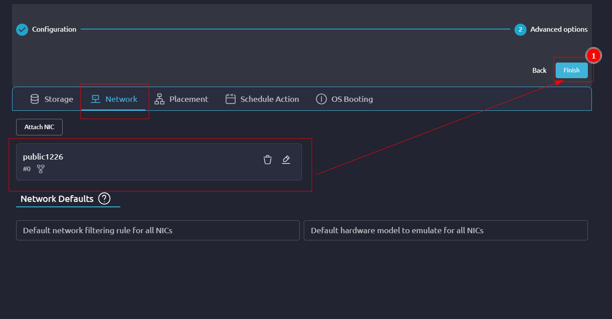
*
Hình 13: Chọn Finish để tiến hành khởi tạo VM 
*

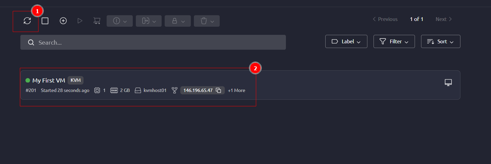
*
Hình 14: VM được khởi tạo thành công và đang running
*

## 4. Truy cập VM

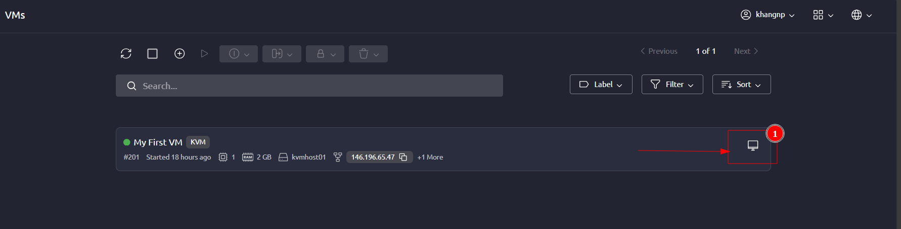
*
Hình 15: Xem VM qua VNC
*

Sau khi tạo VM, và VM ở trạng thái **running**, có thể truy cập VM trên giao diện web thông qua VNC. Giao diện VNC hỗ trợ quan sát VM kể cả giao diện boot. Giao diện web VNC không hỗ trợ tính năng "copy-paste", cần nhập lệnh thủ công. Mặc định, các template Linux thường không có mật khẩu user root. Nên cần thực hiện 1 trong 2 cách sau để truy cập vào VM:

**Cách 1**: Truy cập thông qua SSH với public key. Nếu đã cấu hình **SSH Public Key** như hướng dẫn ở **phần 2**, thì ssh public key sẽ được thêm vào VM một cách tự động. Lúc này có thể truy cập VM thông qua **IP public** và **private key** trên máy từ xa. Nếu không, vẫn có thể thêm public key thủ công vào VM thông qua giao diện như sau:

- **Bước 1**: Điều hướng đến VM panel từ **Instances** -> **VMs** -> Nhấn vào tên của VM, một giao diện thông tin chi tiết của VM sẽ hiện ra.
- **Bước 2**: Chọn **tab Configuration** -> **Update VM Configuration** -> chọn **tab Context**.

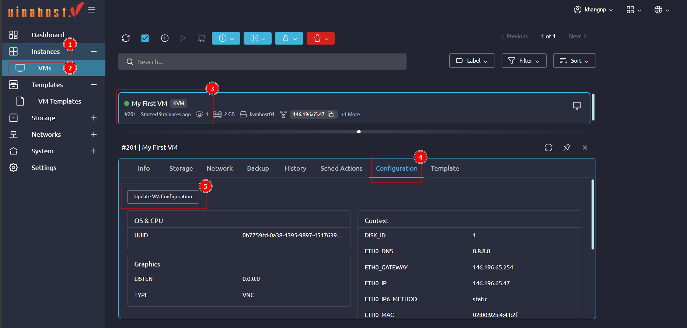
*
Hình 16: Tab Configuration của VM
*

- **Bước 3**: Nhập **ssh public key** và chọn **Accept**, sau khi nhấn Accept, VM sẽ ở trạng thái *Hot Plug* vài giây, sau đó, có thể truy cập VM thông qua ssh với ssh private key phù hợp.

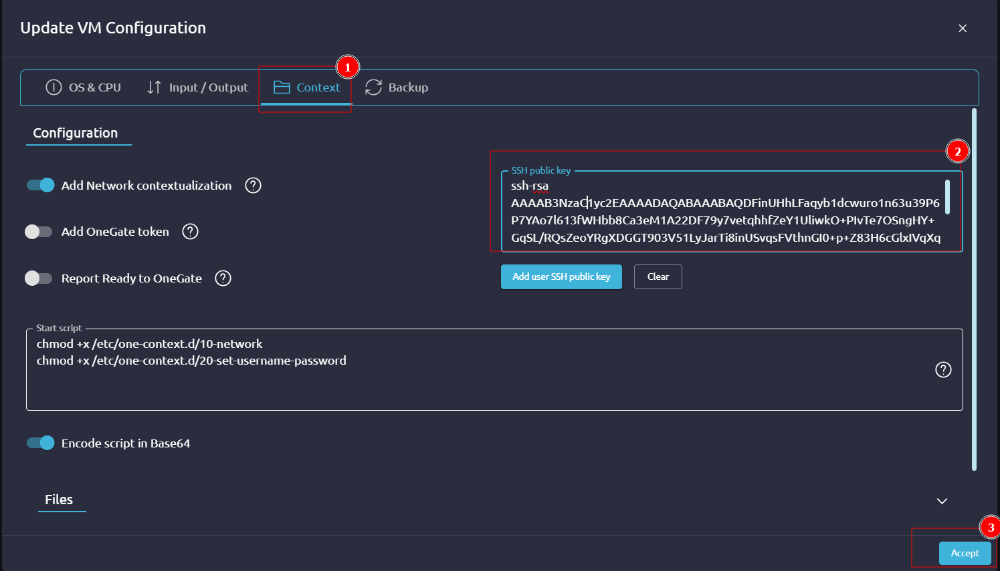
*
Hình 17: Thêm Public Key vào VM
*

**Cách 2**: Trong trường hợp khởi tạo nhưng network bị lỗi, dẫn đến không thể ping tới VM thông qua ip public được cấp, hoặc sshd không khởi chạy bên trong VM, thì có thể thêm password cho user root như sau:

- **Bước 1**:  Điều hướng đến VM panel từ **Instances -> VMs** -> Nhấn vào tên của VM, một giao diện thông tin chi tiết của VM sẽ hiện ra.
- **Bước 2**: Chọn tab **Configuration** -> **Update VM Configuration** -> chọn tab **Context**
- **Bước 3**: Chọn **Context Custom Variables** (Nơi này có rất nhiều biến chứa các thông tin cần thiết cho cấu hình VM khi boot, như thông tin về network, disk,... cần được để mặc định).

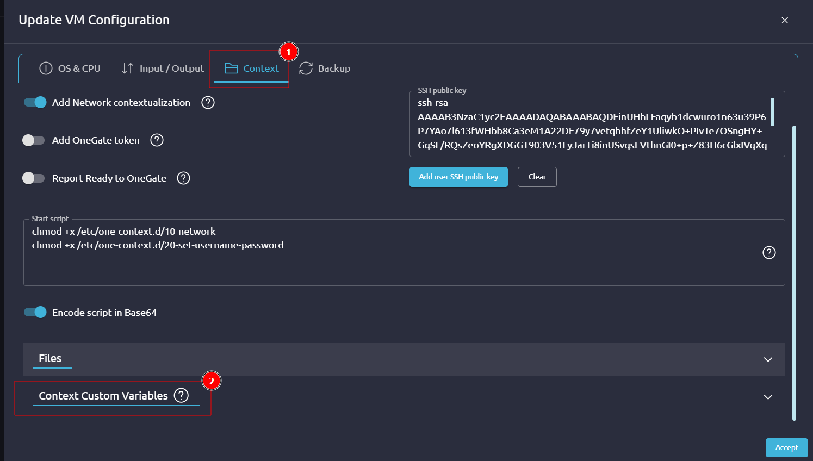
*
Hình 18: Thêm Context Custom Variables
*

- **Bước 4**: Các cấu hình ở đây ghi theo kiểu *Key-Value*, để thiết lập password root, ở phần Key để từ khóa **"PASSWORD"**, ở phần value để mật khẩu mong muốn.

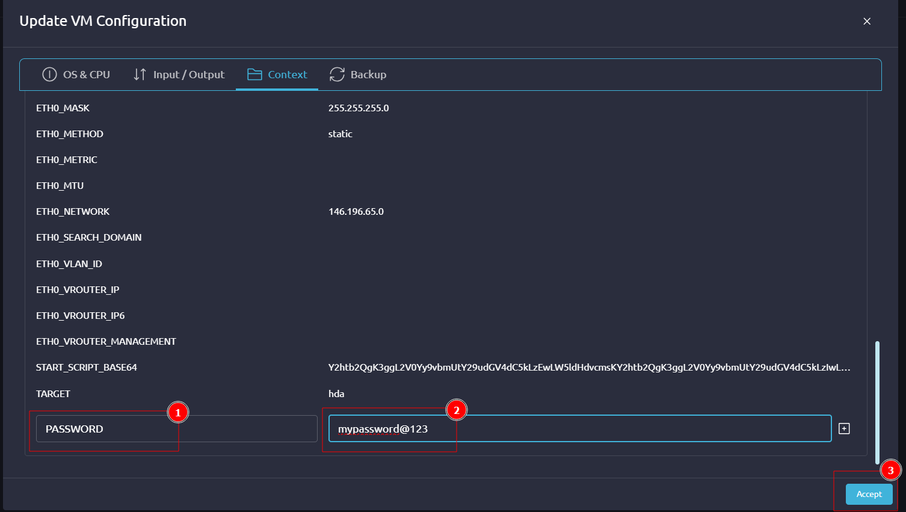
*
Hình 19: Thêm biến PASSWORD
*

- **Bước 5**: Nhấn **Accept**, sau đó, VM sẽ chuyển sang trạng thái *Hot Plug*, khi VM chuyển sang trạng thái **running** trở lại, truy cập vào VNC, login với user root và password vừa tạo.
- Lưu ý: Việc thêm biến **PASSWORD** sẽ ảnh hưởng đến quá trình boot của VM, kể cả khi sử dụng lệnh passwd để thay đổi password, nhưng sau khi reboot VM, password sẽ bị ghi đè bởi giá trị của biến PASSWORD này, vậy nên, sau khi đã login thành công, nên **xóa biến PASSWORD** đi, và cấu hình lại password mạnh mẽ hơn với lệnh passwd.

Thực hiện tương tự với các VM sử dụng hệ điều hành Windows, tuy nhiên Windows có thể sử dụng VNC để mở port RDP và dùng Remote Desktop Client thay vì ssh client để truy cập vào VM.

## 5. Quản lý VM

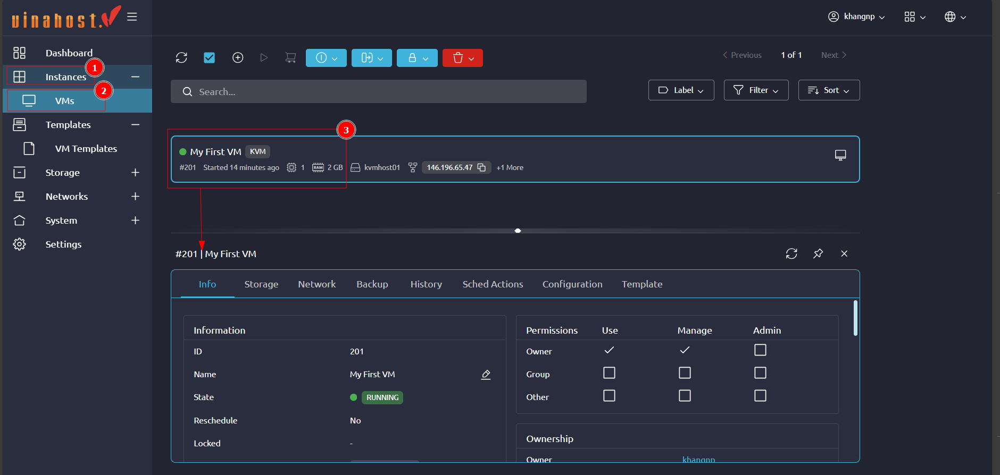
*
Hình 20: Giao diện thông tin VM
*

Khi VM được tạo thành công ở giao diện **Instances** -> **VMs** sẽ có thông tin VM như các tài nguyên được cấp, mạng, địa chỉ ip, MAC address (lưu ý về MAC address khi sử dụng nhiều IPs). Một số thao tác quản trị có thể thực hiện như:

- **Poweroff/Restart VM**: Có 2 thao tác là poweroff và poweroff **hard**, đối với poweroff, cloud platform sẽ gửi lệnh shutdown đến VM, VM sẽ stop các service và tắt an toàn như khi gọi lệnh (shutdown -h now trên VM). Ngược lại, **poweroff hard** sẽ tương tự như *"rút nguồn điện"* của VM để VM tắt ngay lập tức. Lựa chọn này chỉ nên được sử dụng khi poweroff/reboot thông thường không thể thực hiện được do VM bị lỗi file system, lỗi RAM,.... khiến cho VM không không nhận được lệnh.

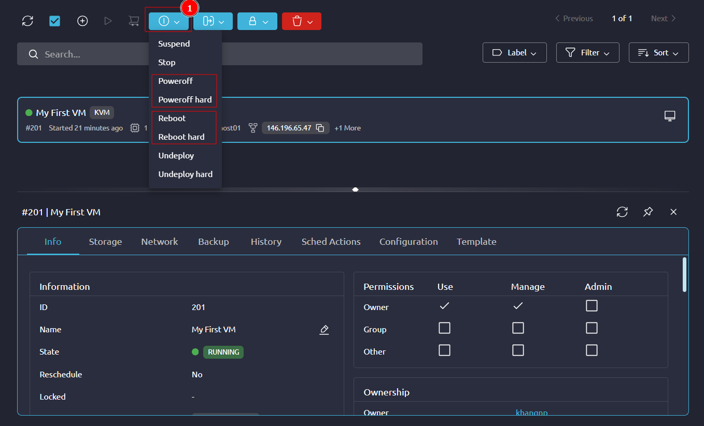
*
Hình 21: Các thao tác thông dụng với VM
*

- **Xem cấu hình VM**: Tab **Info** chứa các thông tin chi tiết về VM, bao gồm tên, thời gian khởi tạo, RAM (Memory) và CPU đã cấp...

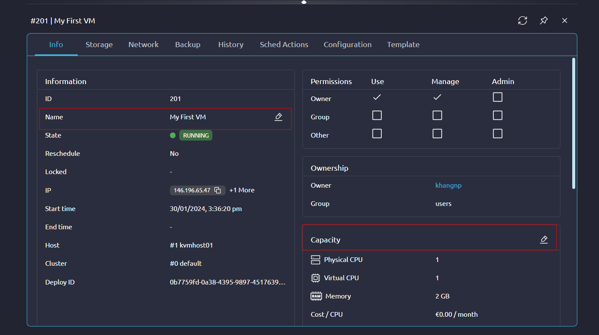
*
Hình 22: Xem các tài nguyên được cấp cho VM
*

- **Kiểm tra các bản backups**: Mặc định VM sẽ được backup 1 tuần / lần, và giữ lại 2 - 3 bản gần nhất. Nếu có nhu cầu **restore VM**, Quý khách vui lòng gửi yêu cầu đến support@vinahost.vn để được hỗ trợ, và nhân viên kỹ thuật sẽ restore VM về 1 trong những bản được hiển thị trong danh sách này.

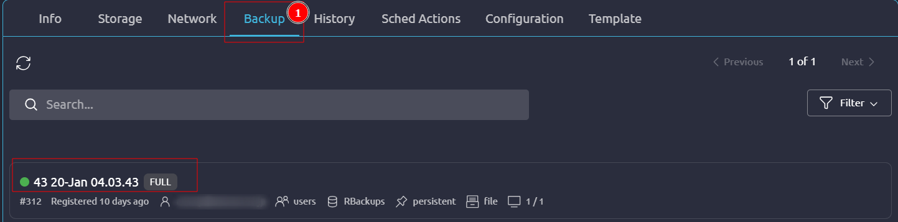
*
Hình 23: Danh sách các bản backup của VM
*

- **Nâng cấp RAM và CPUs**: Tại **tab Info**, mục **Capacity** chọn nút **Edit** và **resize** Memory hay CPU theo nhu cầu. Tùy template mà việc này có thể không cần reboot VM (chỉ điền Virtual CPU, không cần điền Physical CPU). Đơn vị tính của Memory là **MB** (1024 MB = 1GB)

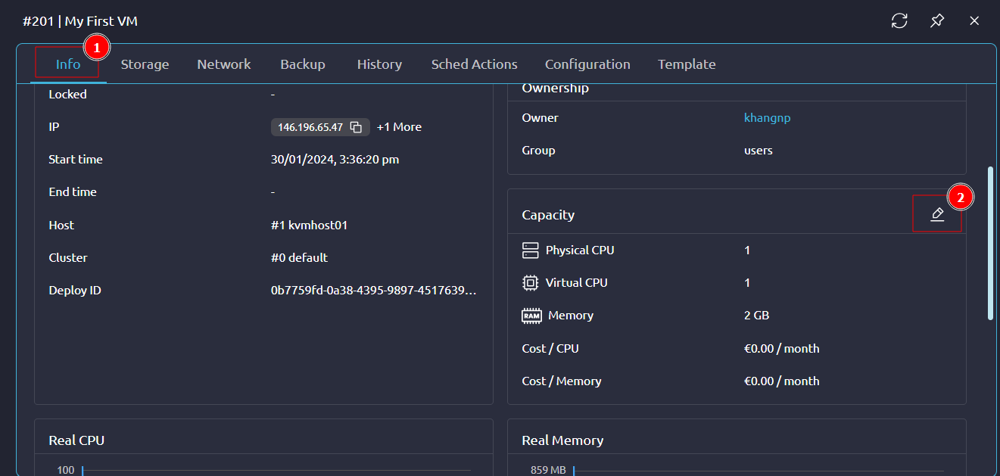
*
Hình 24: Edit Memory và CPU
*

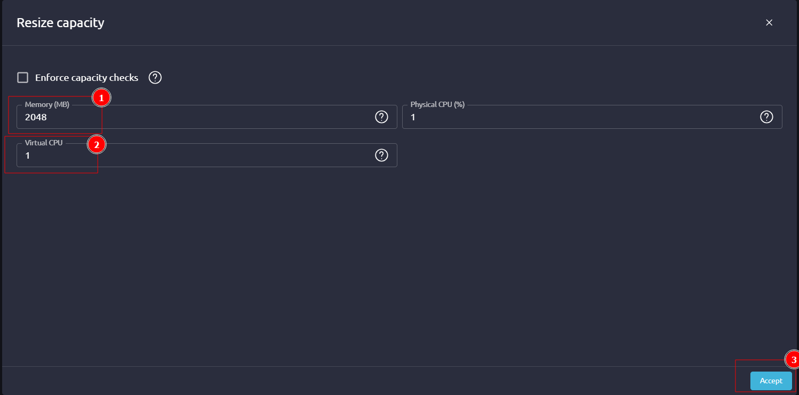
*
Hình 25: Chỉnh sửa thông số Memory, CPU
*

- **Nâng dung lượng disk cho VM**: Nếu có nhu cầu thêm dung lượng disk cho VM, có thể chọn resize disk hiện tại, hoặc *attach* thêm **Blank Disk** mới (hiện tại Vinahost hỗ trợ thêm blank disk 10GB/20GB,...).Lưu ý: sau khi thêm dung lượng đĩa cần resize partion để sử dụng được dung lượng vừa thêm này.

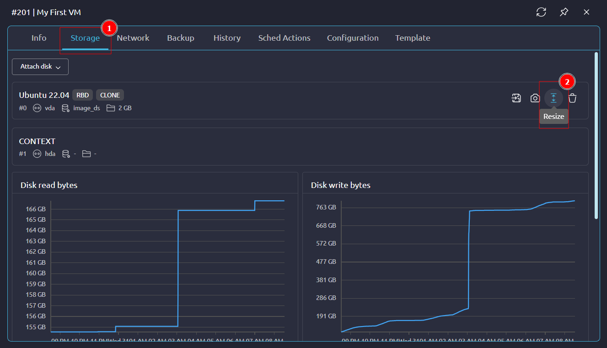
*
Hình 26: Chỉnh sửa dung lượng disk
*

- **Snapshot disk**: Snapshot disk là một phiên bản backup gắn liền với disk đang được sử dụng ở hiện tại. Có thể revert trạng thái (hay dữ liệu ) của disk từ một bản snapshot của chính nó. Snapshot disk chỉ revert về dữ liệu của disk tại thời điểm snapshot, không thể revert về toàn bộ trạng thái của VM như snapshot VM (hệ thống hiện tại không hỗ trợ snapshot VM) Để snapshot và revert disk, cần điều hướng đến **VM -> Storage -> Snapshot**. Sau khi có bản snapshot cần **shutdown VM** trước khi revert.

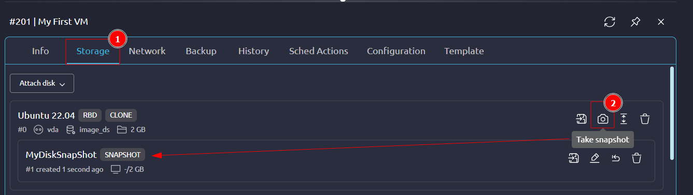
*
Hình 27: Snapshot disk thành công
*

- **Lock VM**: Khi VM đã được cấu hình và hoạt động ổn định có thể chọn option **Lock VM** để tránh các thao tác can thiệp từ giao diện đến VM, lúc chọn Lock VM, thì không thể restart, update,... VM từ giao diện được nữa.

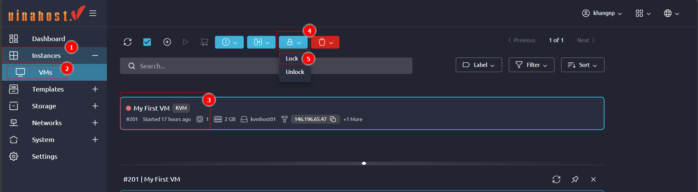
*
Hình 28: Lock VM ngăn sự can thiệp từ giao diện web
*

- **Xóa VM vĩnh viễn**: Để xóa VM vĩnh viễn có thể chọn thao tác **Terminate Hard**.

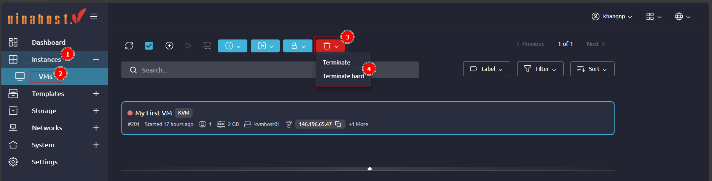
*
Hình 29: Xóa VM vĩnh viễn và không thể khôi phục
*

- **Kiểm tra quota**: Khi sử dụng gói dịch vụ sẽ có nhiều giới hạn phù hợp, như giới hạn về số lượng **core CPU**, số lượng **Memory** (RAM), dung lượng **disk**, để kiểm tra Quota của User, điều hướng đến **System** -> **User** -> Chọn vào User name -> chọn **tab Quota**. 
Các loại tài nguyên thường theo cặp như: **CPU** là số lượng CPU tối đa được sử dụng, **CPU used** là số CPU đã cấp phát và đang được sử dụng, tương tự cho các thông số còn lại, những thông số để "-1" là không đặt, hoặc không có.

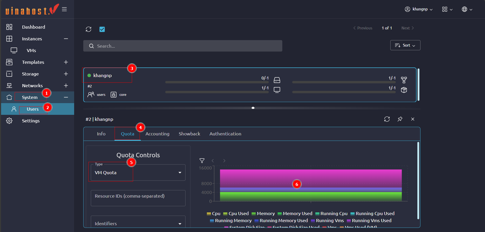
*
Hình 30: Xem thông số Quota của dịch vụ
*

## 6. Hỗ trợ

Nếu có bất kỳ lỗi hay khó khăn trong quá trình sử dụng sản phẩm, hoặc cần thêm các tính năng, template, hay hệ điều hành khác, hãy liên hệ qua các kênh liên lạc của chúng tôi để được hỗ trợ (https://vinahost.vn/ho-tro)

