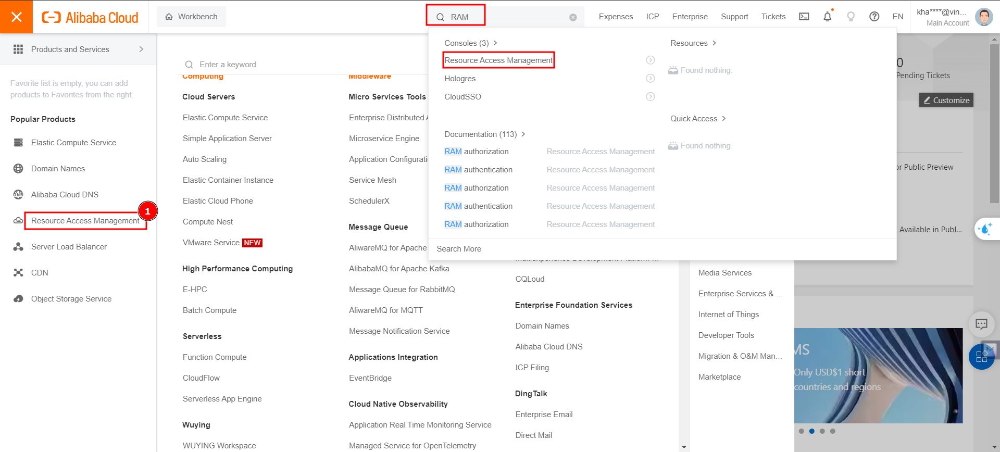
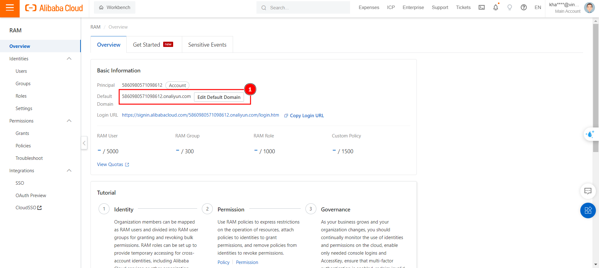
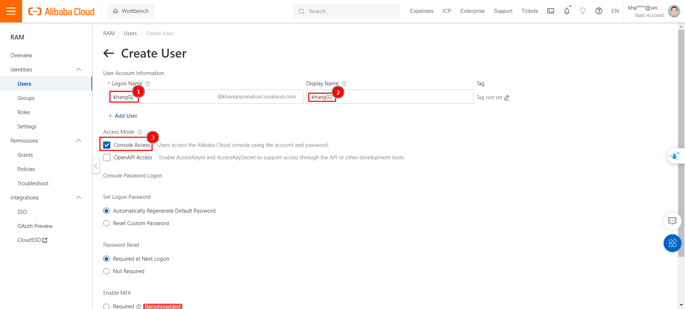
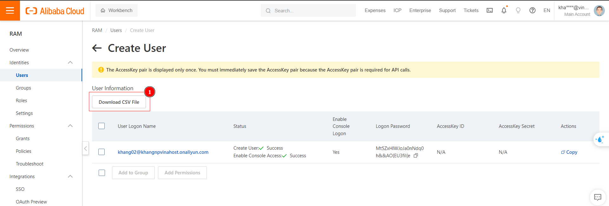
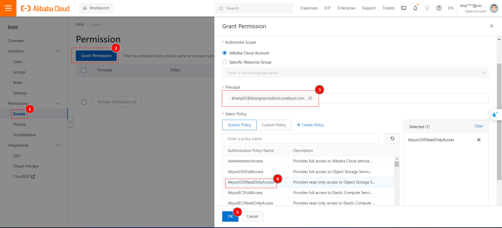
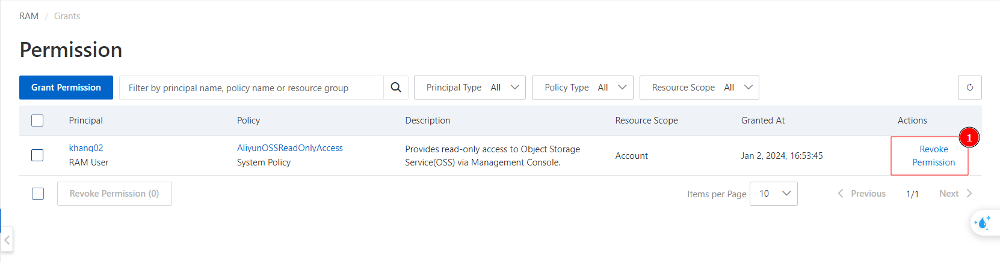

Bài viết này sẽ hướng dẫn bạn **Tạo, phân quyền và thay đổi default login domain cho RAM user trên Alibaba Cloud**. Nếu bạn cần hỗ trợ, xin vui lòng liên hệ VinaHost qua **Hotline 1900 6046 ext. 3**, email về [support@vinahost.vn](mailto:support@vinahost.vn) hoặc chat với VinaHost qua livechat [https://livechat.vinahost.vn/chat.php](https://livechat.vinahost.vn/chat.php).

1. **RAM User là gì?**
	RAM (Resource Access Management) user là các account "con" được một Alibaba Cloud Account (**Primary** hay **Root Account**) tạo ra, để dễ dàng quản lý việc truy cập tài nguyên, khi có nhiều người cần sử dụng các tài nguyên trên hệ thống. RAM user được sử dụng trong các ngữ cảnh như: quản lý account và phân quyền cho các thành viên trong nội bộ doanh nghiệp, hợp tác giữa các doanh nghiệp với nhau, cấp quyền tạm thời cho các khách hàng hoặc cấp quyền cho các application.
	RAM user **không sở hữu** bất kỳ tài nguyên nào trên Alibaba Cloud. Các hóa đơn, chi phí phát sinh hoặc tài nguyên mà RAM user tạo ra đều được tính cho **Primary Account** của nó. Primary Account có toàn quyền với RAM user, có thể cấp, hoặc thu hồi quyền hạn của RAM user bất kỳ lúc nào.
	RAM user có **UID** và các thông tin đăng nhập như **Password** và **AccessKey pair** riêng (khác RAM role).
	RAM user cũng có thể được tạo từ 1 RAM User hoặc RAM role khác (nếu có đủ quyền hạn).
2. **Đổi domain mặc định và tạo RAM user mới**
	- Đăng nhập vào giao diện Console của Aliababa Cloud [Here](https://account.alibabacloud.com)
	- Truy cập Resource Access Management (hoặc search từ khóa trên thanh tìm kiếm).
	
	*
Bước 1: Truy cập giao diện RAM
*
	
	- Đổi Domain mặc định (Optional): RAM user khi được tạo ra, sẽ login với định dạng: \<user_name\>@\<UID\>.onaliyun.com. user_name là tên user sẽ được tạo ra, UID là ID của tài khoản chính, có thể thay đổi dãy số này thành các **tên dễ nhớ** hơn do người dùng đặt. onaliyun.com là phần mặc định, không thể thay đổi.
	
	
	*
Bước 2: Đổi domain đăng nhập mặc định
*
	
	- Điều hướng đến **Identities** > **Users**, chọn **Create User** và điền các thông tin còn thiếu. Có thể tạo User có thể login vào **Console**, hoặc **OpenAPI** cho các application được cấp quyền truy cập resource, hay gọi các API, SDK.
	
	
	*
Bước 3: Tạo RAM user mới
*
	
	- Khi được tạo lần đầu tiên, phải nhấn "**Download CSV file**", đây là file chứa thông tin đăng nhập gồm **username, password, AccessKey Pair**. Nút này chỉ xuất hiện **1 lần**, cần phải lưu ý để tránh bị mất Access Key Pair.
	
	
	*
Bước 4: Tải file chứa thông tin truy cập
*
	
1. **Phân quyền cho RAM User**
	- Khi vừa tạo User, Root Account phải phân quyền để RAM user được sử dụng, hay truy cập các tài nguyên trên Cloud. Tập hợp các "quyền hạn" được gọi là **Policy**, Alibaba Cloud có sẵn một số Policy nhất định, ngoài ra user cũng có thể tự tạo các Policy của riêng mình. Trong ví dụ dưới đây, sẽ phân quyền cho user khang02@khangnpvinahost.onaliyn.com được quyền Read trên các tài nguyên của dịch vụ Object Storage (OSS) thuộc sở hữu của Root Account trên Alibaba Cloud.
	
	
	*
Bước 5: Phân quyền cho RAM user
*
	
	- Root Account có thể thu hồi quyền đã cấp cho RAM user bất kỳ lúc nào bằng cách chọn **Revoke Permission**
	
	
	*
Bước 6 (Optional): Thu hồi quyền đã cấp cho RAM user
*
	
1. Đọc thêm
	1. [Resource Access Manager Introduction](https://docs-aliyun.cn-hangzhou.oss.aliyun-inc.com/pdf/ram-intro-intl-en-2017-03-19.pdf)
	2. [Overview of RAM user](https://www.alibabacloud.com/help/en/ram/user-guide/overview-of-ram-users)
	3. [Create RAM user](https://www.alibabacloud.com/help/en/ram/user-guide/create-a-ram-user)
	4. [Grant Permissions to RAM user](https://www.alibabacloud.com/help/en/ram/user-guide/grant-permissions-to-the-ram-user#task-187800)