Bài viết này sẽ hướng dẫn bạn **Import Người Dùng Vào Zimbra Thông Qua Zimbra Và File XML**. Nếu bạn cần hỗ trợ, xin vui lòng liên hệ VinaHost qua **Hotline 1900 6046 ext.3**, email về [support@vinahost.vn](mailto:support@vinahost.vn) hoặc chat với VinaHost qua livechat [https://livechat.vinahost.vn/chat.php](https://livechat.vinahost.vn/chat.php).

## Hướng Dẫn Import Người Dùng Vào Zimbra Thông Qua Giao Diện Zimbra Và File XML

**Bước 1: Tạo 1 file có đuôi xml (có thể dùng note pad để tạo)**

File mẫu có thể lấy [tại đây](images/Config_Import_Zimbra_Mau.xml)

Giải thích về đoạn mã trong file:

- Phần config server Zimbra

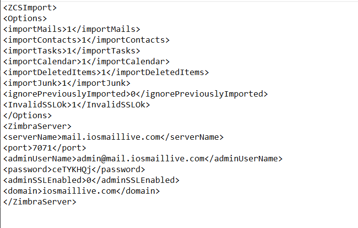

Dòng <serverName>mail.iosmaillive.com</serverName> đổi lại thành mail.<domains> như hướng dẫn gửi khách (phải kiểm tra xem A record của mail.domains của khách có trỏ về IP server chưa)

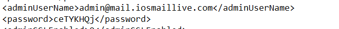

Phần này điền lại thông tin account của khách hàng lúc gửi cho khách khi kích hoạt.

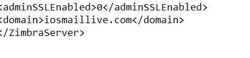

Phần domains chỉnh về đúng domains khách hàng đăng kí.

- Phần config User

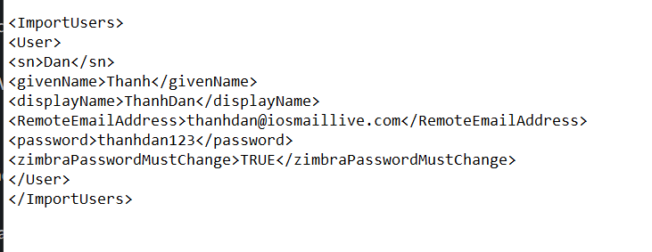

Chỉ nên quan tâm vào 3 block  Display name, RemoteEmailAddress và Password

Phần displayName, bạn điền tên User muốn hiển thị vào đây.

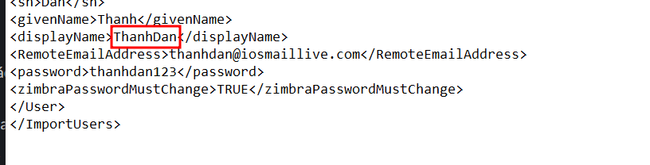

Phần RemoteEmailAddress, bạn điền thông tin mail muốn tạo vào đây.

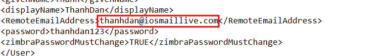

Phần password có thể điền thông tin password vào đây.

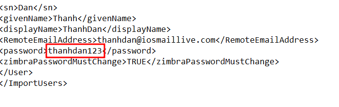

Lưu ý nếu muốn Import Người Dùng Vào Zimbra nhiều tài khoản 1 lần, bạn có thể copy đoạn code từ <Users> đến </Users> trên thành nhiều phần và đặt ngay bên dưới dòng </Users>  và trên dòng </ImportUsers> sau đó thay đổi thông tin như hướng dẫn ở trên.

- Sau đó lưu file dưới tên import.xml hoặc tên gì cũng được với đuôi .xml

**Bước 2: Import thông qua giao diện ZimbrAdmin**

Login vào Zimbra Admin vào phần Tools and Migration

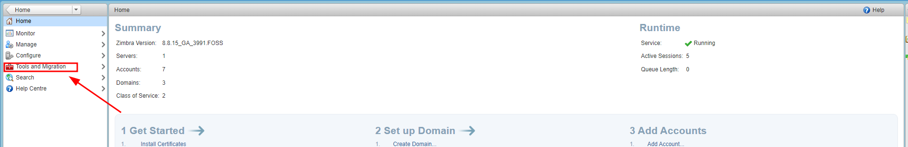

Sau đó vào Account Migration

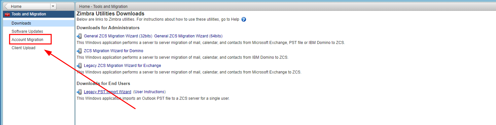

Vào Setting => Migration Wizard

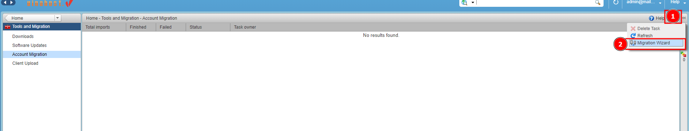

Thiết lập thông tin như hình, sau đó chọn Next

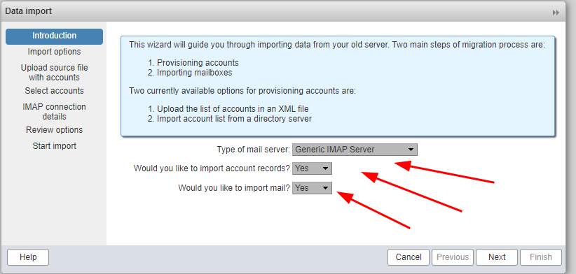

Chọn Import from an XML file sau đó chọn Next.

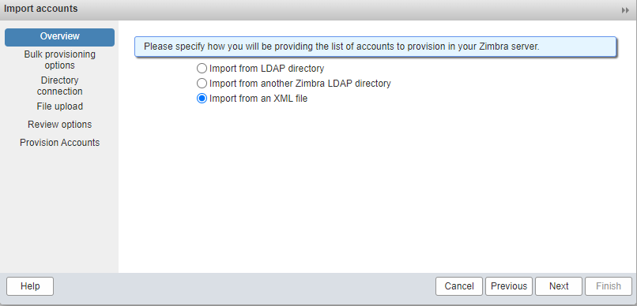

Upload file xml vừa tạo lên sau đó chọn NEXT.

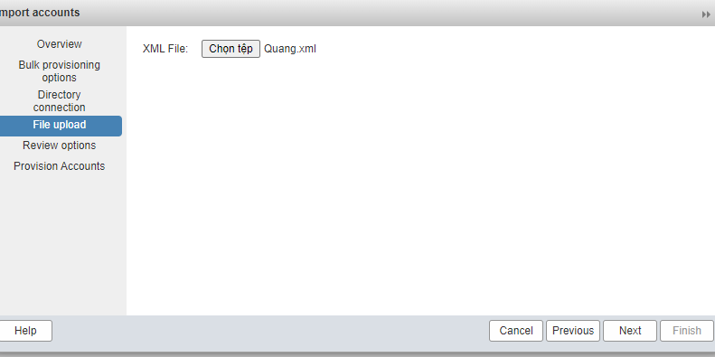

Chọn NEXT -> Sau khi Import xong chọn Cancel.

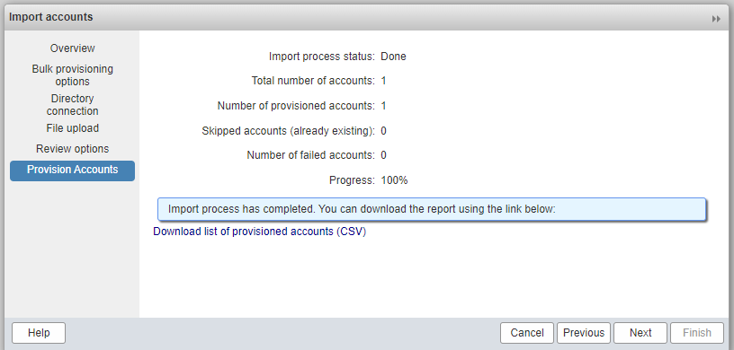

Quay về phần manage (có thể cần reload để nhận thông tin mới) sẽ thấy mail và User vừa được tạo.

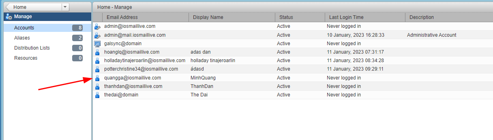

Chúc bạn thực hiện **Import Người Dùng Vào Zimbra Thông Qua Zimbra Và File XML** thành công!

> **THAM KHẢO CÁC DỊCH VỤ TẠI [VINAHOST](https://vinahost.vn/)**
> 
> **\>>** [**SERVER**](https://vinahost.vn/thue-may-chu-rieng/) **–** [**COLOCATION**](https://vinahost.vn/colocation.html) – [**CDN**](https://vinahost.vn/dich-vu-cdn-chuyen-nghiep)
> 
> **\>> [CLOUD](https://vinahost.vn/cloud-server-gia-re/) – [VPS](https://vinahost.vn/vps-ssd-chuyen-nghiep/)**
> 
> **\>> [HOSTING](https://vinahost.vn/wordpress-hosting)**
> 
> **\>> [EMAIL](https://vinahost.vn/email-hosting)**
> 
> **\>> [WEBSITE](http://vinawebsite.vn/)**
> 
> **\>> [TÊN MIỀN](https://vinahost.vn/ten-mien-gia-re/)**
