Bài viết này sẽ **Hướng Dẫn Migrate Server, VM Trên Alibaba Cloud Sử Dụng SSH.** Nếu bạn cần hỗ trợ, xin vui lòng liên hệ VinaHost qua **Hotline 1900 6046 ext. 3**, email về [support@vinahost.vn](mailto:support@vinahost.vn) hoặc chat với VinaHost qua livechat [https://livechat.vinahost.vn/chat.php](https://livechat.vinahost.vn/chat.php).

## **1\. Yêu cầu chung**

**Server Migration Center (SMC)** để chuyển server từ Physical Server/VM/Third-party Cloud Server/ ECS Alibabacloud/VMWare về Alibabacloud (hoặc có thể migrate các VM giữa các khu vực với nhau)

Link dịch vụ: [https://smc.console.aliyun.com/](https://smc.console.aliyun.com/)

- Đối với server **Linux** cần kết nối được **port ssh, disable selinux,** trên server phải có **wget, rsync**
- Đối với server **Windows** cần cài **OpenSSH** cho Windows (tham khảo tại [link](https://www.alibabacloud.com/help/en/server-migration-center/latest/smc-faq#section-beu-cwd-dwe))

**\*\* Lưu ý: Trước khi bạn sử dụng dịch vụ Migrate của SMC, phải đáp ứng các yêu cầu sau:**

**(1) Đã kích hoạt dịch vụ RAM và cho phép SMC truy cập tài nguyên Cloud của mình**

Thao tác này chỉ cần thao tác một lần trong lần đầu sử dụng dịch vụ SMC.

Khi lần đầu sử dụng sẽ nhận được thông báo như hình, bấm vào **Authorize** sau đó làm theo hướng dẫn để kích hoạt.

**(2) Đã Active Snapshot Service**

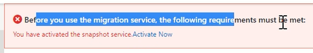

Tương tự như trên, bạn cần click vào **Active Now** một lần trong lần đầu sử dụng và làm theo hướng dẫn.

##  **2. Hướng Dẫn Migrate Server, VM Lên Alibaba Cloud Sử Dụng SSH**

<iframe title="YouTube video player" src="https://www.youtube.com/embed/5jIwyXBMLQU" width="560" height="315" frameborder="0" allowfullscreen="allowfullscreen" data-mce-fragment="1"></iframe>

_Video Hướng Dẫn Migrate Server, VM Lên Alibaba Cloud Sử Dụng SSH_

### **Bước 1:  Chuẩn bị**

- Đảm bảo Server cần **migrate** đã mở các port SSH, tắt **selinux/firewall**
- Đã cài **wget, rsync**

### **Bước 2: Nhập thông tin của nguồn muốn migrate**

Nhập thông tin Server muốn migrate bằng cách sử dụng bảng điều khiển SMC

Trong ngăn điều hướng bên trái, nhấp vào **Migration Sources**.

Trong bảng điều khiển **Migration Sources**, click **Import Migration Source.**

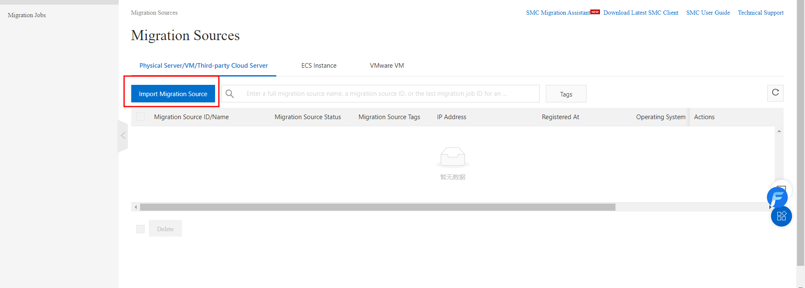

Đặt tham số dựa trên loại Server cần migrate

- **Migration Source Type**: Dịch vụ của SMC hỗ trợ các loại source như sau:
- **Physical Server/VM/ECS Instance**: có thể import từ server vật lý, VM hoặc từ một instance.

**Các tham số mà phải đặt nếu Migrate là Server vật lý, VM, một Host trên một cụm Cloud khác.**

<table style="width: 100%;"><tbody><tr><td style="text-align: center; width: 24.0909%;" width="468"><strong>Description</strong></td><td style="text-align: center; width: 74.8485%;" width="468"><strong>Description</strong></td></tr><tr><td style="width: 24.0909%;" width="468"><strong>Import Method</strong></td><td style="width: 74.8485%;" width="468">Phương pháp được sử dụng để nhập thông tin của Server.&nbsp;Chọn <strong>Import through Console</strong>.</td></tr><tr><td style="width: 24.0909%;" width="468"><strong>Migration Source Name</strong></td><td style="width: 74.8485%;" width="468">Tên của Migrate source.&nbsp;Tên phải có độ dài từ 2 đến 128 ký tự.&nbsp;Tên phải bắt đầu bằng một chữ cái và không được bắt đầu bằng http:// hoặc https://.&nbsp;Tên có thể chứa các chữ cái, chữ số, dấu hai chấm (:), dấu gạch dưới (_) và dấu gạch nối (-).</td></tr><tr><td style="width: 24.0909%;" width="468"><strong>IP Address</strong></td><td style="width: 74.8485%;" width="468">Địa chỉ IPv4 được sử dụng để truy cập server qua internet/IP public.</td></tr><tr><td style="width: 24.0909%;" width="468"><strong>OS Type</strong></td><td style="width: 74.8485%;" width="468">Loại hệ điều hành.&nbsp;Chọn&nbsp;<strong>Linux</strong>&nbsp;hoặc&nbsp;<strong>Windows</strong>&nbsp;dựa trên loại hệ điều hành của bạn.</td></tr><tr><td style="width: 24.0909%;" width="468"><strong>Username</strong></td><td style="width: 74.8485%;" width="468">Tên user sử dụng để đăng nhập vào Server

Root với linux

Administrator với windowns</td></tr><tr><td style="width: 24.0909%;" width="468"><strong>Password</strong></td><td style="width: 74.8485%;" width="468">Mật khẩu để truy cập</td></tr><tr><td style="width: 24.0909%;" width="468"><strong>Port</strong></td><td style="width: 74.8485%;" width="468">Port được sử dụng để SSH, mặc định 22</td></tr></tbody></table>

**Các tham số mà phải đặt nếu Migrate là một ESC Instance**

<table style="width: 100%;"><tbody><tr><td style="width: 24.0909%; text-align: center;" width="468"><strong>Parameter</strong></td><td style="width: 74.697%; text-align: center;" width="468"><strong>Description</strong></td></tr><tr><td style="width: 24.0909%;" width="468"><strong>Import Method</strong></td><td style="width: 74.697%;" width="468">Phương pháp được sử dụng để nhập thông tin của Server.&nbsp;Chọn <strong>Import through Console</strong>.</td></tr><tr><td style="width: 24.0909%;" width="468"><strong>Region</strong></td><td style="width: 74.697%;" width="468">Khu vực chứa &nbsp;ECS instance</td></tr><tr><td style="width: 24.0909%;" width="468"><strong>Instance</strong></td><td style="width: 74.697%;" width="468">ECS instance.có thông tin bạn muốn nhập vào SMC. Bạn có thể chọn nhiều ECS instance.để nhập thông tin của các ECS instance.cùng một lúc.</td></tr></tbody></table>

**VM ware VM:** Có thể import từ một VM trong **VM ware vCenter**

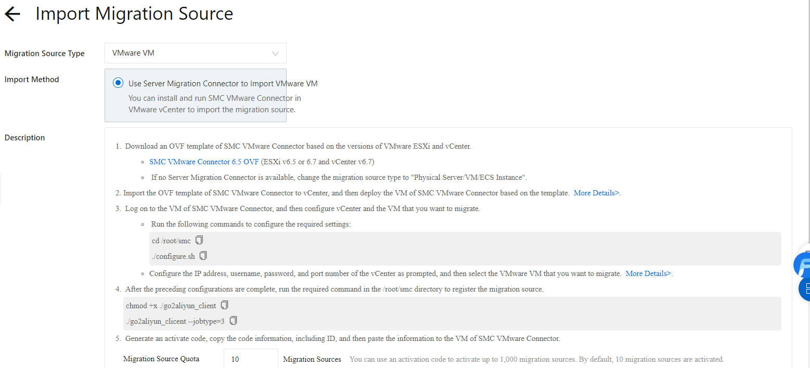

Ở bài này chúng tôi sử dụng Import type là: **Physical Server/VM/ECS Instance**

Cần phải điền thông tin SSH (**IP ssh và Pass root, port ssh**) đối với Linux.

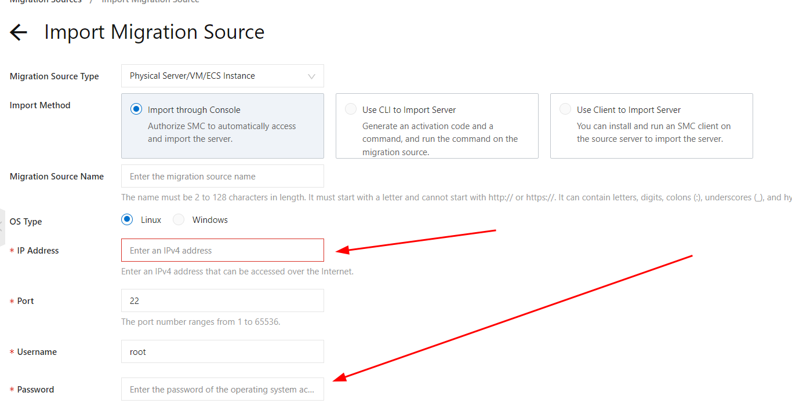

**\*\* Lưu ý: Nếu sử dụng OS là Windows cần đảm bảo đã cài đặt OpenSSH for Windows và đảm bảo có thể SSH.**

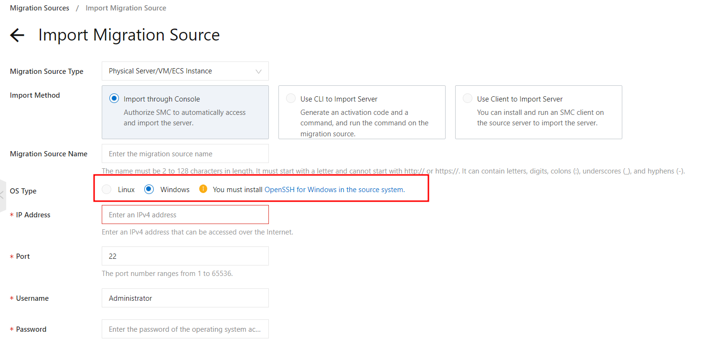

Sau khi điền đầy đủ thông tin chọn Import để bắt đầu:

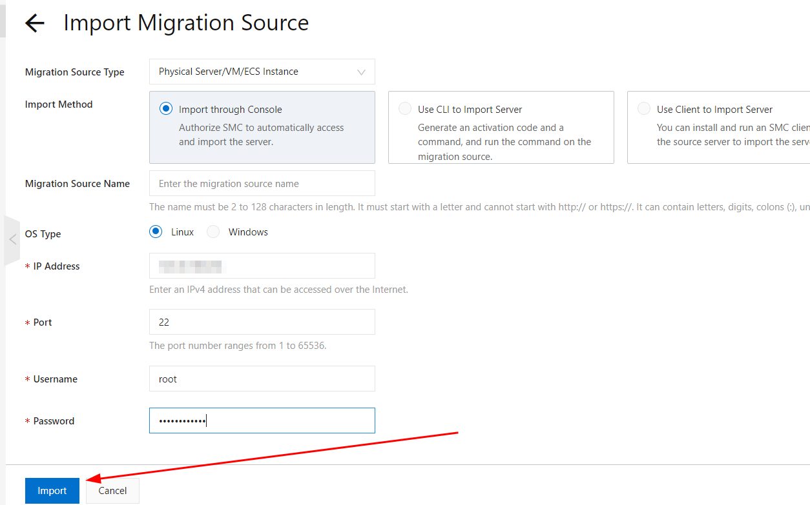

Quá trình **Import** mất khoảng 3 đến 10 phút. Hãy đợi cho đến khi quá trình import hoàn tất, bạn có thể xem trạng thái import trên trang Nguồn di chuyển. Nếu giá trị trong cột **Trạng thái** thay đổi từ **importing** thành **active** đối với **Migrate source**, thì thông tin của **Migrate source** sẽ được nhập.

Ở đây bạn có thể xem được **migration ID** và **Migration status:**

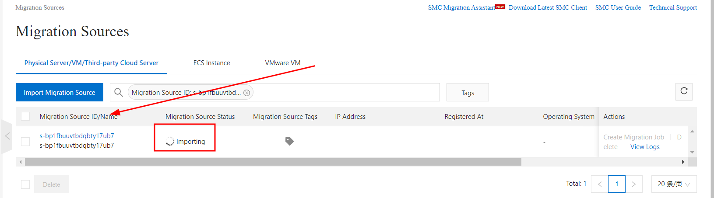

Bạn có thể theo dõi nếu trạng thái migrate, có thể báo **Failed** hoặc **Active**.

Nếu báo **Failed** như hình, bạn có thể chọn vào mục **Viewlogs** để xem các lỗi, hoặc có thể **Delete** quá trình này.

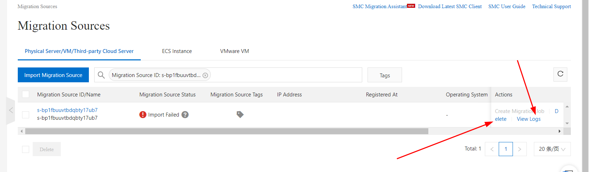

Ở phần **View Logs** sẽ hiển thị thông báo, một số yêu cầu cần đáp ứng và lỗi đang gặp bạn cần phải sửa nó và thử lại.

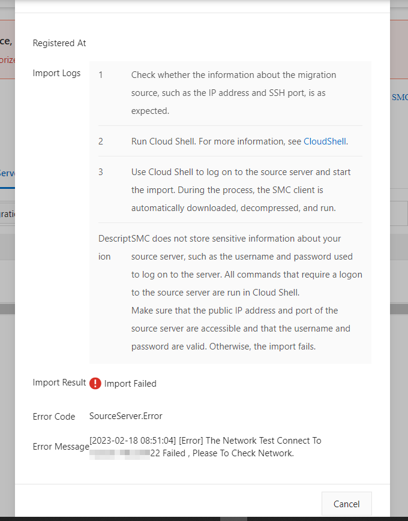

Bạn có thể dựa vào đây để kiểm tra lý do việc **migrate** bị **failed**.

Sau khi thành công thì **import status** sẽ thông báo **active** thì có thể tiến hành tạo một **Migration Job**.

### **Bước 3: Create Migration Job**

Khi quá trình **Import** thành công sẽ thông báo **active**, click vào **Create Migration Job** để bắt đầu **Migrate**.

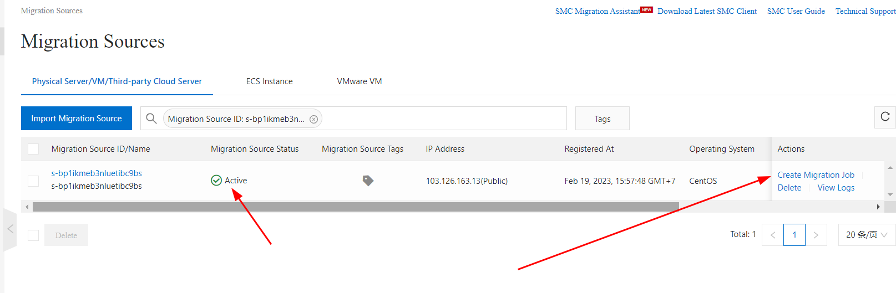

Sau khi vào tab **Create Migration Job**, cần thiết lập một số thông tin cơ bản trước khi **Migrate**.

Ở đây chú ý vào một số thông tin cần thiết như

**Destination Region** có thể chọn vùng bạn muốn migrate đến, mặc định là **China**.

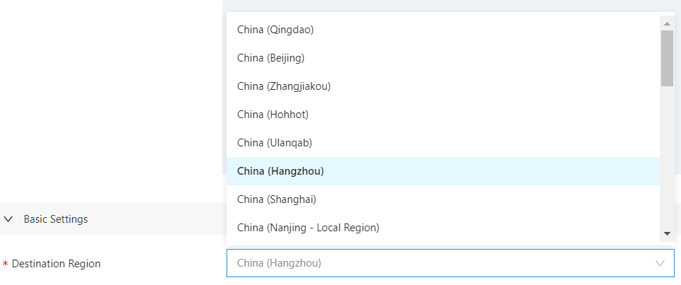

Các thông tin khác có thể điền vào như sau

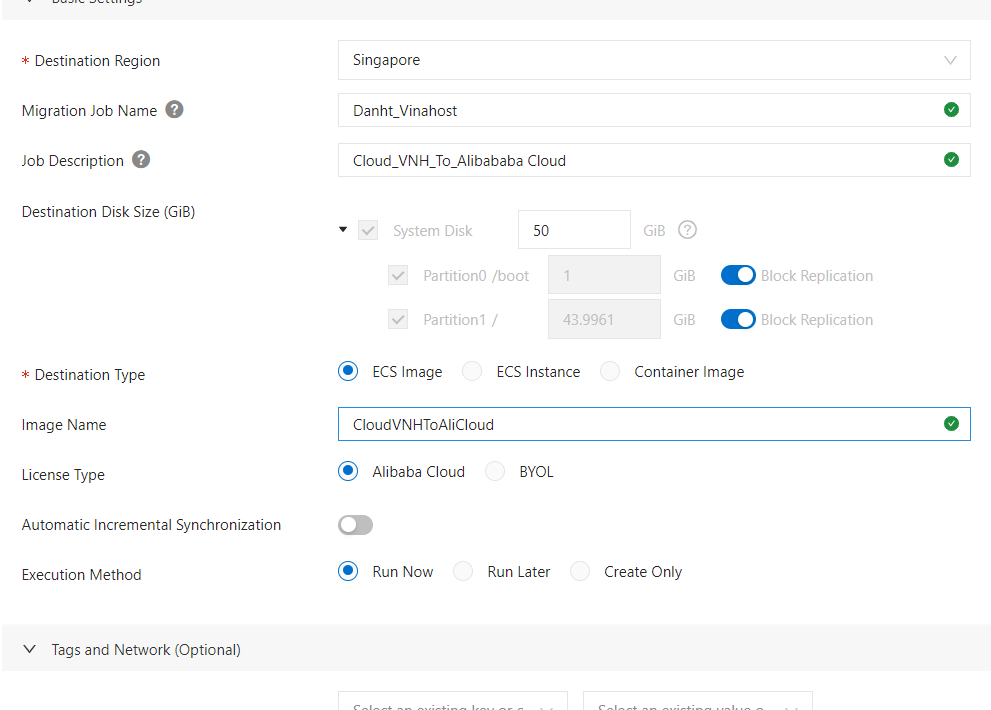

Chọn **Create** để bắt đầu:

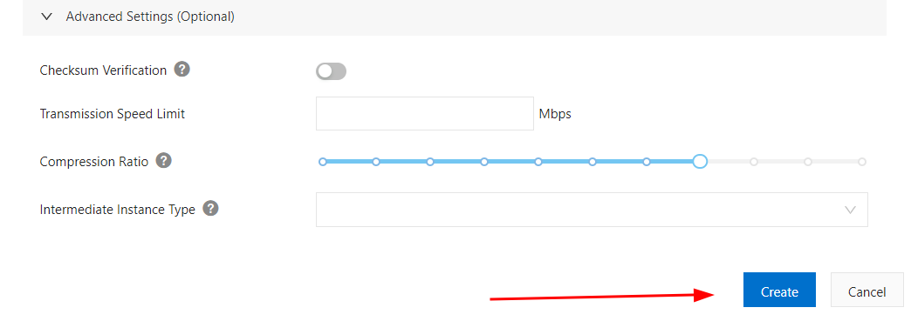

**\*\*Lưu ý:**

- _Sau khi tạo và bắt đầu công việc Migrate, hãy đảm bảo rằng **Server/VM** đang phải online cho đến khi công việc hoàn thành. Nếu không, công việc Migrate **không thành công**._
- _Sau khi công việc Migrate bắt đầu, một phiên bản trung gian sẽ được tạo. **Không** thực hiện các thao tác trên VM này. Nếu không, lỗi có thể xảy ra._
- _Thời gian Migrate phụ thuộc vào **dung lượng dữ liệu và băng thông mạng**. Nếu khối lượng dữ liệu lớn hoặc băng thông mạng nhỏ, quá trình Migrate có thể mất nhiều thời gian. Trong trường hợp này,có thể đợi hoặc chuyển qua kết nối **Express Connect**._

Lúc này nên đợi hệ thống thực hiện xong, không nên thao tác trong thời gian này.

Sau khi **Create** sẽ nhận được thông báo như sau:

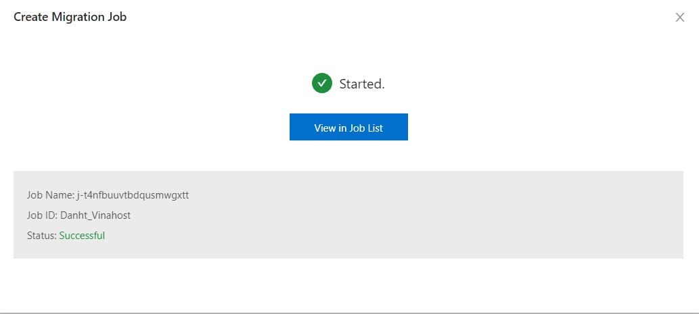

Có thể chọn **View in Job list** để xem quá trình **Migrate**, hoặc có thể vào phần **migrate job** bên thanh điều khiển bên trái.

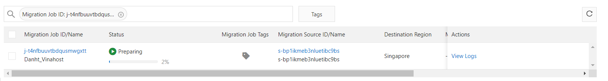

Sau khi trạng thái **status** đã thông báo **Completed** thì quá trình **migrate** đã hoàn thành, có thể chọn **Create Instance** để tạo một **ESC Instance** mới trên **Alibaba Cloud**.

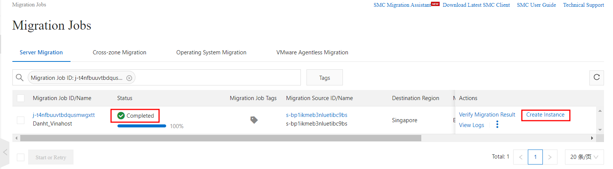

Khi tạo **ESC Instance** bạn hãy chọn **Images** theo như tên mà bạn đã đặt ở bước trước đó.

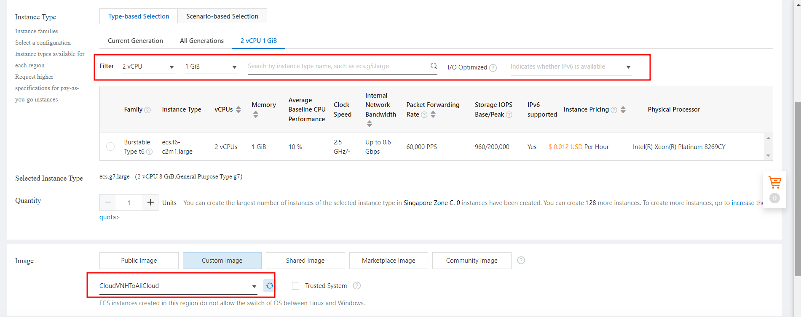

Chúc bạn thực hiện **Migrate Server, VM Trên Alibaba Cloud Sử Dụng SSH** thành công!

\> Tham khảo [Hướng Dẫn Migrate Server, VM Lên Alibaba Cloud Sử Dụng Tool go2aliyun\_client](https://kb.vinahost.vn/migrate-server-vm-alibaba-cloud-su-dung-tool-go2aliyun_client/)

> **THAM KHẢO CÁC DỊCH VỤ TẠI [VINAHOST](https://vinahost.vn/)**
> 
> **\>>** [**SERVER**](https://vinahost.vn/thue-may-chu-rieng/) **–** [**COLOCATION**](https://vinahost.vn/colocation.html) – [**CDN**](https://vinahost.vn/dich-vu-cdn-chuyen-nghiep)
> 
> **\>> [CLOUD](https://vinahost.vn/cloud-server-gia-re/) – [VPS](https://vinahost.vn/vps-ssd-chuyen-nghiep/)**
> 
> **\>> [HOSTING](https://vinahost.vn/wordpress-hosting)**
> 
> **\>> [EMAIL](https://vinahost.vn/email-hosting)**
> 
> **\>> [WEBSITE](http://vinawebsite.vn/)**
> 
> **\>> [TÊN MIỀN](https://vinahost.vn/ten-mien-gia-re/)**
