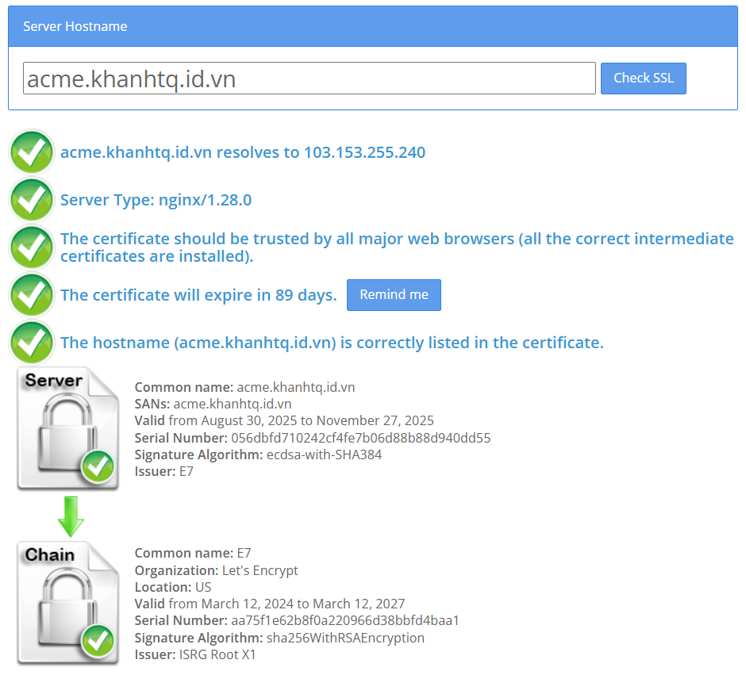

!!! info
  Bài viết này sẽ hướng dẫn bạn **cấu hình SSL tự động với Nginx** mà không cần cài đặt thêm phần mềm bên thứ ba như Certbot. Nếu bạn cần hỗ trợ, xin vui lòng liên hệ VinaHost qua **Hotline 1900 6046 ext.3**, gửi email về [support@vinahost.vn](mailto:support@vinahost.vn) hoặc [bấm vào đây](https://livechat.vinahost.vn/chat.php) để chat trực tuyến.

_[Giao thức ACME](https://www.rfc-editor.org/rfc/rfc8555.html) (Automated Certificate Management Environment) giúp tự động hóa quá trình cấp phát, chứng thực, gia hạn và thu hồi các chứng chỉ bảo mật kỹ thuật số (ví dụ chứng chỉ SSL/TLS). Nhờ đó mà đơn giản hóa việc tương tác với CA (Certificate Authority - Cơ quan Chứng chỉ) để triển khai các dịch vụ dựa trên HTTPS._

_Mô-đun `ngx_http_acme_module` của Nginx hỗ trợ ACMEv2 (phiên bản mới của ACME, hỗ trợ chứng chỉ wildcard) cung cấp các chỉ thị để yêu cầu, cài đặt và gia hạn chứng chỉ ngay bên trong cấu hình của Nginx._

## Yêu cầu

- Nginx 1.26.0 hoặc mới hơn
- Đã cài đặt và bật mô-đun hỗ trợ ACME, xem tại đây
- Cổng 80 có thể được truy cập
- Nginx host phải truy cập được đường dẫn <https://acme-v02.api.letsencrypt.org/directory>

**Lưu ý:** Tính năng này chỉ hỗ trợ HTTP-01

## Thực hiện

### Cấu hình Nginx

Trong hướng dẫn này, chúng ta sẽ sử dụng Let's Encrypt.

```nginx
#cấu hình resolver cho Nginx để gọi Let’s Encrypt API
resolver 8.8.8.8 1.1.1.1 valid=300s; #Google, Cloudflare
resolver_timeout 5s;

acme_issuer letsencrypt { 
  uri         https://acme-v02.api.letsencrypt.org/directory;
  contact     khanhtq@vinahost.vn; #thay bằng email của bạn
  state_path  /var/cache/nginx/acme-letsencrypt;
  accept_terms_of_service; #chấp nhận điều khoản
}
```

Vùng nhớ dùng chung để lưu trữ chứng chỉ, khóa riêng tư, dữ liệu chứng thực. Mặc định là 256K, có thể được tăng lên 1M như bên dưới.

```nginx
acme_shared_zone zone=acme_shared:1M; 
```

Chỉ thị `acme_certificate` trong khối `server` sẽ tự động cấp phát và gia hạn chứng chỉ cho các tên miền được liệt kê bởi chỉ thị `server_name`.

```nginx
server {
  listen 443 ssl; #phục vụ https
  server_name acme.khanhtq.id.vn; #tên miền của bạn
  #server_name .khanhtq.id.vn; #wildcard

  acme_certificate letsencrypt;

  ssl_certificate       $acme_certificate; #chứng chỉ
  ssl_certificate_key   $acme_certificate_key; #khóa riêng tư
  ssl_certificate_cache max=2; #cache 2 cặp chứng chỉ - khóa riêng tư

  #cấu hình web cơ bản, thay bằng cấu hình thực tế
  root /var/www/html;
  index index.html;
}

server { 
  listen 80; #bắt buộc
  server_name acme.khanhtq.id.vn;

  access_log /var/log/nginx/access.log combined;
  error_log /var/log/nginx/error.log debug;

  location /.well-known/acme-challenge/ {
    root /var/www/html;
  }

  location / { 
    return 404; #nếu không phải yêu cầu chứng thực
  }
}
```

### Tệp cấu hình đầy đủ

```nginx
resolver 8.8.8.8 1.1.1.1 valid=300s;
resolver_timeout 5s;

acme_issuer letsencrypt { 
  uri         https://acme-v02.api.letsencrypt.org/directory;
  contact     khanhtq@vinahost.vn;
  state_path  /var/cache/nginx/acme-letsencrypt;
  accept_terms_of_service;
}

acme_shared_zone zone=acme_shared:1M; 

server {
  listen 443 ssl;
  server_name acme.khanhtq.id.vn;
  #server_name .khanhtq.id.vn; #wildcard

  access_log /var/log/nginx/access.log combined;
  error_log /var/log/nginx/error.log debug;

  acme_certificate letsencrypt;

  ssl_certificate       $acme_certificate;
  ssl_certificate_key   $acme_certificate_key;
  ssl_certificate_cache max=2;

  root /var/www/html;
  index index.html;
}

server { 
  listen 80;
  server_name acme.khanhtq.id.vn;

  access_log /var/log/nginx/access.log combined;
  error_log /var/log/nginx/error.log debug;

  location /.well-known/acme-challenge/ {
    root /var/www/html;
  }

  location / { 
    return 404;
  } 
}
```

### Áp dụng các thay đổi

Tải lại Nginx:

```bash
nginx -t && nginx -s reload
```

## Kiểm tra

Log truy cập phải có các yêu cầu chứng thực thành công từ Let's Encrypt.

```bash
grep acme /var/log/nginx/access.log
```

Đầu ra mong đợi:

```log
23.178.112.219 - - [30/Aug/2025:15:23:52 +0700] "GET /.well-known/acme-challenge/4CHRBkHOgR2zdj7NCFWNBG7CZjVBjWsasWlrx3fKblY HTTP/1.1" 200 87 "-" "Mozilla/5.0 (compatible; Let's Encrypt validation server; +https://www.letsencrypt.org)"
3.1.6.219 - - [30/Aug/2025:15:23:52 +0700] "GET /.well-known/acme-challenge/4CHRBkHOgR2zdj7NCFWNBG7CZjVBjWsasWlrx3fKblY HTTP/1.1" 200 87 "-" "Mozilla/5.0 (compatible; Let's Encrypt validation server; +https://www.letsencrypt.org)"
34.216.44.74 - - [30/Aug/2025:15:23:53 +0700] "GET /.well-known/acme-challenge/4CHRBkHOgR2zdj7NCFWNBG7CZjVBjWsasWlrx3fKblY HTTP/1.1" 200 87 "-" "Mozilla/5.0 (compatible; Let's Encrypt validation server; +https://www.letsencrypt.org)"
51.20.136.232 - - [30/Aug/2025:15:23:53 +0700] "GET /.well-known/acme-challenge/4CHRBkHOgR2zdj7NCFWNBG7CZjVBjWsasWlrx3fKblY HTTP/1.1" 200 87 "-" "Mozilla/5.0 (compatible; Let's Encrypt validation server; +https://www.letsencrypt.org)"
3.138.69.251 - - [30/Aug/2025:15:23:53 +0700] "GET /.well-known/acme-challenge/4CHRBkHOgR2zdj7NCFWNBG7CZjVBjWsasWlrx3fKblY HTTP/1.1" 200 87 "-" "Mozilla/5.0 (compatible; Let's Encrypt validation server; +https://www.letsencrypt.org)"
```

Kiểm tra với công cụ trực tuyến như [SSL Shopper](https://www.sslshopper.com/ssl-checker.html).


## Kết luận

VinaHost đã hướng dẫn xong cách **cấu hình SSL tự động với Nginx không cần Certbot**.

Chúc bạn thực hiện thành công! 🍻

Hướng dẫn liên quan: Hướng dẫn cài đặt mô-đun Nginx `ngx_http_acme_module`

> **THAM KHẢO CÁC DỊCH VỤ TẠI [VINAHOST](https://vinahost.vn/)**
>
> **\>> [SERVER](https://vinahost.vn/thue-may-chu-rieng/) – [COLOCATION](https://vinahost.vn/colocation.html) – [CDN](https://vinahost.vn/dich-vu-cdn-chuyen-nghiep)**\
> **\>> [CLOUD](https://vinahost.vn/cloud-server-gia-re/) – [VPS](https://vinahost.vn/vps-ssd-chuyen-nghiep/)**\
> **\>> [HOSTING](https://vinahost.vn/wordpress-hosting)**\
> **\>> [EMAIL](https://vinahost.vn/email-hosting)**\
> **\>> [WEBSITE](http://vinawebsite.vn/)**\
> **\>> [TÊN MIỀN](https://vinahost.vn/ten-mien-gia-re/)**
