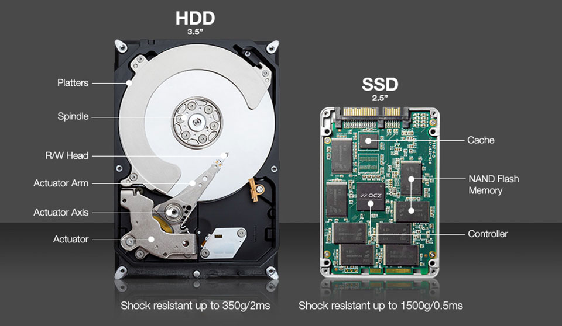

# Ổ cứng SSD là gì? Phân biệt khác nhau giữa ổ cứng SSD và HDD? Trường hợp nào nên sử dụng SSD?

## SSD là gì?
  
**SSD** là viết tắt của từ **Solid-State Drive** - ổ cứng thể rắn, còn **HDD** là viết tắt của **Hard Disk Drive**, tức ổ đĩa cứng hoạt động bằng cơ. Với HDD, dữ liệu được ghi lên các phiến đĩa (gọi là platter), ví dụ trong ổ đó bạn có 1000 bài nhạc MP3, khi muốn mở một bài nhạc nào đó, đầu từ của ổ sẽ quét lên các phiến đĩa để tìm file MP3 đó, việc này mất một khoảng thời gian (gọi là seek time), tương tự như bạn tìm 1 cái áo trong tủ đồ của mình, nhưng vì seek time này vô cùng nhỏ, chỉ vài mili giây, nên hầu như chúng ta không nhận thấy sự chậm trễ này. Tuy nhiên, vì cơ chế đó mà với HDD có chứa nhiều dữ liệu, chúng sẽ bị phân mảnh, dẫn tới việc tốc độ truy xuất bị giảm sút (giống như ta mất thời gian tìm 1 cuốn sách trong thư viện), và cũng vì giới hạn trong công nghệ sản xuất mà HDD ngày nay chỉ tăng về dung lượng là chủ yếu chứ tiến rất chậm về tốc độ.  

Cấu trúc bên trong của HDD và SSD
  
## Phân biệt khác nhau giữa ổ cứng SSD và HDD?
  
Ngày nay, công nghệ phát triển rất nhanh, từng ngày trên các thiết bị kỹ thuật số như điện thoại, máy tính bảng, laptop. Trên laptop, một thành phần không thể thiếu đó là ổ cứng để lưu trữ dữ liệu cũng như nạp hệ điều hành.

Công nghệ lưu trữ trên ổ cứng hiện nay có 2 loại: **Hard-disk-drive (HDD)** là dạng truyền thống, **Solid-state-drive (SSD)**là loại ổ cứng mới ở dạng thể rắn. Về cơ bản cả hai loại ổ cứng đều dùng để lưu trữ dữ liệu, nhưng chúng sẽ có nhiều điểm khác nhau, việc lựa chọn sử dụng sẽ tùy thuộc khá nhiều vào mức độ hiểu biết và nhu cầu của bạn.

Ổ cứng truyền thống được sử dụng rộng rãi trên tất cả các server cho đến hiện nay là HDD, nó có nhiều ưu điểm để nhà sản xuất còn duy trì đến ngày nay, quan trọng nhất vẫn là dung lượng lớn và giá thành không quá cao. Với dạng ổ đĩa HDD này, sử dụng một đĩa từ để lưu dữ liệu trên đó, máy sẽ truy cập dữ liệu bằng cách dùng một đầu đọc chạy trên mặt đĩa tròn xoay quanh trục.

Thế hệ ổ cứng mới là SSD khác biệt hoàn toàn về thiết kế lẫn cách hoạt động so với ổ cứng HDD. Do ở trạng thái rắn (bộ nhớ flash) nên ổ cứng SSD hoạt động rất êm, chống sốc cực tốt và hầu như ổn định, những ưu điểm này đều không có trên HDD.

##  Ưu – Nhược điểm của HDD và SSD?  

Công dụng chính của cả hai loại ổ cứng này đều là lưu trữ dữ liệu trên máy tính, hệ điều hành, phần mềm. Mỗi loại ổ cứng sẽ có ưu và nhược điểm riêng, có thể thông qua các yếu tố sau để so sánh SSD và HDD:

*   **Giá:** ổ cứng SSD đắt hơn nhiều so với HDD. 
*   **Hiệu suất và sự thông dụng:** SSD sẽ cao và ổn định hơn HDD rất nhiều, đồng thời nó có khả năng chống sốc tốt (do các chip nhớ nằm cố định trên bo mạch chủ), ổ cứng HDD sẽ bị sốc và mất ổn định hơn. Tuy vậy, ổ HDD vẫn rất thông dụng hiện nay vì giá thành rẻ và dung lượng lưu trữ lớn.
*   **Tốc độ:** đây là ưu điểm tuyệt đối của SSD khi so sánh với HDD. Một máy tính sử dụng ổ SSD chỉ mất vài giây đến vài chục giây khởi động trong khi đó nếu sử dụng HDD sẽ mất thời gian tầm 1 phút hoặc lâu hơn, tốc độ này cũng đúng trong các tác vụ trên máy, sử dụng đồ họa hay chơi game.  
    Đối với ổ cứng HDD, bạn vẫn có thể chọn tốc độ cao hơn với loại HDD (7200 vòng/phút).
*   **Sự phân mảnh dữ liệu:** do cấu trúc là mặt đĩa hình tròn, vì thế dữ liệu lớn và tập trung sẽ dễ lưu và truy cập hơn trên HDD, nếu dữ liệu nhỏ lẻ sẽ dễ bị phân mảnh và mất thời gian hơn (ổ đĩa quay), điều này không xuất hiện trên SSD do cấu trúc các chip nhớ rời và dữ liệu được phân vùng trên đó.
*   **Độ bền:** SSD có độ bền sử dụng hơn hẳn HDD vì cấu tạo vật lý của nó là cố định, còn HDD sẽ phải hoạt động liên tục đĩa từ và trục xoay.
*   **Tiếng ồn:** ổ đĩa HDD sẽ khá rung và có tiếng ồn khi lưu/truy cập dữ liệu, ổ HDD thế hệ mới sẽ giảm thiểu được điều này nhưng không hoàn toàn. Trong khi đó, SSD hoạt động cực kì mượt mà và êm ái.
*   **Hình thức:** SSD được đánh giá cao về hình thức cũng như sự linh hoạt trong thiết kế hơn nhiều so với HDD (bắt buộc là đĩa từ và phải có một trục xoay).

## Trường hợp nào nên sử dụng ổ SSD.
  
Ổ cứng SSD thích hợp với tất cả mọi đối tượng sử dụng, đặc biệt là những đối tượng sử dụng dịch vụ yêu cầu sự đọc ghi (in/ out) lớn của ổ cứng. Vinahost khuyến nghị những trường hợp khách hàng nên sử dụng SSD để lưu trữ dữ liệu như khách hàng dùng để lưu trữ và truy xuất cơ sở dữ liệu (database), khách hàng lưu trữ các dịch vụ file dung lượng vừa phải và yêu cầu truy cập thường xuyên...

Đối với tất cả các thể ổ cứng lưu trữ, Vinahost đều khuyến cáo khách hàng nên lưu trữ dạng Raid để nhằm tối ưu hóa tốc độ truy cập cũng như đảm bảo an toàn dữ liệu.

> **THAM KHẢO CÁC DỊCH VỤ TẠI [VINAHOST](https://vinahost.vn/)**
> 
> **\>>** [**SERVER**](https://vinahost.vn/thue-may-chu-rieng/) **–** [**COLOCATION**](https://vinahost.vn/colocation.html) – [**CDN**](https://vinahost.vn/dich-vu-cdn-chuyen-nghiep)
> 
> **\>> [CLOUD](https://vinahost.vn/cloud-server-gia-re/) – [VPS](https://vinahost.vn/vps-ssd-chuyen-nghiep/)**
> 
> **\>> [HOSTING](https://vinahost.vn/wordpress-hosting)**
> 
> **\>> [EMAIL](https://vinahost.vn/email-hosting)**
> 
> **\>> [WEBSITE](http://vinawebsite.vn/)**
> 
> **\>> [TÊN MIỀN](https://vinahost.vn/ten-mien-gia-re/)**