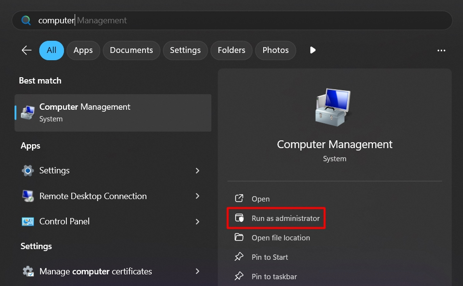
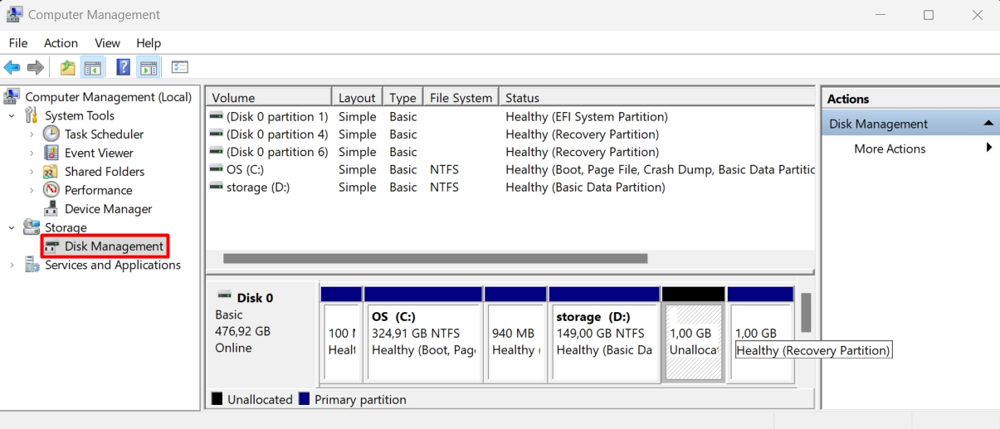
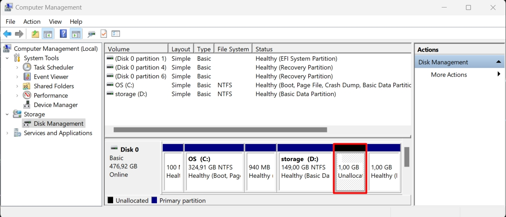
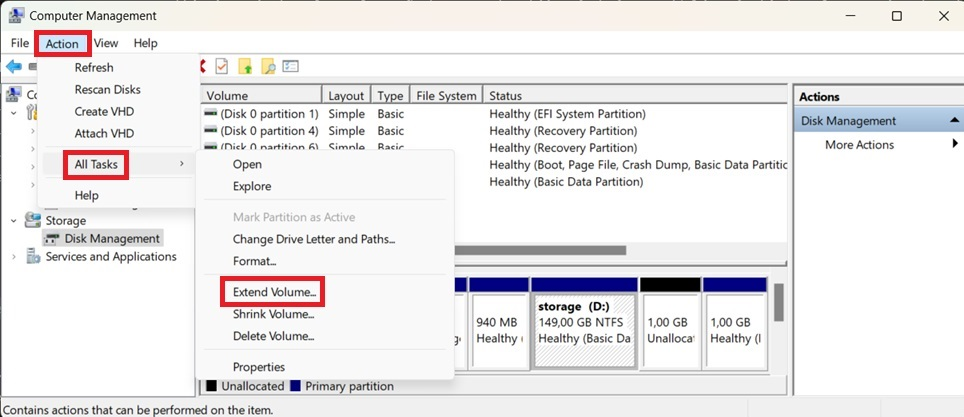
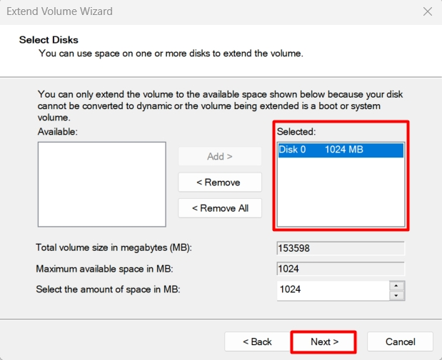
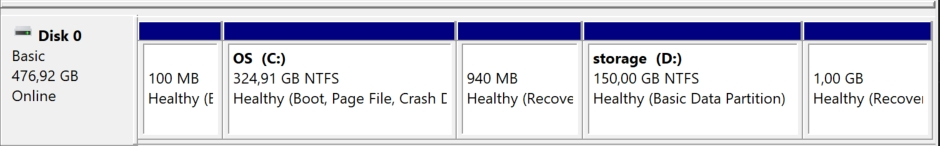
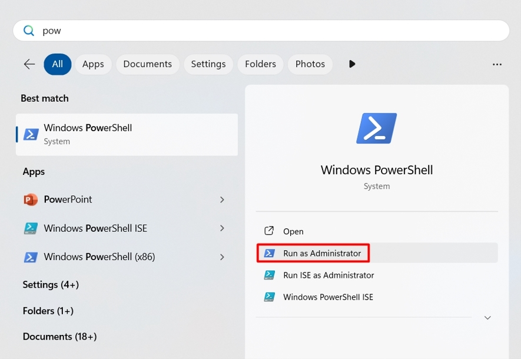

!!! info "Liên hệ"
    Nếu bạn cần hỗ trợ, xin vui lòng liên hệ hotline **1900 6046 nhánh 3**, hoặc gửi email đến [**support@vinahost.vn**](mailto:support@vinahost.vn), hoặc chat trực tiếp với chúng tôi tại [**đây**](https://livechat.vinahost.vn/chat.php).


**Disk Management** là công cụ hệ thống trên Windows để quản lý lưu trữ. Một số tính năng của Disk Management:

- [x] Tạo/Xoá ổ đĩa
- [x] Mở rộng/Cắt dung lượng ổ đĩa/volume
- [x] Gán/Thay đổi ký tự cho volume

!!! info "Thông tin thêm"
    Khái niệm **volume** đang được đề cập là một phân vùng ổ đĩa với các ký tự (C:, D:, E:, ...)


## Điều kiện để mở rộng đĩa

Các điều kiện cần phải được đáp ứng để có thể mở rộng một volume bằng Disk Management:

- Phần dung lượng trống chưa được cấp phát (được đánh dấu là "Unallocated")
- Phần dung lượng trống nằm liền kề bên phải của volume cần được mở rộng
- Volume cần được mở rộng phải được định dạng NTFS hoặc ReFS


## Thực hiện

Sau khi nâng cấp dung lượng lưu trữ cho VPS, thực hiện các bước sau để lấy toàn bộ dung lượng trống chưa được sử dụng.

!!! tip "Mẹo"
    Nếu không thấy phần dung lượng nào được đánh dấu là "Unallocated", bạn cần phải tắt nguồn :material-power:{ title="poweroff" } rồi khởi động :material-play:{ title="start" } VPS.

=== "Sử dụng Disk Management"

    1. **Mở Disk Management với quyền quản trị viên**

        Tìm kiếm và chạy **Computer Management** với quyền quản trị viên.

        

        Chọn **Storage > Disk Management** trong thanh điều hướng bên trái.

        

    2. **Xác định volume có thể mở rộng**
    
        

        Trong ảnh trên, chỉ có một phần dung lượng trống nằm liền kề bên phải của volume **D:**. Do đó, đây cũng là volume duy nhất có thể được mở rộng trong trường hợp này.

    3. **Mở rộng volume**

        Chọn volume cần mở rộng (D:), sau đó chọn **Action > All Tasks > Extend Volume...**.

        

        Chọn **Next** ở cửa sổ tiếp theo.

        Đảm bảo toàn bộ dung lượng trống nằm trong hộp **Selected**.

        

        Chọn **Finish** ở hộp thoại cuối cùng để hoàn tất việc mở rộng.

        

=== "Sử dụng Powershell"

    1.  **Mở Powershell với quyền quản trị viên**

        

    2. **Kiểm tra cổng RDP đang dùng**

        Sao chép và dán lệnh sau vào Powershell, sau đó nhấn Enter để chạy:

        ```powershell title="Powershell" linenums="1"
        # Chỉ định ký tự của volume cần mở rộng
        $drive_letter = "D"

        # Biến size chứa thông tin về kích thước tối thiểu (SizeMin) và tối đa (SizeMax) mà phân vùng có thể thay đổi
        $size = (Get-PartitionSupportedSize -DriveLetter $drive_letter)

        # Mở rộng phân vùng đến kích thước tối đa
        Resize-Partition -DriveLetter $drive_letter -Size $size.SizeMax
        ```


## Kết luận

Như vậy là VinaHost đã hướng dẫn bạn 2 cách để **mở rộng dung lượng lưu trữ trên Windows sau khi nâng cấp**. Chúc bạn thực hiện thành công! 🍻


> **THAM KHẢO CÁC DỊCH VỤ TẠI [VINAHOST](https://vinahost.vn/)**
>
> **\>> [SERVER](https://vinahost.vn/thue-may-chu-rieng/) – [COLOCATION](https://vinahost.vn/colocation.html) – [CDN](https://vinahost.vn/dich-vu-cdn-chuyen-nghiep)**<br>
> **\>> [CLOUD](https://vinahost.vn/cloud-server-gia-re/) – [VPS](https://vinahost.vn/vps-ssd-chuyen-nghiep/)**<br>
> **\>> [HOSTING](https://vinahost.vn/wordpress-hosting)**<br>
> **\>> [EMAIL](https://vinahost.vn/email-hosting)**<br>
> **\>> [WEBSITE](http://vinawebsite.vn/)**<br>
> **\>> [TÊN MIỀN](https://vinahost.vn/ten-mien-gia-re/)**
