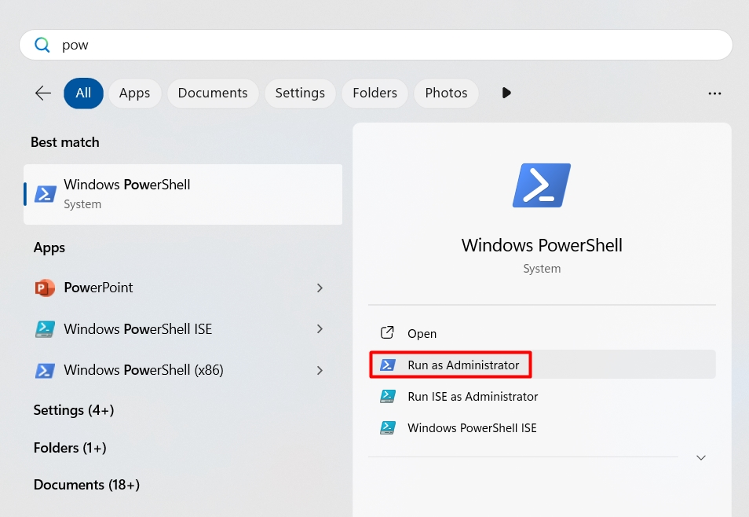
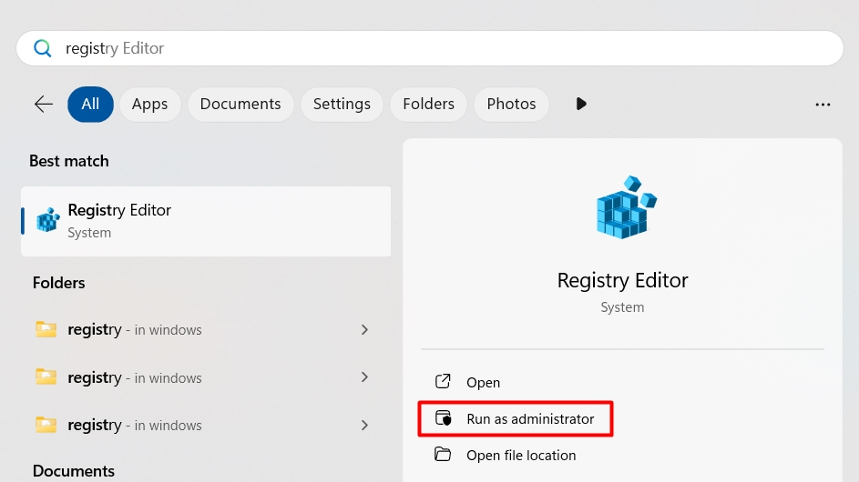
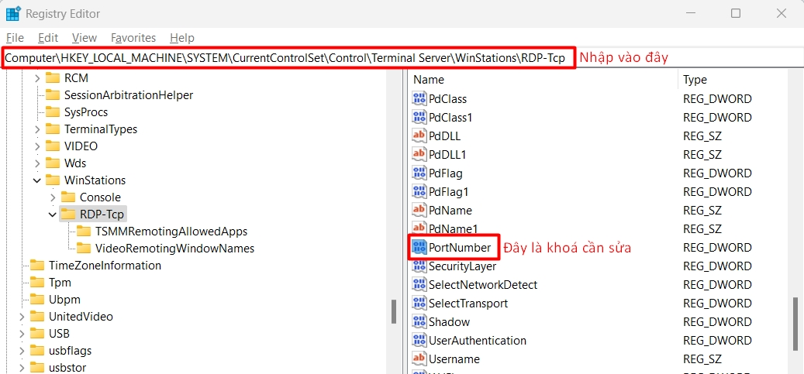
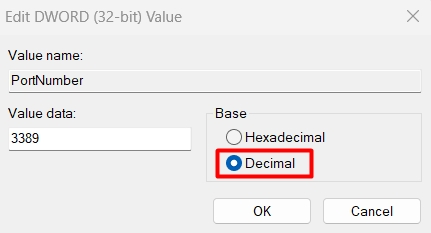
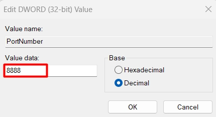

!!! info "Liên hệ"
    Nếu bạn cần hỗ trợ, xin vui lòng liên hệ hotline **1900 6046 nhánh 3**, hoặc gửi email đến [**support@vinahost.vn**](mailto:support@vinahost.vn), hoặc chat trực tiếp với chúng tôi tại [**đây**](https://livechat.vinahost.vn/chat.php).


## Thay đổi cổng RDP trên Windows

=== "Sử dụng Powershell"

    1.  **Mở Powershell với quyền quản trị viên**

        

    2. **Kiểm tra cổng RDP đang dùng**

        Sao chép và dán lệnh sau vào Powershell, sau đó nhấn Enter để chạy:

        ```powershell
        Get-ItemProperty -Path 'HKLM:\SYSTEM\CurrentControlSet\Control\Terminal Server\WinStations\RDP-Tcp' -name "PortNumber"
        ```

        Đầu ra của Powershell chứa số cổng đang dùng:

        ```powershell
        PortNumber   : 3389
        ```

        !!! info "Thông tin thêm"
            3389 là cổng Windows RDP mặc định

    3. **Thay đổi cổng RDP**

        Chạy lệnh sau trong Powershell:

        ```powershell title="Powershell"
        Set-ItemProperty -Path 'HKLM:\SYSTEM\CurrentControlSet\Control\Terminal Server\WinStations\RDP-Tcp' -name "PortNumber" -Value <port>
        ```

        !!! warning "Lưu ý"
            Thay `<port>` ở cuối lệnh trên bằng số cổng mà bạn muốn

    4.  **Tạo quy tắc tường lửa mới để cho phép Windows sử dụng cổng vừa chỉ định**

        Chạy lần lượt 2 lệnh sau trong Powershell:

        ```powershell title="Powershell" linenums="1"
        New-NetFirewallRule -DisplayName 'RDPPORTLatest-TCP-In' -Profile 'Public' -Direction Inbound -Action Allow -Protocol TCP -LocalPort <port>
        New-NetFirewallRule -DisplayName 'RDPPORTLatest-UDP-In' -Profile 'Public' -Direction Inbound -Action Allow -Protocol UDP -LocalPort <port>
        ```

        !!! warning "Lưu ý"
            Thay `<port>` ở cuối lệnh trên bằng số cổng mà bạn đã chỉ định tại **bước 3**

=== "Sử dụng Registry Editor"

    1. **Mở Registry Editor với quyền quản trị viên**

        

    2. **Điều hướng đến khoá registry cần sửa**

        Nhập chuỗi dưới đây vào thanh điều hướng rồi nhấn Enter:

        ```
        HKEY_LOCAL_MACHINE\System\CurrentControlSet\Control\Terminal Server\WinStations\RDP-Tcp
        ```

        
        
    3. **Sửa khoá registry**

        Khoá registry có tên **PortNumber** quy định số cổng RDP. Nhấp đôi chuột vào khoá này, chọn **Decimal** để hiện số cổng dạng thập phân.

        

        Nhập số cổng mong muốn vào trường **Value data**, nhấn **OK** để thay đổi.

        

    4. **Khởi động lại Windows để áp dụng thay đổi**

## Kết luận

Như vậy là VinaHost đã hướng dẫn bạn 2 cách để **thay đổi cổng RDP trên Windows**. Chúc bạn thực hiện thành công! 🍻


> **THAM KHẢO CÁC DỊCH VỤ TẠI [VINAHOST](https://vinahost.vn/)**
>
> **\>> [SERVER](https://vinahost.vn/thue-may-chu-rieng/) – [COLOCATION](https://vinahost.vn/colocation.html) – [CDN](https://vinahost.vn/dich-vu-cdn-chuyen-nghiep)**<br>
> **\>> [CLOUD](https://vinahost.vn/cloud-server-gia-re/) – [VPS](https://vinahost.vn/vps-ssd-chuyen-nghiep/)**<br>
> **\>> [HOSTING](https://vinahost.vn/wordpress-hosting)**<br>
> **\>> [EMAIL](https://vinahost.vn/email-hosting)**<br>
> **\>> [WEBSITE](http://vinawebsite.vn/)**<br>
> **\>> [TÊN MIỀN](https://vinahost.vn/ten-mien-gia-re/)**
