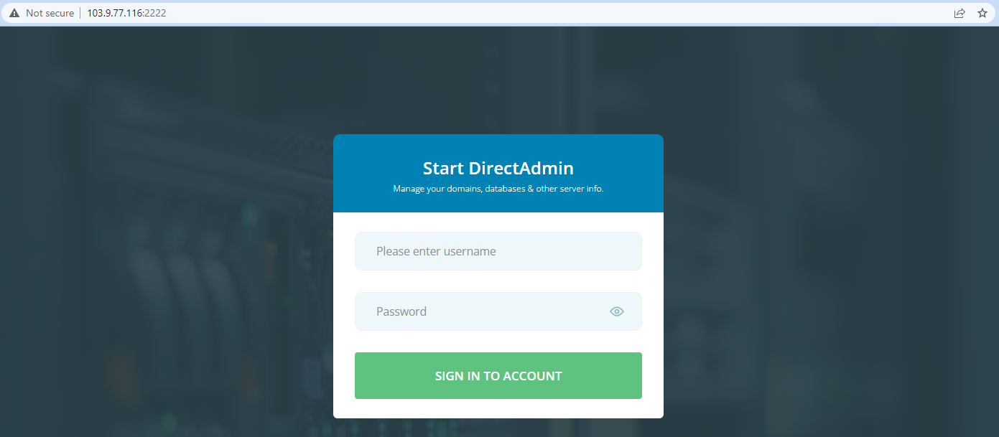
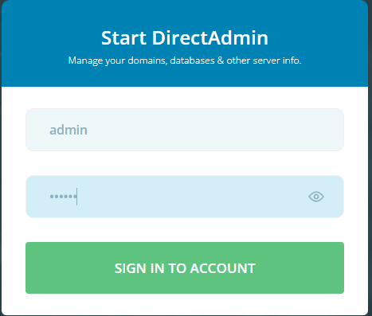
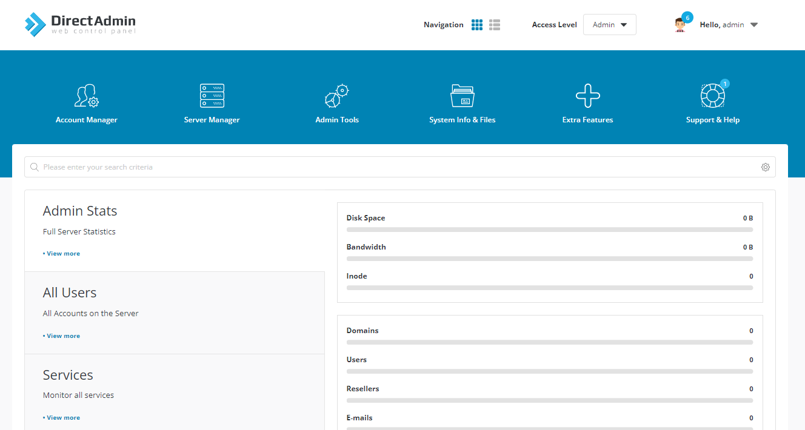
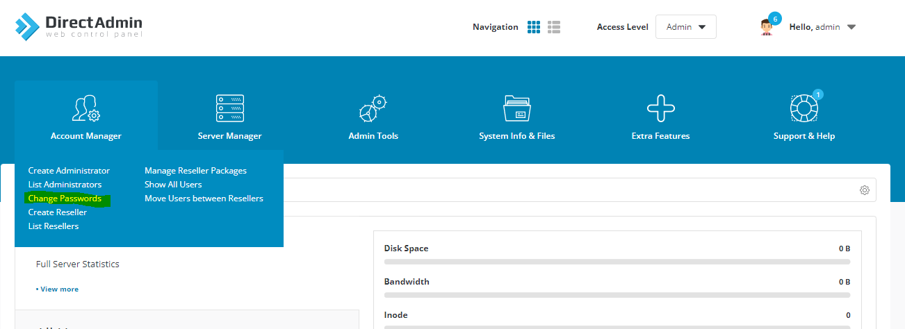
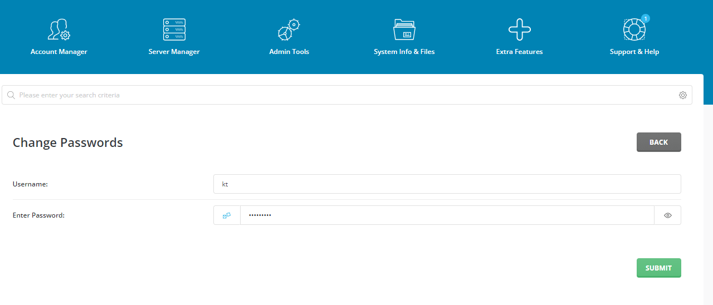
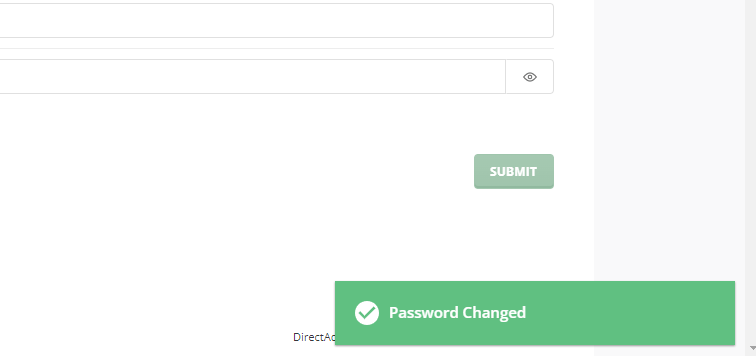

Bài viết này sẽ hướng dẫn bạn cách **Reset Mật KhẩuTài Khoản DirectAdmin**. Nếu bạn cần hỗ trợ, xin vui lòng liên hệ VinaHost qua Hotline 1900 6046 ext.3, email về support@vinahost.vn hoặc chat với VinaHost qua livechat https://livechat.vinahost.vn/chat.php.

## **1\. DirectAdmin là gì ?**

DirectAdmin là một trong số những Bảng điều khiển (Control Panel) dành cho người quản trị Web Hosting được sử dụng phổ biến hiện nay với giao diện đơn giản, trực quan, dễ dàng sử dụng. DirectAdmin được thiết kế để dễ dàng thực hiện các công việc hàng ngày của webmaster, đặc biệt là những người có ít hoặc không có kinh nghiệm trước đó.

## 2\. Hướng dẫn thực hiện

**Bước 1:** **Truy cập directadmin controlpanel**

Truy cập vào giao điện directadmin bằng địa chỉ ip của máy vps sau đó thêm vào **:2222** ở cuối địa chỉ

**Bước 2: Đăng nhập tài khoản admin**

Muốn chỉnh sửa bất kì thông tin nào của tài khoản user phải bằng quyền admin, nên ta phải đăng nhập vào tài khoản admin.

Sau khi đăng nhập tài khoản admin xong chúng ta sẽ được một giao diện như thế này:

**Bước 3: Tìm nút Change Password**

Tiến hành những bước đầu tiên của việc reset lại password của tài khoản user, đầu tiên chúng ta chọn **account manager** tiếp theo chọn vào **change Passwords**

**Bước 4: Điền user và password cần thay đổi**

Chúng ta điền thông tin user cần reset password và nhập password mới vào

**Bước 5: Thực hiện change password**

Sau đó chúng ta nhấn vào submit và hiện lên được tick **password changed** là hoàn thành việc reset password cho user.

Chúc quý khách thực hiện thành công!

> **THAM KHẢO CÁC DỊCH VỤ TẠI [VINAHOST](https://vinahost.vn/)**
> 
> **\>>** [**SERVER**](https://vinahost.vn/thue-may-chu-rieng/) **–** [**COLOCATION**](https://vinahost.vn/colocation.html) – [**CDN**](https://vinahost.vn/dich-vu-cdn-chuyen-nghiep)
> 
> **\>> [CLOUD](https://vinahost.vn/cloud-server-gia-re/) – [VPS](https://vinahost.vn/vps-ssd-chuyen-nghiep/)**
> 
> **\>> [HOSTING](https://vinahost.vn/wordpress-hosting)**
> 
> **\>> [EMAIL](https://vinahost.vn/email-hosting)**
> 
> **\>> [WEBSITE](http://vinawebsite.vn/)**
> 
> **\>> [TÊN MIỀN](https://vinahost.vn/ten-mien-gia-re/)**
