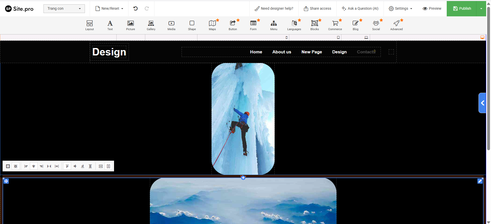
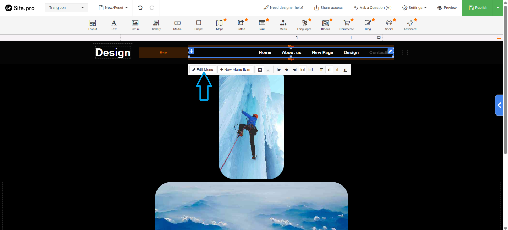

**Hướng dẫn sử dụng Website Builder (SitePro Builder) trên Direct Admin**

Bài viết này sẽ giới thiệu về **Hướng dẫn sử dụng Website Builder (SitePro Builder) trên Direct Admin** và lợi ích của nó. Nếu bạn cần hỗ trợ, xin vui lòng liên hệ VinaHost qua **Hotline 1900 6046 ext. 3**, email về [support@vinahost.vn](mailto:support@vinahost.vn) hoặc chat với VinaHost qua livechat [https://livechat.vinahost.vn/chat.php](https://livechat.vinahost.vn/chat.php)

Click chọn **Tính năng bổ sung**

Chọn **Website Builder**

Tìm và chọn mẫu giao diện

Để sửa văn bản, chỉ cần double click vào đoạn văn bản cần sửa và sửa lại

Sai khi sửa xong thì click **Done** để lưu lại

Để thêm hình ảnh, ta có thể chọn vào vùng cần thêm ảnh

Click **Picture**

Chọn khung ảnh ưa thích

Upload ảnh thông qua nút **Upload New Picture** để tải ảnh lên từ máy

Sau đó chọn ảnh cần chèn và nhấn **SELECT**

Để chỉnh sửa menu, ta có thể click vào menu cần sửa và click **Edit menu**

**  **

Ở đây, ta có thể thêm trang mới qua thao tác click **New Menu Item**

Điền tên của mục menu mới và click **APPLY**

Đã hiện mục menu mới

Để thay đổi màu sắc của đoạn văn bản cần sửa 🡪 Double Click vào đoạn văn bản đó 🡪 Bôi đen văn bản cần chỉnh 🡪 Click biểu tượng **<u>A</u>** để hiện bảng màu, click vào vùng như hình để bôi đen toàn bộ phần văn bản 🡪 Điều chỉnh lại màu và bấm **Done**

Để thay đổi Font chữ của heading 🡪 Chọn phần văn bản cần đổi font chữ 🡪 click **Edit Text**

Click biểu tượng 

Đổi lại font mới và click **APPLY**

**  **

Để tạo trang con, đầu tiên cần click vào nút như trong hình

Click **Edit**

Click **New Page**

Tùy chỉnh thông tin của trang con và click **APPLY**

**  **

Click vào **Trang con** mới tạo để chuyển tiếp đến giao diện sửa đổi trang con.

Để thêm section mới, cần click vào biểu tượng  để thêm các section tương ứng

Để liên kết chỉ mục menu với **Trang con** cần click vào menu 🡪 click **Edit Menu**

Click vào chỉ mục cần liên kết với **Trang con**

Click chọn trang cần liên kết và bấm **APPLY**

Dùng tổ hợp phím **Ctrl + S** để lưu.

Có thể click nút **Preview** để kiểm tra lại

Để thêm section gồm thông tin liên hệ, form email cần thao tác như hình 

Sẽ hiện ra 1 pop-up và ta có thể click chọn form theo ý muốn

Sau đó dùng tổ hợp phím **Ctrl + S** để lưu lại

Như trong hình lần lượt là favicon và logo mặc định

Để thay đổi favicon cần click **Settings 🡪 Favicon**

Click biểu tượng  để mở popup thêm ảnh

Click **SELECT** để chọn ảnh vừa upload

Click **APPLY**

**  **

Để thay đổi logo thì ta cần xóa logo (hình ảnh, văn bản) của mẫu template cũ đi

Click **Picture**

Thực hiện upload ảnh mới

Dùng tổ hợp phím **Ctrl + S** và lưu lại

Ta có thể dùng tính năng **Preview** để kiểm tra lại

Ngoài ra, **Website Builder** còn có các tính năng liên quan đến tối ưu SEO

Để xuất bản website, ta cần click vào nút **Publish**

Website đã được xuất bản thành công

*Lưu ý: Tên miền phải trỏ DNS bản ghi A đến IP của hosting.*

**Chúc bạn thực hiện thành công!**

> **THAM KHẢO CÁC DỊCH VỤ TẠI [VINAHOST](https://vinahost.vn/)**
> 
> **\>>** [**SERVER**](https://vinahost.vn/thue-may-chu-rieng/) **–** [**COLOCATION**](https://vinahost.vn/colocation.html) – [**CDN**](https://vinahost.vn/dich-vu-cdn-chuyen-nghiep)
> 
> **\>> [CLOUD](https://vinahost.vn/cloud-server-gia-re/) – [VPS](https://vinahost.vn/vps-ssd-chuyen-nghiep/)**
> 
> **\>> [HOSTING](https://vinahost.vn/wordpress-hosting)**
> 
> **\>> [EMAIL](https://vinahost.vn/email-hosting)**
> 
> **\>> [WEBSITE](http://vinawebsite.vn/)**
> 
> **\>> [TÊN MIỀN](https://vinahost.vn/ten-mien-gia-re/)**