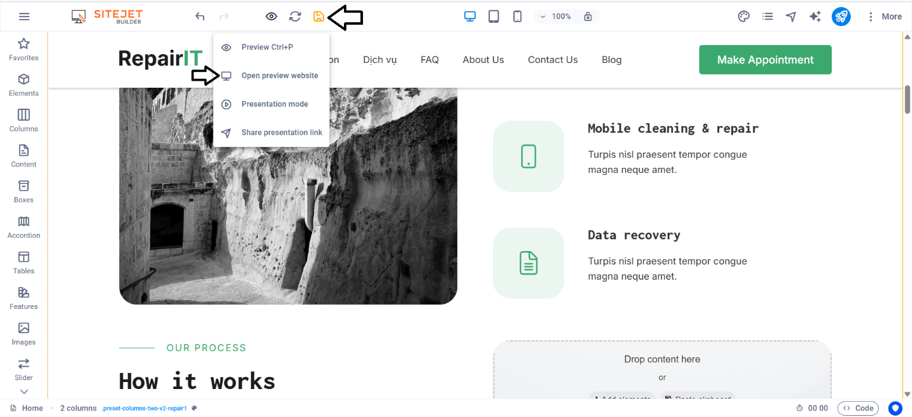
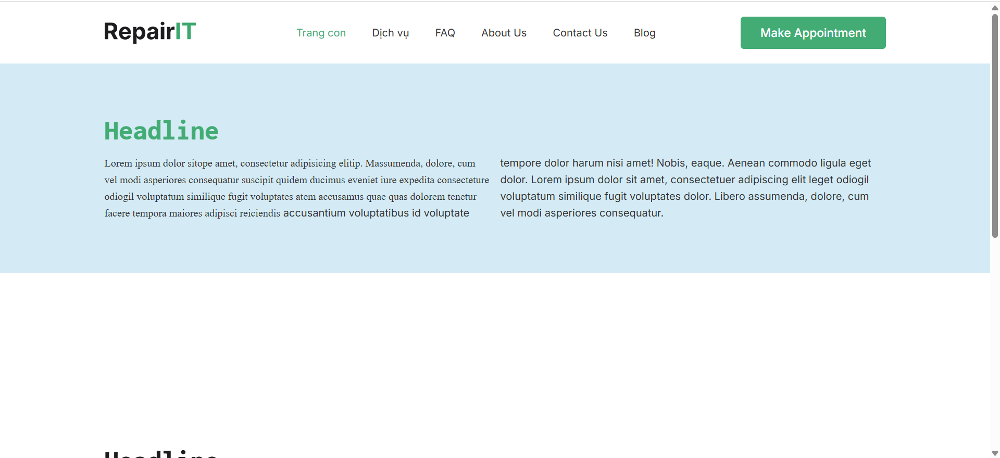
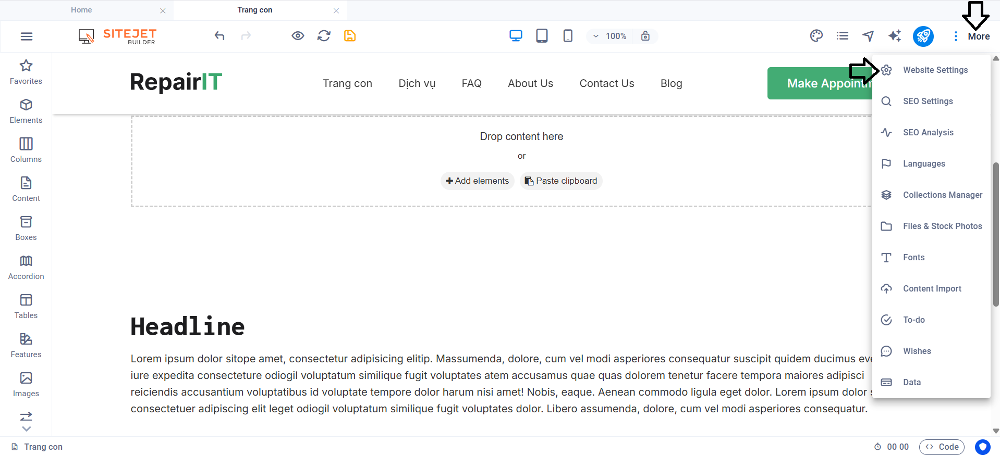
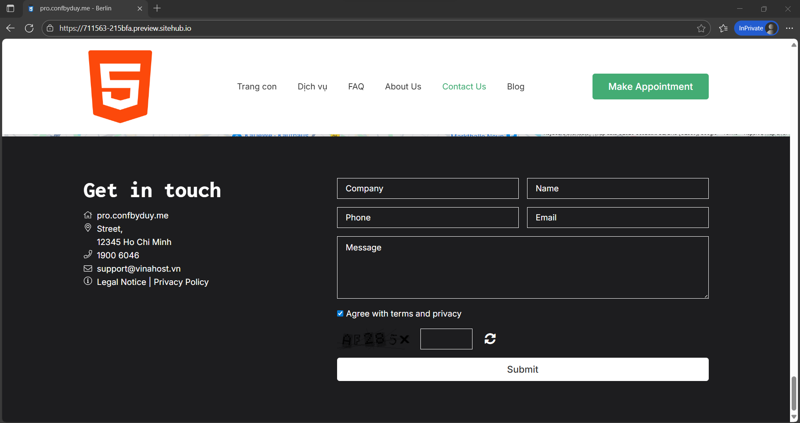
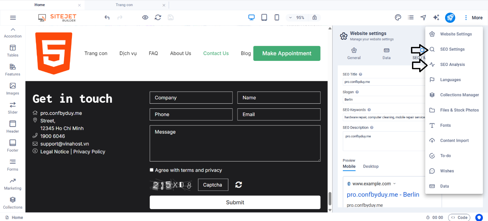

**Hướng dẫn chi tiết các sử dụng Sitejet Builder trên cPanel**

Bài viết này sẽ giới thiệu về **Hướng dẫn sử dụng Website Builder (SitePro Builder) trên cPanel** và lợi ích của nó. Nếu bạn cần hỗ trợ, xin vui lòng liên hệ VinaHost qua **Hotline 1900 6046 ext. 3**, email về [support@vinahost.vn](mailto:support@vinahost.vn) hoặc chat với VinaHost qua livechat [https://livechat.vinahost.vn/chat.php](https://livechat.vinahost.vn/chat.php)

Click **Sitejet Builder** để tiến hành tạo website

Click **Edit Site**

Click biểu tượng 

Click **Change Template**

Click **Confirm**

Có thể chọn bất cứ template có sẵn nào ở đây cho website theo nhu cầu cá nhân

Sau khi chọn đúng template theo nhu cầu thì sẽ hiện ra trang như hình, cho phép thiết kế chỉnh sửa lại

Có thể chỉnh sửa các văn bản, hình ảnh, menu.

Về văn bản, để sửa văn bản có sẵn thì double-click vào đoạn văn bản cần sửa.

Sau khi sửa xong thì bấm nút  để lưu lại

Tương tự với việc chỉnh sửa ảnh

Double click vào ảnh cần sửa

Click **Background**

Click **Image** và click vào **ảnh** cần sửa

Hiện hộp thoại để chọn ảnh từ việc **UPLOAD**

Sau khi ảnh đã upload xong thì bấm biểu tượng  để lưu lại

Tiếp theo là ví dụ về việc chỉnh sửa menu: Double click vào menu cần sửa (hoặc right click và bấm **Edit**)

Ở phần này, chúng ta có thể thay đổi thứ tự các chỉ mục trong menu, hoặc thay đổi tên chỉ mục của menu

Tiếp theo, là hướng dẫn thêm chỉ mục trong menu và link với trang con

Double click vào menu để hiện giao diện thêm chỉ mục vào menu và bấm biểu tượng  để thêm chỉ mục menu mới

Tiếp theo, click vào biểu tượng  và click **New page** để thêm trang mới

Điền các thông tin tương ứng cho trang con

Sau đó bấm nút  để điá»u hướng đến trang chỉnh sửa giao diện **Trang con**

Ở trang này, ta có thể thêm section kèm với phần tử tùy theo ý muốn cá nhân

Để thay đổi màu chữ của section chứa phần tử đó thì chỉ cần double click vào chỗ cần sửa, click biểu tượng  để thay đổi màu chữ.

Để thay đổi màu ná»n của section chứa phần tử đó, ta click vào biểu tượng  như trong hình

Click **Background** 🡪 Click **Color**

Chọn màu nền và click **Apply**

Tương tự cho việc thay đổi phông chữ, bôi đen chọn đoạn văn bản cần thay đổi phông chữ, và thực hiện theo các bước như hình để đổi phông chữ

Sau khi thao tác xong thì bật phần chỉnh sửa menu (double click vào menu) và sửa lại chỉ mục “**Trang con**” liên kết với page “**Trang con**”

Sau khi tùy chỉnh xong thì bấm nút  để lưu và di chuột vào biểu tượng  bấm “**Open preview website**†để kiểm tra lại

Để sửa thêm logo và favicon, cần thực hiện theo các thao tác sau: click **More 🡪 Website Settings**

Click biểu tượng upload  để thêm ảnh tương ứng

Sau khi thêm xong thì lưu lại và mở trang preview trong tab ẩn danh để kiểm tra lại.

Để thêm footer gồm các thông tin liên hệ cũng như biểu mẫu, có thể thực hiện thêm footer theo các bước sau đây:

Click **Add section** (+)

Chọn mẫu footer tương ứng

Ở đây, có thể chỉnh sửa lại các thông tin liên hệ

Để sửa các thông tin liên hệ ở footer cần thao tác như sau: Click **More 🡪 Website Settings 🡪 Data**

Sau khi sửa xong thì dùng tổ hợp phím **Ctrl + S** để lưu lại

Ngoài ra, còn có các tùy chọn để tối ưu SEO ở phần **SEO Settings** và **SEO Analysis**

Để xuất bản trang web, bấm nút **Publish** (biểu tượng )

Website đã được public thành công

*Lưu ý: Tên miền phải trỏ DNS bản ghi A đến IP của hosting.*

**Chúc bạn thực hiện thành công!**

> **THAM KHẢO CÁC DỊCH VỤ TẠI [VINAHOST](https://vinahost.vn/)**
> 
> **\>>** [**SERVER**](https://vinahost.vn/thue-may-chu-rieng/) **–** [**COLOCATION**](https://vinahost.vn/colocation.html) – [**CDN**](https://vinahost.vn/dich-vu-cdn-chuyen-nghiep)
> 
> **\>> [CLOUD](https://vinahost.vn/cloud-server-gia-re/) – [VPS](https://vinahost.vn/vps-ssd-chuyen-nghiep/)**
> 
> **\>> [HOSTING](https://vinahost.vn/wordpress-hosting)**
> 
> **\>> [EMAIL](https://vinahost.vn/email-hosting)**
> 
> **\>> [WEBSITE](http://vinawebsite.vn/)**
> 
> **\>> [TÊN MIỀN](https://vinahost.vn/ten-mien-gia-re/)**