> Bài viết này hướng dẫn các bạn sử dụng JetBackup để khôi phục tài khoản cPanel, mã nguồn, cơ sở dữ liệu trên dịch vụ Shared Hosting (cPanel, Linux). Nếu bạn cần hỗ trợ, xin vui lòng:
>
> - Liên hệ qua **hotline 1900 6046 ext. 3**
> - Gửi email về địa chỉ [**support@vinahost.vn**](mailto:support@vinahost.vn)
> - Hoặc chat trực tiếp với chúng tôi tại [**đây**](https://livechat.vinahost.vn/chat.php)

**JetBackup** là giải pháp sao lưu mạnh mẽ và linh hoạt. Để truy cập JetBackup trên cPanel, nhập "jetbackup" vào thanh tìm kiếm hoặc chọn biểu tượng như hình dưới.

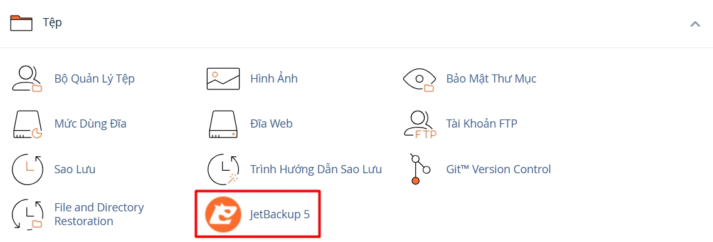

Giao diện chính của JetBackup:

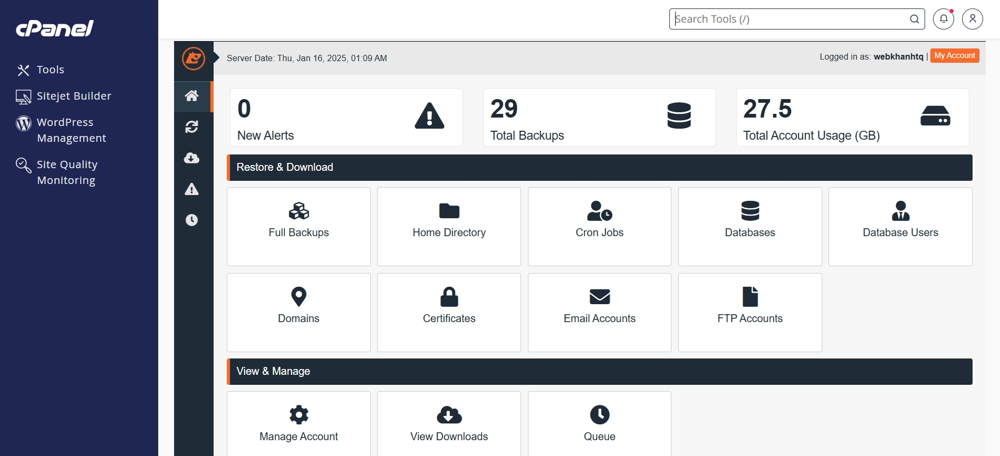

## 1. Khôi phục tài khoản cPanel

Tính năng này hữu ích khi bạn muốn khôi phục toàn bộ dữ liệu, bao gồm mã nguồn, email, các thiết đặt tuỳ chỉnh, v.v.

Để khôi phục tài khoản cPanel, trong giao diện chính JetBackup, chọn **Full Backups**.

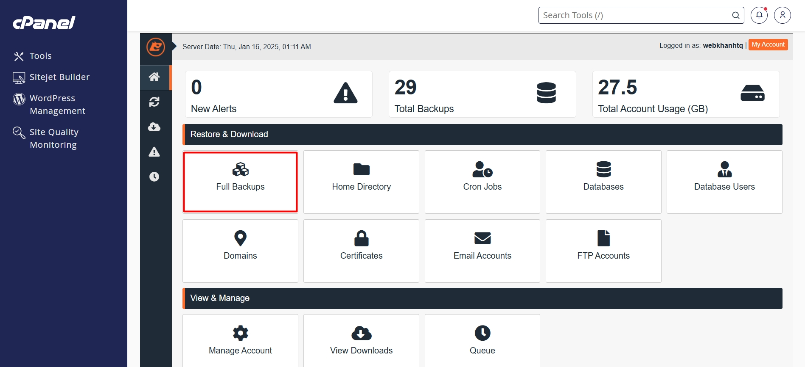

Đảm bảo bạn đang ở thẻ **Full Account** như hình dưới. Chọn thời điểm sao lưu mà bạn mong muốn.

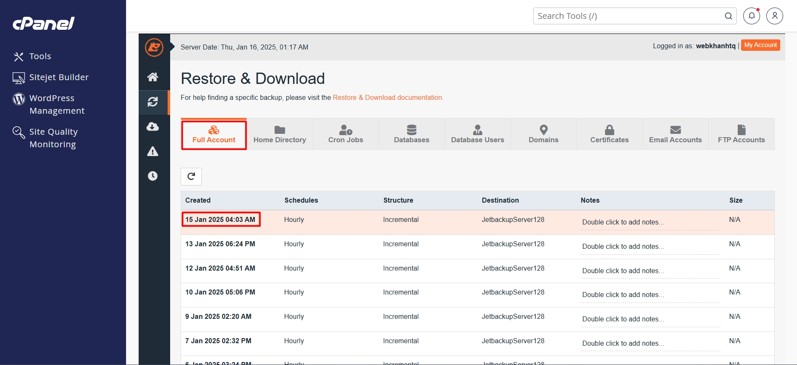

Kéo xuống dưới cùng, chọn **Restore**.

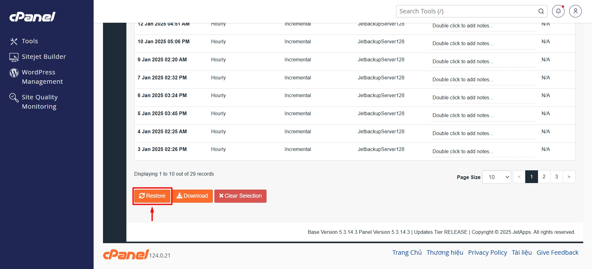

_**Thông tin thêm:** Bạn cũng có thể chọn **Download** (bên phải nút **Restore**) để tải xuống bản sao lưu tài khoản cPanel._

Trong giao diện tiếp theo, chọn **Restore Selected Items** để tiến hành khôi phục.

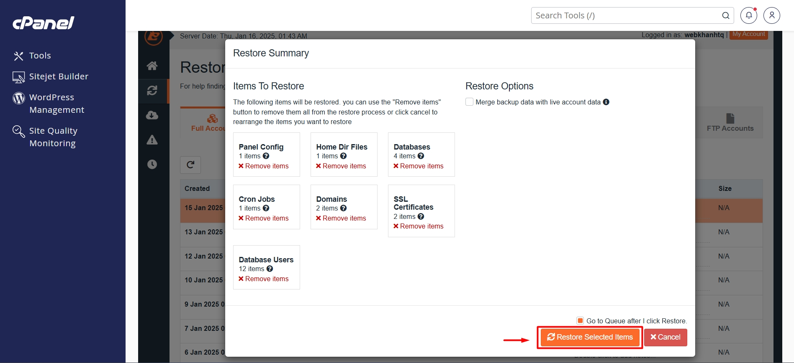

Bạn sẽ được chuyển hướng đến giao diện **Queue** để xem tiến trình khôi phục. Trạng thái "Completed" có nghĩa là khôi phục thành công.

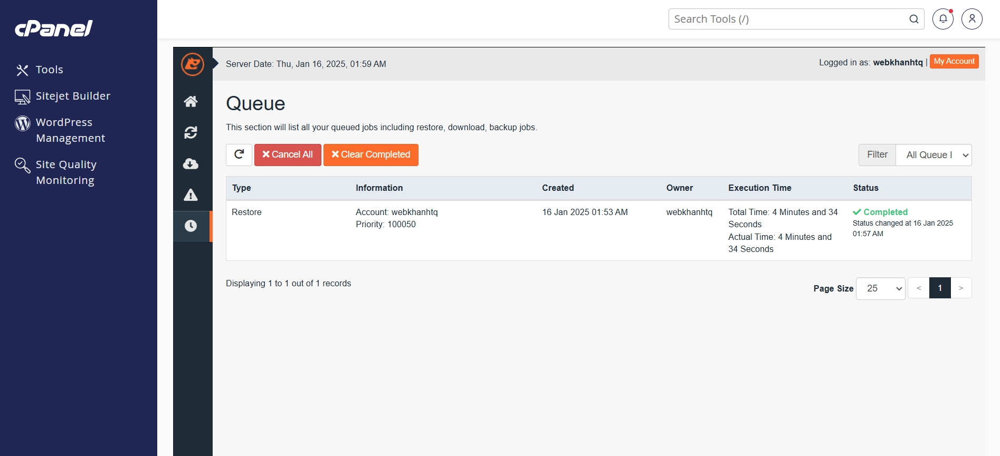

## 2. Khôi phục tệp, thư mục

Tính năng này hữu ích khi bạn muốn khôi phục **_toàn bộ_** mã nguồn hoặc **_một phần_** mã nguồn (một tệp, nhiều tệp, một thư mục, nhiều thư mục).

_**Q: Khi nào cần khôi phục một phần thay vì toàn bộ mã nguồn?**_ 
_A: Giả sử bạn vô tình xoá tệp `wp-config.php`, việc khôi phục tài khoản cPanel (mục 1) hoặc toàn bộ mã nguồn có thể sẽ hoàn tác các thay đổi gần đây mà bạn đã thực hiện. Thay vào đó, bạn chỉ nên khôi phục phiên bản mới nhất của tệp `wp-config.php`._

Để khôi phục tài khoản cPanel, trong giao diện chính JetBackup, chọn **Home Directory**.

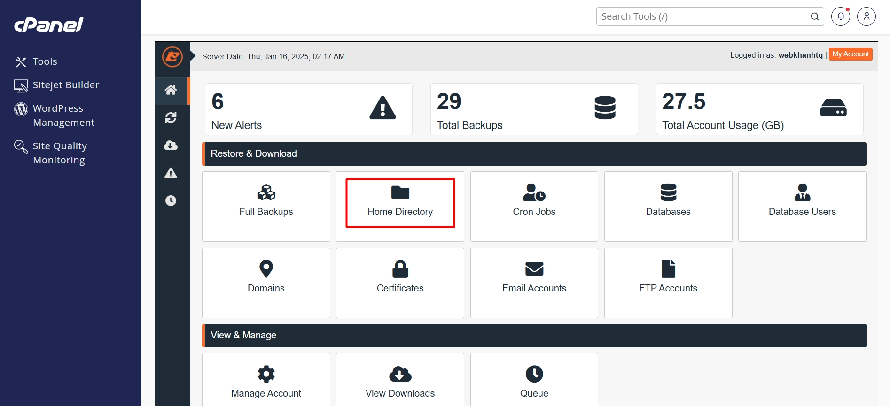

Đảm bảo bạn đang ở thẻ **Home Directory** như hình dưới. Chọn thời điểm sao lưu mà bạn mong muốn để khôi phục toàn bộ **_thư mục gốc_** của tài khoản.

_**Thông tin thêm:** Thư mục gốc của tài khoản `myusername` là `/home/myusername`._

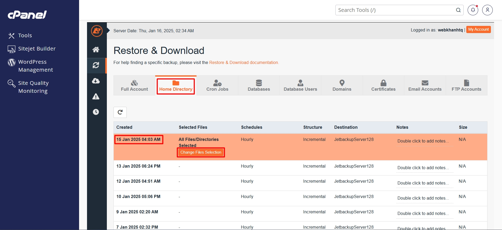

Nếu bạn chỉ muốn khôi phục tệp `public_html/wp-config.php` như đã đề cập, chọn **Change Files Selection** > **public_html** > tích chọn **wp-config.php**.

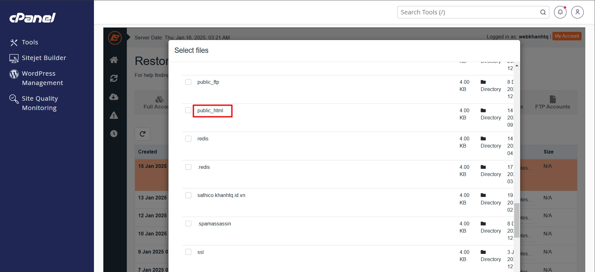

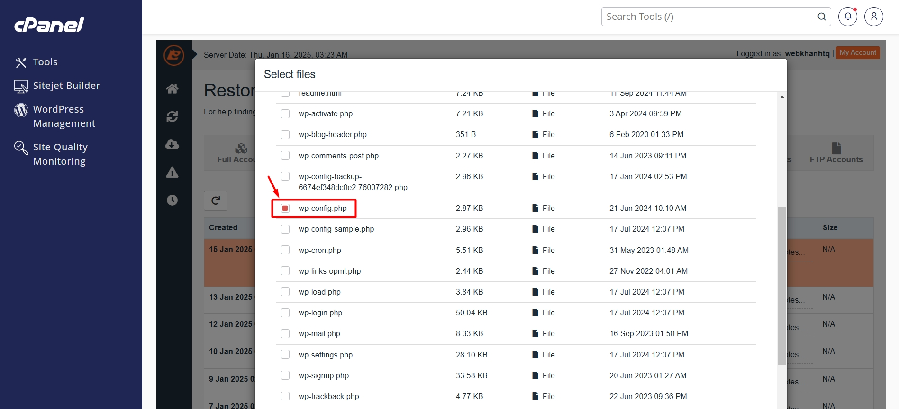

Cuộn xuống dưới, chọn lần lượt **Select Files** > **Restore** > **Restore Selected Items** để tiến hành khôi phục.

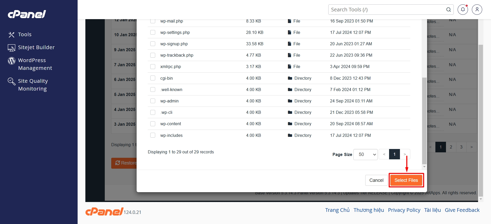

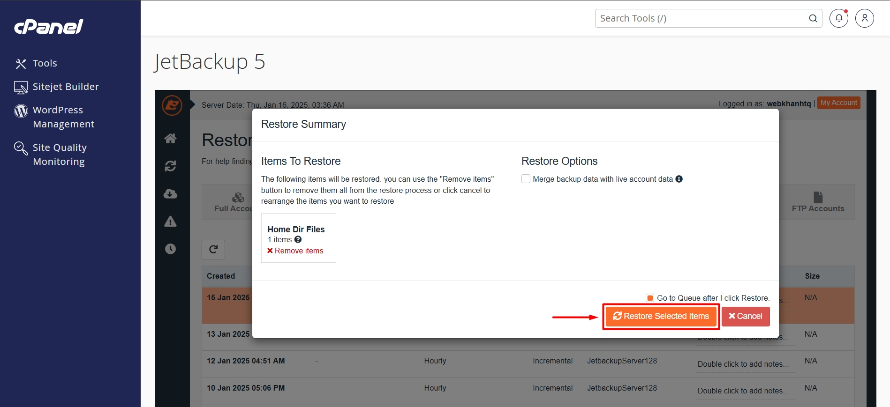

## 3. Khôi phục cơ sở dữ liệu (CSDL) và người dùng CSDL

Tính năng này hữu ích khi bạn chỉ muốn khôi phục CSDL và người dùng CSDL nhất định.

### 3.1. Khôi phục CSDL

Để khôi phục CSDL, trong giao diện chính JetBackup, chọn **Databases**.

Đảm bảo bạn đang ở thẻ **Databases** như hình dưới. Chọn CSDL và thời điểm sao lưu mà bạn mong muốn bằng cách nhấn vào nút **Choose Other Backup**. Sau cùng, nhấn **Restore** > **Restore Selected Items**.

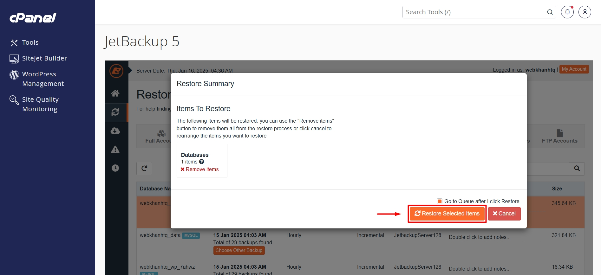

### 3.2. Khôi phục người dùng CSDL

Để khôi phục người dùng CSDL, trong giao diện chính JetBackup, chọn **Database Users** rồi thực hiện tương tự **mục 3.1. Khôi phục CSDL**.

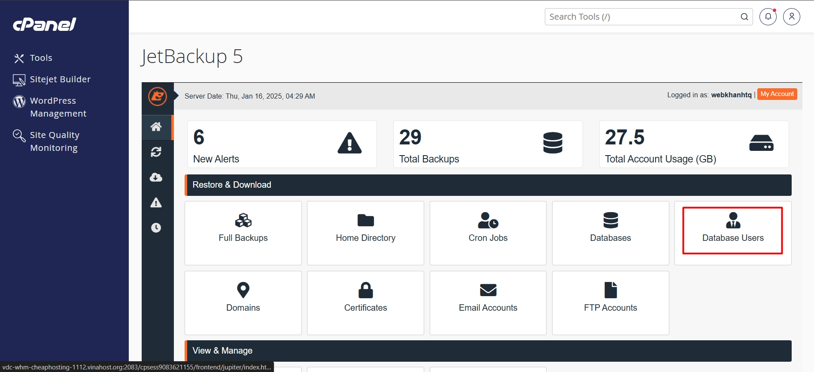

## 4. Khôi phục các loại dữ liệu khác

JetBackup còn có thể được sử dụng để khôi phục **Cron Jobs**, tên miền (**Domains**), chứng chỉ TLS/SSL (**Certificates**), tài khoản email (**Email Accounts**) và tài khoản FTP (**FTP Accounts**). Các bước thực hiện hoàn toàn tương tự với những dữ liệu đã được trình bày.

Chúc bạn **sử dụng JetBackup** một cách hiệu quả! 🍻

> **THAM KHẢO CÁC DỊCH VỤ TẠI [VINAHOST](https://vinahost.vn/)**   **\>>** [**SERVER**](https://vinahost.vn/thue-may-chu-rieng/) **–** [**COLOCATION**](https://vinahost.vn/colocation.html) **–** [**CDN**](https://vinahost.vn/dich-vu-cdn-chuyen-nghiep)   **\>> [CLOUD](https://vinahost.vn/cloud-server-gia-re/) – [VPS](https://vinahost.vn/vps-ssd-chuyen-nghiep/)**  **\>> [HOSTING](https://vinahost.vn/wordpress-hosting)**   **\>> [EMAIL](https://vinahost.vn/email-hosting)**   **\>> [WEBSITE](http://vinawebsite.vn/)**   **\>> [TÊN MIỀN](https://vinahost.vn/ten-mien-gia-re/)**
