# Hướng dẫn thêm tên miền/tên miền phụ và cài đặt wordpress lên hosting cPanel

Bài viết này sẽ giới thiệu về **Hướng dẫn thêm tên miền/tên miền phụ và cài đặt wordpress lên hosting cPanel**. Nếu bạn cần hỗ trợ, xin vui lòng liên hệ VinaHost qua Hotline 1900 6046 ext. 3, email về support@vinahost.vn hoặc chat với VinaHost qua livechat https://livechat.vinahost.vn/chat.php

# I. Thêm tên miền/**tên miền phụ** vào hosting

Truy cập mục **Domains**

 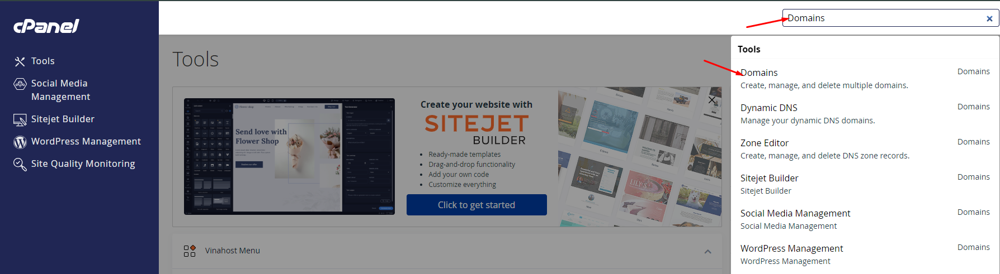

Chọn **Create A New Domain**

 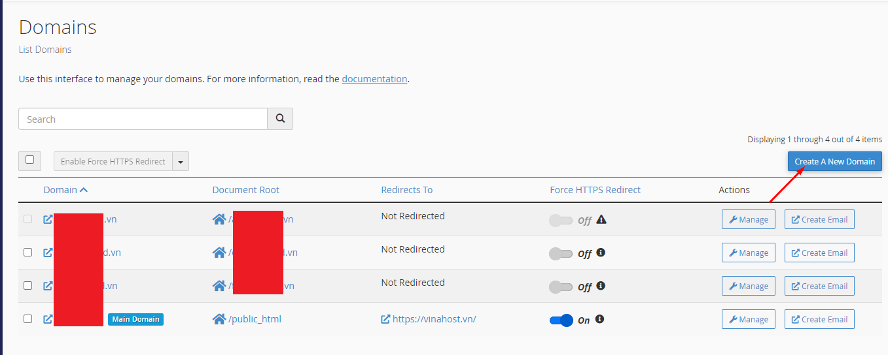

Bỏ tích **Share document root** (đây là tùy chọn chia sẻ source website với tên miền chính, thông thường sẽ bỏ qua) => **Submit** để tạo

 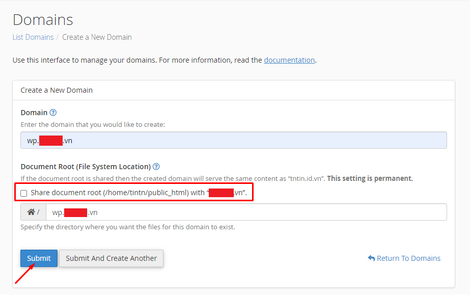

Hoàn tất, lúc này ta có thể bắt đầu trỏ DNS của tên miền/tên miền phụ về hosting: 

 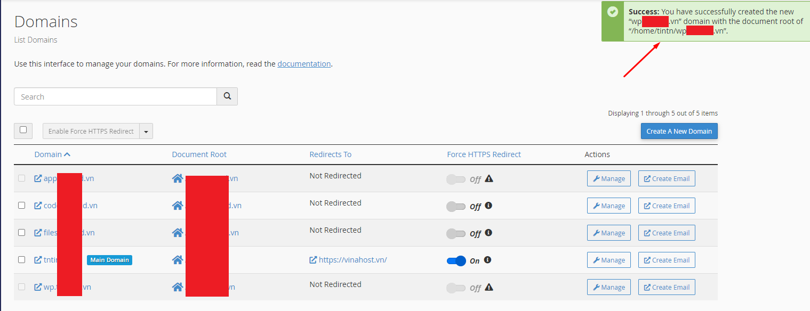

 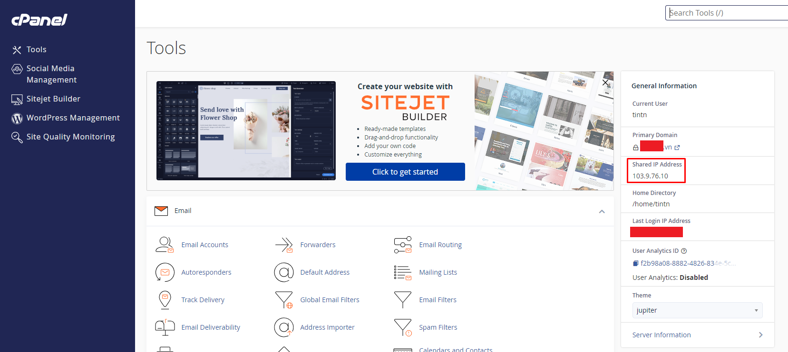

# II. Cài đặt Wordpress cho tên miền/tên miền phụ

Đầu tiên, truy cập **WordPress Management**

 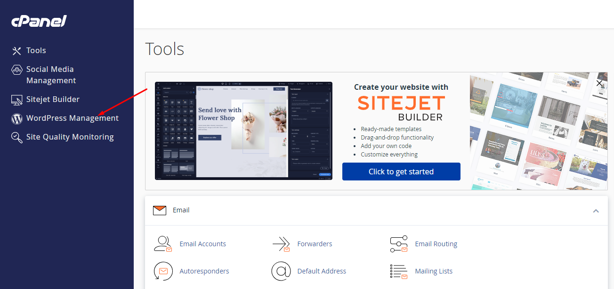

Chọn **Install** để tiến hành cài mới

 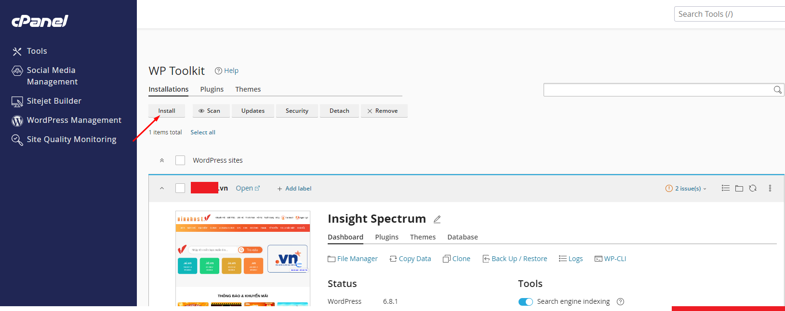

Chọn tên miền cần cài đặt

 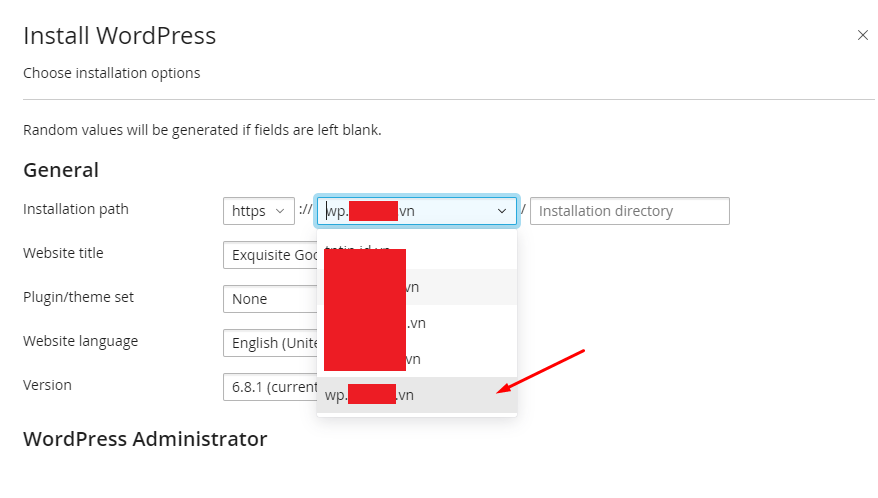

Nhập thông tin cơ bản và chọn **Install**

 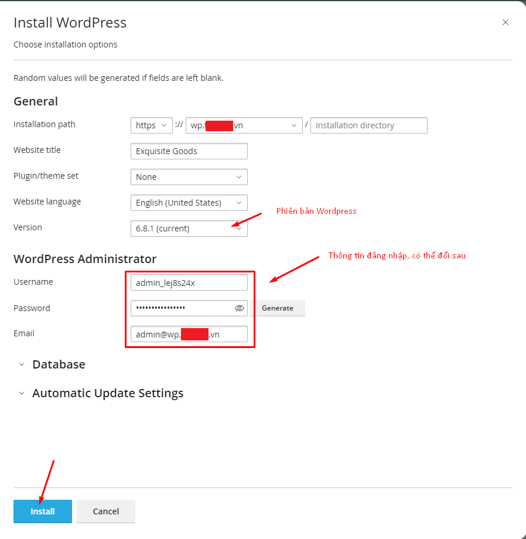

Hoàn tất

 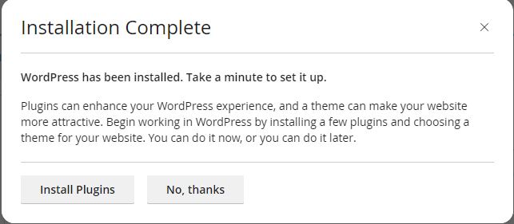

Lúc này đã có thể truy cập wordpress, ta thêm /wp-admin vào sau link để đăng nhập trang quản trị. Ví dụ *https://domain.com/wp-admin*

 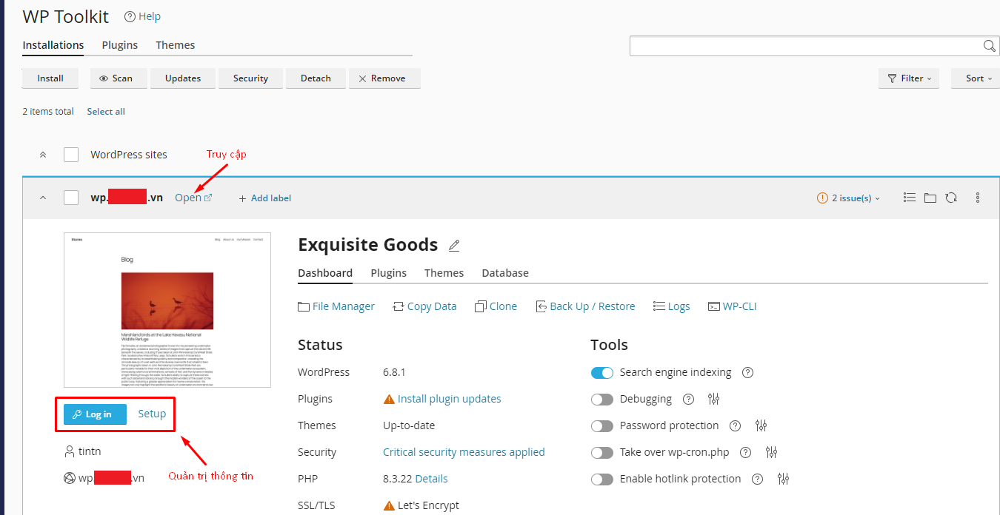

**Chúc bạn thực hiện thành công!**

> **THAM KHẢO CÁC DỊCH VỤ TẠI [VINAHOST](https://vinahost.vn/)**
>
> **>>** **[SERVER](https://vinahost.vn/thue-may-chu-rieng/)** **–** **[COLOCATION](https://vinahost.vn/colocation.html)** – **[CDN](https://vinahost.vn/dich-vu-cdn-chuyen-nghiep)**
>
> **>> [CLOUD](https://vinahost.vn/cloud-server-gia-re/) – [VPS](https://vinahost.vn/vps-ssd-chuyen-nghiep/)**
>
> **>> [HOSTING](https://vinahost.vn/wordpress-hosting)**
>
> **>> [EMAIL](https://vinahost.vn/email-hosting)**
>
> **>> [WEBSITE](http://vinawebsite.vn/)**
>
> **>> [TÊN MIỀN](https://vinahost.vn/ten-mien-gia-re/)**