> Bài viết này hướng dẫn các bạn đăng nhập SSH vào dịch vụ Shared Hosting (cPanel, Linux). Nếu bạn cần hỗ trợ, xin vui lòng:
>
> - Liên hệ qua **hotline 1900 6046 ext. 3**
> - Gửi email về địa chỉ [**support@vinahost.vn**](mailto:support@vinahost.vn)
> - Hoặc chat trực tiếp với chúng tôi tại [**đây**](https://livechat.vinahost.vn/chat.php)

## 1. Truy cập giao diện quản lý SSH key

Đăng nhập cPanel, tìm kiếm và chọn **SSH Access**.

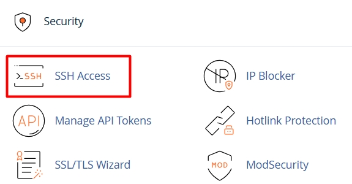

Nhấn nút **Manage SSH Keys** để quản lý SSH key.

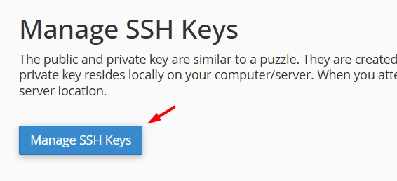

## 2. Thêm hoặc nhập SSH key

=== "Thêm một SSH key"

    Chọn **Generate a New Key**.

    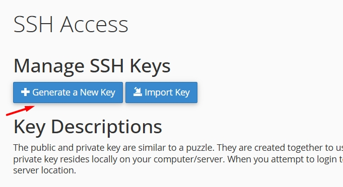

    Tạo mật khẩu cho SSH key.

    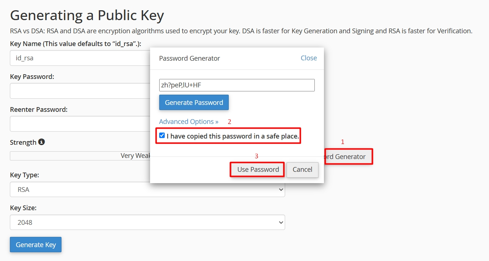

    !!! warning "Lưu ý"
        Sao chép và lưu mật khẩu tại nơi an toàn vì sẽ không thể được đặt lại sau khi tạo SSH key.

    Nhấn **Generate key** để bắt đầu tạo SSH key.

    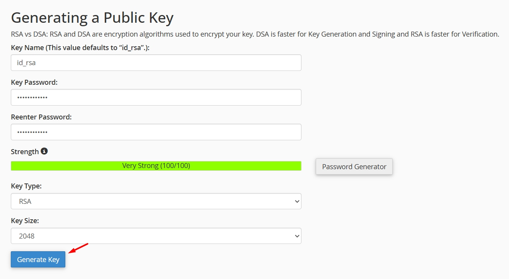

    Thông báo sau khi tạo thành công chứa một số thông tin về SSH key vừa tạo.

    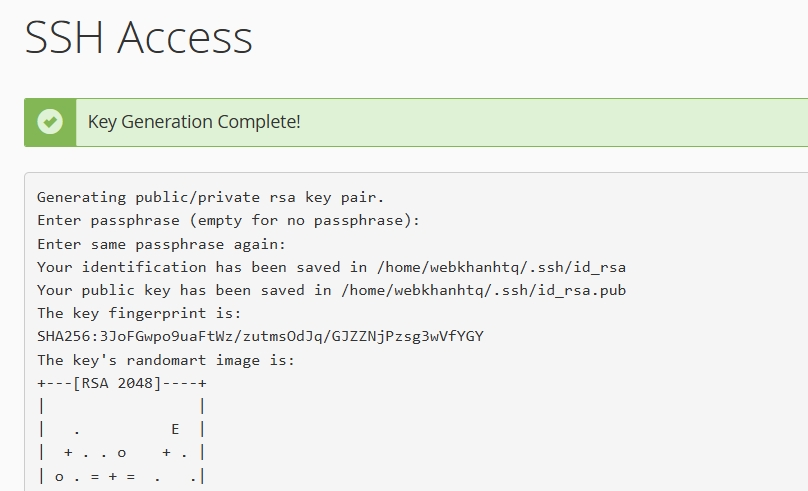

=== "Nhập một SSH key"

    Chọn **Import Key**.

    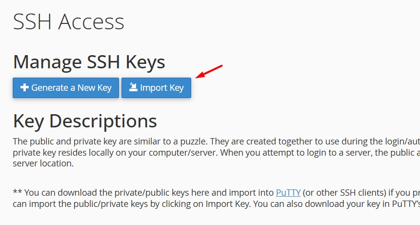

    Điền các thông tin của SSH key.

    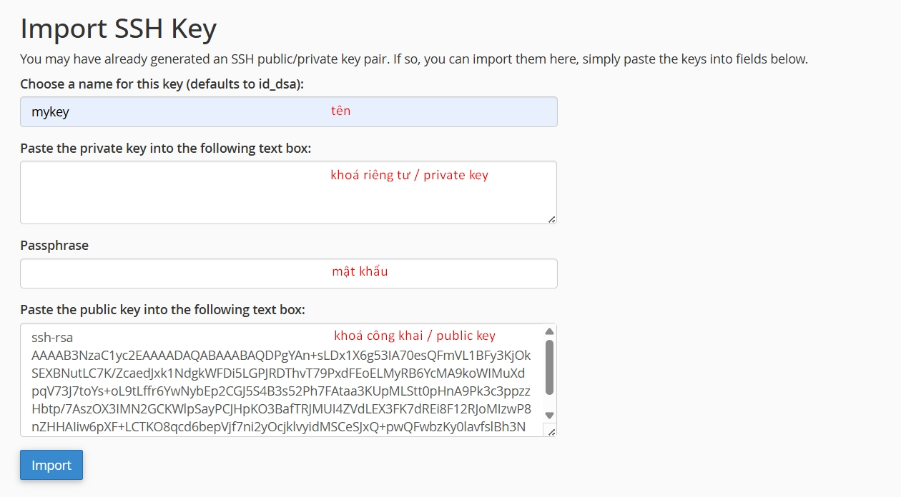

    !!! info "Thông tin"
        Bạn có thể bỏ trống private key và mật khẩu, chỉ điền public key để tăng tính bảo mật. Bạn vẫn có thể truy cập SSH bình thường theo cách này.

## 3. Authorize/Ủy quyền truy cập SSH key

!!! info "Thông tin"
    Bạn phải ủy quyền truy cập để sử dụng SSH key.

Chọn **Manage** tại SSH key cần ủy quyền truy cập.

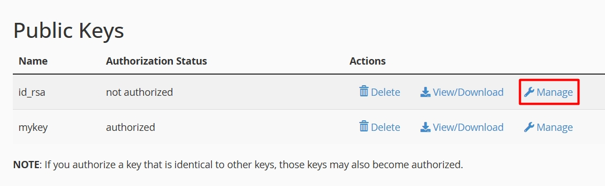

Chọn **Authorize**.

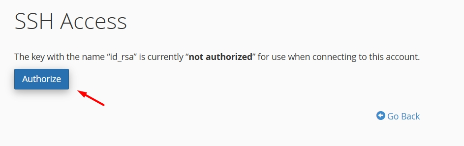

## 4. Kiểm tra đăng nhập SSH

Chọn **Vỉew/Download** để tải xuống private key đã tạo.

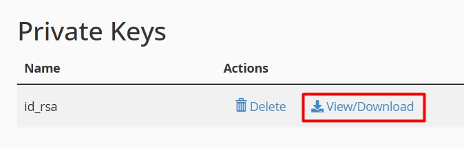

!!! info "Thông tin"
    Bạn chỉ cần tải private key về máy cá nhân là có thể đăng nhập SSH đến server đang chứa public key hợp lệ của nó, không cần tải public key.

Để có thể sử dụng private key với [PuTTY](https://vinahost.vn/putty-la-gi/), chuyển đổi nó về định dạng mà PuTTY yêu cầu.

Mở **PuTTYgen** - phần mềm được cài đặt cùng PuTTY. Chọn **Load** để tải nội dung private key đã tải về.

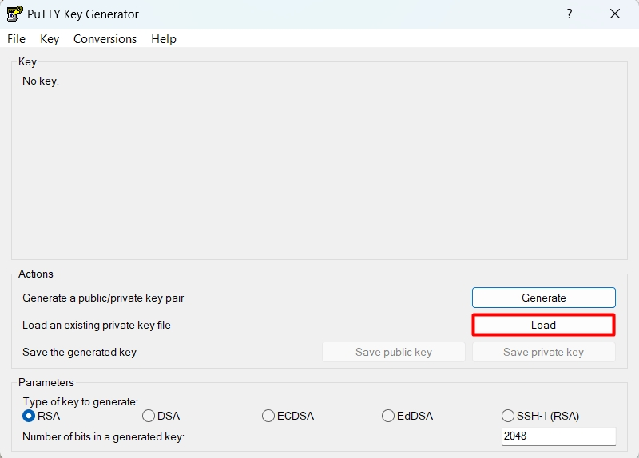

Nhập mật khẩu của private key, bấm **OK**.

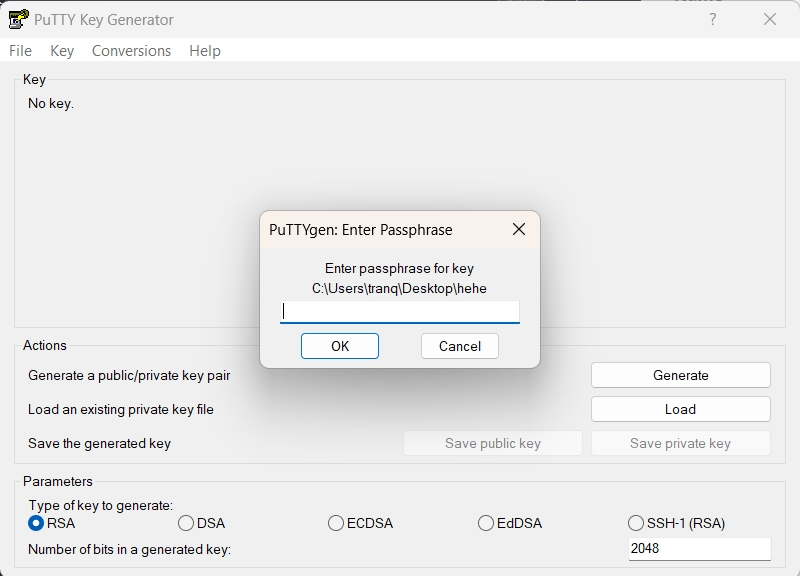

Chọn **Save private key** và lưu private key với phần mở rộng `.ppk`.

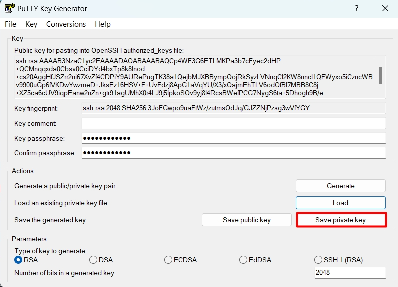

Thông tin để đăng nhập SSH được hiển thị ngay tại giao diện chính của cPanel. Trong đó, ***SSH username*** là username của tài khoản cPanel, ***SSH hostname*** là địa chỉ IP của hosting như ảnh bên dưới.

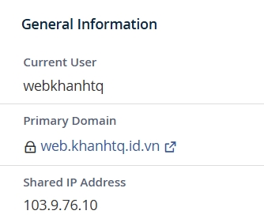

Mở phần mềm [PuTTY](https://vinahost.vn/putty-la-gi/). Nhập địa chỉ IP của hosting vào trường **Host Name (or IP address)**.

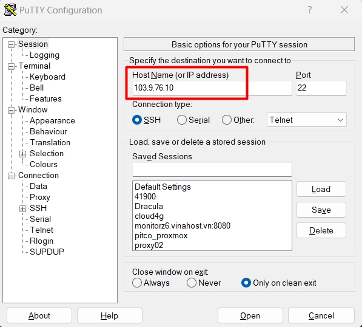

Tại thanh điều hướng bên trái, chọn **Connection** > **SSH** > **Auth** > **Credentials** để chọn tệp private key đã tải về máy cá nhân.

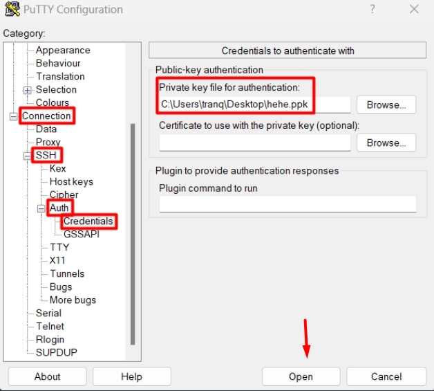

Nhấn **Open** để bắt đầu phiên kết nối.
Nhập lần lượt username và mật khẩu của private key để đăng nhập.

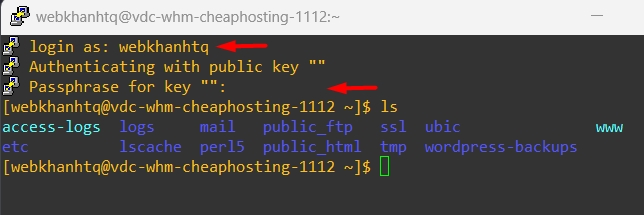

!!! warning "Lưu ý"
    Mật khẩu sẽ không được hiển thị lúc nhập/dán vào PuTTY, đảm bảo nhập/dán chính xác rồi nhấn Enter.

Chúc bạn **đăng nhập SSH vào hosting cPanel** thành công! 🍻

> **THAM KHẢO CÁC DỊCH VỤ TẠI [VINAHOST](https://vinahost.vn/)**   **\>>** [**SERVER**](https://vinahost.vn/thue-may-chu-rieng/) **–** [**COLOCATION**](https://vinahost.vn/colocation.html) **–** [**CDN**](https://vinahost.vn/dich-vu-cdn-chuyen-nghiep)   **\>> [CLOUD](https://vinahost.vn/cloud-server-gia-re/) – [VPS](https://vinahost.vn/vps-ssd-chuyen-nghiep/)**  **\>> [HOSTING](https://vinahost.vn/wordpress-hosting)**   **\>> [EMAIL](https://vinahost.vn/email-hosting)**   **\>> [WEBSITE](http://vinawebsite.vn/)**   **\>> [TÊN MIỀN](https://vinahost.vn/ten-mien-gia-re/)**
