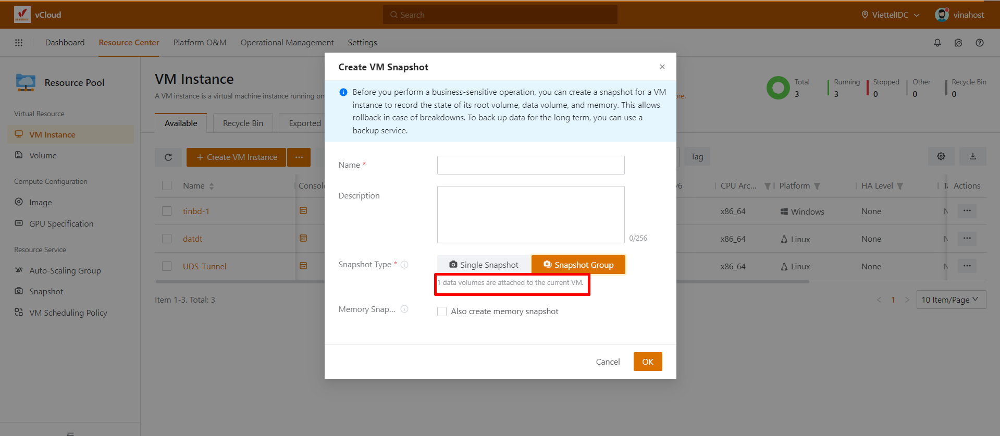

Bài viết này sẽ hướng dẫn bạn cách **Tạo SnapShot Và Attach ISO Cho VM Instance.** Nếu bạn cần hỗ trợ, xin vui lòng liên hệ VinaHost qua **Hotline 1900 6046 ext. 3**, email về [support@vinahost.vn](mailto:support@vinahost.vn) hoặc chat với VinaHost qua livechat [https://livechat.vinahost.vn/chat.php](https://livechat.vinahost.vn/chat.php).

## **1\. Hướng dẫn Tạo Snapshot cho VM Instance và hướng dẫn revert**

### **Hướng dẫn Tạo Snapshot cho VM Instance**

Để tạo một snapshot chúng ta chọn **actions** ở VM cần tạo sau đó chọn **Snapshot and Image > Create Snapshot**

Sau đó chúng ta điền tất cả các thông tin cần thiết **Name** là tên của bản snapshot, **Description** là mô tả nội dung được snapshot, tiếp theo chọn **Single Snapshot**

Chúng ta cũng có thể chọn **Snapshot Group**, phần này có chức năng tạo snapshot của toàn bộ volumes đã được thêm vào VM, như hình ảnh VM này đã được thêm 1 volumes nên sẽ hiện số 1.

### Hướng dẫn revert

Chúng ta chọn vào Snapshot như hình

Để tiến hành revert một bản snapshot chúng ta cần phải stop VM đó, chúng ta tích vào snapshot cần revert và chọn **actions > Revert**

Chúng ta cần tích vào 2 mục **Auto-Start VM Upon Reversion Completion và I acknowledge** và bấm OK  và đợi là chúng ta đã hoàn thành xong revert một bản snapshot

Để xóa một bản snapshot chúng ta cần chọn và **actions** của snapshot cần xóa và chọn **delete**

Tích vào **I acknowledge** và chọn OK là hoàn tất việc xóa một snapshot

## **2\. Hướng dẫn Attach ISO cho VM Instance**

Đầu tiên muốn Attach ISO chúng ta cần stop VM sau đó nhấn vào **Actions >** **Associated Resource >** **Attach ISO** như hình

Nhấn **create**, bước này dùng để tạo phân vùng vDrives để chứa iso

Sau đó chúng ta chọn hệ điều hành mong muốn và bấm vào chữ OK

Sau đó chúng ta mở start lại VM và console vào

Sau khi mở VM lên, hãy tiến hành restart lại VM, khi VM vừa **restart** xong trước **VM boot** vào hệ điều hành hãy ấn nút ESC trên bàn phím nhanh nhất để có thể vào **menu boot**, sau đó chọn đĩa đã Attach ISO như hình bằng cách nhấn số tương ứng trên bàn phím

Tới bước này là chúng ta đã **Attach ISO** và tiến hành cài đặt hệ điều hành

Xóa một ISO khỏi một VM chúng ta cũng làm tương tự chúng ta chọn **Associated Resource > Detach ISO**

Tích vào ISO cần xóa và bấm OK

Tích vào **I acknowledge** và chọn OK và đã hoàn thành việc xóa một ISO

Chúc bạn thực hiện thành công!

> **THAM KHẢO CÁC DỊCH VỤ TẠI [VINAHOST](https://vinahost.vn/)**
> 
> **\>>** [**SERVER**](https://vinahost.vn/thue-may-chu-rieng/) **–** [**COLOCATION**](https://vinahost.vn/colocation.html) – [**CDN**](https://vinahost.vn/dich-vu-cdn-chuyen-nghiep)
> 
> **\>> [CLOUD](https://vinahost.vn/cloud-server-gia-re/) – [VPS](https://vinahost.vn/vps-ssd-chuyen-nghiep/)**
> 
> **\>> [HOSTING](https://vinahost.vn/wordpress-hosting)**
> 
> **\>> [EMAIL](https://vinahost.vn/email-hosting)**
> 
> **\>> [WEBSITE](http://vinawebsite.vn/)**
> 
> **\>> [TÊN MIỀN](https://vinahost.vn/ten-mien-gia-re/)**
