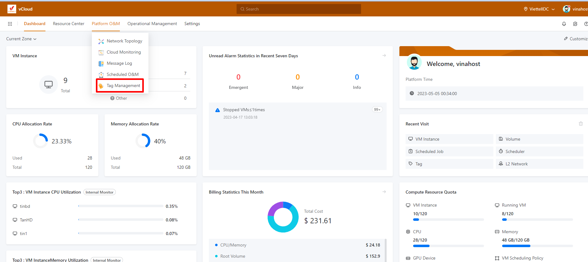
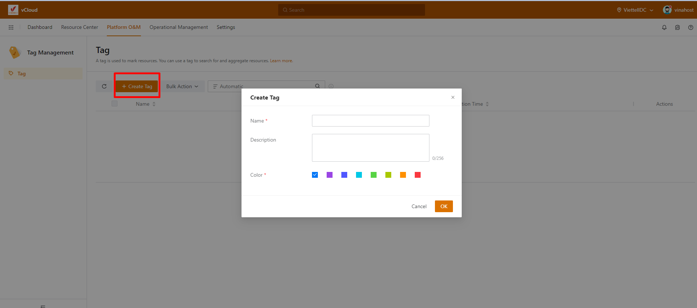
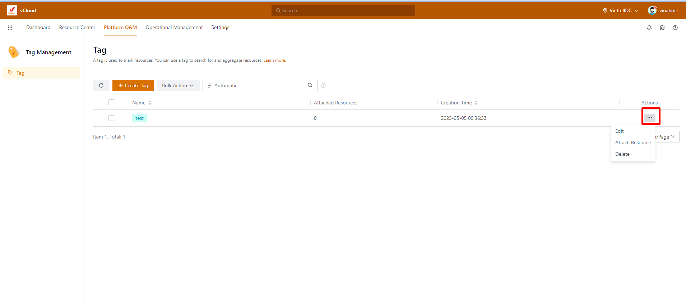
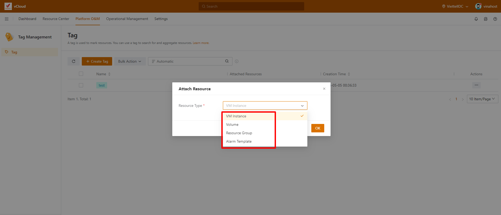
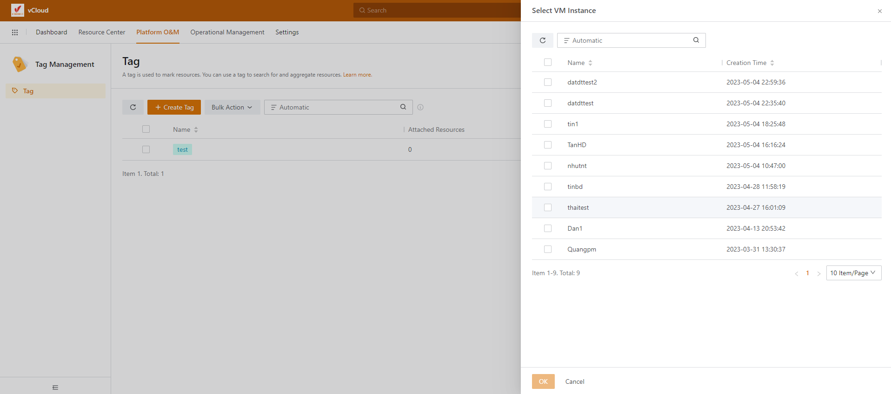
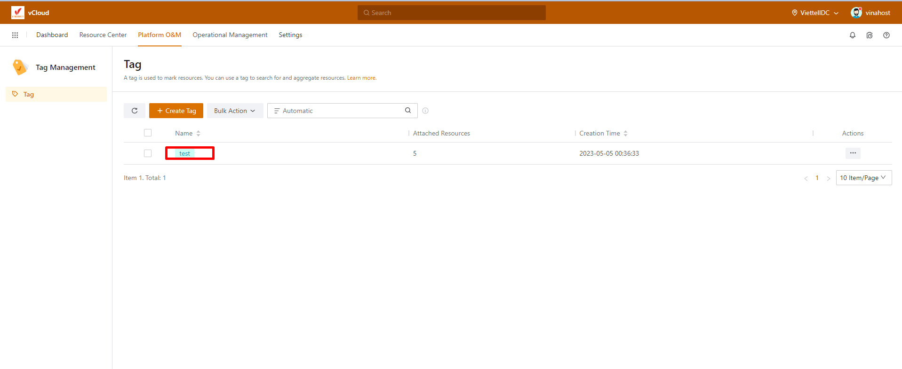
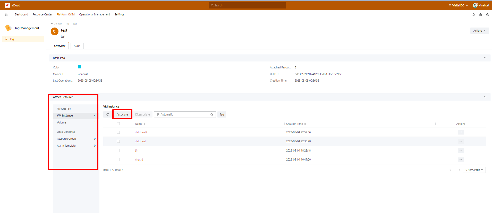
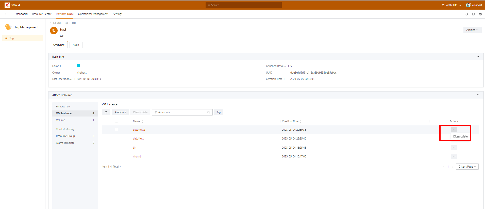
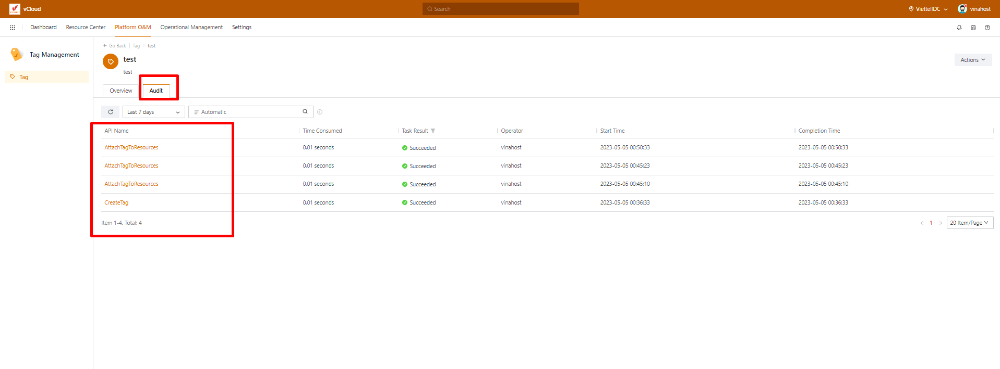

Bài viết này sẽ hướng dẫn bạn cách **Tạo Và Giới Thiệu Tag Managerment Trên vCloud.** Nếu bạn cần hỗ trợ, xin vui lòng liên hệ VinaHost qua **Hotline 1900 6046 ext. 3**, email về [support@vinahost.vn](mailto:support@vinahost.vn) hoặc chat với VinaHost qua livechat [https://livechat.vinahost.vn/chat.php](https://livechat.vinahost.vn/chat.php).

Tag Management trên Vcloud là tính năng cho phép người dùng quản lý các thẻ (tag) được gắn vào các tài nguyên trên hệ thống, ví dụ như VM, Volume, Resource Group, Alarm Template. Tag là một chuỗi ký tự được gắn vào các tài nguyên để giúp phân loại, quản lý và tìm kiếm chúng dễ dàng hơn. Thay vì phải tìm kiếm các tài nguyên theo từng danh mục riêng biệt, người dùng có thể sử dụng tag để phân loại, quản lý và tìm kiếm chúng theo Tag.

Sau khi login vào hệ thống, bạn chọn Platform O&M và chọn chức năng Tag Managerment.

Chúng ta chọn Create Tag, sau đó điền các thông tin như sau.

- Name: Đặt tên cho Tag.
- Description: mô tả công dụng của Tag đó.
- Color: chọn màu sắc cho Tag.

Sau khi đã tạo xong một tag chúng ta có thể thiết lập Tag đó bằng cách nhận và dấu ba chấm như hình.

- Edit: Chúng ta có thể thẩy đổi thông tin của Name và Description của một Tag.
- Attach Resource: Chúng ta có thể chọn tài nguyên cho một tag.
- Delete: Dùng để xóa Tag.

Ở phần Attach Resource chúng ta có thể chọn các tài nguyên trên cloud như VM, Volume, Resource Group, Alarm Template sau khi đã chọn được loại  tài nguyên mong muốn để thêm và Tag chúng ta chọn vào phần OK.

Ở đây mình đang chọn loại tài nguyên là VM (chúng ta cũng có thể thêm nhiều loại tài nguyên khác nhau trên một tag), sau đó chúng ta sẽ chọn những VM cần thiết để thêm và Tag.

Để quản lí cũng như xem quá trình vận hàng của một Tag chúng ta bấm vào tên của Tag đó như hình.

Chúng ta có thể xem loại và số lượng tài nguyên đã thêm và Tag ở Resource Pool và có thể bổ sung thêm tài nguyên ở Tag bằng cách chọn vào Associate và bổ sung thêm tài nguyên mong muốn.

Nếu như muốn xóa một tài nguyên nào đó khỏi tag có thể chọn vào đấu ba chấm sau đó chọn Disassociate như hình.

Còn ở phần Audit chúng ta có thể theo dõi quá trình vận hành của Tag. Ví dụ như quá trình tạo Tag, thêm tài nguyên cho Tag, xóa tài nguyên khỏi Tag.

Chúc bạn thực hiện thành công!

> **THAM KHẢO CÁC DỊCH VỤ TẠI [VINAHOST](https://vinahost.vn/)**
> 
> **\>>** [**SERVER**](https://vinahost.vn/thue-may-chu-rieng/) **–** [**COLOCATION**](https://vinahost.vn/colocation.html) – [**CDN**](https://vinahost.vn/dich-vu-cdn-chuyen-nghiep)
> 
> **\>> [CLOUD](https://vinahost.vn/cloud-server-gia-re/) – [VPS](https://vinahost.vn/vps-ssd-chuyen-nghiep/)**
> 
> **\>> [HOSTING](https://vinahost.vn/wordpress-hosting)**
> 
> **\>> [EMAIL](https://vinahost.vn/email-hosting)**
> 
> **\>> [WEBSITE](http://vinawebsite.vn/)**
> 
> **\>> [TÊN MIỀN](https://vinahost.vn/ten-mien-gia-re/)**
