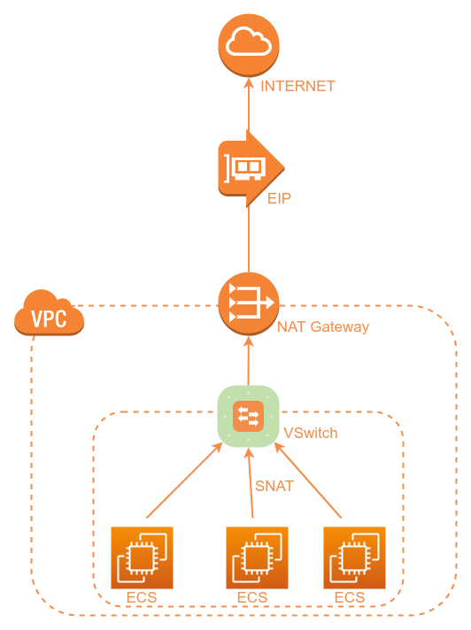
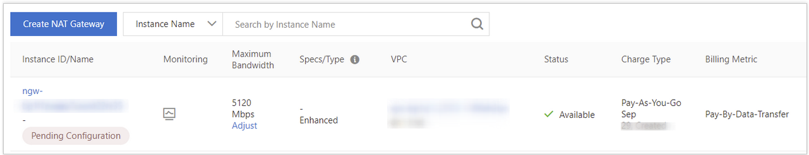
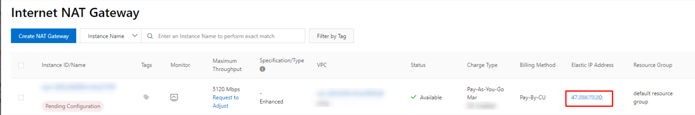
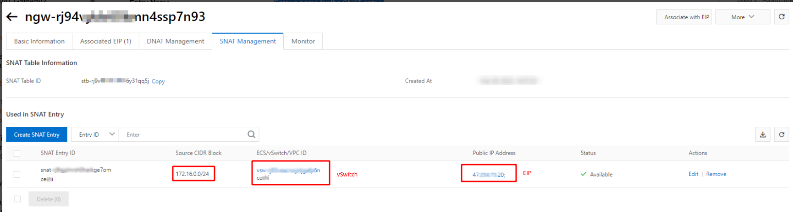

Bài viết này sẽ hướng dẫn bạn **Tạo Và Quản Lý Internet NAT Gateway**. Nếu bạn cần hỗ trợ, xin vui lòng liên hệ VinaHost qua **Hotline 1900 6046 ext. 3**, email về [support@vinahost.vn](mailto:support@vinahost.vn) hoặc chat với VinaHost qua livechat [https://livechat.vinahost.vn/chat.php](https://livechat.vinahost.vn/chat.php).

## 1\. Giới thiệu chung

Mặc định, mọi **ECS** chạy bên trong **Private Subnet** thì sẽ không có khả năng giao tiếp với Internet. Từ đó phát sinh vấn đề khi ECS đó cần truy cập ra ngoài Internet để apply các **bản cập nhật bảo mật, tải các bản vá hoặc cập nhật phần mềm ứng dụng**.

Trong trường hợp đó, người dùng có thể sử dụng tính năng **Internet NAT Gateway của Alibaba** để liên kết **ECS** tới địa chỉ EIP, từ đó ECS có thể access được Internet. Yêu cầu EIP address đang free, không liên kết với bất kỳ **ECS và Network Interface** nào khác.

Internet NAT Gateway cung cấp tính năng **SNAT (Source Network Address Translation)**. SNAT cho phép các ECS bên trong một vùng mạng VPC có thể truy cập Internet.

_Mô hình hoạt động của một Internet **NAT Gateway** kết hợp địa chỉ EIP_

**Yêu cầu:**

- _Đã tạo một mạng ảo VPC và tối thiểu 1 vSwitch tạo sẵn trước đó_
- _Một địa chỉ EIP đang có sẵn, free và đang không liên kết với bất kỳ ECS hoặc Network Interface nào trước đó. (Trường hợp chưa có sẵn EIP, bạn có thể đăng ký một EIP sau khi đã tạo Internet NAT Gateway và liên kết EIP tới Nat Gateway)_

## 2\. Cách tạo một Internet NAT Gateway

\- Log on tại giao diện [NAT Gateway console](https://vpc.console.aliyun.com/nat/cn-qingdao/nats).

\- Tại trang **Internet NAT Gateway**, click chọn **Create NAT Gateway**.

\- Nếu đây là lần đầu tiên bạn tạo Internet NAT Gateway, bạn phải tạo _service-linked role_. Trong phần **Create Service-Linked Role** của trang **Internet NAT Gateway,** nhấp vào **Create Service-Linked Role**. Sau khi tạo _service-linked role_, bạn có thể tạo Internet NAT Gateway.

\- Tại trang **Confirm**, xác nhận các thông tin đã chọn, tick vào **Terms of Service** check box, cuối cùng click Confirm.

\-  Khi thông báo **Order complete.** Dịch vụ Internet NAT Gateway đã được tạo.

## 3\. Liên kết một địa chỉ EIP tới Internet NAT Gateway

**Lưu ý:** _Từ ngày 19/9/2022, nếu bạn muốn liên kết EIP tới một cổng NAT Gateway vừa tạo, hệ thống yêu cầu một địa chỉ random IP để gán trên vSwitch mà cổng NAT được gán để sử dụng. Điều này nhằm đảm bảo vSwitch đủ IP private available để sử dụng, nếu không sẽ không thể liên kết NAT Gateway tới EIP. Các cổng NAT Gateway tạo và sử dụng trước đó không ảnh hưởng._

Một cổng NAT gateway chỉ hoạt động khi bạn liên kết nó với 1 địa chỉ EIP, tối đa cho phép 20 EIP tới một Internet NAT Gateway. Bạn cần truy cập trang Quota Management để yêu cầu thêm tăng hạn mức sử dụng.

\- Log on tại giao diện [NAT Gateway console](https://vpc.console.aliyun.com/nat/cn-qingdao/nats).

\- Chọn Region muốn tạo NAT Gateway

\- Tại trang **Internet NAT Gateway**, tìm **Internet NAT Gateway** muốn quản lý và click chọn **Associate Now** trong cột **Elastic IP Address**.

\- Tại hộp thoại **Associate EIP**, chọn một trong các option sau và click OK:

- **Resource Group**: Chọn resource group của EIP
- **Select EIP**: Chọn EIP để liên kết với cổng NAT, bao gồm 2 options:
- **Select Existing EIP**: chọn một EIP có sẵn
- **Purchase and Associate EIP**: Hệ thống tự động purchase và khởi tạo một địa chỉ EIP với tạo hóa đơn pay-by-data-transfer, địa chỉ EIP sẽ tự động liên kết tới cổng NAT.

Sau khi đã liên kết EIP tới Internet NAT Gateway, thông tin EIP sẽ hiện ở cột Elastic IP Address

## 4\. Tạo bản ghi SNAT

SNAT cho phép các ECS instance trong một vùng mạng VPC access được Internet. Người dùng không cần gán public IP cho từng ECS.

\- Log on tại giao diện [NAT Gateway console](https://vpc.console.aliyun.com/nat/cn-qingdao/nats).

\- Chọn **Region** muốn tạo NAT Gateway

\- Tại trang **Internet NAT Gateway**, tìm **Internet NAT Gateway** muốn quản lý và click chọn **Configure SNAT** tại cột **Actions**

\- Tại trang **SNAT Management**, click chọn **Create SNAT Entry**.

\- Tại trang Create SNAT Entry, tick vào các tham số tùy chọn phù hợp:

- SNAT Entry: gồm thông tin vSwitch và VSwitch CIDR Block
- Các ECS được attach vào Vswitch đã chọn sẽ dùng địa chỉ EIP đã tạo để access Internet
- VSwitch CIDR Block: hiển thị block CIDR hiện tại của VSwitch
- **Select Public IP Address**: chọn tùy chọn này nếu bạn có nhiều hơn 1 địa chỉ EIP để gán cho SNAT Entry

Sau khi bản ghi SNAT đã khởi tạo thành công, có thể xem lại các thông tin tại tab **Used in SNAT Entry**

## 5\. Ngắt liên kết địa chỉ EIP tới Internet NAT Gateway

\- Kiểm tra và chắc chắn rằng địa chỉ EIP không còn sử dụng trong các bản ghi SNAT/DNAT. Nếu đang sử dụng EIP cho SNAT/DNAT, vui lòng delete các bản ghi liên quan trước.

\- Log on tại giao diện [NAT Gateway console](https://vpc.console.aliyun.com/nat/cn-qingdao/nats).

\- Tại trang **Internet NAT Gateway**, tìm **Internet NAT Gateway** muốn quản lý và click chọn **EIP** tại cột **Elastic IP Address.**

\- Tại tab **Associated EIP**, chon địa chỉ **EIP** muốn ngắt liên kết khỏi **NAT Gateway**, click chọn **Disassociate** tại cột **Actions**

\- Tắt thông báo sau khi hoàn thành.

Chúc bạn thực hiện thành công!

> **THAM KHẢO CÁC DỊCH VỤ TẠI [VINAHOST](https://vinahost.vn/)**
> 
> **\>>** [**SERVER**](https://vinahost.vn/thue-may-chu-rieng/) **–** [**COLOCATION**](https://vinahost.vn/colocation.html) – [**CDN**](https://vinahost.vn/dich-vu-cdn-chuyen-nghiep)
> 
> **\>> [CLOUD](https://vinahost.vn/cloud-server-gia-re/) – [VPS](https://vinahost.vn/vps-ssd-chuyen-nghiep/)**
> 
> **\>> [HOSTING](https://vinahost.vn/wordpress-hosting)**
> 
> **\>> [EMAIL](https://vinahost.vn/email-hosting)**
> 
> **\>> [WEBSITE](http://vinawebsite.vn/)**
> 
> **\>> [TÊN MIỀN](https://vinahost.vn/ten-mien-gia-re/)**
