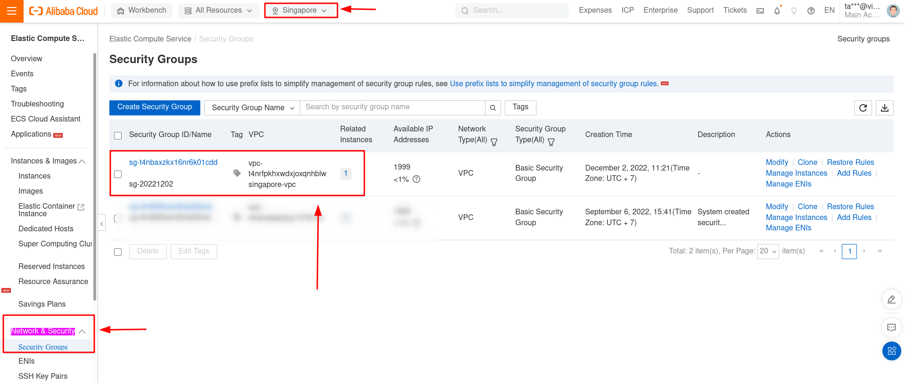
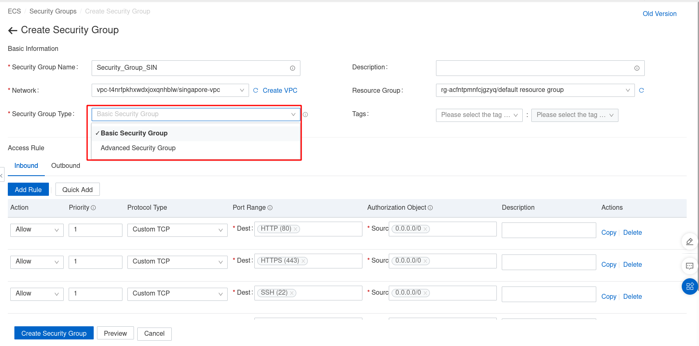
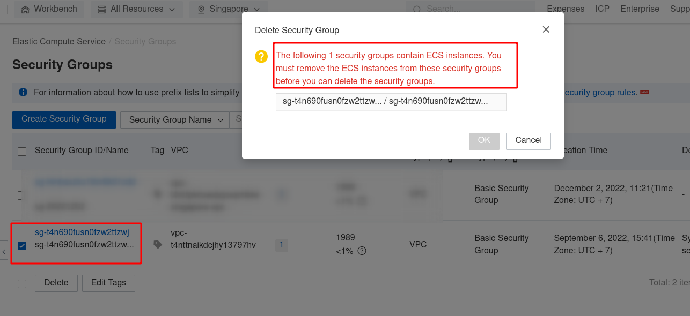

Bài viết này hướng dẫn bạn **Tạo Và Quản Lý Security Group Với Alibaba Cloud**. Nếu bạn cần hỗ trợ, xin vui lòng liên hệ VinaHost qua **Hotline 1900 6046 ext.3**, email về [support@vinahost.vn](mailto:support@vinahost.vn) hoặc chat với VinaHost qua livechat [https://livechat.vinahost.vn/chat.php](https://livechat.vinahost.vn/chat.php).

## **1\. Security Group là gì?**

Security Group là một tường lửa ảo (Virtual Firewall) để điều khiển truy cập giữa các ECS Instance. Khi khởi tạo 1 instance, bạn cần chỉ ra 1 hoặc nhiều security group. Và sau khi tạo 1 instance bạn có thể thay đổi Security Group đó.

### **2\. Security Group Rules**

- Mặc định Security Group cho phép mọi truy cập ra ngoài.
- Security Group phải có ít nhất rule cho phép truy cập. Bạn không thể tạo rule với chỉ quyền từ chối truy cập.
- Security Groups là stateful firewall. Nghĩa là nếu bạn gửi 1 truy vấn từ instance của bạn. Một phản hồi của truy vấn đó sẽ được cho phép lưu chuyển trở lại mà không phụ thuộc vào bất kỳ luật nào của Security Groups (Inbound)
- Bạn có thể thêm và xóa nhiều luật ở bất cứ thời điểm. Thay đổi sẽ tự động được apply vào các instances mà đã được gắn với Security Group đó.

## **3\. Tạo Và Quản Lý Security Group**

Mặc định khi khởi tạo ECS Instances sẽ tạo sẵn một default security group gồm các rule mặc định bên dưới:

- Inbound rule allow ICMP
- Inbound rule allow SSH port 22 và Remote Desktop Protocol (RDP) port 3389
- Optional Inbound rule allow HTTP port 80 và HTTPS port 443

Bước 1: Truy cập vào [ECS Console](https://ecs.console.aliyun.com/?spm=a2c63.p38356.0.0.c4a2650e1lhu7q).

Bước 2: Ở thanh điều hướng bên trái > Network & Security > Chọn Security Groups.

Bước 3: Tại giao diện Security Groups. Bấm chọn vào Create Security Group để tạo mới.

Bước 4: Chọn điền các giá trị theo yêu cầu và bấm chọn Create Security Group để khởi tạo.

- Security Group Name: Đặt tên cho security group
- Network: Chọn VPC muốn gán vào
- Security Group Type: Chọn Basic hoặc Advanced
- Advanced: Hỗ trợ nhiều ECS, ENIs và private IP hơn so với tuy chọn basic. Tham khảo thêm tại [đây](https://www.alibabacloud.com/help/en/elastic-compute-service/latest/advanced-security-groups).

## **4\. Cách xóa một Security Group**

Bước 1: Truy cập vào [ECS Console](https://ecs.console.aliyun.com/?spm=a2c63.p38356.0.0.c4a2650e1lhu7q).

Bước 2: Ở thanh điều hướng bên trái > Network & Security > Chọn Security Groups.

Bước 3: Tại giao diện Security Groups. Bấm chọn vào Security Group muốn xóa và bấm Delete.

**Lưu ý:** nếu đã gán security group cho ECS trước đó, cần remove ECS Instance ra khỏi security group trước rồi tiến hành xóa.

Chúc bạn Tạo Và Quản Lý Security Group Với Alibaba Cloud thành công!

> **THAM KHẢO CÁC DỊCH VỤ TẠI [VINAHOST](https://vinahost.vn/)**
> 
> **\>>** [**SERVER**](https://vinahost.vn/thue-may-chu-rieng/) **–** [**COLOCATION**](https://vinahost.vn/colocation.html) – [**CDN**](https://vinahost.vn/dich-vu-cdn-chuyen-nghiep)
> 
> **\>> [CLOUD](https://vinahost.vn/cloud-server-gia-re/) – [VPS](https://vinahost.vn/vps-ssd-chuyen-nghiep/)**
> 
> **\>> [HOSTING](https://vinahost.vn/wordpress-hosting)**
> 
> **\>> [EMAIL](https://vinahost.vn/email-hosting)**
> 
> **\>> [WEBSITE](http://vinawebsite.vn/)**
> 
> **\>> [TÊN MIỀN](https://vinahost.vn/ten-mien-gia-re/)**
