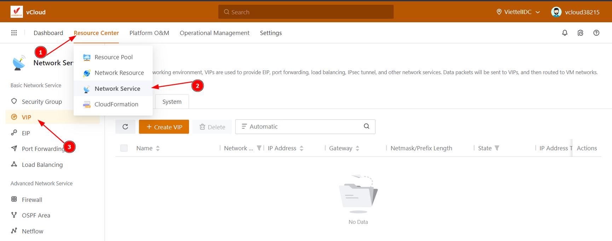
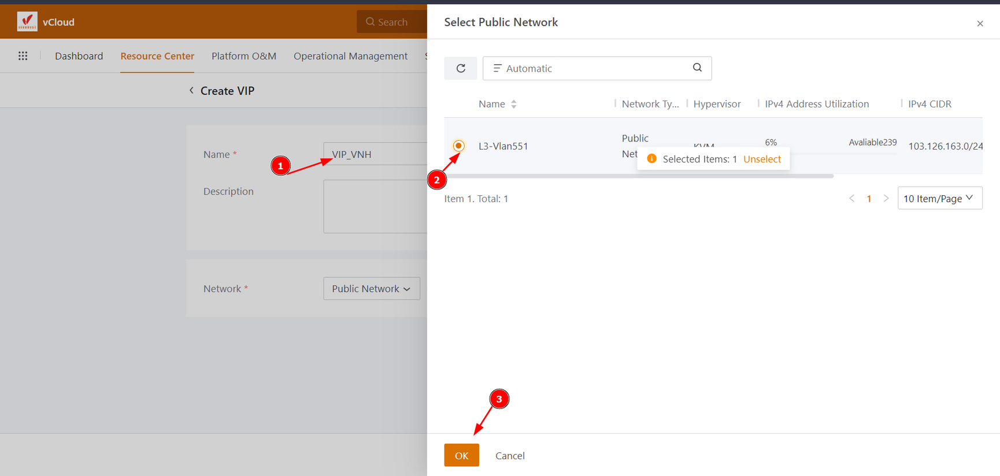
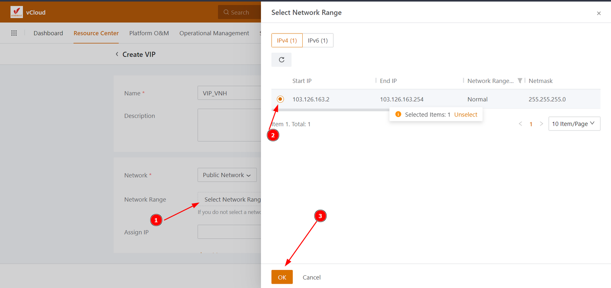
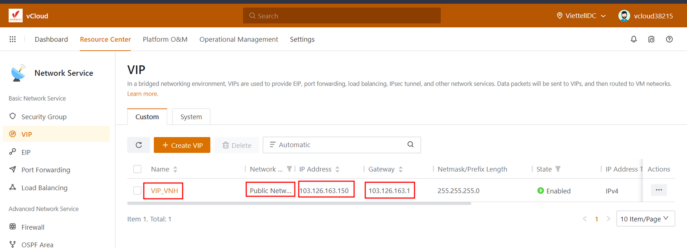
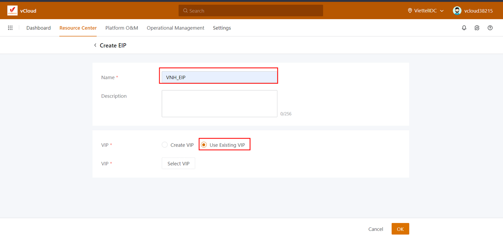
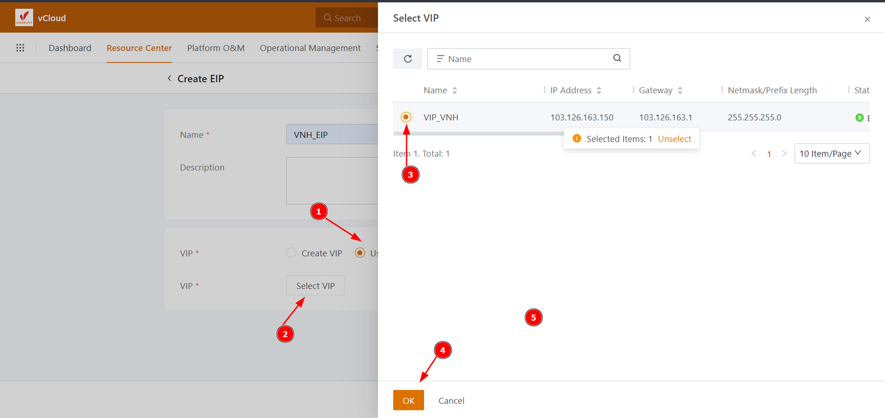
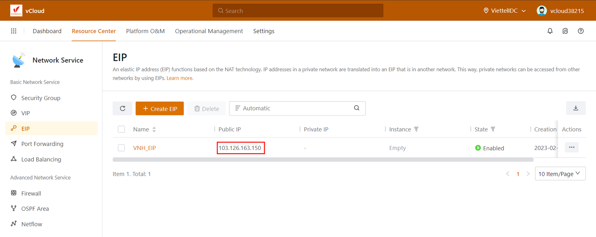
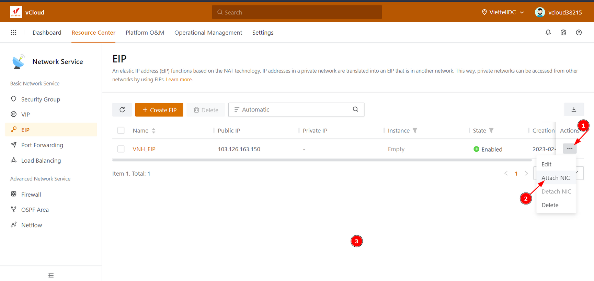
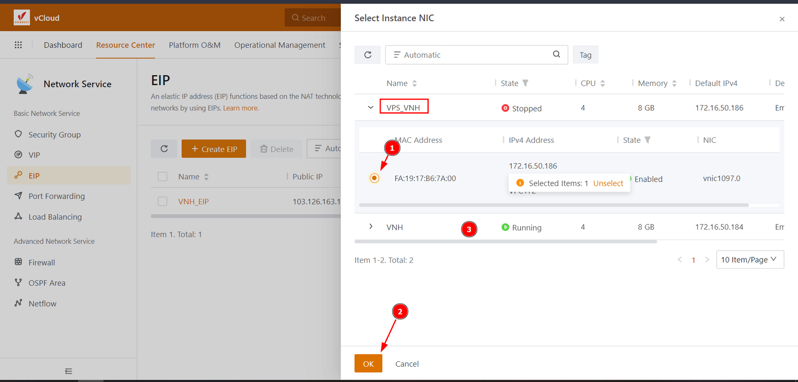
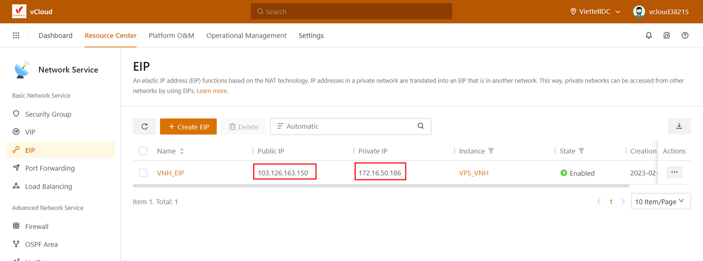

Bài viết này sẽ hướng dẫn bạn **thêm EIP (Elastic IP) lên VM Instance trên Cloud VinaHost****.** Nếu bạn cần hỗ trợ, xin vui lòng liên hệ VinaHost qua **Hotline 1900 6046 ext. 3**, email về [support@vinahost.vn](mailto:support@vinahost.vn) hoặc chat với VinaHost qua livechat [https://livechat.vinahost.vn/chat.php](https://livechat.vinahost.vn/chat.php).

Để biết Elastic IP là gì, các bạn có thể thao khảo [tại đây](https://vinahost.vn/elastic-ip-address/).

## 1\. Tạo VIP (Virtual IP Address)

Chúng ta cần tạo một range địa chỉ IP ảo Public để cung cấp cho EIP

Sau khi đã login vào hệ thống, các bạn chọn **Resource Center > Network Service > VIP > Create VIP**

Tiến hành đặt tên và chọn type Network, ở đây mình chọn là Public Network

Kế đến là chọn Select Network Range

Các bạn có thể Assign IP hoặc để trống, hệ thống sẽ tự chọn địa chỉ IP. Cuối cùng nhấn Ok để tạo VIP

Thông tin VIP sau khi đã tạo

## 2\. Tạo thêm EIP (**Elastic IP)**

Các bạn chọn **Resource Center > Network Service > EIP > Create EIP**

Tiến hành đặt tên cho EIP, các bạn có thể tạo trực tiếp VIP tại bước này, Tuy nhiên mình đã tạo sẵn VIP ở bước 1 nên mình sẽ chọn Use Existing VIP

Chọn VIP vừa tạo và nhấn Ok để tạo EIP

Sau khi đã tạo xong EIP, các bạn sẽ thấy thông tin địa chỉ Public IP sẽ giống với địa chỉ VIP vừa tạo lúc nãy 103.126.163.150

## 3\. Gán EIP cho VM Instance

Các bạn nhấp chọn vào dấu 3 chấm của EIP vừa tạo và chọn Attach NIC

Tại bước này các bạn chọn VM cần gán EIP và nhấn OK để gán EIP cho VM đó

Sau khi gán EIP cho VM thành công các bạn sẽ thấy thông tin sau

Địa chỉ IP Private của VPS là 172.16.50.186 sẽ được NAT thành địa chỉ IP Public 103.126.163.150. Khi truy cập ra Internet, VM sẽ truy cập bằng địa chỉ IP 103.126.163.150

Để gỡ bỏ EIP cho VM đó, các bạn chỉ cần thực hiện tương tự bước 3 và chọn Detach NIC

Chúc các bạn **thêm EIP** cho VM Instance trên Cloud VinaHost thành công !!!

> **THAM KHẢO CÁC DỊCH VỤ TẠI [VINAHOST](https://vinahost.vn/)**
> 
> **\>>** [**SERVER**](https://vinahost.vn/thue-may-chu-rieng/) **–** [**COLOCATION**](https://vinahost.vn/colocation.html) – [**CDN**](https://vinahost.vn/dich-vu-cdn-chuyen-nghiep)
> 
> **\>> [CLOUD](https://vinahost.vn/cloud-server-gia-re/) – [VPS](https://vinahost.vn/vps-ssd-chuyen-nghiep/)**
> 
> **\>> [HOSTING](https://vinahost.vn/wordpress-hosting)**
> 
> **\>> [EMAIL](https://vinahost.vn/email-hosting)**
> 
> **\>> [WEBSITE](http://vinawebsite.vn/)**
> 
> **\>> [TÊN MIỀN](https://vinahost.vn/ten-mien-gia-re/)**
