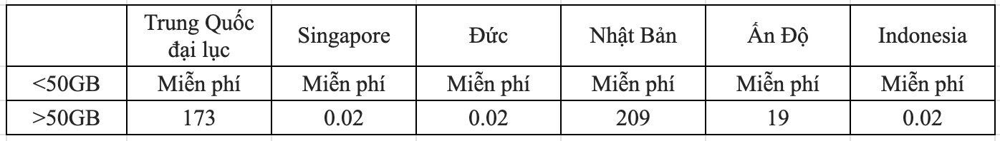
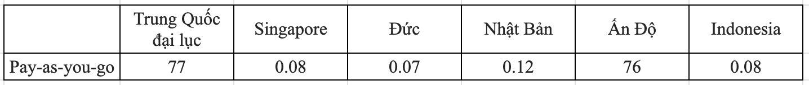
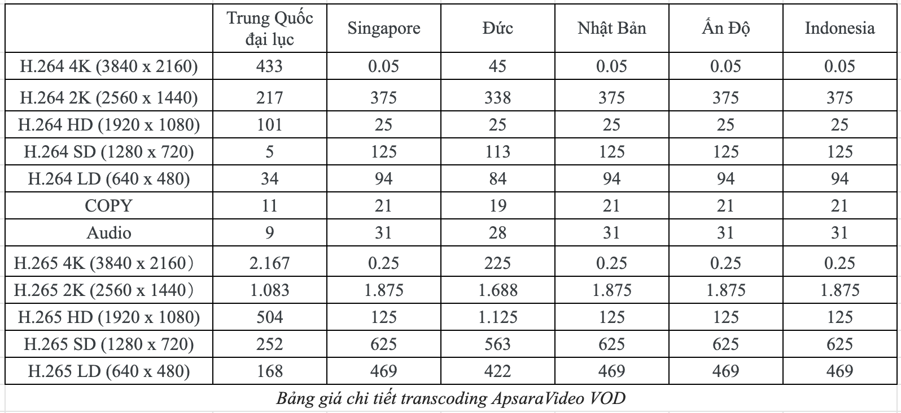
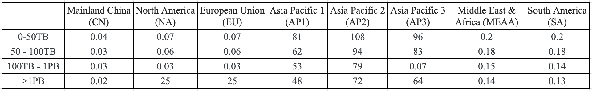
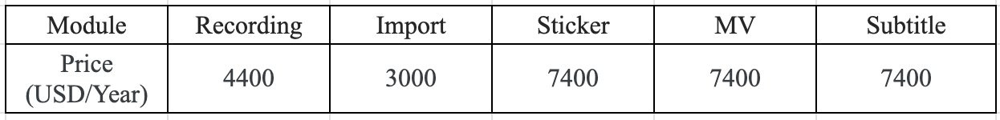
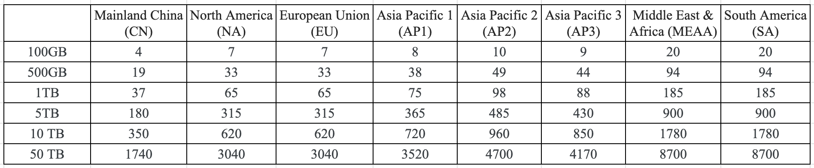
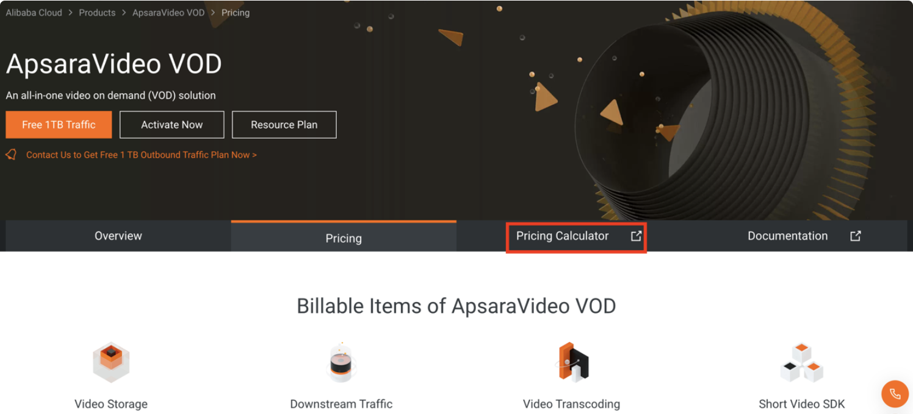
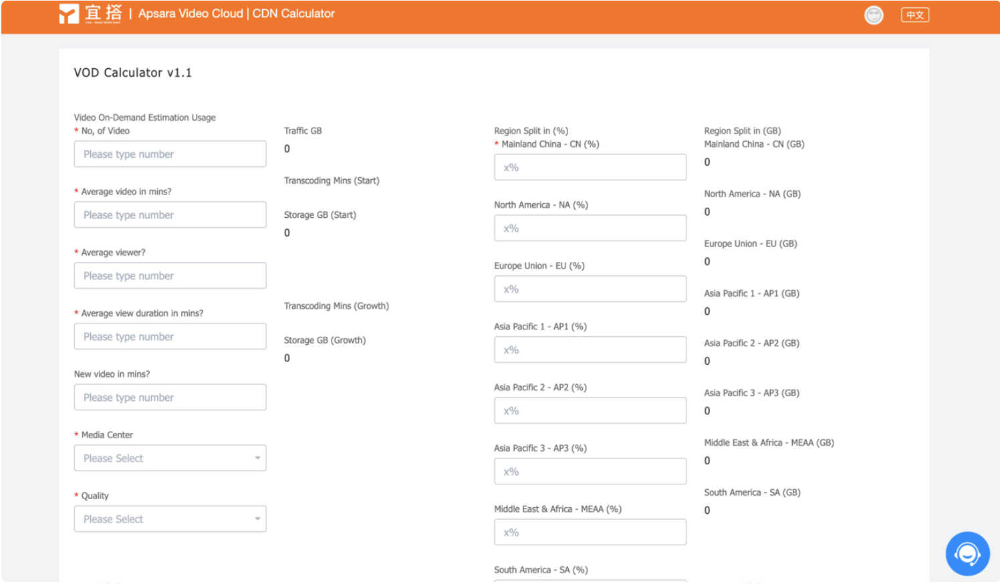
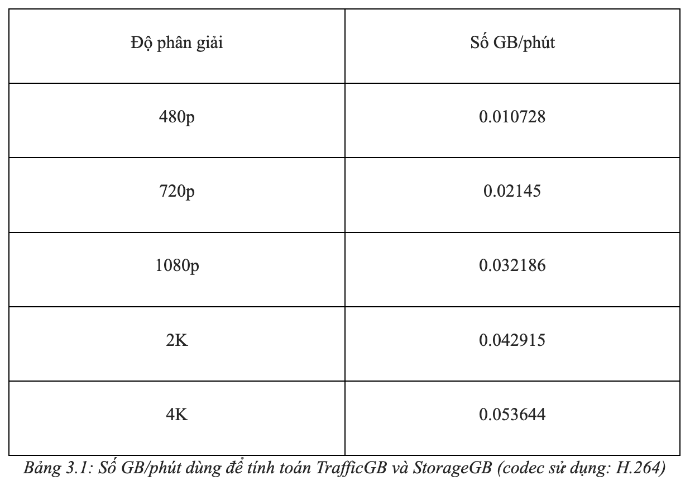
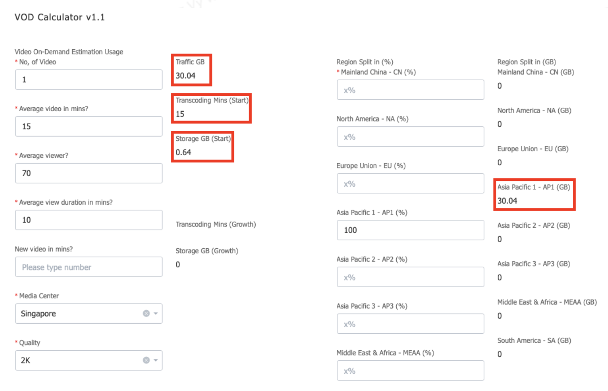

Bài viết này sẽ hướng dẫn bạn cách **Tính Toán Chi Phí Apsaravideo Vod Với Alibaba Vod Calculator.** Nếu bạn cần hỗ trợ, xin vui lòng liên hệ VinaHost qua **Hotline 1900 6046 ext. 3**, email về [support@vinahost.vn](mailto:support@vinahost.vn) hoặc chat với VinaHost qua livechat [https://livechat.vinahost.vn/chat.php](https://livechat.vinahost.vn/chat.php).

## 1\. ApsaraVideo VOD là gì?

Alibaba Cloud ApsaraVideo VOD (Video on Demand) là một dịch vụ đám mây cho phép người dùng lưu trữ, quản lý và phân phối video trực tuyến trên nền tảng điện toán đám mây của Alibaba. ApsaraVideo VOD cung cấp các tính năng như lưu trữ video, mã hóa video, phân phối, phát trực tiếp và phát lại định dạng video, cho phép người dùng tùy chỉnh, chi tiết và quản lý các nội dung video trên đám mây.

## 2\. Phương thức thanh toán của ApsaraVideo VOD

Chi phí sử dụng ApsaraVideo VOD được là tổng các chi phí sử dụng bộ nhớ, transcoding, phân phối nội dung CDN và chi phí Short Video SDK (nếu có).

### 2.1. Chi phí sử dụng bộ nhớ (Storage Service) sẽ bao gồm:

**Chi phí bộ nhớ** (chi phí hiện hành như bảng bên dưới, đơn vị tính: USD/GB/Tháng).

**Chi phí lưu lượng bộ nhớ phát sinh** dùng trên OSS Downstream (Upstream Trafic là miễn phí) – chi phí hiện hành như bảng bên dưới (đơn vị tính USB/GB).

### 2.2. Chi phí transcoding

Chi phí transcoding được tính theo phút, làm tròn đến hai chữ số thập phân. Video dưới 1 giây được tính là 0,02 phút. Chi phí transcoding phụ thuộc vào loại codec, độ phân giải và khu vực.

### 2\. 3. Chi phí phân phối nội dung CDN

### 2.4. Chi phí Short Video SDK

### 2\. 5. Chi phí truyền dữ liệu ra bên ngoài (Outbound Data Transfer)

## **3\. Sử dụng Alibaba VOD Calculator để tính toán chi phí giải pháp ApsaraVideo VOD của bạn**

Việc tính toán chi phí trong Alibaba Cloud ApsaraVideo VOD là tương đối phức tạp và liên quan đến nhiều yếu tố, bạn có thể sử dụng công cụ tính toán có sẵn của Alibaba Cloud dành cho ApsaraVideo VOD.

Để sử dụng công cụ này, truy cập vào trang Pricing của ApsaraVideo VOD, chọn Pricing Calculator.

Bạn sẽ vào được giao diện chính của VOD Calculator.

ApsaraVideo VOD Calculator hỗ trợ tính toán chi phí các mục Transcoding, Storage và CDN Service.

Tại trang chủ, nhập vào các thông số các video của bạn:

- No of Video: số lượng video.
- Average video in mins: số phút trung bình (thời lượng trung bình của video), thông số này để tính Transcoding Mins (Start).
- Average viewer: lượt xem trung bình của video.
- Average view duration in mins: thời lượng xem video trung bình của người xem.
- New video in mins: thời lượng video mới. Trường này là trường không bắt buộc nhập.
- Media Center: chọn vị trí phát trung tâm của bạn. Cước phí cho một số dịch vụ sẽ được tính dựa trên vị trí này.
- Quality: Độ phân giải mong muốn khi phát video. Độ phân giải thấp nhất là 480p và cao nhất là 4K với những mức giá tương ứng.

Cách chương trình tính toán: ApsaraVideo VOD sẽ thực hiện tính toán trafic (số GB) sử dụng; Storage GB và Transcoding Minutes (để nhân với đơn giá ở bước sau) dựa trên các nguyên tắc như sau:

- Transcoding Minute = No.Video \* Average Video in mins
- Transcoding Start = Transcoding Minute \* Price (Price xem tại mục 2.2).
- Storage GB (Start) = Transcoding Minute \* số GB/phút (xem ở bảng 3.1)
- Storage Fee miễn phí với số GB từ 50 trở xuống; số GB > 50 được tính theo giá ở phần 2.1 (tính cả phần <50).
- Traffic GB (xấp xỉ) = No. Video _Average Viewer_ Average View Duration in minute\* số GB/phút (xem ở bảng 3.1)
- Phí Traffic được tính theo CDN Service theo số GB và khu vực (theo giá ở mục 2.3)
- Ngoài ra bạn có thể set up Region Split để chia lượng TraficGB về từng khu vực (nếu có nhu cầu).

Sau khi các thông số về lượng sử dụng trên được tính, hệ thống sẽ nhân với giá list để ra hóa đơn tổng thể ứng với lượng sử dụng của bạn.

Ví dụ, nhập các thông số sau:

Lúc này, các thông số sẽ được tính toán như sau:

- Transcoding Mins (Start) = No of Video _Average video in mins = 1_ 15 = 15
- Traffic GB = No of Video _Average viewer_ Average view durrtion in mins _số GB/phút = 1_ 70 _10_ 0.042915 = 30.04
- Storage GB = No of Video _Average video in mins_ số GB/phút = 1 _15_ 0.042915 = 0.64
- Asia Pacific – AP1 (GB) do ta đã nhập 100%: = 100% \* Traffic GB

Từ đó giá tiền sẽ được tính:

- Chi phí Transcoding (Transcoding (Start)) = Transcoding Mins \* Price = 15 \* 0.0375 = 0.5625
- Chi phí Traffic = Traffic by Region _Price = 30.04_ 0.081 = 2.43324 **Tổng chi phí = 0.5625 + 2.43324 = 2.99574**

**\>>> Truy cập [Pricing Calulator](https://yida.alibaba-inc.com/o/livecalculator#/).**

**\>>> Truy cập [Live Streaming Calulator](https://market.m.taobao.com/app/video-cloud-fe/live-calculator/index.html?#/?channel=SIN).**

Chúc bạn thực hiện thành công!

_Nguồn: https://www.alibabacloud.com/blog/how-to-use-apsaravideo-vod-calculator\_599978_

> **THAM KHẢO CÁC DỊCH VỤ TẠI [VINAHOST](https://vinahost.vn/)**
> 
> **\>>** [**SERVER**](https://vinahost.vn/thue-may-chu-rieng/) **–** [**COLOCATION**](https://vinahost.vn/colocation.html) – [**CDN**](https://vinahost.vn/dich-vu-cdn-chuyen-nghiep)
> 
> **\>> [CLOUD](https://vinahost.vn/cloud-server-gia-re/) – [VPS](https://vinahost.vn/vps-ssd-chuyen-nghiep/)**
> 
> **\>> [HOSTING](https://vinahost.vn/wordpress-hosting)**
> 
> **\>> [EMAIL](https://vinahost.vn/email-hosting)**
> 
> **\>> [WEBSITE](http://vinawebsite.vn/)**
> 
> **\>> [TÊN MIỀN](https://vinahost.vn/ten-mien-gia-re/)**
