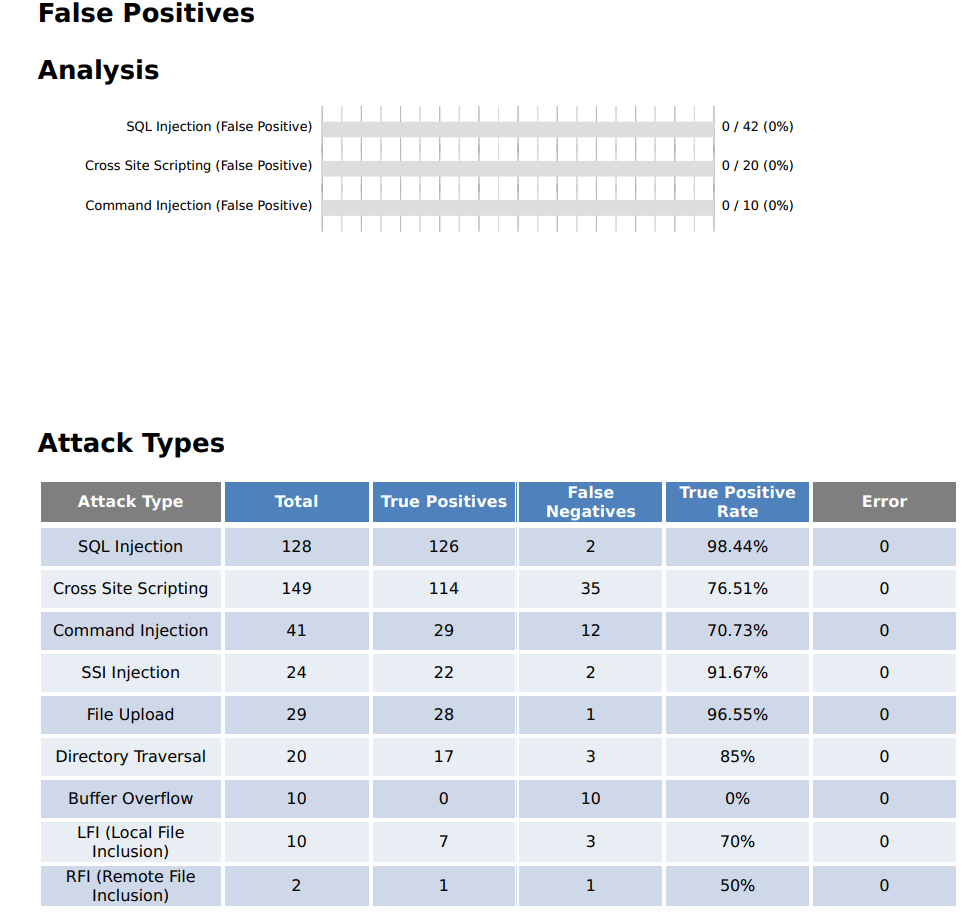
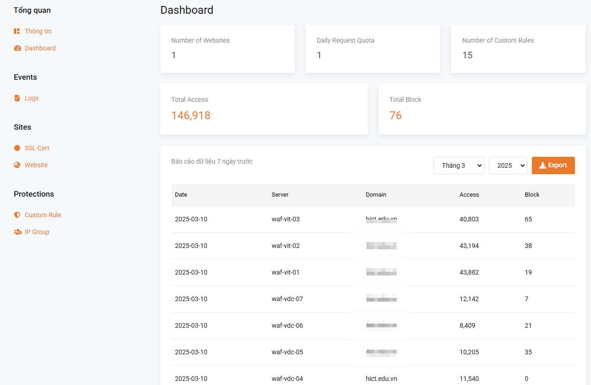

# VinaHost WAF Security

# Thách thức bảo mật ứng dụng

> Các ứng dụng đang ngày càng trở nên quan trọng đối với doanh nghiệp, đó là lý do tại sao chúng liên tục bị nhắm mục tiêu bởi các tin tặc, dẫn đến gia tăng các mối lo ngại về bảo mật tổ chức. Những mối lo ngại này đa dạng từ việc duy trì bảo vệ trước các lỗ hổng 0-day mới xuất hiện, phát hiện các nỗ lực né tránh, giảm thiểu rủi ro tấn công nhồi thông tin đăng nhập dẫn đến chiếm đoạt tài khoản, phát hiện mất dữ liệu, thậm chí quét phát hiện việc tải lên phần mềm độc hại vào ứng dụng.

> Những mối lo ngại này đi kèm với nhu cầu đảm bảo rằng các biện pháp bảo vệ ứng dụng là một phần của tư thế bảo mật thống nhất, rộng lớn hơn ngăn chặn bot, mà còn giảm thiểu các rủi ro phía máy khách. Tất cả những điều này phải diễn ra đồng thời mà không gây ra gánh nặng quản lý quá mức cho các đội ngũ.

# Key Points

* VinaHost WAF là một tường lửa ứng dụng web tự lưu trữ, được thiết kế để bảo vệ ứng dụng web khỏi các cuộc tấn công mạng như SQL injection, XSS, và nhiều mối đe dọa khác.
* Sản phẩm này có các tính năng như phát hiện mối đe dọa tiên tiến, giới hạn tốc độ, và hỗ trợ quản lý qua giao diện web.
* Giá cả và hỗ trợ có thể được cung cấp theo các phiên bản khác nhau, nhiều cách triển khai khác nhau. Phù hợp với nhu cầu của người dùng.

---

# Tổng Quan Về VinaHost WAF

VinaHost WAF là một giải pháp tường lửa ứng dụng web (WAF) tự lưu trữ, được phát triển để bảo vệ các ứng dụng web khỏi một loạt các mối đe dọa mạng. Sản phẩm mang lại sự bảo vệ mạnh mẽ chống lại các cuộc tấn công như SQL injection, Cross-Site Scripting (XSS), và nhiều loại khai thác khác.

Nó hoạt động như một proxy ngược, lọc và giám sát lưu lượng HTTP giữa ứng dụng web và Internet, đảm bảo rằng chỉ lưu lượng an toàn được chuyển tiếp. Đây là một lựa chọn lý tưởng cho các doanh nghiệp muốn kiểm soát hoàn toàn dữ liệu và cài đặt bảo mật của mình.

# Tính Năng Chính

VinaHost WAF cung cấp một loạt các tính năng tiên tiến, bao gồm:

* **Phát hiện mối đe dọa tiên tiến:** Sử dụng thuật toán phân tích cú pháp để phát hiện chính xác các cuộc tấn công, giảm thiểu báo động giả.
* **Bảo vệ tự động:** Chống lại các cuộc tấn công như SQL injection, XSS, code injection, và nhiều loại khác.
* **Kiến trúc dựa trên NGINX:** Tận dụng hiệu suất cao của NGINX để xử lý lưu lượng HTTP hiệu quả.
* **Giao diện quản lý thân thiện:** Cung cấp bảng điều khiển web để dễ dàng cấu hình và quản lý chính sách bảo mật.
* **Hỗ trợ SSL/TLS:** Đảm bảo giao tiếp mã hóa giữa khách hàng và ứng dụng web.
* **Giới hạn tốc độ:** Bảo vệ hạn chế các cuộc tấn công DoS, brute-force, và tăng đột biến lưu lượng.
* **Thách thức chống bot:** Chặn bot độc hại trong khi cho phép người dùng và trình thu thập thông tin hợp pháp.
* **Thách thức xác thực:** Yêu cầu nhập mật khẩu để truy cập, chặn người dùng không được phép.
* **Bảo vệ động:** Mã hóa mã HTML và JavaScript động cho mỗi lượt truy cập để ngăn chặn khai thác.
* **Giới hạn dựa trên IP:** Kiểm soát lưu lượng từ các địa chỉ IP cụ thể để ngăn chặn lạm dụng.
* **Danh sách kiểm soát truy cập web (ACL):** Cho phép hoặc từ chối truy cập dựa trên địa chỉ IP hoặc tiêu chí khác.

# Tùy Chọn Triển Khai

VinaHost WAF có thể được triển khai dễ dàng

* **Shared WAF**: VinaHost có các cụm WAF trải dài trên các DataCenter. Tên miền của khách hàng sẽ được điều hướng tải lên các node WAF. Giúp khả năng chịu tải, chịu tấn công DDoS và không ảnh hưởng khi downtime node WAF.

 

* **Dedicate WAF**: Xây dựng WAF riêng biệt trước máy chủ khách hàng. Trường hợp khách hàng có rất nhiều tên miền cần bảo vệ thì có thể sử dụng option này để tối ưu chi phí.

# Thông Số Kỹ Thuật

* **Số lượng WAF node:** 15
* **Số lượng DataCenter**: 3

# Hỗ Trợ và Giá Cả

VinaHost cung cấp tài liệu toàn diện để hỗ trợ cài đặt, cấu hình, và khắc phục sự cố. Hỗ trợ khách hàng có sẵn qua email, trò chuyện, và các kênh khác. Về giá cả, VinaHost WAF có các phiên bản khác nhau, từ cơ bản đến nâng cao, phù hợp với nhu cầu bảo mật của bạn. Vui lòng liên hệ đội ngũ bán hàng để biết chi tiết giá cả và lựa chọn phù hợp.

# Thông Tin Liên Hệ

Để biết thêm thông tin hoặc yêu cầu bản demo, vui lòng liên hệ đội ngũ của chúng tôi tại [support@vinahost.](mailto:sales@vinahost.com)vn hoặc truy cập website tại [www.vinahost.](http://www.vinahost.com)vn.

---

# Ghi Chú Chi Tiết Về VinaHost WAF

# Phân Tích Tính Năng

Dưới đây là bảng tổng hợp các tính năng chính, được trích xuất từ tài liệu:

| **Tính Năng** | **Mô Tả** |
|----|----|
| Chặn Cuộc Tấn Công Web | Bảo vệ chống lại SQL injection, XSS, code injection, os command injection, CRLF injection, XXE, SSRF, path traversal, v.v. |
| Giới Hạn Tốc Độ | Bảo vệ giúp hạn chế tấn công DoS, brute-force, tăng đột biến lưu lượng bằng cách giới hạn lưu lượng vượt quá. |
| Thách Thức Chống Bot | Chặn bot, cho phép người dùng và trình thu thập thông tin hợp pháp. |
| Thách Thức Xác Thực | Yêu cầu nhập mật khẩu để truy cập, chặn người dùng không được phép. |
| Bảo Vệ Động | Mã hóa mã HTML và JS động cho mỗi lượt truy cập. |
| Khả Năng Thêm | Bao gồm bảo vệ chống tấn công web, phòng chống bot chủ động, mã hóa mã HTML & JS, giới hạn dựa trên IP, danh sách kiểm soát truy cập web. |

Bảng trên phản ánh các tính năng cốt lõi, được điều chỉnh để phù hợp với nhu cầu của VinaHost, đảm bảo rằng sản phẩm cung cấp khả năng bảo mật toàn diện.

# Kết quả kiểm thử

Kết quả test từ WAFER (Cloudbrics):

 

 

# So sánh với các WAF phổ biến hiện nay

| Đặc điểm | VinaHost WAF | Cloudflare | Mod Security |
|----|----|----|----|
| Triển khai | Cluster (Việt Nam) | Cloud-base (Quốc tế) | Build-in Webserver |
| Pricing | Free, Có phí | Free, Có phí | Free |
| Cách hoạt động | Phân tích ngữ nghĩa (semantic analysis), giúp detect tấn công phức tạp như Zero-day | Machine learning  & Managed Rules của Cloudflare. Ngăn chặn mối đe dọa mà người dùng không cần can thiệp nhiều. | Sử dụng các ruleset (OWASP) có sẵn, chỉ kiểm tra được trên các rule đã biết |
| Khả năng bảo vệ | Chống lại OWASP top 10, Zero-day, Bot, HTTP-Flood | Chống lại OWASP top 10, Zero-day, DDoS, API. Do có mạng lưới toàn cầu | Chống lại OWASP top 10 |
| Đối tượng | Website bảo mật cơ bản đến trung bình và tự quản lý | Mọi đối tượng, đưa lên môi trường cloud-base và muốn tích hợp CDN | Phù hợp web nhỏ, đơn giản hoặc người quản trị chuyên nghiệp |
| Cấu hình | Đơn giản, có giao diện UI để cấu hình | Rất dễ, ngoài trỏ DNS ra không cần can thiệp quá nhiều | Khó |
| Tích hợp CDN | Không | Có | Không |
| Tùy chỉnh | Cao (Giới hạn ít) | Trung bình (giới hạn nhiều) | Rất cao (người dùng làm chủ) |
| DDoS | HTTP Flood | DDoS Traffic | Không có khả năng |
| Hiệu suất | Độ trễ thấp (<1ms), tối ưu tự quản lý | Cao (mạng toàn cầu, 100M req/s tại đỉnh) | Phụ thuộc máy chủ, có thể chậm nếu không tối ưu |
| **Hỗ trợ SSL** | Có (Let's Encrypt) | Có (tự động, wildcard tùy gói) | Có (phụ thuộc cấu hình máy chủ) |
| **Cộng đồng/Hỗ trợ** | Hỗ trợ kỹ thuật 24/7 | Ít hỗ trợ nhưng cộng đồng lớn | Cộng đồng mạnh, sắp EOL (2024) |

# Giao diện

Giao diện đơn giản, không phức tạp:

 

 

 

# Kết Luận

Sản phẩm này cung cấp một giải pháp bảo mật toàn diện, dễ triển khai, và hỗ trợ mạnh mẽ, đáp ứng nhu cầu của các doanh nghiệp trong việc bảo vệ ứng dụng web.

###