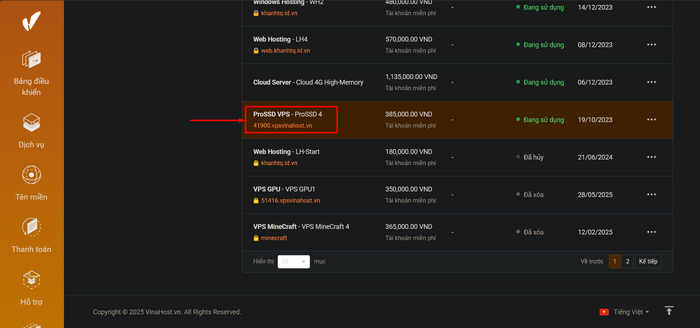
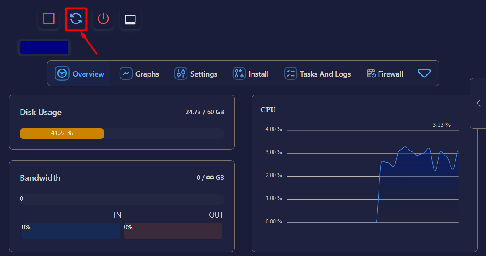
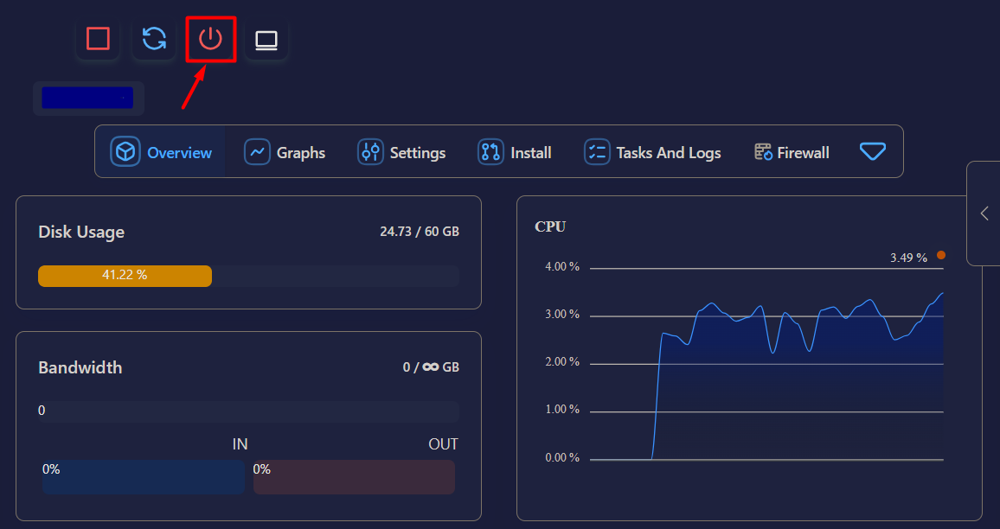
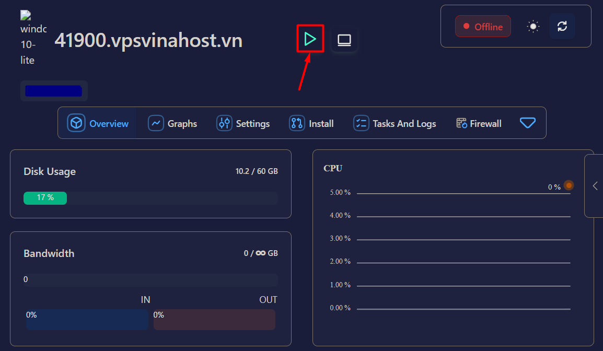

!!! info "Liên hệ"

    Nếu bạn cần hỗ trợ, xin vui lòng liên hệ hotline **1900 6046 nhánh 3**, hoặc gửi email đến [**support@vinahost.vn**](mailto:support@vinahost.vn), hoặc chat trực tiếp với chúng tôi tại [**đây**](https://livechat.vinahost.vn/chat.php).

## Bạn cần *restart (soft reboot)* hay *hard reboot*?

Trong nhiều trường hợp, "restart" và "reboot" đều có nghĩa là ***khởi động lại***, nhưng thực ra chúng khác nhau. Điều này đặc biệt hữu ích trong trường hợp bạn vừa nâng cấp tài nguyên cho VPS (RAM, CPU, dung lượng lưu trữ).

- **Restart (soft reboot)**: chỉ khởi động lại hệ điều hành bên trong VPS (như khi bạn click vào nút Restart trong Windows). Do đó, VPS không nhận cấu hình tài nguyên mới.
- **Reboot**: gồm 'soft reboot' (tức *restart* như trên) và 'hard reboot'. ***Hard reboot*** dùng để chỉ việc ngắt điện rồi bật lại. Tương tự như khi bạn bấm nút nguồn để tắt hẳn máy. Trong trường hợp này, hệ thống sẽ áp dụng cấu hình tài nguyên mới khi bạn bật lại máy.

Vậy:

- Bạn *restart* VPS sau khi thực hiện 1 số thay đổi như update Windows, cài đặt ứng dụng, thay đổi thiết đặt hệ thống, v.v.
- Bạn *hard reboot* VPS sau khi nâng cấp tài nguyên VPS hoặc hệ điều hành đang bị treo.

## Thực hiện

### Bước 1. Truy cập bảng điều khiển VPS

Đăng nhập vào [trang khách hàng VinaHost](https://secure.vinahost.vn/ac/index.php?rp=/login). Trong phần **Dịch vụ**, nhấp vào VPS cần thao tác rồi cuộn xuống cuối trang. Bảng điều khiển sẽ tự động được hiển thị sau khoảng 2 giây.

!!! tip "Mẹo"

    Nếu bảng điều khiển không hiển thị, vui lòng gửi yêu cầu hỗ trợ.

### Bước 2. Khởi động lại VPS

Trong bảng điều khiển VPS, chọn nút **Restart** nếu bạn chỉ cần restart.

Nếu bạn muốn hard reboot, chọn nút **Poweroff** :material-power:{ title="poweroff" } để tắt hẳn, sau đó nhấn nút **Start** :material-play:{ title="start" } để bật lại.

---

VinaHost chúc bạn thực hiện thành công! 🍻

> **THAM KHẢO CÁC DỊCH VỤ TẠI [VINAHOST](https://vinahost.vn/)**
>
> **\>> [SERVER](https://vinahost.vn/thue-may-chu-rieng/) – [COLOCATION](https://vinahost.vn/colocation.html) – [CDN](https://vinahost.vn/dich-vu-cdn-chuyen-nghiep)**  
> **\>> [CLOUD](https://vinahost.vn/cloud-server-gia-re/) – [VPS](https://vinahost.vn/vps-ssd-chuyen-nghiep/)**  
> **\>> [HOSTING](https://vinahost.vn/wordpress-hosting)**  
> **\>> [EMAIL](https://vinahost.vn/email-hosting)**  
> **\>> [WEBSITE](http://vinawebsite.vn/)**  
> **\>> [TÊN MIỀN](https://vinahost.vn/ten-mien-gia-re/)**
