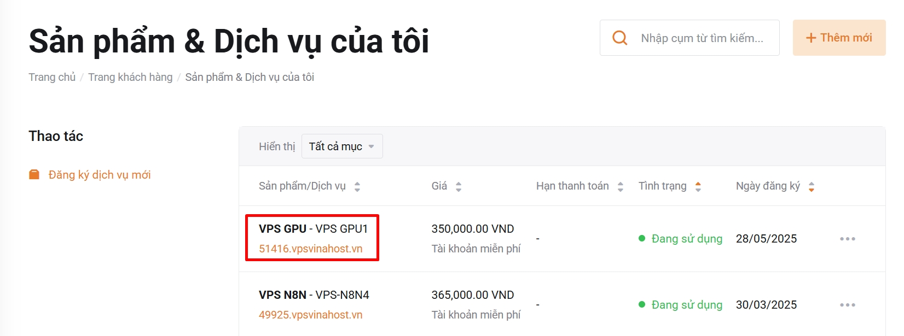
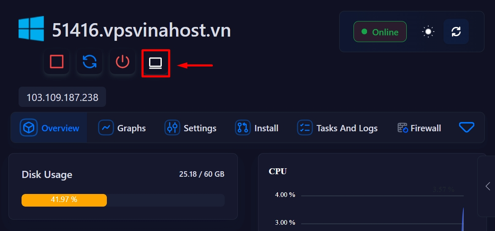
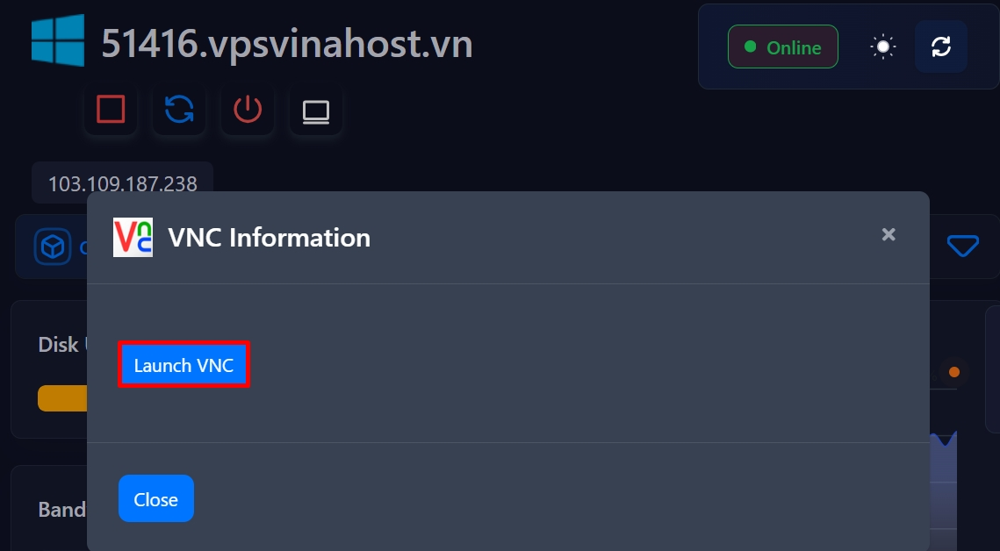
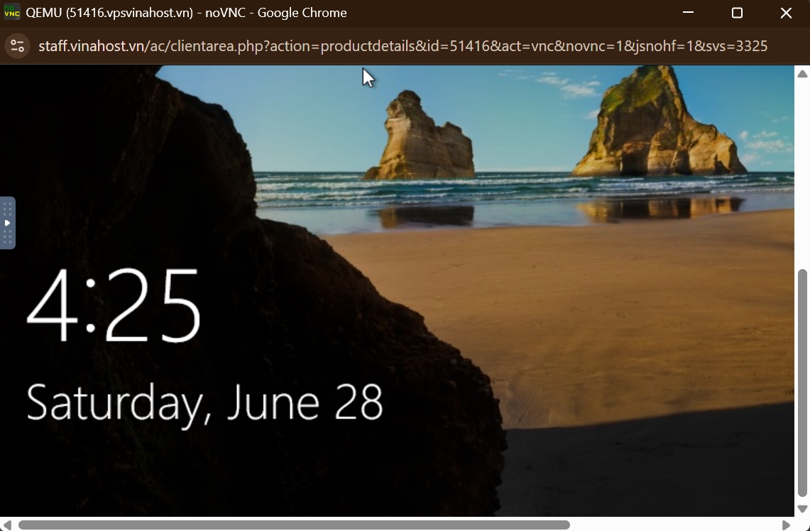

!!! info "Liên hệ"

    Nếu bạn cần hỗ trợ, xin vui lòng liên hệ hotline **1900 6046 nhánh 3**, hoặc gửi email đến [**support@vinahost.vn**](mailto:support@vinahost.vn), hoặc chat trực tiếp với chúng tôi tại [**đây**](https://livechat.vinahost.vn/chat.php).

## Điều khiển VPS từ xa với VNC

VNC đặc biệt hữu ích trong trường hợp bạn không thể đăng nhập từ xa (SSH hoặc RDP) đến máy chủ của mình vì bất kỳ lý do gì.

### Bước 1. Truy cập bảng điều khiển VPS

Đăng nhập vào [trang khách hàng VinaHost](https://secure.vinahost.vn/ac/index.php?rp=/login). Trong phần **Dịch vụ**, nhấp vào VPS cần thao tác rồi cuộn xuống cuối trang. Bảng điều khiển sẽ tự động được hiển thị sau khoảng 2 giây (xem tại [bước 2](#bước-2-đăng-nhập-vnc)).

!!! tip "Mẹo"

    Nếu bảng điều khiển không hiển thị, vui lòng gửi yêu cầu hỗ trợ.

### Bước 2. Đăng nhập VNC

Trong bảng điều khiển VPS, chọn biểu tượng Console > nhấn **Launch VNC** trong hộp thoại hiện ra.

!!! tip "Mẹo"

    Nếu cửa sổ console (VNC) không hiển thị (chỉ có màu đen) hoặc không thể kết nối đến máy chủ, vui lòng gửi yêu cầu hỗ trợ.

VinaHost chúc bạn thực hiện thành công! 🍻

> **THAM KHẢO CÁC DỊCH VỤ TẠI [VINAHOST](https://vinahost.vn/)**
>
> **\>> [SERVER](https://vinahost.vn/thue-may-chu-rieng/) – [COLOCATION](https://vinahost.vn/colocation.html) – [CDN](https://vinahost.vn/dich-vu-cdn-chuyen-nghiep)**  > **\>> [CLOUD](https://vinahost.vn/cloud-server-gia-re/) – [VPS](https://vinahost.vn/vps-ssd-chuyen-nghiep/)**  > **\>> [HOSTING](https://vinahost.vn/wordpress-hosting)**  > **\>> [EMAIL](https://vinahost.vn/email-hosting)**  > **\>> [WEBSITE](http://vinawebsite.vn/)**  > **\>> [TÊN MIỀN](https://vinahost.vn/ten-mien-gia-re/)**
