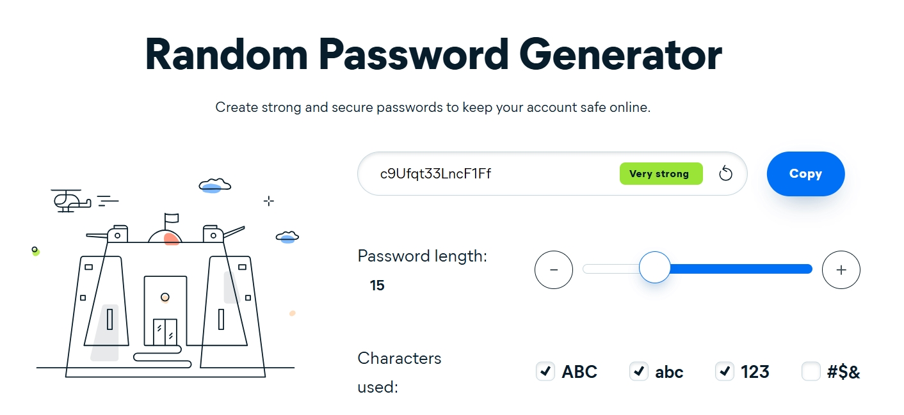
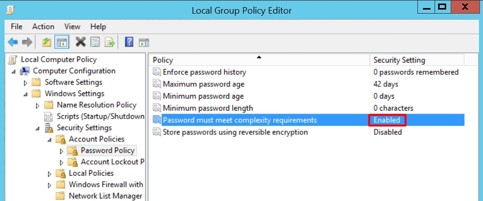
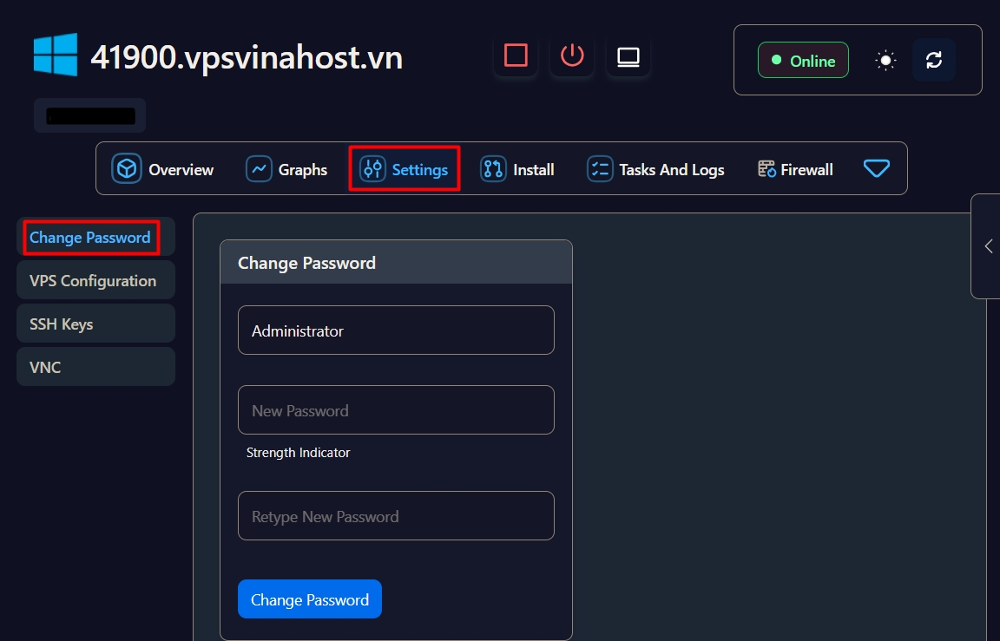
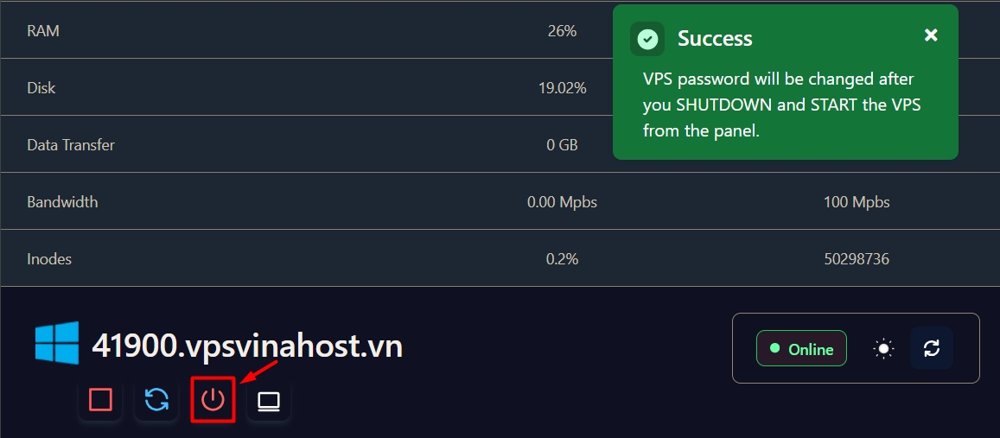
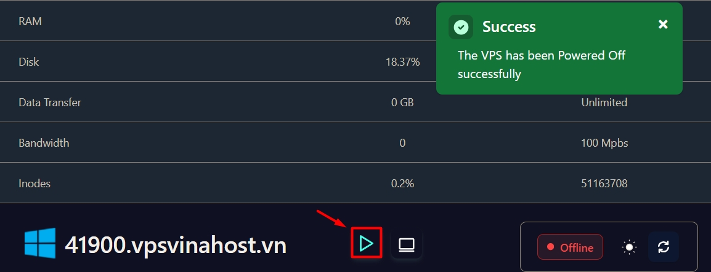

!!! info "Liên hệ"

    Nếu bạn cần hỗ trợ, xin vui lòng liên hệ hotline **1900 6046 nhánh 3**, hoặc gửi email đến [**support@vinahost.vn**](mailto:support@vinahost.vn), hoặc chat trực tiếp với chúng tôi tại [**đây**](https://livechat.vinahost.vn/chat.php).

## Thay đổi mật khẩu VPS từ bảng điều khiển VPS

### Bước 1. Truy cập bảng điều khiển VPS

Đăng nhập vào [trang khách hàng VinaHost](https://secure.vinahost.vn/ac/index.php?rp=/login). Trong phần **Dịch vụ**, nhấp vào VPS cần đổi mật khẩu rồi cuộn xuống cuối trang. Bảng điều khiển sẽ tự động được hiển thị sau khoảng 2 giây.

!!! tip "Mẹo"

    Nếu bảng điều khiển không hiển thị, vui lòng gửi yêu cầu hỗ trợ.

### Buớc 2. Tạo mật khẩu mạnh

Truy cập [**trình tạo mật khẩu mạnh Avast**](https://www.avast.com/random-password-generator), chọn độ dài mật khẩu và các ký tự mong muốn.

!!! warning "Lưu ý"

    Đối với **Windows** trong một số trường hợp, ký tự đặc biệt khiến mật khẩu mới không thể được áp dụng (dù bảng điều khiển không báo lỗi).
    Để cho phép ký tự đặc biệt, truy cập **Group Policy Editor** > **Computer Configuration** > **Windows Settings** > **Security Settings** > **Account Policies** > **Password Policy** > đảm bảo **Password must meet complexity requirements** đang được bật (Enabled).
    

!!! info "Thông tin thêm"

    - Bạn hoàn toàn có thể sử dụng công cụ tạo mật khẩu mạnh khác.
    - Không phải mọi ký tự đặc biệt đều được cho phép kể cả khi đã bật **Password must meet complexity requirements** trong Windows.

### Bước 3. Thay đổi mật khẩu

Quay lại bảng điều khiển VPS > **Settings** > **Change Password**.

Nhập mật khẩu mới > nhấn nút **Change Password**.

Đợi đến khi có thông báo thay đổi mật khẩu thành công thì chọn nút **Poweroff** :material-power:{ title="poweroff" } để tắt nguồn VPS.

Đợi VPS tắt hẳn thì bật lên lại bằng cách chọn nút **Start** :material-play:{ title="start" }.

VinaHost chúc bạn thực hiện thành công! 🍻

> **THAM KHẢO CÁC DỊCH VỤ TẠI [VINAHOST](https://vinahost.vn/)**
>
> **\>> [SERVER](https://vinahost.vn/thue-may-chu-rieng/) – [COLOCATION](https://vinahost.vn/colocation.html) – [CDN](https://vinahost.vn/dich-vu-cdn-chuyen-nghiep)**  > **\>> [CLOUD](https://vinahost.vn/cloud-server-gia-re/) – [VPS](https://vinahost.vn/vps-ssd-chuyen-nghiep/)**  > **\>> [HOSTING](https://vinahost.vn/wordpress-hosting)**  > **\>> [EMAIL](https://vinahost.vn/email-hosting)**  > **\>> [WEBSITE](http://vinawebsite.vn/)**  > **\>> [TÊN MIỀN](https://vinahost.vn/ten-mien-gia-re/)**
