Bài viết này sẽ hướng dẫn bạn **Hướng dẫn upload source code và database của website lên Windows Hosting.** Nếu bạn cần hỗ trợ, xin vui lòng liên hệ VinaHost qua **Hotline 1900 6046 ext. 3**, email về [support@vinahost.vn](mailto:support@vinahost.vn) hoặc chat với VinaHost qua livechat [https://livechat.vinahost.vn/chat.php](https://livechat.vinahost.vn/chat.php).

Khi host một website, chúng ta cần thực hiện các bước chung như sau:

1. Upload source code
2. Import database
3. Liên kết source code với database

## Upload source code
Có 2 cách thông dụng và dễ dàng nhất để upload source code:
- Sử dụng các phần mềm FTP Client (FileZilla, WinSCP)
- Sử dụng chức năng **Files** trong Plesk

### Cách 1: Sử dụng các phần mềm FTP Client
Sau đây là hướng dẫn sử dụng phần mềm FileZilla để upload source code. Các bước thực hiện tương tự đối với phần mềm WinSCP.

**Bước 1: Kết nối đến host**
Mở FileZilla và nhập thông tin vào các trường tương ứng:
- **Host**: IP của remote host
- **Username**: username của remote host
- **Password**: mật khẩu của username
- **Port**: sử dụng cổng 21 (FTP) hoặc 22 (SFTP) (thay đổi giữa 2 cổng nếu không kết nối được)
Có thể xem username, IP ngay trong giao diện **Website & Domains** của Plesk phía dưới cùng.
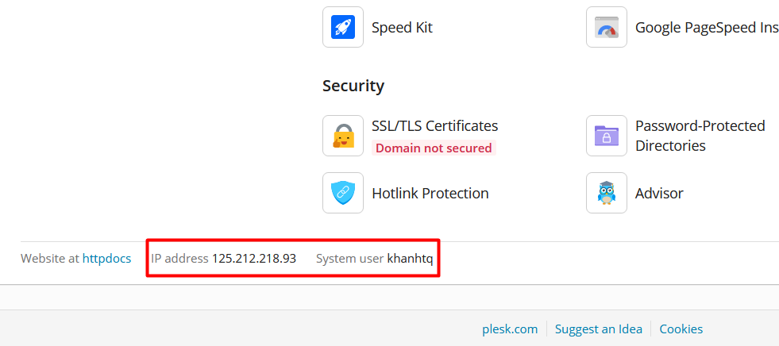

Sau khi nhập đầy đủ các trường, nhấn **Quickconnect** để bắt đầu kết nối.
Chọn **OK** nếu có hộp thoại tiếp theo hiện lên.
Nếu kết nối thành công:
- Phần **Status** hiển thị trạng thái *successful*
- Phần **Remote site** hiển thị cây thư mục và các thư mục, tệp của remote host
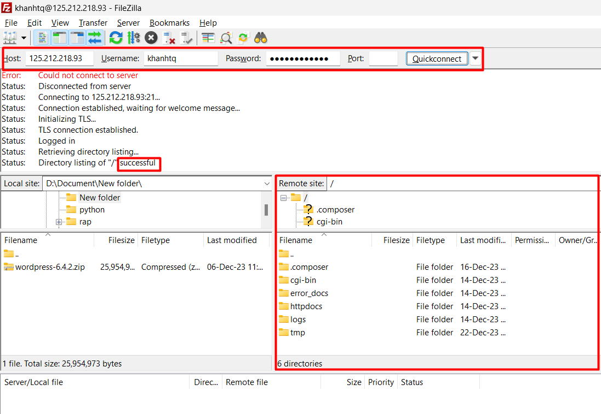

**Bước 2: Upload source code**
Vào thư mục **httpdocs** của remote host.
Chú ý, đường dẫn sẽ có dạng: `/httpdocs`
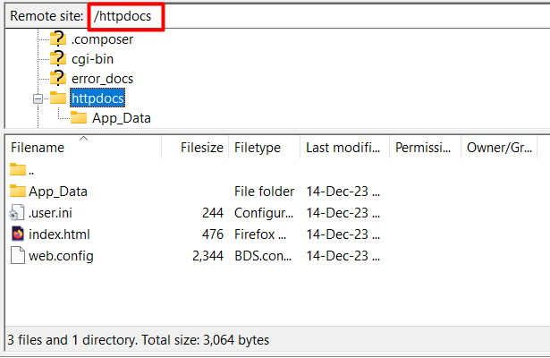

Có thể xoá các thư mục, tập tin mặc định.
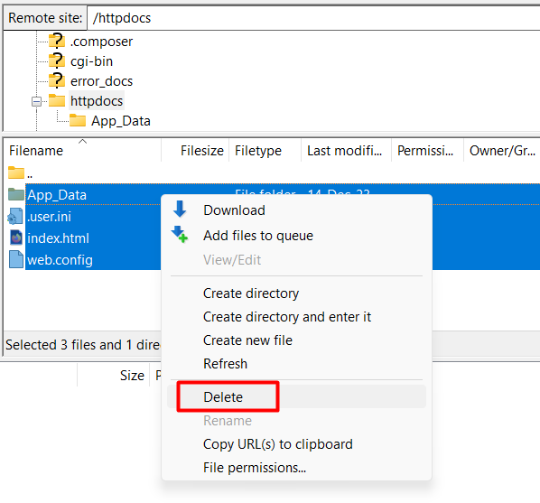

Click vào tệp nén source code, kéo và thả tệp từ phần **Local site** sang **Remote site**.

### Cách 2: Sử dụng Files trong Plesk
Tìm trên giao diện Plesk và chọn **Files**.
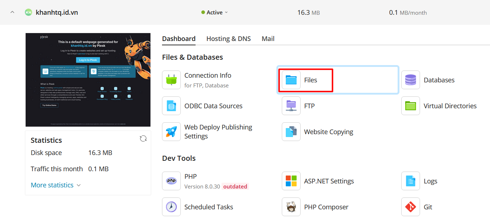

Trong giao diện **Files**, upload tệp nén source code theo các bước trong ảnh sau và đợi hoàn tất.
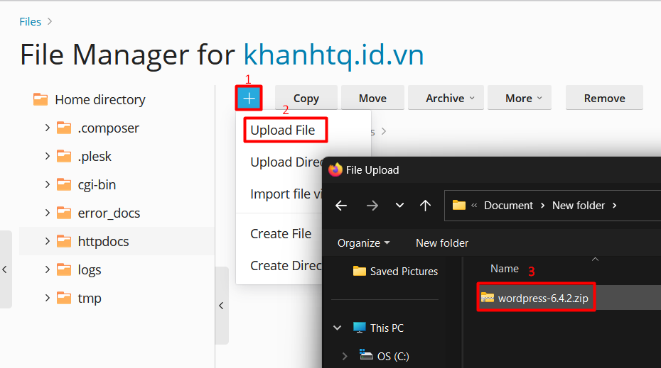

Sau khi upload thành công, thực hiện giải nén tệp nén source code.
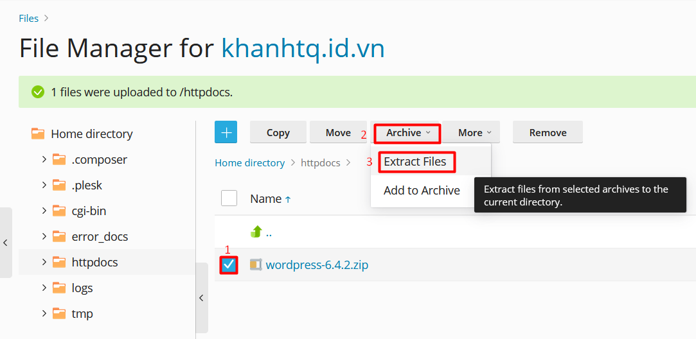

Tích vào ***Replace existing files*** để ghi đè các tệp trùng tên đang tồn tại (nếu muốn) và nhấn **OK**.
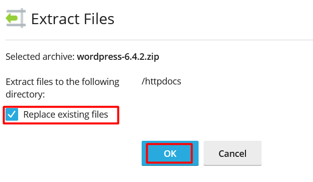

Truy cập vào thư mục vừa giải nén, tích chọn tất cả tệp và thư mục, sau đó nhấn **Move** để chuẩn bị di chuyển chúng.
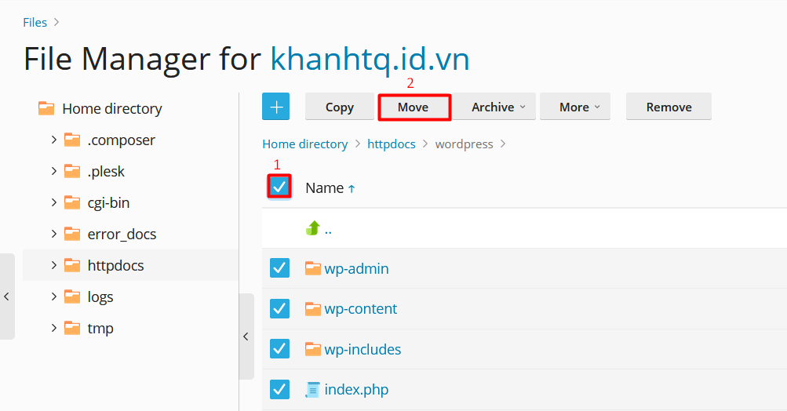

Chọn thư mục cần di chuyển đến, ở đây là `httpdocs`. Tích chọn ***Replace existing files*** để ghi đè các tệp trùng tên đang tồn tại (nếu muốn) và nhấn **OK**.
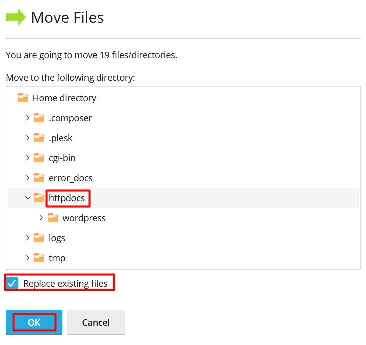

Sau khi quá trình di chuyển hoàn tất, có thể an toàn xoá tệp nén source code và thư mục rỗng (do đã chuyển hết tệp và thư mục ra ngoài).
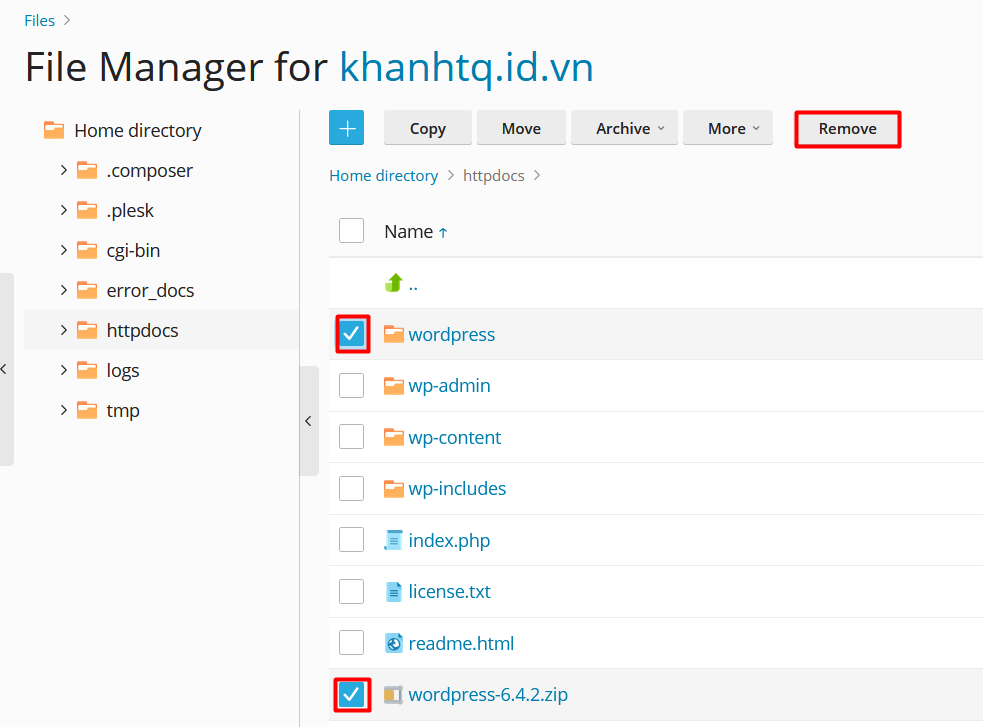

Như vậy là chúng ta đã hoàn thành bước upload source code.

## Import database
Thực hiện lần lượt các bước sau để import database:

1. Tạo database và user sử dụng database
2. Nhập dữ liệu database

### 1. Tạo database và user sử dụng database
Tìm trên giao diện Plesk, vào phần **Databases** và chọn **Add Database**.
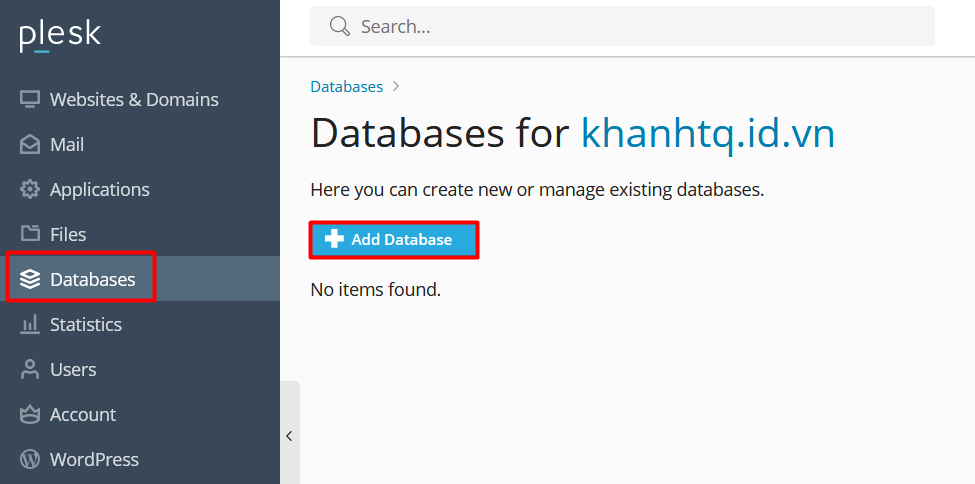

Nhập tên database. Chọn database server. Chọn website sử dụng database này. Tạo user, mật khẩu cho user và tích vào ***Allow remote connections...*** để cho phép kết nối từ xa đến database.
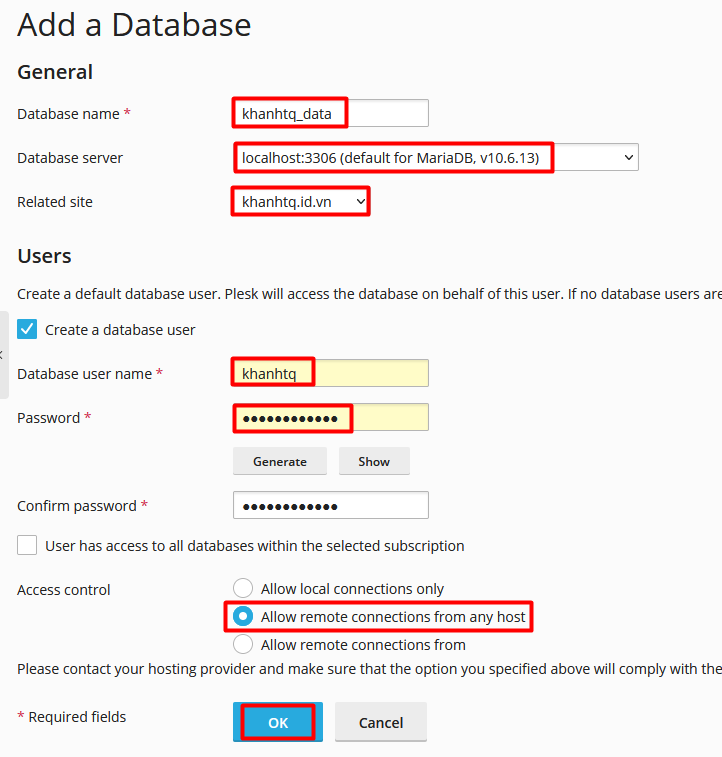

### 2. Nhập dữ liệu database
Sau khi tạo xong database, có 2 cách để nhập dữ liệu cho database:

1. Sử dụng chức năng **Import Dump**
2. Sử dụng **phpMyAdmin**

#### Cách 1: Sử dụng chức năng Import Dump
Chọn Import Dump để nhập dữ liệu cho database.
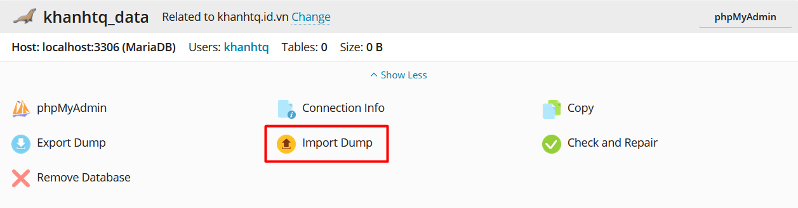

Chọn tệp dump database cần nhập. Tích vào ***Recreate the database*** để tạo lại database (nếu muốn). Sau đó bấm **OK**.
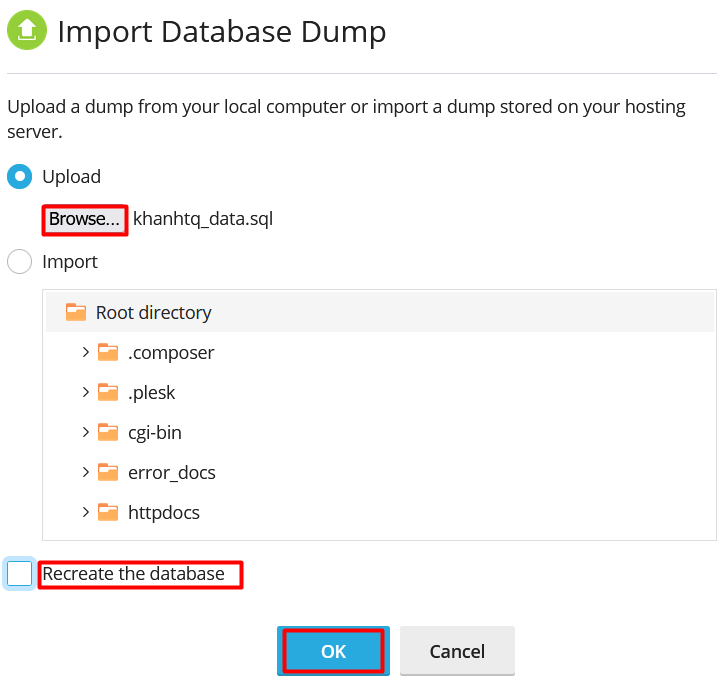

#### Cách 2: Sử dụng phpMyAdmin
Chọn phpMyAdmin trên giao diện Plesk.
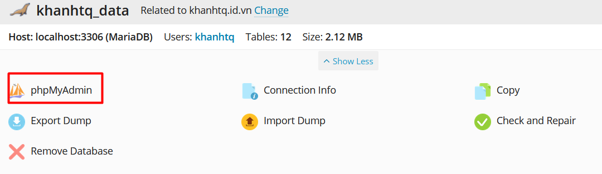

Plesk sẽ chuyển hướng đến giao diện của **phpMyAdmin** để nhập dữ liệu database.
Chọn đúng database cần nhập dữ liệu (database mà bạn đã tạo ở bước 1), sau đó chọn **Import**.
Trong giao diện **Import**, nhấp vào **Browse** để chọn tệp database.
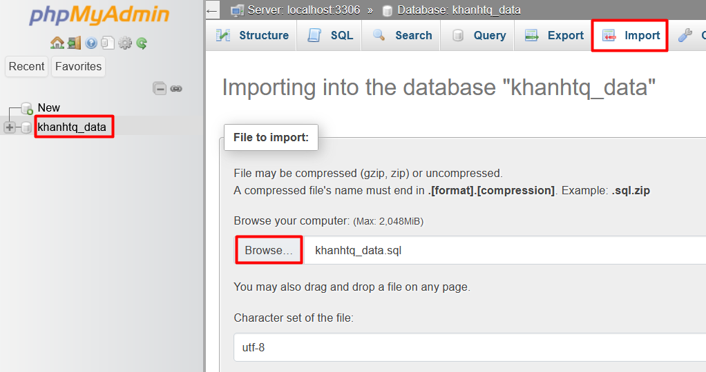

Sau đó, kéo xuống dưới và chọn **Import** để bắt đầu quá trình nhập dữ liệu cho database.
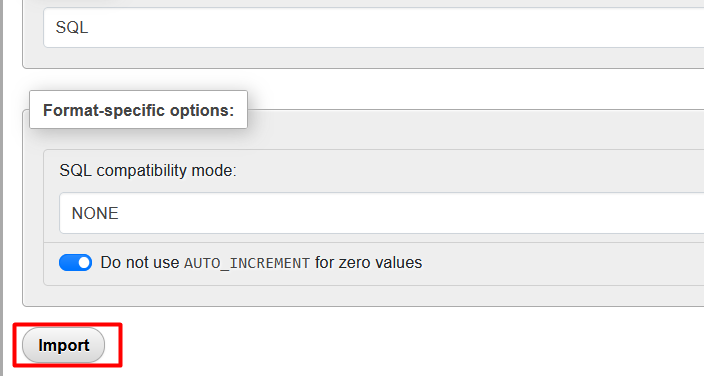

Nếu nhập dữ liệu thành công sẽ thấy các bảng trong database hiện trên màn hình khi chọn vào database đó.
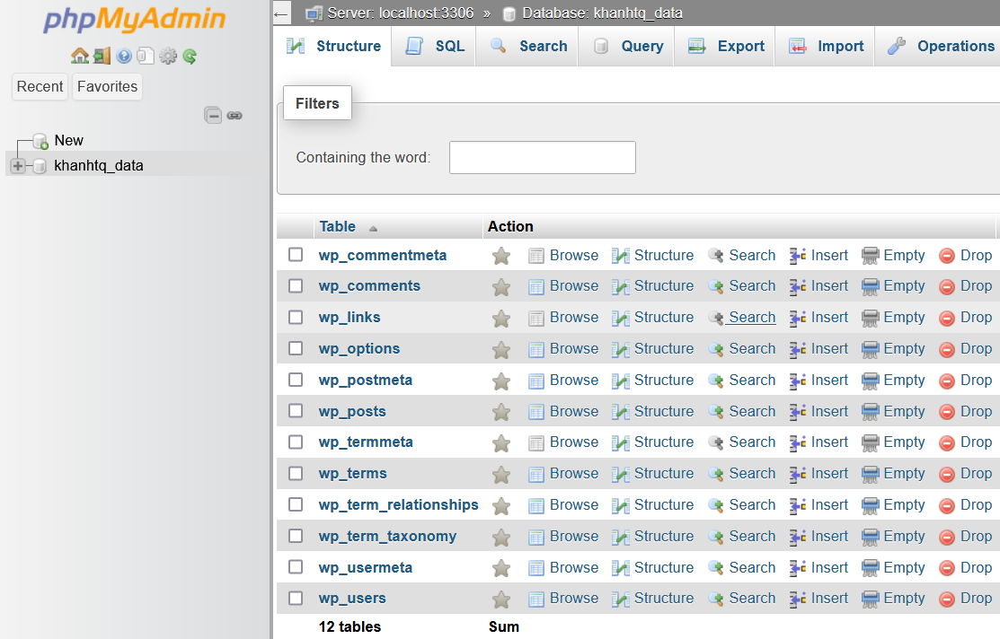

## Liên kết source code với database
Sau khi đã upload source code và import database, để website hoạt động đúng thì chúng ta phải kiểm tra kết nối giữa source code và database. Nếu không, khi truy cập website rất có thể hiển thị lỗi như *Error Establishing a Database Connection* hoặc các thông báo lỗi tương tự.

Đối với WordPress, sửa đổi các giá trị để kết nối database trong tệp `wp-config.php`.
Trong giao diện **Files** của Plesk, chọn biểu tượng 3 dấu gạch ngang bên phải của tệp `wp-config.php` và chọn **Edit in Code Editor** để vào giao diện chỉnh sửa.
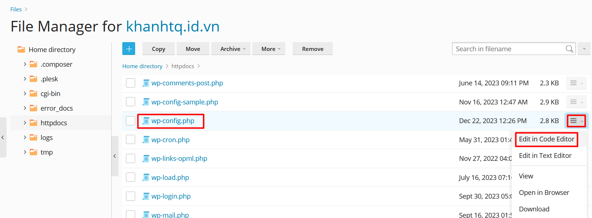

Lưu ý một số giá trị:
- `DB_NAME`: tên database
- `DB_USER`: tên user
- `DB_PASSWORD`: mật khẩu của user
Nhấn **Save** để lưu lại các thay đổi.
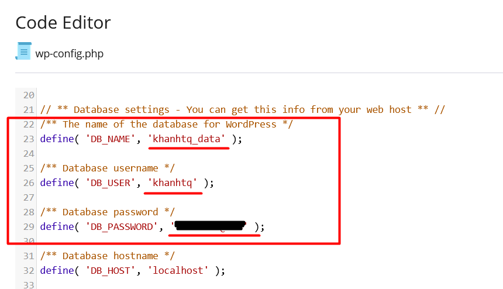

Sau khi hoàn thành tất cả các bước trên, truy cập website để kiểm tra.
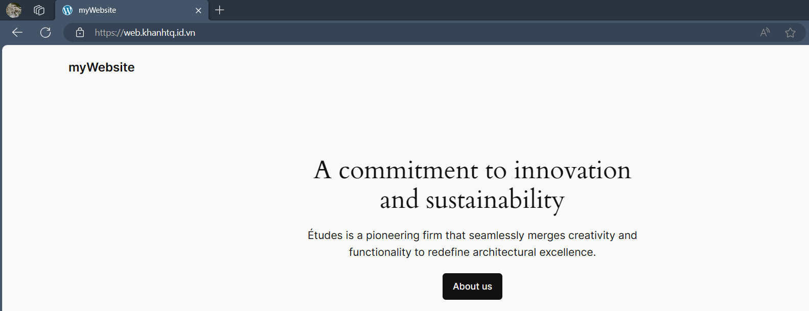

## Kết luận
Việc host một website không đòi hỏi quá nhiều thao tác, gồm 3 bước cơ bản:

1. Upload source code
2. Import database
3. Liên kết source code với database

Điểm đáng lưu ý là các giá trị trong tệp `wp-config.php` phải được cấu hình đúng để website có thể hoạt động.
Chúc các bạn thực hiện thành công 😊.
