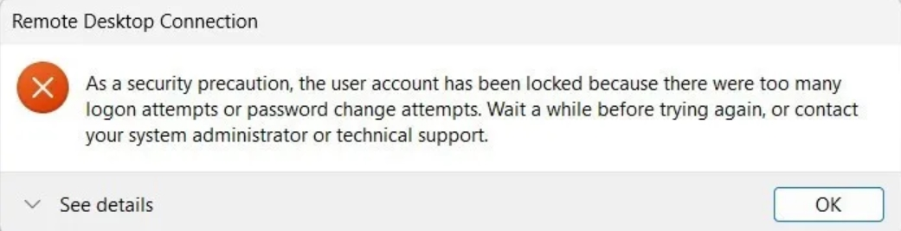
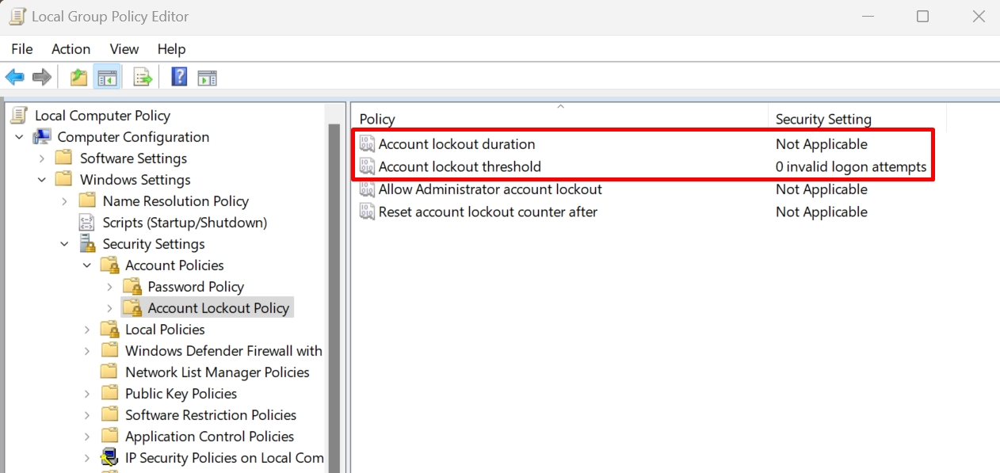
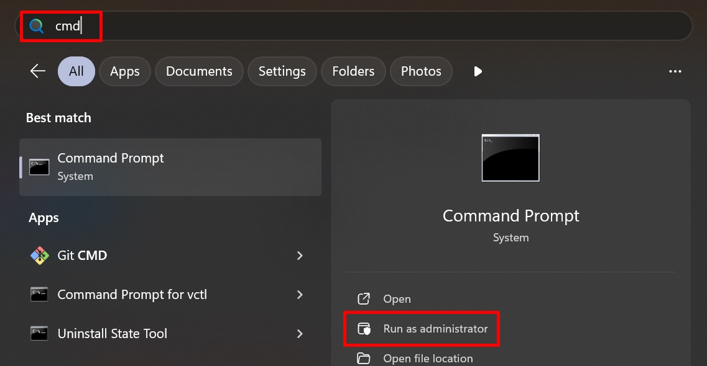

!!! info "Liên hệ"

    Nếu bạn cần hỗ trợ, xin vui lòng liên hệ hotline **1900 6046 nhánh 3**, hoặc gửi email đến [**support@vinahost.vn**](mailto:support@vinahost.vn), hoặc chat trực tiếp với chúng tôi tại [**đây**](https://livechat.vinahost.vn/chat.php).



Đây là chính sách bảo mật của Windows được thiết lập để bảo vệ tài khoản người dùng khỏi hành vi bẻ khoá mật khẩu bằng hình thức tấn công vét cạn. Nếu bạn gặp lỗi này, có thể do bạn đã nhập sai mật khẩu quá nhiều lần hoặc có ai đó đang cố gắng truy cập vào tài khoản của bạn.

!!! warning "Từ chối trách nhiệm"

    Thực hiện vô hiệu hoá chính sách bảo mật có thể khiến tài khoản Administrator bị lộ mật khẩu trong tương lai. Hãy đảm bảo bạn đã [đặt mật khẩu mạnh](https://kb.vinahost.vn/vps/huong-dan-thay-doi-password-vps/), khuyến nghị [thay đổi cổng RDP](https://kb.vinahost.vn/windows/thay-doi-cong-rdp/). Chúng tôi không chịu trách nhiệm nếu mật khẩu của bạn bị lộ dưới bất kỳ hình thức nào. VinaHost chỉ cung cấp hạ tầng dịch vụ, máy chủ đã được bàn giao cho khách hàng tự quản lý.

## Sửa lỗi Remote Desktop "the user account has been locked out"

### Bước 1. Sử dụng VNC

Nếu bạn đang sử dụng dịch vụ VPS tại VinaHost, bạn có thể sử dụng VNC để truy cập vào máy chủ của mình. VNC cho phép bạn điều khiển máy tính từ xa mà KHÔNG cần phải đăng nhập bằng Remote Desktop.

Tham khảo hướng dẫn sử dụng VNC tại [đây](https://kb.vinahost.vn/vps/huong-dan-su-dung-vnc/).

### Bước 2. Thay đổi chính sách bảo mật

Chỉ chọn 1 trong 2 cách sau:

=== "Thao tác bằng giao diện"

    1. Click chuột phải vào biểu tượng Windows :material-microsoft-windows:, chọn **Run**, nhập "gpedit.msc", nhấn Enter để mở **Local Security Policy Editor**.

    2. Tại phần điều hướng bên trái, chọn lần lượt **Local Computer Policy** > **Computer Configuration** > **Windows Settings** > **Security Settings** > **Account Policies > Account Lockout Policy**.

    3. Thay đổi các thiết lập sau:
        - **Account lockout duration (Thời gian khoá user)**: Đặt thành 0.
        - **Account lockout threshold (Số lần đăng nhập thất bại dẫn đến bị khoá)**: Đặt thành 0.

        

        !!! tip "Mẹo"
            Nếu Administrator là user duy nhất trong hệ thống, bạn chỉ cần đặt **Allow Administrator account lockout** thành *Disabled* mà không cần thay đổi các thiết lập bên trên.

    4. Mở Command Prompt với quyền quản trị viên (Run as Administrator).

        

    5. Nhập lệnh sau vào Command Prompt rồi nhấn Enter.

        ``` cmd
        gpupdate /force
        ```

=== "Thao tác bằng dòng lệnh"

    1. Mở Command Prompt với quyền quản trị viên (Run as Administrator).

        

    2. Chạy lần lượt các lệnh sau (nhấn Enter sau mỗi lệnh):

        ``` cmd
        net accounts /lockoutduration:0
        net accounts /lockoutthreshold:0
        gpupdate /force
        ```

### Bước 3. Thử thực hiện Remote Desktop lại

<hr>
VinaHost chúc bạn thực hiện thành công! 🍻

> **THAM KHẢO CÁC DỊCH VỤ TẠI [VINAHOST](https://vinahost.vn/)**
>
> **\>> [SERVER](https://vinahost.vn/thue-may-chu-rieng/) – [COLOCATION](https://vinahost.vn/colocation.html) – [CDN](https://vinahost.vn/dich-vu-cdn-chuyen-nghiep)**<br> > **\>> [CLOUD](https://vinahost.vn/cloud-server-gia-re/) – [VPS](https://vinahost.vn/vps-ssd-chuyen-nghiep/)**<br> > **\>> [HOSTING](https://vinahost.vn/wordpress-hosting)**<br> > **\>> [EMAIL](https://vinahost.vn/email-hosting)**<br> > **\>> [WEBSITE](http://vinawebsite.vn/)**<br> > **\>> [TÊN MIỀN](https://vinahost.vn/ten-mien-gia-re/)**
