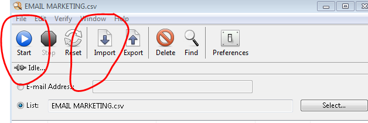
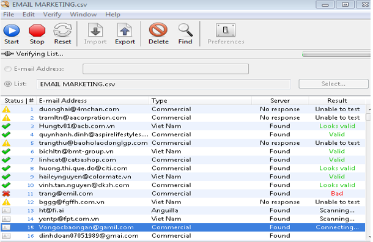
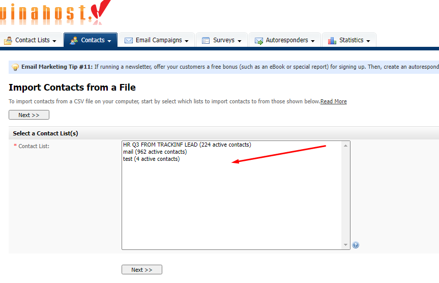
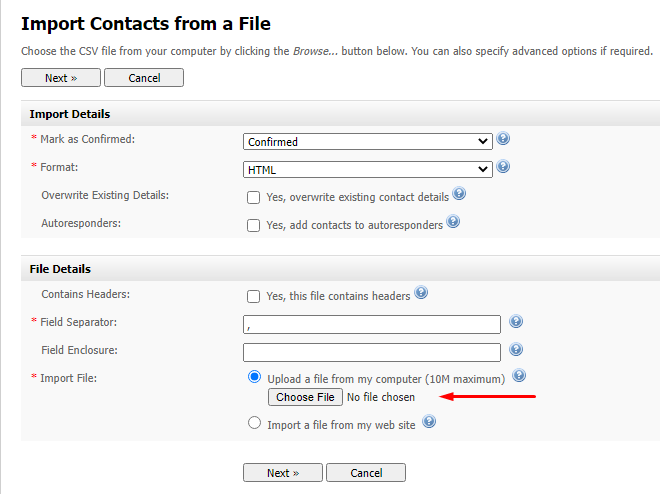
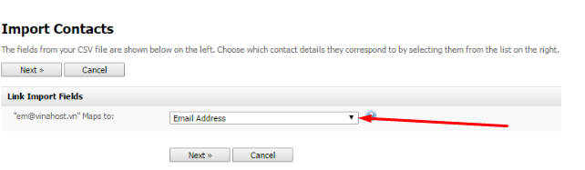
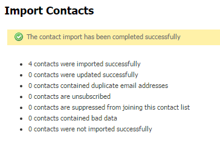

Bài viết này sẽ hướng dẫn bạn cách **Export Và Import Danh Sách Email Marketing VinaHost**. Nếu bạn cần hỗ trợ, xin vui lòng liên hệ VinaHost qua Hotline 1900 6046 ext.3, email về support@vinahost.vn hoặc chat với VinaHost qua livechat https://livechat.vinahost.vn/chat.php.

## **1\. Sử dụng Email Verifiter** **export danh sách mail**

Bước 1: cần có phần mềm Email Verifiter. Sau khi đã có phần mềm này cần thêm file chứa thông tin email.

Bước 2: Chọn Import để add file chứa dữa liệu email, sau đó click Start để bắt đầu lọc.

- Như hình là đã lọc thành công:

- Sau khi đã lọc xong, bạn click **Export** để xuất file, tiếp đó chọn **Custom**... chỉ tích vào **Email Address** và **Ok** để chọn nơi lưu file:

## **2\. I****mport vào email marketing****:**

- Truy cập vào **Contacts**  -> **Import Contacts  from a File**.
- Tại đây, chọn danh sách bạn muốn thêm và nhấn **next** (ví dụ ở đây chọn danh sách có tên “test”:

- Sau khi next, bạn click **chọn tệp** chọn file chứa dữ liệu email và **next**:

- ở trường **Map to** có mũi tên, click vào vào chọn **Emai Address**:

- Sau đó, click **Start Importing** để tiến hành.

- Ở đây, có thể thấy các liên hệ đã được nhập, và các thông tin khác.

Chúc quý khách thực hiện thành công!

> **THAM KHẢO CÁC DỊCH VỤ TẠI [VINAHOST](https://vinahost.vn/)**
> 
> **\>>** [**SERVER**](https://vinahost.vn/thue-may-chu-rieng/) **–** [**COLOCATION**](https://vinahost.vn/colocation.html) – [**CDN**](https://vinahost.vn/dich-vu-cdn-chuyen-nghiep)
> 
> **\>> [CLOUD](https://vinahost.vn/cloud-server-gia-re/) – [VPS](https://vinahost.vn/vps-ssd-chuyen-nghiep/)**
> 
> **\>> [HOSTING](https://vinahost.vn/wordpress-hosting)**
> 
> **\>> [EMAIL](https://vinahost.vn/email-hosting)**
> 
> **\>> [WEBSITE](http://vinawebsite.vn/)**
> 
> **\>> [TÊN MIỀN](https://vinahost.vn/ten-mien-gia-re/)**
