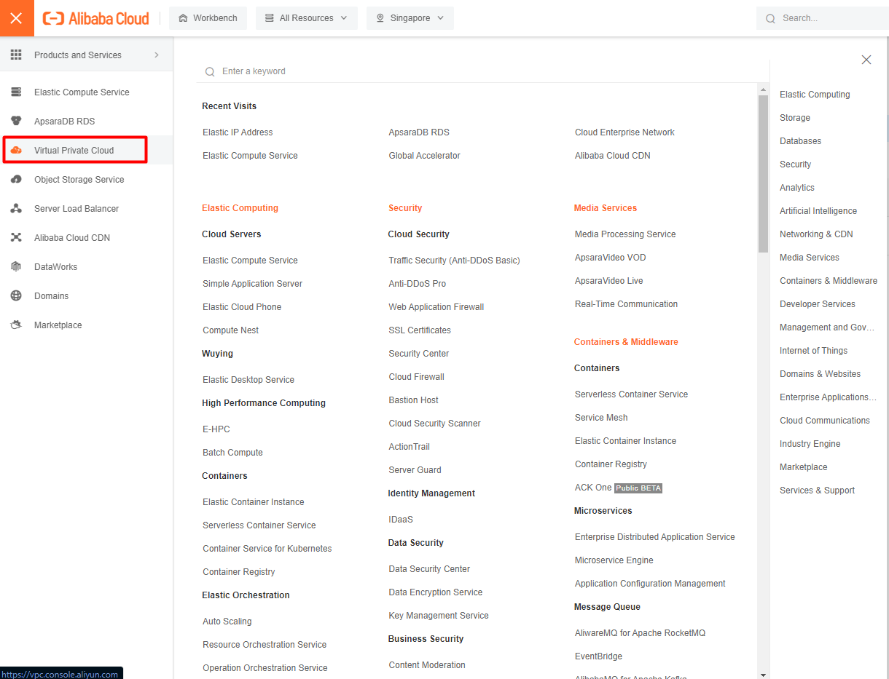
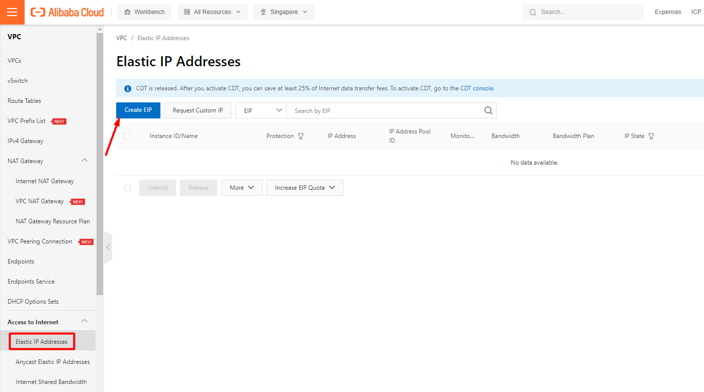
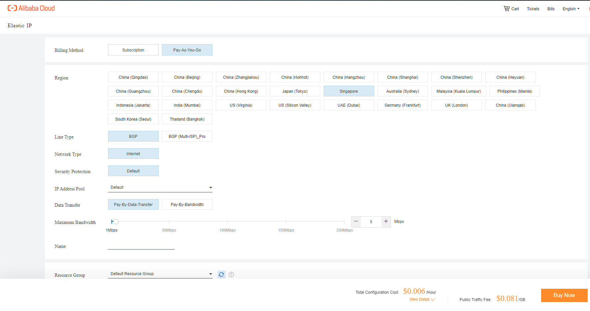
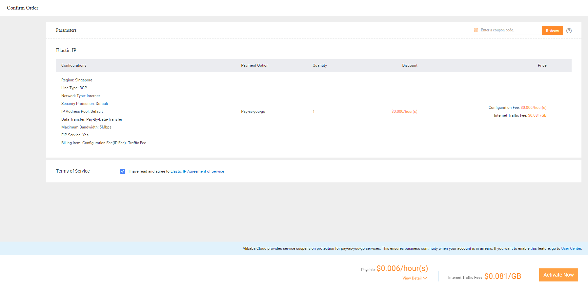
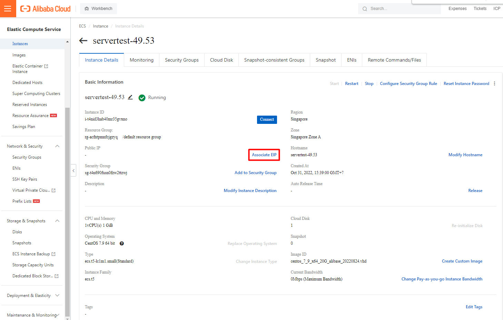
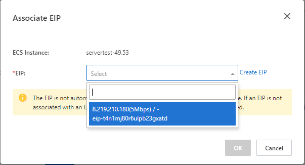
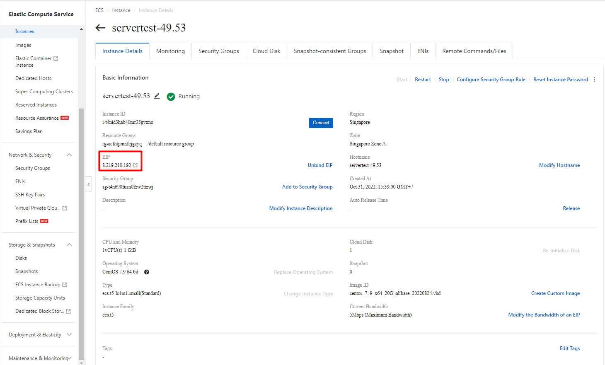

Bài viết này sẽ hướng dẫn bạn cách **Gán EIP Cho Instances Trên Alibaba Cloud**. Nếu bạn cần hỗ trợ, xin vui lòng liên hệ VinaHost qua **Hotline 1900 6046 ext.3, email về support@vinahost.vn hoặc chat với VinaHost qua livechat https://livechat.vinahost.vn/chat.php**.

## Hướng dẫn **Gán EIP Cho Instances**

Để khởi tạo dịch vụ EIP, bạn vào thanh tìm kiếm góc trên bên trái và chọn Virtual Private Cloud.

Chọn Alastic IP Addresses và Create EIP

**Phương thức thanh toán:**

\- Subcription: trả phí trước theo tháng

\- Pay-as-you-go: trả phí theo giờ sử dụng

Region. Lưu ý: Regison phải giống với ECS

**Data Transfer:**

\- Pay-by-Data-Transfer: trả phí theo dung lượng sử dụng

\- Pay-by-Bandwidth: trả phí theo BW

Buy No

Kiểm tra cấu hình và Activate Now

Sau khi Activate EIP hoàn tất. Vào Mục Instances > Associate EIP để gán EIP cho Instance

Chọn EIP vừa tạo

Gán EIP thành công

Chúc bạn thực hiện **Gán EIP Cho Instances Trên Alibaba Cloud** thành công!

> **THAM KHẢO CÁC DỊCH VỤ TẠI [VINAHOST](https://vinahost.vn/)**
> 
> **\>>** [**SERVER**](https://vinahost.vn/thue-may-chu-rieng/) **–** [**COLOCATION**](https://vinahost.vn/colocation.html) – [**CDN**](https://vinahost.vn/dich-vu-cdn-chuyen-nghiep)
> 
> **\>> [CLOUD](https://vinahost.vn/cloud-server-gia-re/) – [VPS](https://vinahost.vn/vps-ssd-chuyen-nghiep/)**
> 
> **\>> [HOSTING](https://vinahost.vn/wordpress-hosting)**
> 
> **\>> [EMAIL](https://vinahost.vn/email-hosting)**
> 
> **\>> [WEBSITE](http://vinawebsite.vn/)**
> 
> **\>> [TÊN MIỀN](https://vinahost.vn/ten-mien-gia-re/)**
