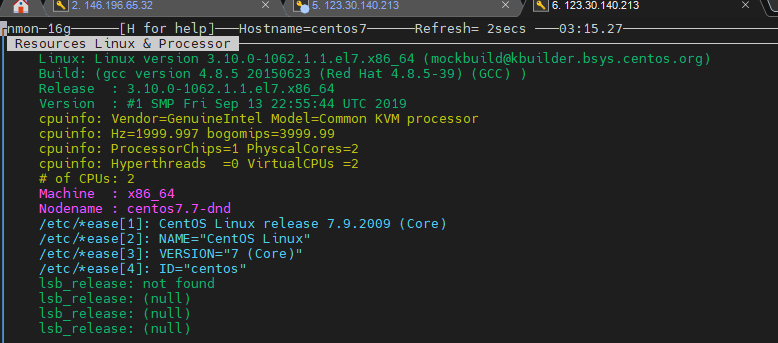

Bài viết này sẽ hướng dẫn bạn **Phân Tích Và Giám Sát Hiệu Suất Hệ Thống Linux Bằng Nmon**. Nếu bạn cần hỗ trợ, xin vui lòng liên hệ VinaHost qua **Hotline 1900 6046 ext.3**, email về [support@vinahost.vn](mailto:support@vinahost.vn) hoặc chat với VinaHost qua livechat [https://livechat.vinahost.vn/chat.php](https://livechat.vinahost.vn/chat.php).

## Phân Tích Và Giám Sát Hiệu Suất Hệ Thống Linux Bằng Nmon

Khi đã cài đặt nmon trên server của bạn, sử dụng lệnh nmon để theo dõi hiệu suất:

Ví dụ bạn muốn thu thập một số thống kê về CPU bạn nhấn phím c trên bàn phím.

Ở đây sẽ hiển thị hostname bạn cài đặt nmon, làm mới sau mỗi 2 giây, thông tin hiển thị % sử dụng, % chờ.

\*Nếu muốn giám sát nhiều server, bạn chỉ cần ssh vào server đó và cài đặt giám sát.

Sau đây là các khóa bạn có thể sử dụng với tiện ích để có được thông tin về các tài nguyên hệ thống khác có trong máy của bạn.

- m– Bộ nhớ
- j– Hệ thống tập tin
- d– Đĩa
- n– Mạng
- V– Bộ nhớ ảo
- r– Tài nguyên
- t– Các quy trình hàng đầu
- . – chỉ các đĩa / đĩa bận
- U– Sử dụng

Để có được số liệu thống kê về các quy trình hàng đầu đang chạy trên hệ thống Linux của bạn nhấn phím t.

Bạn cũng có thể sử dụng lệnh top để xem:

Nhấn n để thống kê mạng:

Như hình là đang thống kê tốc độ của card mạng eth0. Nhấn d để giám sát đồ thị I/O đĩa linux.

Như ở hình là đang thống kê tên đĩa, tất cả đều free. Để kiểm tra thông tin phiên bản hệ điều hành nhấn r:

Để xem dung lượng trong server như dung lượng đã dùng, đang trống, loại và điểm gắn tệp:

Chúc bạn thực hiện **Phân Tích Và Giám Sát Hiệu Suất Hệ Thống Linux Bằng Nmo** thành công!

> **THAM KHẢO CÁC DỊCH VỤ TẠI [VINAHOST](https://kb.vinahost.vn/)**
> 
> **\>>** [**SERVER**](https://vinahost.vn/thue-may-chu-rieng/) **–** [**COLOCATION**](https://vinahost.vn/colocation.html) – [**CDN**](https://vinahost.vn/dich-vu-cdn-chuyen-nghiep)
> 
> **\>> [CLOUD](https://vinahost.vn/cloud-server-gia-re/) – [VPS](https://vinahost.vn/vps-ssd-chuyen-nghiep/)**
> 
> **\>> [HOSTING](https://vinahost.vn/wordpress-hosting)**
> 
> **\>> [EMAIL](https://vinahost.vn/email-hosting)**
> 
> **\>> [WEBSITE](http://vinawebsite.vn/)**
> 
> **\>> [TÊN MIỀN](https://vinahost.vn/ten-mien-gia-re/)**
