Bài viết này sẽ **giới thiệu và hướng dẫn mở rộng LVM**. Nếu bạn cần hỗ trợ, xin vui lòng liên hệ [**VinaHost**](https://vinahost.vn/) qua Hotline 1900 6046 ext.3, email về support@vinahost.vn hoặc chat với VinaHost qua livechat https://livechat.vinahost.vn/chat.php.

## Giới thiệu

LVM (Logical Volume Management) là một công nghệ giúp quản lý các thiết bị lưu trữ dữ liệu trên các [hệ điều hành Linux](https://blog.vinahost.vn/?s=server&post_type=). Công nghệ này cho phép người dùng gom nhóm các ổ cứng vật lý lại và phân tách chúng thành những phân vùng nhỏ hơn, dễ dàng mở rộng các phân vùng này khi cần thiết.

Một số ưu điểm của LVM:

- Quản lý một lượng lớn ổ đĩa một cách dễ dàng.
- Điều chỉnh phân vùng ổ cứng một cách linh động.
- Backup hệ thống bằng cách snapshot các phân vùng ổ cứng (real-time).
- Migrate dữ liệu dễ dàng.

## Mô hình hoạt động

Một số khái niệm cần nắm rõ khi tiếp xúc với LVM:

- **Physical Volume – PV:** Ổ cứng vật lý từ hệ thống (đĩa cứng, partition, iSCSI LUN, SSD…) là đơn vị cơ bản để LVM dùng để khởi tạo các Volume Group. Trên mỗi một PV sẽ chứa khoảng 1 MB header ghi dữ liệu về cách phân bố của Volume Group chứa nó. Header này sẽ hỗ trợ rất nhiều trong việc phục hồi dữ liệu khi có sự cố xảy ra.
- **Volume Group – VG:** là tập hợp các ổ cứng vật lý (PV) thành một kho lưu trữ chung với tổng dung lượng của các ổ đĩa con. Mỗi khi ta thêm một PV vào VG, LVM sẽ tự động chia dung lượng trên PV thành nhiều Physical Extent với kích cỡ bằng nhau. Và từ VG, ta có thể tạo ra nhiều Logical Volume và dễ dàng chỉnh sửa dung lượng của chúng.

- **Logical Volume – LV:** là các phân vùng luận lý được tạo ra từ VG. Logical Volume tương tự như các partition trên ổ cứng bình thường nhưng linh hoạt hơn vì kích thước của LV có thể được dễ dàng thay đổi theo thời gian thực mà không lo làm gián đoạn hệ thống. Sở dĩ ta có thể dễ dàng thay đổi được kích thước của LV vì LV được chia thành nhiều Logical Extent, mỗi Logical Extent này sẽ được mapping tương ứng với 1 Physical Extent trên các ổ đĩa.

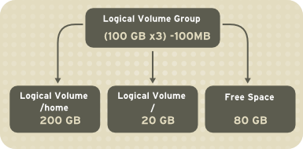

- **extent:** extent là đơn vị nhỏ nhất của VG. Mỗi một volume được tạo ra từ VG chứa nhiều extent nhỏ với kích thuớc cố định bằng nhau. Các extent trên LV không nhất thiết phải nằm liên tục với nhau trên ổ cứng vật lý bên dưới mà có thể nằm rải rác trên nhiều ổ cứng khác nhau. Extent chính là nền tảng cho công nghệ LVM, các LV có thể được mở rộng hay thu nhỏ lại bằng cách add thêm các extent hoặc lấy bớt các extent từ volume này.

Tóm lại, với công nghệ LVM ta có thể gộp nhiều ổ cứng vật lý Physical Volume lại thành Volume Group để tổng hợp toàn bộ tài nguyên lưu trữ cần thiết. Sau đó, người quản trị có thể chia nhỏ Volume Group ra thành các Logical Volume một cách tùy ý và linh hoạt. Mỗi một Logical Volume gồm nhiều extent, khi cần mở rộng Logical Volume thì ta thêm vào một số extent, khi cần thu nhỏ thì ta lấy lại một số extent.

**Ví dụ**: Theo hình ví dụ dưới đây, ta có một VG được tạo ra từ 3 PV. Trên đó, ta tạo ra 3 LV và có một LV trong số đó chạy trên 2 PV khác nhau.

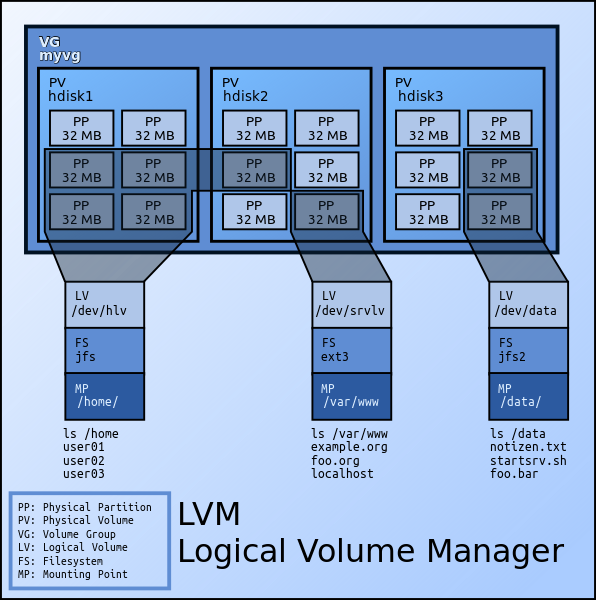

Một số tính năng cơ bản của LVM:

- Di chuyển LV giữa các PV khác nhau.
- Thay đổi kích thước của VG online bằng cách gắn thêm hoặc tháo bớt PV.
- Thay đổi kích thước của LV bằng cách thay đổi số lượng extent của PV này.
- Tạo snapshot của các LV (giữ nguyên toàn bộ trạng thái của LV vào thời điểm đó).

## LVM Thin provisioning

Thin Provisioning là tính năng cấp phát ổ cứng dựa trên sự linh hoạt của LVM. Giả sử ta có một **Volume Group**, ta sẽ tạo ra **1 Thin Pool** từ **VG** này với dung lượng là 20GB cho nhiều khách hàng sử dụng. Giả sử ta có 3 khách hàng, mỗi khách hàng được cấp 6GB lưu trữ. Như vậy ta có 3 x 6GB là 18GB. Với kỹ thuật cấp phát truyền thống thì ta chỉ có thể cấp phát thêm 2GB cho khách hàng thứ 4.

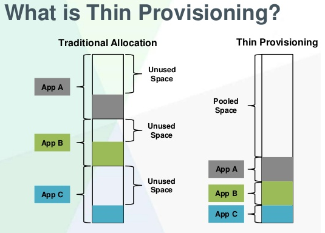

_So sánh giữa cách cấp phát truyển thống so với_ **Thin Provisioning**

Nhưng với kỹ thuật Thin Provisioning, ta vẫn có thể cấp thêm 6GB nữa cho khách hàng thứ 4. Tức là 4 x 6GB = 24GB > 20GB lúc đầu. Sở dĩ ta có thể làm được như vậy là do mỗi user tuy được cấp 6GB nhưng thường thì họ sẽ không xài hết số dung lượng này (nếu 4 khách hàng đều xài hết thì ta sẽ gặp tình trạng Over Provisioning). Ta sẽ giả dụ là họ không xài hết dung lượng được cấp thì trên danh nghĩa mỗi người sẽ được 6GB, nhưng thực tế thì họ xài đến đâu, hệ thống sẽ cấp thêm dung lượng đến đó.

Đối với cơ chế cấp phát bình thường thì LVM sẽ cấp phát 1 dãy block liên tục mỗi khi người dùng tạo ra 1 volume mới. Nhưng với cơ chế thin pool thì LVM chỉ sẽ cấp phát các block ổ cứng (là một tập hợp các con trỏ, trỏ tới ổ cứng) khi có dữ liệu thật sự ghi xuống đó. Cách tiếp cận này giúp tiết kiệm dung lượng cho hệ thống, tận dụng tối ưu dung lượng lưu trữ. Tuy nhiên, khuyết điểm là có thể gây phân mảnh hệ thống và gây ra tình trạng Over Provisioning như đã nói ở trên.

## Hướng dẫn mở rộng LVM

Như đã đề cập ở trên, thực chất việc mở rộng logical volume là thêm extent vào nó. Và để thêm extent, trong môi trường ảo hóa, ta có hai cách đó là mở rộng (resize) ổ cứng hoặc thêm một ổ cứng mới vào. Đối với [**server vật lý**](https://vinahost.vn/server.php) thì chỉ có cách là thêm ổ cứng mới.

Dưới đây tớ sẽ hướng dẫn các cậu thực hiện trường hợp thêm một ổ cứng mới nhé <3

VM được sử dụng trong hướng dẫn là một VPS cloud tại Vinahost, vì các hệ điều hành Linux của dịch vụ này sử dụng lvm.

Giả dụ ban đầu ta có một VPS có dung lượng 40G được cấu hình lvm và mount tại /dev/mapper/centos-root.

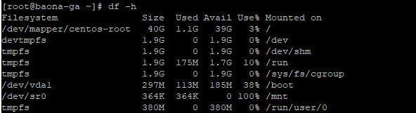

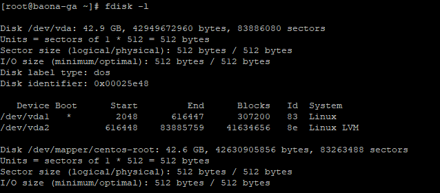

Sau một thời gian sử dụng thì VPS này hết dung lượng và cần nâng cấp. Sau khi người quản trị hệ thống thực hiện múa lửa (gắn thêm 01 ổ cứng mới với kích thước 20G vào VPS), ae thực hiện login vào VPS để kiểm tra thì thấy VPS đã nhận thêm 01 ổ mới là **/dev/vdb**

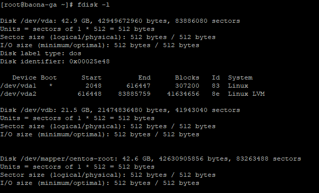

Tiếp theo, ta check các thành phần cấu thành của lvm như physical volume (PV), volume group (VG), logical volume (LV) như sau:

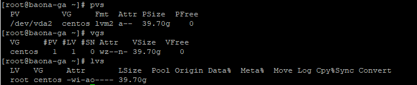

Theo như kết quả trên, ta có:

**PV:** /dev/vda2

**VG:** centos

**LV:** root

Sau khi đã nắm được các thông tin trên, ta tiến hành lần lượt các công đoạn:

\_ Tạo PV từ /dev/vdb

\_ Mở rộng VG từ PV mới tạo

\_ Mở rộng LV từ VG mới tạo

Đầu tiên, ta tạo partition trên ổ cứng /dev/vdb mới gắn thêm:

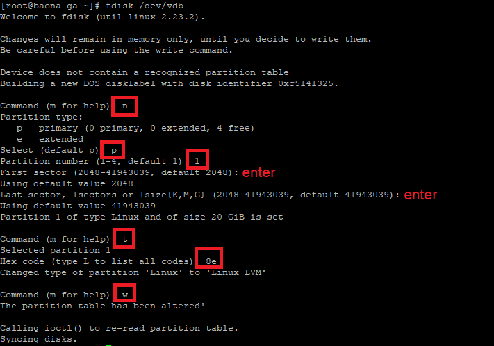

Sau khi hoàn tất bước trên, ta sẽ có partition /dev/vdb1 như bên dưới:

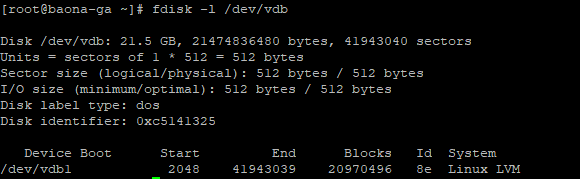

Tiếp theo, ta tạo PV từ partition vừa tạo:

<table><tbody><tr><td><em># pvcreate /dev/vdb1</em></td></tr></tbody></table>

Kiểm tra:

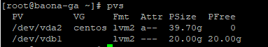

Tiếp theo, ta mở rộng VG **centos**:

<table><tbody><tr><td># <em>vgextend centos /dev/vdb1</em></td></tr></tbody></table>

Kiểm tra:

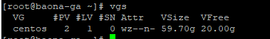

Tiếp theo, ta kiểm tra số **extent** khả dụng để thêm vào LV **root**:

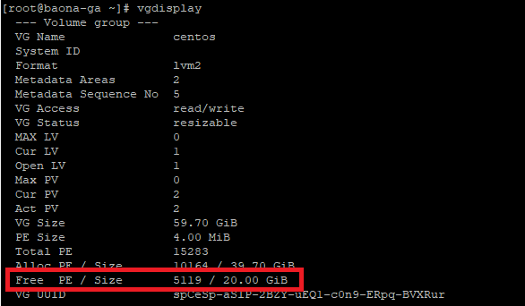

Như kết quả ở trên thì số **extent** khả dụng là 5119. Ta tiến hành thêm số **extent** này vào LV như sau:

<table><tbody><tr><td><em># lvextend -l +5119 /dev/centos/root</em></td></tr></tbody></table>

Kết quả và kiểm tra:

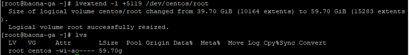

Cuối cùng, ta tiến hành tăng filesystem lên giá trị mới:

- Đối với filesystem **ext4**:

<table><tbody><tr><td><em># resize2fs /dev/centos/root</em></td></tr></tbody></table>

- Đối với filesystem **xfs**:

<table><tbody><tr><td><em># xfs_growfs /dev/centos/root</em></td></tr></tbody></table>

Kiểm tra:

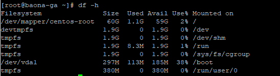

Vậy là chúng ta đã hoàn tất bài **giới thiệu và hướng dẫn mở rộng LVM**. Nếu bạn cần hỗ trợ, xin vui lòng liên hệ VinaHost qua Hotline 1900 6046 ext.3, email về support@vinahost.vn hoặc chat với VinaHost qua livechat https://livechat.vinahost.vn/chat.php.

Chúc bạn thành công!

> **THAM KHẢO CÁC DỊCH VỤ TẠI [VINAHOST](https://blog.vinahost.vn/)**
> 
> **\>>** [**SERVER**](https://vinahost.vn/thue-may-chu-rieng/) **–** [**COLOCATION**](https://vinahost.vn/colocation.html) – [**CDN**](https://vinahost.vn/dich-vu-cdn-chuyen-nghiep)
> 
> **\>> [CLOUD](https://vinahost.vn/cloud-server-gia-re/) – [VPS](https://vinahost.vn/vps-ssd-chuyen-nghiep/)**
> 
> **\>> [HOSTING](https://vinahost.vn/wordpress-hosting)**
> 
> **\>> [EMAIL](https://vinahost.vn/email-hosting)**
> 
> **\>> [WEBSITE](http://vinawebsite.vn/)**
> 
> **\>> [TÊN MIỀN](https://vinahost.vn/ten-mien-gia-re/)**
> 
> **\>> [SSL](https://vinahost.vn/geotrust-ssl) – [LICENSE](https://vinahost.vn/bang-gia-license)**
