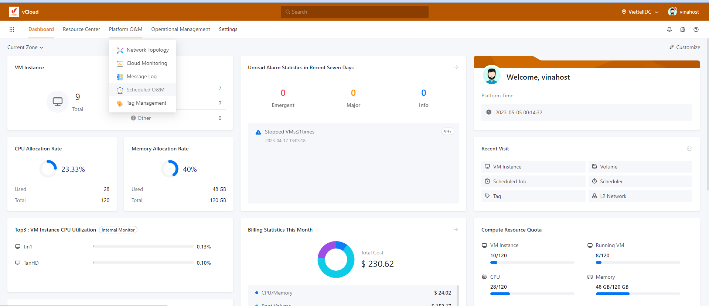

Bài viết này sẽ **Giới Thiệu Về Schedule Và OM Trên Vcloud Của VinaHost.** Nếu bạn cần hỗ trợ, xin vui lòng liên hệ VinaHost qua **Hotline 1900 6046 ext. 3**, email về [support@vinahost.vn](mailto:support@vinahost.vn) hoặc chat với VinaHost qua livechat [https://livechat.vinahost.vn/chat.php](https://livechat.vinahost.vn/chat.php).

Vcloud cung cấp hai loại tài nguyên của scheduled O&M: scheduled job và scheduler. Hai loại tài nguyên này độc lập với nhau. Bạn có thể tạo scheduled jobs và scheduler dựa trên các quy tắc khác nhau và liên kết hoặc tách rời các scheduled job với hoặc khỏi scheduler.

\-  Chức năng scheduled job cho phép người dùng lập lịch cho các tác vụ nhất định, để thực hiện một số hành động cụ thể vào một thời điểm nhất định, ví dụ như tạo snapshot cho VM, reboot VM, và nhiều hành động khác. Người dùng có thể tạo các lịch trình khác nhau dựa trên các quy tắc khác nhau, và kết hợp các scheduler với nhau để tối ưu hóa quá trình làm việc của hệ thống.

\- Scheduler là một tính năng của hệ thống Vcloud, được sử dụng để lập lịch và tự động hóa các tác vụ nhất định trong scheduled job. Scheduler định nghĩa các quy tắc cho các tác vụ được lập lịch, giúp chúng được thực hiện đúng thời gian và theo các yêu cầu cụ thể.

Các khái niệm về scheduled job và scheduler.

- **Scheduled job xác định rằng một hành động cụ thể được thực hiện tại một thời điểm xác định dựa trên scheduler.**
    - Bạn có thể liên kết bất kỳ scheduled job có sẵn nào với một scheduler.
    - Bạn có thể chọn các các thao tác Disable, Enable, Attach, và Detach cho một scheduled job dựa trên nhu cầu sử dụng của bạn.
    - Nếu bạn xóa một scheduler, các scheduled job được liên kết với scheduler đó sẽ bị tách rời. Bạn có thể liên kết các scheduled job với các scheduler khác.
    - Tất cả các hoạt động được kích hoạt bởi các scheduled job đều được tính năng audit lưu lại.
- **Một scheduler được sử dụng để sắp xếp scheduled job. Nó phù hợp với một kế hoạch kinh doanh đã hoạt động lâu dài.**
    - Một scheduler xác định các quy tắc thực hiện cho một scheduled job.
    - Một scheduler có thể được sử dụng cho các nhu cầu hoạt động lâu, chẳng hạn như tạo snapshots ở một khoảng thời gian xác định cho một phiên bản VM hoặc reboot VM ở một khoản thời gian nhất định
    - Nếu bạn xóa một scheduler, các scheduled job được liên kết với scheduler đó sẽ bị tách rời. Bạn có thể liên kết các scheduled job với các scheduler khác.
    - Tất cả các hoạt động được kích hoạt bởi scheduler đều được tính năng audit lưu lại.

Ở các bài viết khác mình sẽ hướng dẫn rõ hơn cách tạo các scheduled job và scheduler và nguyên lí hoạt động trên Vcloud của Vinahost.

> **THAM KHẢO CÁC DỊCH VỤ TẠI [VINAHOST](https://vinahost.vn/)**
> 
> **\>>** [**SERVER**](https://vinahost.vn/thue-may-chu-rieng/) **–** [**COLOCATION**](https://vinahost.vn/colocation.html) – [**CDN**](https://vinahost.vn/dich-vu-cdn-chuyen-nghiep)
> 
> **\>> [CLOUD](https://vinahost.vn/cloud-server-gia-re/) – [VPS](https://vinahost.vn/vps-ssd-chuyen-nghiep/)**
> 
> **\>> [HOSTING](https://vinahost.vn/wordpress-hosting)**
> 
> **\>> [EMAIL](https://vinahost.vn/email-hosting)**
> 
> **\>> [WEBSITE](http://vinawebsite.vn/)**
> 
> **\>> [TÊN MIỀN](https://vinahost.vn/ten-mien-gia-re/)**
