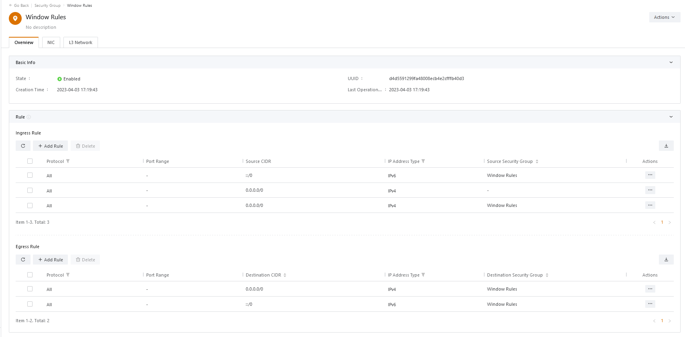
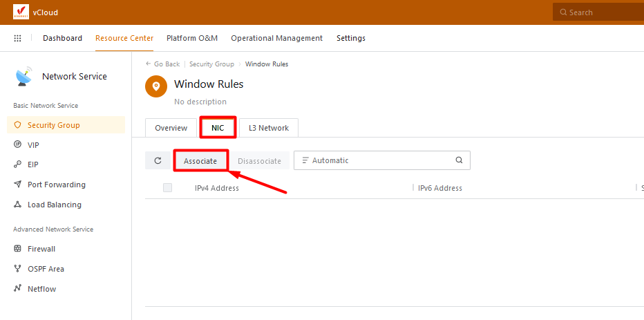
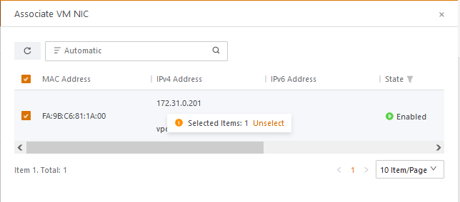
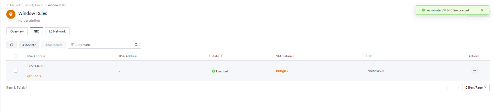
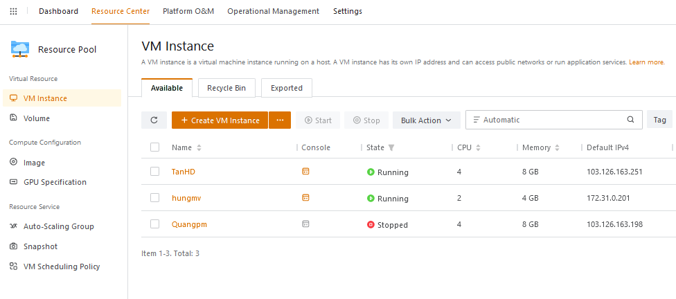
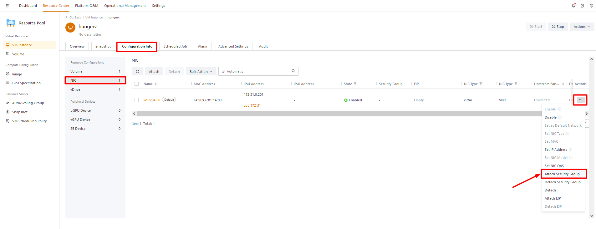
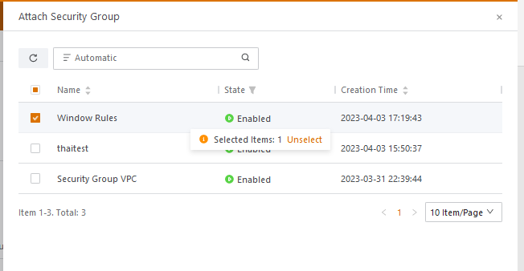
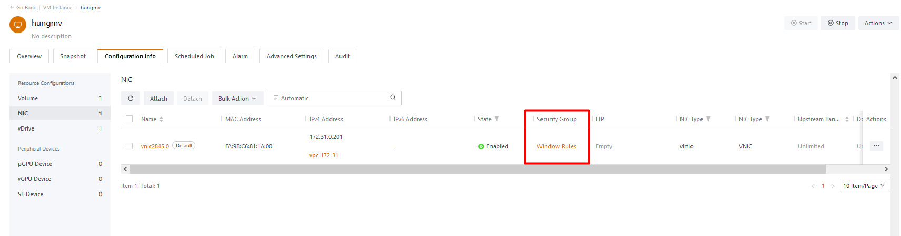

Bài viết này sẽ hướng dẫn bạn cách **Add Instance tới Security Group.** Nếu bạn cần hỗ trợ, xin vui lòng liên hệ VinaHost qua **Hotline 1900 6046 ext. 3**, email về [support@vinahost.vn](mailto:support@vinahost.vn) hoặc chat với VinaHost qua livechat [https://livechat.vinahost.vn/chat.php](https://livechat.vinahost.vn/chat.php).

Để Add & Remove Rules trên Security Group. Có 2 Cách.

## Cách 1 - Add Instance tới Security Group

- Truy cập Resource Center > Network Service > Security Group > Rules
- Các Rule đang có

- Chuyển qua Tab NIC > Chọn Associate (tương tự chọn Disassociate để gỡ NIC)

- Chọn NIC của VM cần gán Security Group > OK

## Cách 2

- Truy cập Resource Center > ResourcePool > VM Instance

- Chọn VM cần gán Security Group > Vào tab Configuration Info > NIC > Attach Security Group (tương tự, chọn Detach để gỡ SG)

- Chọn SG cần gán > OK

- Hoàn tất

Chúc bạn thực hiện thành công!

> **THAM KHẢO CÁC DỊCH VỤ TẠI [VINAHOST](https://vinahost.vn/)**
> 
> **\>>** [**SERVER**](https://vinahost.vn/thue-may-chu-rieng/) **–** [**COLOCATION**](https://vinahost.vn/colocation.html) – [**CDN**](https://vinahost.vn/dich-vu-cdn-chuyen-nghiep)
> 
> **\>> [CLOUD](https://vinahost.vn/cloud-server-gia-re/) – [VPS](https://vinahost.vn/vps-ssd-chuyen-nghiep/)**
> 
> **\>> [HOSTING](https://vinahost.vn/wordpress-hosting)**
> 
> **\>> [EMAIL](https://vinahost.vn/email-hosting)**
> 
> **\>> [WEBSITE](http://vinawebsite.vn/)**
> 
> **\>> [TÊN MIỀN](https://vinahost.vn/ten-mien-gia-re/)**
