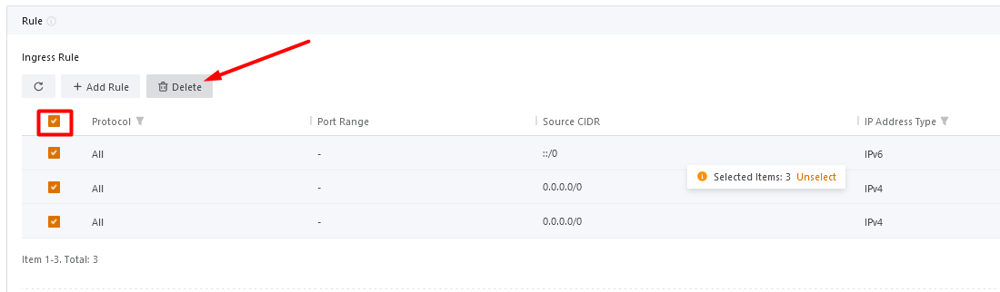
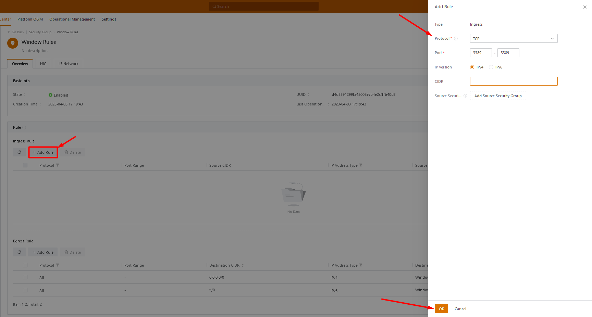
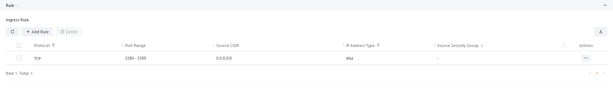

Bài viết này sẽ hướng dẫn bạn cách **Add Rules cho Security Group.** Nếu bạn cần hỗ trợ, xin vui lòng liên hệ VinaHost qua **Hotline 1900 6046 ext. 3**, email về [support@vinahost.vn](mailto:support@vinahost.vn) hoặc chat với VinaHost qua livechat [https://livechat.vinahost.vn/chat.php](https://livechat.vinahost.vn/chat.php).

Ở bài viết trước chúng ta đã tìm hiểu cách tạo và quản lý Security Group, giờ đây chúng ta sẽ tìm hiểu về cách Add & Remove Rules của Security Group.

Để Add & Remove Rules trên Security Group, bạn truy cập **Resource Center -> Network Service -> Security Group -> Rules**

## \[vCloud\] Hướng dẫn Add Rules cho Security Group

- Các Rule đang có

![[vCloud] Hướng dẫn Add Rules cho Security Group](images/huong-dan-add-rules-cho-security-group-1.png)

Ví dụ: Chỉ cho phép Port 3389 truy cập vào

- Chọn tất cả và Delete

- Thêm Rule Access Port 3389 ở Add Rule
- Cấu hình Protocol, Port và OK

- Add rules Access Port 3389 truy cập hoàn tất

Chúc bạn thực hiện thành công!

> **THAM KHẢO CÁC DỊCH VỤ TẠI [VINAHOST](https://kb.vinahost.vn/)**
> 
> **\>>** [**SERVER**](https://vinahost.vn/thue-may-chu-rieng/) **–** [**COLOCATION**](https://vinahost.vn/colocation.html) – [**CDN**](https://vinahost.vn/dich-vu-cdn-chuyen-nghiep)
> 
> **\>> [CLOUD](https://vinahost.vn/cloud-server-gia-re/) – [VPS](https://vinahost.vn/vps-ssd-chuyen-nghiep/)**
> 
> **\>> [HOSTING](https://vinahost.vn/wordpress-hosting)**
> 
> **\>> [EMAIL](https://vinahost.vn/email-hosting)**
> 
> **\>> [WEBSITE](http://vinawebsite.vn/)**
> 
> **\>> [TÊN MIỀN](https://vinahost.vn/ten-mien-gia-re/)**
