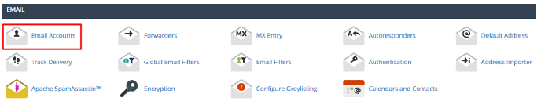
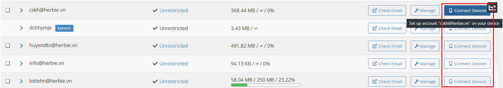
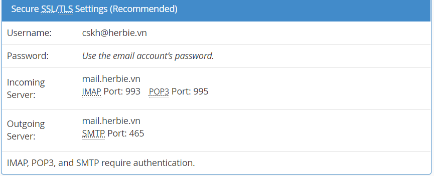
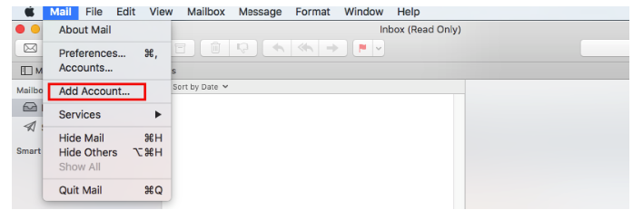
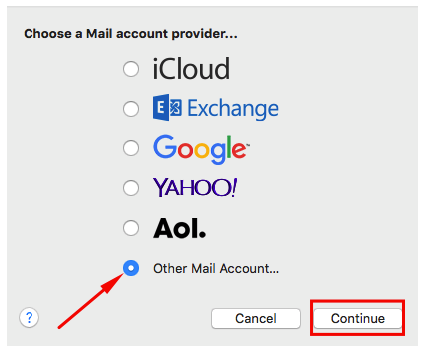
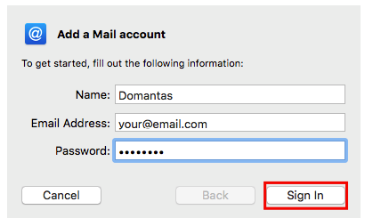
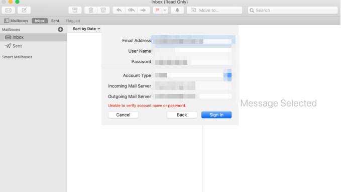

Bài viết này sẽ hướng dẫn bạn thực hiện **Cài đặt Email Trên Máy Mac**. Nếu bạn cần hỗ trợ, xin vui lòng liên hệ VinaHost qua **Hotline 1900 6046 ext.3**, email về [support@vinahost.vn](mailto:support@vinahost.vn) hoặc chat với VinaHost qua livechat [https://livechat.vinahost.vn/chat.php](https://livechat.vinahost.vn/chat.php).

## Sau đây VinaHost sẽ hướng đẫn các bạn Cài đặt Email Trên Máy Mac.

Đối với hosting nền **cPanel** bạn làm theo các bước sau để lấy thông tin:

Bước 1: Truy cập cPanel và nhấn icon **Email Accounts**

Bước 2: Nhấn nút **Connect Devices**bên cạnh tài khoản email bạn muốn cài đặt trên Mac Mail.

Bước 3: Một cửa sổ mới mở ra, bạn sẽ thấy thông tin tài khoản.

Bước 4: Ghi lại các thông số này, bạn sẽ cần nó ở bước sau. Nếu bạn muốn, bạn có thể gửi thông tin này tới email cá nhận bằng cách gõ địa chỉ email cá nhận trong mục **Email Instructions**.

Khi bạn đã lấy tất cả thông tin cần thiết thông tin trên tài khoản email, tiếp tục cài đặt tài khoản email đó lên Mac Mail:

Bước 1: Mở launcher bằng cách nhấn nút **F4**, tìm Mail và truy cập vào App Mail và nhấn vào **Mail**\-> **Add Account**.

Bước 2: Mở pop-up mail và nhấn **Other Mail Account…**và nhấn nút **Continue**.

Bước 3: Điền thông tin mail và nhấn nút **Sign In**:

Mac Mail sẽ thử cố gắng đăng nhập. Có khả năng nó sẽ thất bại và hiện lỗi **Unable to verify account name or password**. Việc này bình thường, khi Apple Mail không thể tìm thấy mail subdomain và sẽ hỏi bạn điền thông tin email và email hositng:

- **Email Address** – Tài khoản mail bạn muốn cài đặt trên Mac Mail
- **Username** – Username được sử dụng để đăng nhập lên mail server. Bạn có thể chừa trống, mail client sẽ thử nó tự động.
- **Password** – Mật khẩu được dùng để đăng nhập tài khoản email.
- **Account Type** – Bạn chọn giữa **IMAP** and **POP**. nên sử dụng **IMAP** vì bảo mật và hiệu năng tốt hơn.
- **Incoming Mail Server** – Ví dụ,   mail sẽ có trường incoming server **vinahost.vn**.
- **Outgoing Mail Server** – Giống với thông tin trên, nếu dùng mail Hostinger bạn sẽ nhập **vinahost.vn**.

Bước 4: Khi đã hoàn tất tất cả thông tin, nhấn vào nút Sign In.

Bước 5: Nếu bạn đã điền đúng thông tin, bạn sẽ có thể đăng nhập mail trên Mac Mail và mac Mail sẽ hỏi apps nào bạn muốn dùng cho mail account mới thêm thêm. Chọn app bạn thích và nhấn nút **Done**.

Chúc bạn thực hiện Cài đặt Email Trên Máy Mac thành công!

> **THAM KHẢO CÁC DỊCH VỤ TẠI [VINAHOST](https://kb.vinahost.vn/)**
> 
> **\>>** [**SERVER**](https://vinahost.vn/thue-may-chu-rieng/) **–** [**COLOCATION**](https://vinahost.vn/colocation.html) – [**CDN**](https://vinahost.vn/dich-vu-cdn-chuyen-nghiep)
> 
> **\>> [CLOUD](https://vinahost.vn/cloud-server-gia-re/) – [VPS](https://vinahost.vn/vps-ssd-chuyen-nghiep/)**
> 
> **\>> [HOSTING](https://vinahost.vn/wordpress-hosting)**
> 
> **\>> [EMAIL](https://vinahost.vn/email-hosting)**
> 
> **\>> [WEBSITE](http://vinawebsite.vn/)**
> 
> **\>> [TÊN MIỀN](https://vinahost.vn/ten-mien-gia-re/)**
