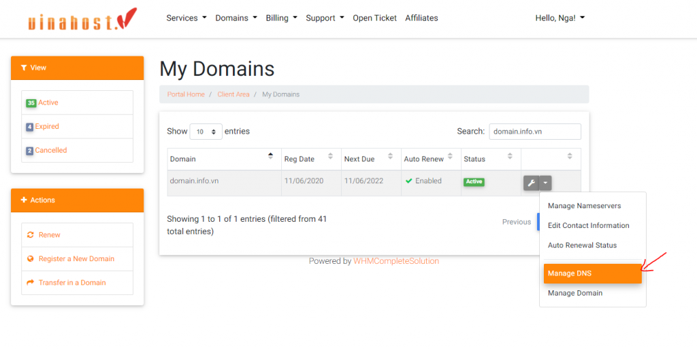
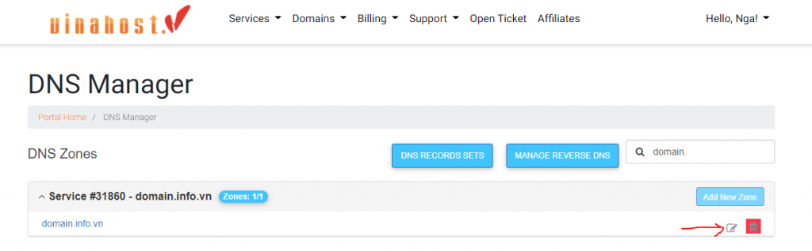
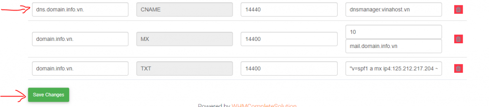
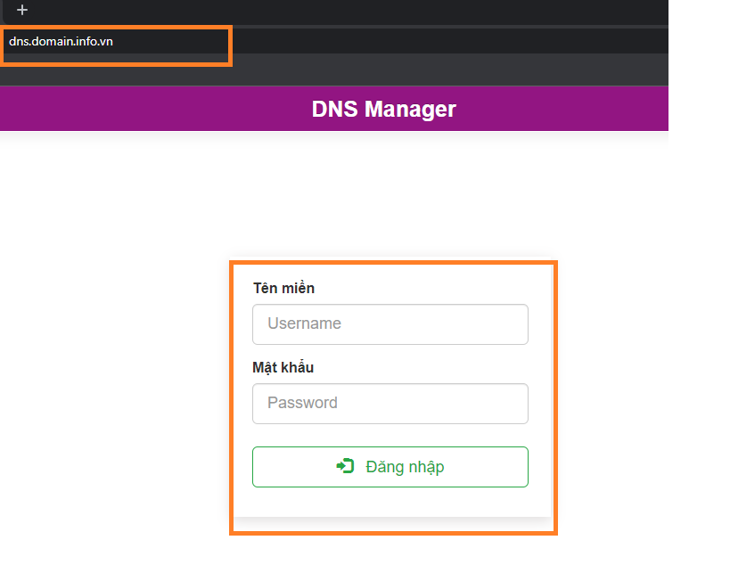
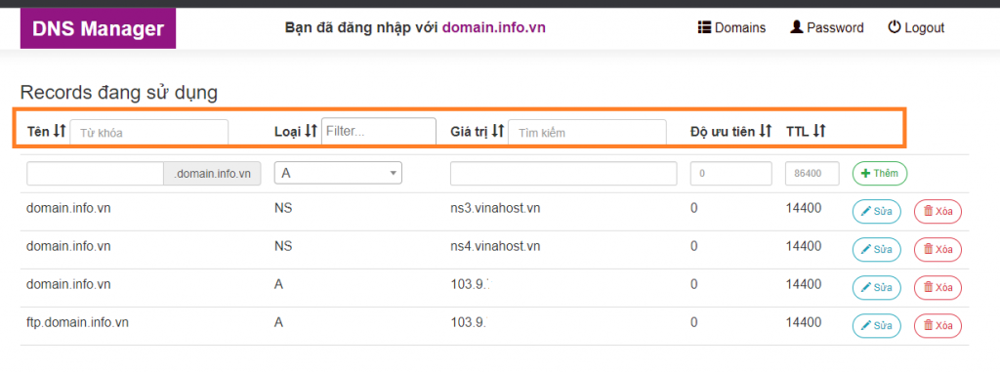

Bạn là đại lý phân phối tên miền của VinaHost, bạn có nhiều tên miền trong tài khoản của mình, mỗi tên miền thuộc quyền sở hữu của một khách hàng khác của bạn. Trong trường hợp này, bạn phải cung cấp từng khách hàng của mình thông tin đăng nhập khác nhau để họ có thể tự thay đổi DNS cho tên miền. VinaHost đã làm tạo ra hệ thống **DNS Manager** để giải quyết vấn đề này.

Bài viết này sẽ hướng dẫn bạn **quản lý tên miền bằng trang quản lý DNS Manager của VinaHost.**

Để có thể có được một trang quản lý tên miền riêng dành cho bạn, bạn phải đăng kí với VinaHost để thực hiện tạo tài khoản ứng với tên miền đó.

## Bước 1: Cấu hình trang DNS Manager

Để có thể truy cập trang **DNS manager** cho Đại Lý. Bạn cần trỏ Record **dns.tenmiendaily.com CNAME** về **dnsmanager.VinaHost.vn**

**_Ví dụ:_** Tên miền đại lý là **domain.info.vn** ta trỏ **Record dns.domain.info.vn CNAME** về **dnsmanager.VinaHost.vn**. Các bước trỏ như sau:

- Vào **DNS Manager** ở **Client Area**

- Chọn **Edit Zone**

- Thêm **record CNAME** cho **dns.domain.info.vn** về **dnsmanager.VinaHost.vn** như hình **\-> Save Change**

## Bước 2: Đăng nhập trang DNS Manager của bạn

Sau khi DNS cập nhật ở bước 1 xong, theo ví dụ trên bạn truy cập [http://dns.domain.info.vn/](http://dns.domain.info.vn/) sẽ thấy hiển thị như hình ảnh bên dưới.

Thông tin đã được cấp ở mục Đại Lý. Sau khi đăng nhập thông tin đúng, bạn sẽ truy cập được vào trang DNS Manager như hình.

Tại đây, bạn đã có thể **quản lý DNS** của tên miền của mình. Bạn có thể **thêm Record** mới tại ô màu cam, hoặc **thêm** **sửa, xóa** các record theo ý muốn.

**Chú ý, khi thêm bản ghi DNS cho tên miền**

- _Nếu bạn dùng dịch vụ Hosting Failover hoặc SecureWeb, vui lòng cấu hình DNS tại trang quản trị hosting để có hiệu lực._
- _Thiết lập bản ghi DNS sẽ có hiệu lực nhanh nhất trong vòng 3 giờ. Chậm nhất 24 giờ._
- _Nếu chọn Record Type là: A thì Value phải là địa chỉ IP, ví dụ: 1.1.1.1_
- _Nếu chọn Record Type là: CNAME thì Value phải là tên miền, ví dụ: example.vn_
- _Nếu chọn Record Type là: MX thì Value phải là tên mail server, ví dụ: mail_
- _Nếu chọn Record Type là: AAAA thì Value phải là IP V6_
- _Độ ưu tiên chỉ áp dụng cho Type là MX. Các Type khác hệ thống sẽ mặc định là 0_

Lưu ý: DNS Record sẽ được cập nhật thành công, khi tên miền của bạn đang sử dụng Nameserver của VinaHost là. ns3.VinaHost.vn và ns4.VinaHost.vn

Chúc bạn thực hiện thành công!

> **THAM KHẢO CÁC DỊCH VỤ TẠI [VINAHOST](https://vinahost.vn/)**
> 
> **\>>** [**SERVER**](https://vinahost.vn/thue-may-chu-rieng/) **–** [**COLOCATION**](https://vinahost.vn/colocation.html) – [**CDN**](https://vinahost.vn/dich-vu-cdn-chuyen-nghiep)
> 
> **\>> [CLOUD](https://vinahost.vn/cloud-server-gia-re/) – [VPS](https://vinahost.vn/vps-ssd-chuyen-nghiep/)**
> 
> **\>> [HOSTING](https://vinahost.vn/wordpress-hosting)**
> 
> **\>> [EMAIL](https://vinahost.vn/email-hosting)**
> 
> **\>> [WEBSITE](http://vinawebsite.vn/)**
> 
> **\>> [TÊN MIỀN](https://vinahost.vn/ten-mien-gia-re/)**