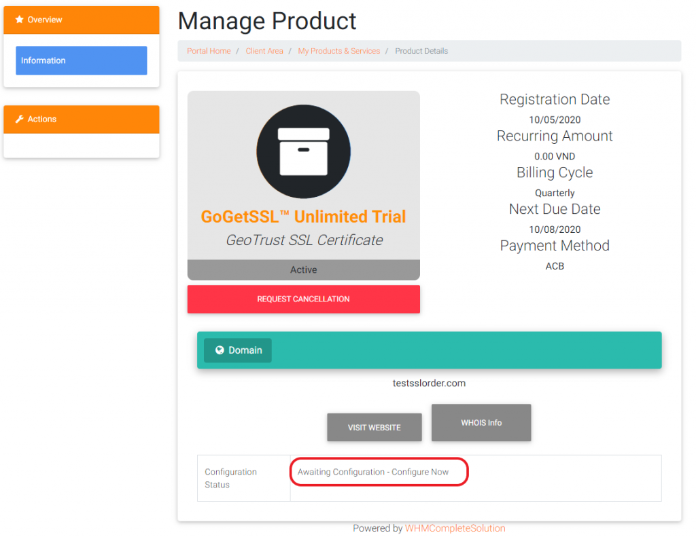
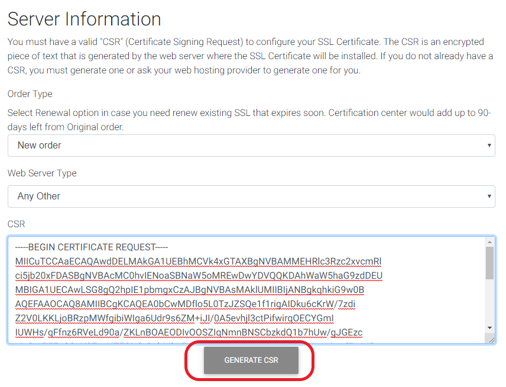
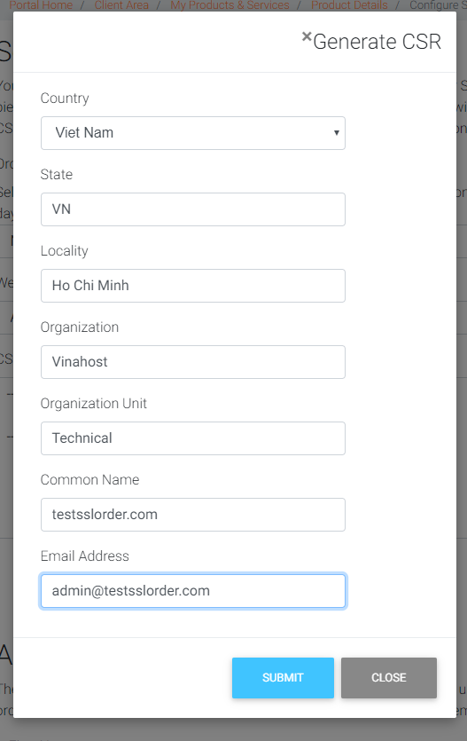
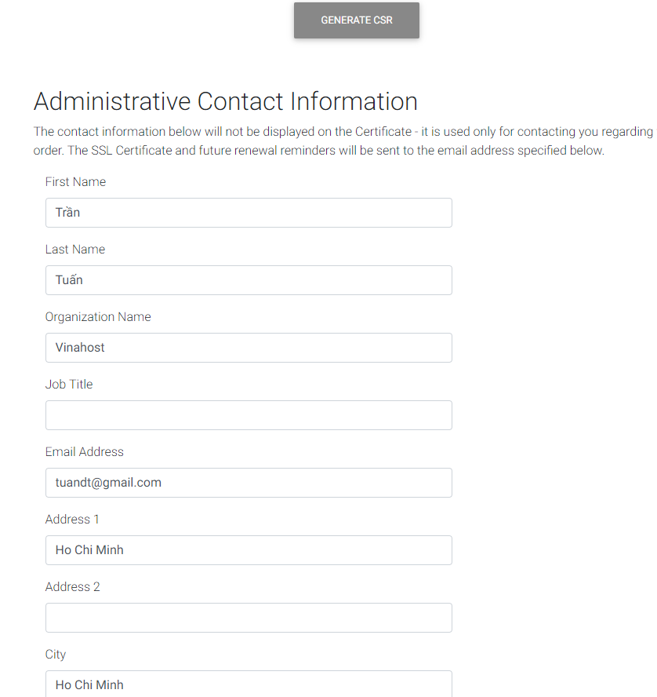
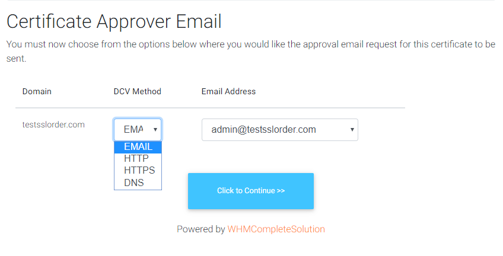
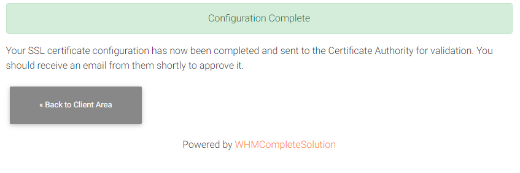
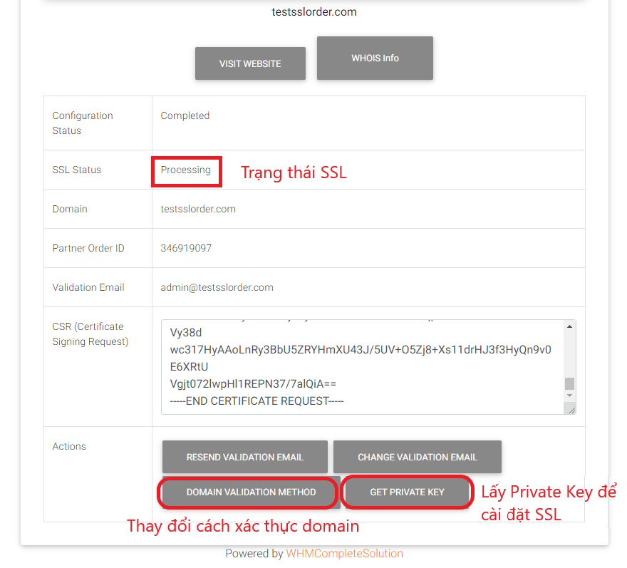

Bài viết này sẽ hướng dẫn bạn cách **Đăng Ký SSL Tại VinaHost**. Nếu bạn cần hỗ trợ, xin vui lòng liên hệ VinaHost qua **Hotline 1900 6046 ext.3, email về support@vinahost.vn hoặc chat với chúng tôi qua livechat https://livechat.vinahost.vn/chat.php**.

Để đăng ký SSL, trước tiên quý khách cần có:

- Tên miền đã được đăng ký
- Email tên miền riêng [admin@tenmien.com](mailto:admin@tenmien.com) có thể nhận mail được

Sau khi đăng ký và thanh toán thành công SSL, phía Client Area sẽ có giao diện để Quý khách cấu hình SSL như hình dưới:

**Bước 1:** Ấn vào **Configure Now** để cấu hình đăng ký SSL

**Bước 2:** Cấu hình:

Để đăng ký SSL chúng ta cần có **CSR. CSR** được VinaHost cung cấp giao diện tạo như hình dưới. Quý khách chọn các mục như hình và ấn vào **Generate CSR**

Giao diện **Genrete CSR** hiện ra. Quý khách điền thông tin SSL cần đăng ký vào.

Các thông tin điền tương tự như hình dưới. Lưu ý phần **Common Name** là tên miền của SSL cần đăng ký > Ấn **Submit**.

Sau khi xong bước tạo CSR, Quý khách kéo xuống phần **Administrative Contact Information**. Phần này là thông tin người quản lý dịch vụ. Quý khách điền các thông tin theo yêu cầu và nhấn **Continue**, ví dụ:

**Bước 3:** Chọn phương thức xác thực.

Ở đây, VinaHost hướng dẫn Quý khách phương thức xác thực qua Email. Email ở đây bắt buộc phải là **Email tên miền** của Quý khách:

Quý khách cần đảm bảo mail được chọn ở hình trên **có thể nhận mail**, vì khi đã chọn thì một mail xác thực tên miền sẽ gửi tới địa chỉ mail này. Quý khách tiếp tục **Click to Continue.**

**Bước 4:** Hoàn thành:

Sau khi chọn phương thức xác thực việc đăng ký SSL hoàn tất, Quý khách ấn **Back to Client Area** để theo dõi trạng thái SSL.

Trang trạng thái SSL như hình dưới:

Quý khách cần truy cập địa chỉ mail đã đăng ký, ví dụ ở trên là [admin@testsslorder.com](mailto:admin@testsslorder.com) để kiểm tra và nhận mail xác thực. Khi click vào link xác thực ở trong Email, quý khách sẽ thấy:

- Trạng thái **Processing** là chưa xác thực thành công tên miền
- Trạng thái **Active** là đã xác thực thành công và có thể tải về các chứng chỉ SSL để cài đặt lên Server.

Sau khi xác thực tên miền thành công, trạng thái SSL là **Active**. Quý khách có thể tải về **Private Key** của SSL để cài đặt lên Server bằng cách ấn nút **GET PRIVATE KEY** như hình trên.

Chúc quý khách thực hiện thành công!

> **THAM KHẢO CÁC DỊCH VỤ TẠI [VINAHOST](https://vinahost.vn/)**
> 
> **\>>** [**SERVER**](https://vinahost.vn/thue-may-chu-rieng/) **–** [**COLOCATION**](https://vinahost.vn/colocation.html) – [**CDN**](https://vinahost.vn/dich-vu-cdn-chuyen-nghiep)
> 
> **\>> [CLOUD](https://vinahost.vn/cloud-server-gia-re/) – [VPS](https://vinahost.vn/vps-ssd-chuyen-nghiep/)**
> 
> **\>> [HOSTING](https://vinahost.vn/wordpress-hosting)**
> 
> **\>> [EMAIL](https://vinahost.vn/email-hosting)**
> 
> **\>> [WEBSITE](http://vinawebsite.vn/)**
> 
> **\>> [TÊN MIỀN](https://vinahost.vn/ten-mien-gia-re/)**