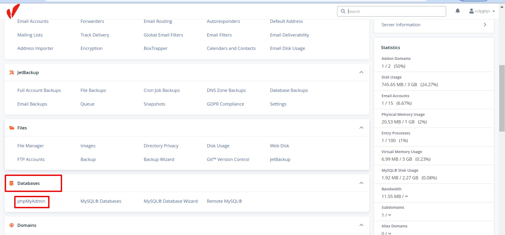
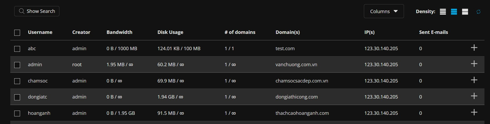
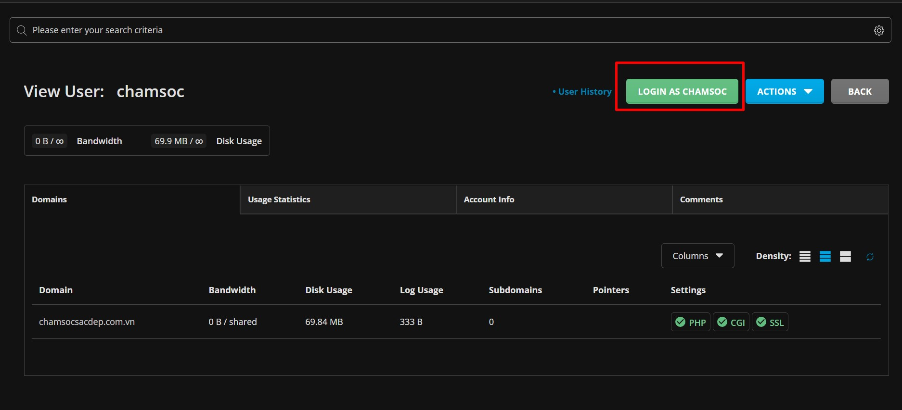
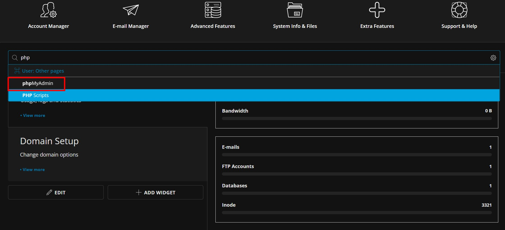
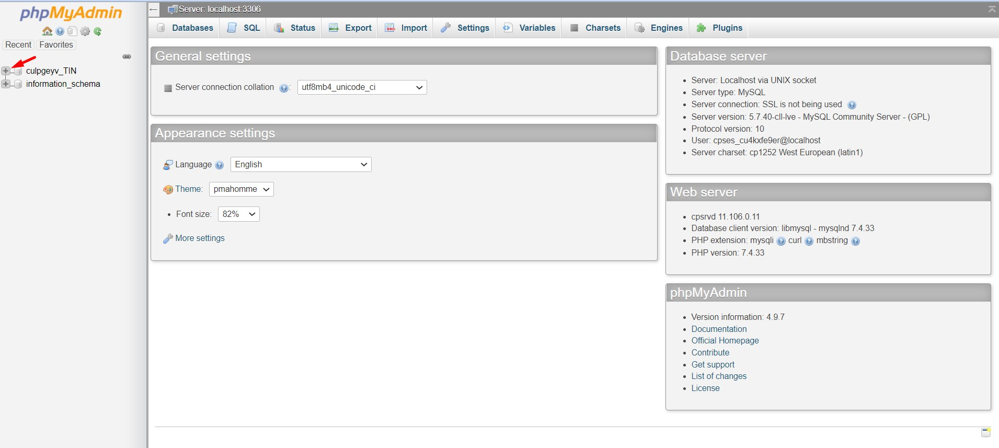
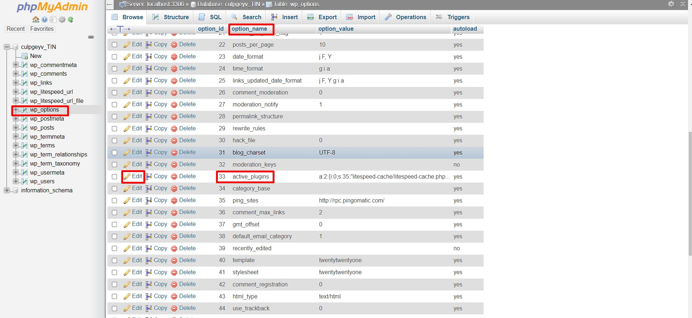
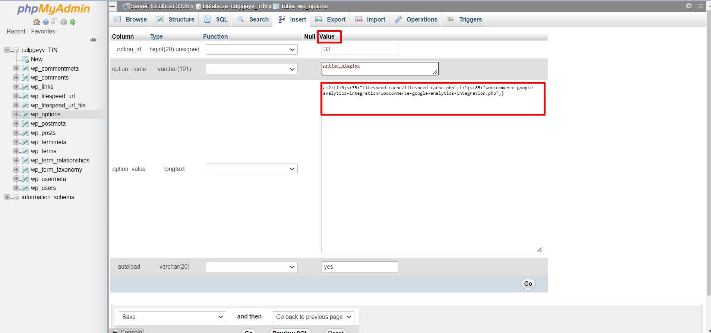
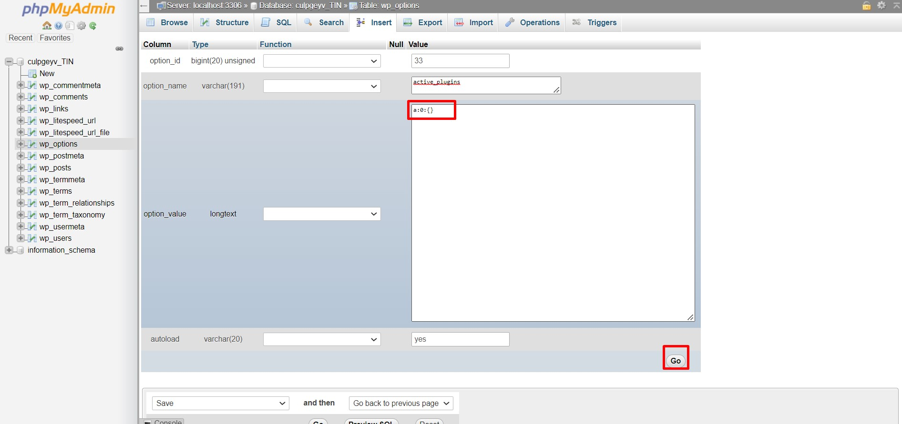

Bài viết này sẽ hướng dẫn bạn thực hiện **Disable Plugin WordPress Bằng Bằng PHPMyAdmin**. Nếu bạn cần hỗ trợ, xin vui lòng liên hệ VinaHost qua **Hotline 1900 6046 ext.3**, email về [support@vinahost.vn](mailto:support@vinahost.vn) hoặc chat với VinaHost qua livechat [https://livechat.vinahost.vn/chat.php](https://livechat.vinahost.vn/chat.php).

## Sau đây VinaHost sẽ hướng đẫn các bạn disable plugin Wordpress Bằng PHPMyAdmin.

Trường hợp một ngày chúng ta không thể truy cập vào trang quản trị website wp-admin hoặc website không truy cập được, chúng ta có thể kiểm tra bằng cách tắt hết các plugin đang hoạt động và kiểm tra thử.

Đầu tiên chúng ta cần đăng nhập vào **Cpanel** và kéo xuống phần **Databases** và chọn vào **phpMyAdmin.**

Nếu các sử dụng **DirectAmin**, chúng ta cần chọn vào user chứa **website** cần tắt **plugin.**

Sau đó chúng ta cần đăng nhập vào **user**.

Trên thanh tìm kiếm chúng ta gõ **phpMyAmin** và chọn như hình.

Sau khi vào được **phpMyAdmin** chúng ta bấm vào dấu cộng tên **Databases** của **Website** cần tắt **plugin.**

Chúng ta chọn vào phần **wp-options** ở cột **option\_name** tìm đến **active\_plugins** và bấm và **edit** như hình

Ở cột **value** chúng ta cần copy và lưu trữ nội dung trên để có thể bật lại **plugin** nếu cần thiết.

Sau khi xóa hết nội dung trên cột chúng ta điền vào nội dung **a:0:{}** sau đó nhân vào **Go** như hình.

Sau khi tắt hết các **plugin** và truy cập vào được trang quản trị website chúng ta bật và tắt thử từng **plugin** xem **plugin** nào là nguyên nhân gây ra sự cố trên nhé.

Chúc bạn thực hiện Disable Plugin WordPress Bằng Bằng PHPMyAdmin thành công!

> **THAM KHẢO CÁC DỊCH VỤ TẠI [VINAHOST](https://kb.vinahost.vn/)**
> 
> **\>>** [**SERVER**](https://vinahost.vn/thue-may-chu-rieng/) **–** [**COLOCATION**](https://vinahost.vn/colocation.html) – [**CDN**](https://vinahost.vn/dich-vu-cdn-chuyen-nghiep)
> 
> **\>> [CLOUD](https://vinahost.vn/cloud-server-gia-re/) – [VPS](https://vinahost.vn/vps-ssd-chuyen-nghiep/)**
> 
> **\>> [HOSTING](https://vinahost.vn/wordpress-hosting)**
> 
> **\>> [EMAIL](https://vinahost.vn/email-hosting)**
> 
> **\>> [WEBSITE](http://vinawebsite.vn/)**
> 
> **\>> [TÊN MIỀN](https://vinahost.vn/ten-mien-gia-re/)**
