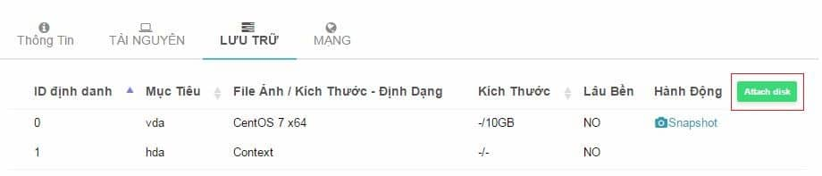

Bài viết này sẽ hướng dẫn bạn cách sử dụng dịch vụ Cloud Server tại VinaHost. Nếu cần được hỗ trợ bạn vui lòng liên hệ bộ phận kỹ thuật của chúng tôi qua Email: support@vinahost.vn hoặc Hotline: 1900. 6046.

## 1\. Đăng nhập vào control panel

Để biết thông tin đăng nhập vào hệ thống, Quý khách vui lòng kiểm tra hộp mail (bao gồm junk/spam box). Thông tin truy cập do VinaHost gửi cho quý khách là thông tin mặc định, Quý khách có thể tự thay đổi mật khẩu truy cập theo hướng dẫn ở mục 3.

Để đăng nhập vào hệ thống, Quý khách thực hiện các bước sau:

- Bước 1: Mở trình duyệt web như CocCoc, Google Chrome, Firefox… và truy cập vào địa chỉ [https://cp.vinahost.vn](https://cp.vinahost.vn/).
- Bước 2: Nhập Username (tên tài khoản) và Password (mật khẩu) VinaHost đã cấp trước đó cho Quý khách vào hai ô tương ứng ở trang [https://cp.vinahost.vn](https://cp.vinahost.vn/) và chọn Login.

Sau khi đăng nhập thành công thì Quý khách sẽ nhận được thông tin như hình bên dưới.

Nếu có vấn đề trong quá trình đăng nhập hoặc cần khôi phục lại mật khẩu truy cập, Quý khách vui lòng gửi yêu cầu hỗ trợ tới [support@vinahost.vn](mailto:support@vinahost.vn) hoặc truy cập địa chỉ [https://vinahost.vn/ho-tro](https://vinahost.vn/ho-tro.html)

## 2\. Thay đổi ngôn ngữ

Để thực hiện thay đổi ngôn ngữ hiển thị trên control panel, Quý khách thực hiện các bước sau:

- Bước 1: Đăng nhập vào [https://cs.vinahost.vn](https://cs.vinahost.vn/)
- Bước 2: Nhấn chọn vào nút mũi tên ở tên tài khoản của Quý khách, sau đó chọn **Cấu hình** \>> **Đổi ngôn ngữ**
- Bước 3: Chọn ngôn ngữ cần thay đổi và chọn **Cập Nhật Ngôn Ngữ**.

## 3\. Thay đổi mật khẩu

- Để thay đổi mật khẩu cũ sang mật khẩu mới, Quý khách thực hiện các bước sau: Bước 1: Đăng nhập vào [https://cs.vinahost.vn](https://cs.vinahost.vn/)
- Bước 2: Nhấn chọn vào nút mũi tên ở tên tài khoản của Quý khách, sau đó chọn **Cấu hình** \>> **Đổi Mật Khẩu**

****

- Bước 3: Khai báo mật khẩu mới và click chọn **Cập Nhật Mật Khẩu.**

****

## 4\. Cập nhật SSH key

Để thay đổi mật khẩu cũ sang mật khẩu mới, Quý khách thực hiện các bước sau:

- Bước 1: Đăng nhập vào [https://cs.vinahost.vn](https://cs.vinahost.vn/)
- Bước 2: Nhấn chọn vào nút mũi tên ở tên tài khoản của Quý khách, sau đó chọn **Cấu hình** \>> **Cập Nhật SSH Key**.
- Bước 3: nhập key ssh của quý khách và click vào “**Cập Nhật SSH Key**”

Lúc này các server của quý khách khi tạo mới sẽ được tự động thêm SSH Key và quý khách có thể dùng Key này để truy cập vào server của quý khách.

**Lưu ý**: cấu hình SSH Key chỉ có tác dụng đối với các server chạy hệ điều hành Linux và dùng SSH để kết nối.

## 5\. Khởi tạo server mới

Để khởi tạo một server mới quý khách thực hiện theo các bước sau:

- Bước 1: Tại giao diện quản lý quý khách click vào biểu tượng dấu **“+”** sau để vào giao diện tạo server mới

- Bước 2: quý khách chọn hệ điều hành của server cần tạo từ template có sẵn

Ví dụ ở đây chúng ta chọn tạo server hệ điều hành CentOS 7 64 bit

- Bước 3: nhập các thông tin cần thiết để tạo server

➢**Tên server**: là tên của máy ảo hiển thị trên giao diện quản lý

➢ **Tài nguyên**: chọn lượng RAM và CPU phù hợp cho server ➢ **Ổ cứng**: chọn dung lượng của ổ cứng phù hợp với mục đích sử dụng ➢ **Các thuộc tính tùy chỉnh**

○ **set default root password - thiết lập mật khẩu root mặc định**: nhập mật khẩu cho server. Quý khách lưu ý chọn mật khẩu an toàn để bảo mật cho server, mật khẩu an toàn gồm có chữ cái, chữ số và kí tự đặc biệt

○ **set default computer name - thiết lập tên máy chủ mặc định**: nhập tên hiển thị của server, đây là trên sẽ hiển thị trên hệ điều hành của quý khách

- Bước 4: sau khi điền đầy đủ các thông tin quý khách click vào nút **“Tạo Mới”** để thực hiện tạo server.

Tiếp theo hệ thống sẽ thực hiện khởi tạo server mới, thời gian khởi tạo hoàn tất thông thường từ 2 tới 5 phút.

Lúc này quý khách có thể thấy server mới đã được thêm vào trong danh sách server

## 6\. Truy cập vào server

Để truy cập vào server quý khách có thể truy cập theo các cách sau: truy cập bằng noVNC (mọi hệ điều hành), truy cập thông qua SSH (hệ điều hành Linux) và truy cập thông qua Remote Desktop (hệ điều hành Window).

### 6.1. Truy cập bằng noVNC

Để truy cập noVNC quý khách thực hiện thao tác như sau:

- Click vào danh sách server để xem danh sách các server và chọn server cần truy cập
- Tạo giao diện quản lý server click vào biểu tượng sau để truy cập noVNC vào server

- Giao diện noVNC hiển thị cho phép khách hàng thao tác lệnh trực tiếp với server trên trình duyệt.

Giao diện của server chạy **Linux:**

Giao diện của server chạy **Window:**

### 6.2. Truy cập bằng SSH

Để truy cập SSH và hệ điều hành Linux quý khách thao tác như sau:

- Truy cập vào giao diện quản lý server để xem IP public của server.

- Sử dụng các phần mềm ssh client để kết nối với thông tin IP public của server. Quý khách có thể sử dụng Putty trên Window để kết nối tới server Linux (download Putty tại: [http://www.putty.org/](http://www.putty.org/) )

### 6.3. Truy cập bằng Remote Desktop (dành cho hệ điều hành Window)

Để truy cập Window server quý khách thao tác như sau:

- Truy cập vào giao diện quản lý server để xem IP public của server.

- Chạy Remote Desktop trên máy Window client để kết nối vào Window server với IP public của server.

## 7\. Khởi động lại server

Để thực hiện khởi động lại server quý khách thao tác như sau:

- Truy cập vào giao diện quản lý server cần quản lý.

- Thực hiện click vào nút khởi động server.

Tại đây quý khách có hai tùy chọn:

➢ Khởi động lại server ngay lập tức (**hard reset**): tùy chọn này tương tự như việc rút nguồn và khởi động lại server. Quý khách lưu ý chỉ sử dụng tùy chọn này khi server của quý khách bị treo và không thể thực hiện việc reboot theo cách thông thường. ➢ Gửi lệnh reboot tới server (**Ctl-Alt-Delete**): hệ thống sẽ thực hiện gửi lệnh reboot tới server và stop các dịch vụ trước khi reboot. Đây là tùy chọn mặc định và an toàn cho server.

- Quý khách thực hiện click vào “**Khởi động lại server (Reboot)**” để thực hiện khởi động lại server.

## 8\. Tắt server

Để thực hiện khởi động lại server quý khách thao tác như sau:

- Truy cập vào giao diện quản lý server cần quản lý.
- Thực hiện click vào nút tắt server trên giao diện quản lý.

Tại đây quý khách có hai tùy chọn:

➢ Tắt server ngay lập tức (**hard power off**): tùy chọn này tương tự như việc rút nguồn để tắt server. Quý khách lưu ý chỉ sử dụng tùy chọn này khi server của quý khách bị treo và không thể thực hiện việc tắt server theo cách thông thường, các dữ liệu đang chạy có thể không được lưu xuống ổ cứng ➢ Gửi lệnh shutdown tới server (**soft power off**): hệ thống sẽ thực hiện gửi lệnh shutdown tới server và stop các dịch vụ trước khi tắt server. Đây là tùy chọn mặc định và an toàn cho server

## 9\. Thêm ổ cứng vào server

Hiện tại VinaHost chỉ hỗ trợ tăng phân vùng lưu trữ cho server bằng cách gắn thêm ổ cứng vào server. Các ổ cứng hỗ trợ có dung lượng lần lượt là: 8G, 20G, 40G, 60G và 80G.

Trong tương lai VinaHost sẽ hỗ trợ điều chỉnh tăng dung lượng phân vùng lưu trữ hiện tại thay vì phải gắn thêm ổ cứng. Để thực hiện thêm ổ cứng và server quý khách thao tác như sau:

- Quý khách truy cập vào giao diện quản lý server và chọn tab “**LƯU TRỮ**”

- Tiếp theo quý khách click vào “**Attach disk**”

- Giao diện chọn các ổ cứng hiện ra và quý khách chọn ổ cứng cần thêm phù hợp với nhu cầu.

- Tiếp theo quý khách click và “**Attach**” để thêm ổ cứng và kiểm tra ổ cứng đã được thêm vào

- Quý khách có thể thấy ổ cứng 60G đã được thêm vào server. Bước cuối cùng quý khách cấu hình lại hệ điều hành để có thể sử dụng ổ cứng mới gắn vào.

Tùy theo từng hệ điều hành mà cách cấu hình sẽ khác nhau, do đó đến bước này quý khách vui lòng liên hệ với nhân viên kỹ thuật để được hỗ trợ.

## 10\. Nâng cấp RAM, CPU của Server

Để thực hiện nâng cấp hoặc điều chỉnh lại tài nguyên CPU, RAM cho server quý khách thực hiện các bước như sau:

- Tắt server (**shutdown**) quý khách vui lòng tham khảo **mục 8** để biết cách thao tác

- Tại giao diện quản lý server quý khách click vào tab “**TÀI NGUYÊN**” sau đó chọn “**Resize**”

- Sau đó quý khách chọn mức tài nguyên cần cấp cho server và click vào “**Resize**” để thực hiện.

- Cuối cùng quý khách kiểm tra lại tài nguyên cho server và bật server lên để sử dụng.

## 11\. Khởi tạo lại server

Quý khách lưu ý **việc khởi tạo lại server sẽ làm mất hết dữ liệu đang chạy trên server và không thể khôi phục**. Do đó quý khách cần đọc kỹ lưu ý này trước khi thao tác. Các bước để thực hiện khởi tạo lại server.

- Truy cập vào giao diện quản lý server cần khởi tạo và click vào biểu tượng xóa server.

- Xuất hiện cảnh báo về việc xóa server, quý khách vui lòng đọc kỹ thông tin trước khi click vào “**Xóa Server**”.

- Sau khi việc xóa server hoàn tất quý khách thực hiện tạo lại server để sử dụng (tham khảo mục 5).

## 12\. Thông tin liên hệ

Nếu quý khách cần trợ giúp trong quá trình sử dụng dịch vụ cloud server, Quý khách vui lòng gửi yêu cầu hỗ trợ tới [support@vinahost.vn](mailto:support@vinahost.vn) hoặc truy cập vào địa chỉ [https://vinahost.vn/ho-tro](https://vinahost.vn/ho-tro.html)

Chúc bạn thành công!

> **THAM KHẢO CÁC DỊCH VỤ TẠI [VINAHOST](https://blog.vinahost.vn/)**
> 
> **\>>** [**SERVER**](https://vinahost.vn/thue-may-chu-rieng/) **–** [**COLOCATION**](https://vinahost.vn/colocation.html) – [**CDN**](https://vinahost.vn/dich-vu-cdn-chuyen-nghiep)
> 
> **\>> [CLOUD](https://vinahost.vn/cloud-server-gia-re/) – [VPS](https://vinahost.vn/vps-ssd-chuyen-nghiep/)**
> 
> **\>> [HOSTING](https://vinahost.vn/wordpress-hosting)**
> 
> **\>> [EMAIL](https://vinahost.vn/email-hosting)**
> 
> **\>> [WEBSITE](http://vinawebsite.vn/)**
> 
> **\>> [TÊN MIỀN](https://vinahost.vn/ten-mien-gia-re/)**
> 
> **\>> [SSL](https://vinahost.vn/geotrust-ssl) – [LICENSE](https://vinahost.vn/bang-gia-license)**