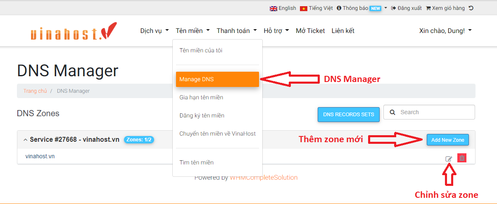
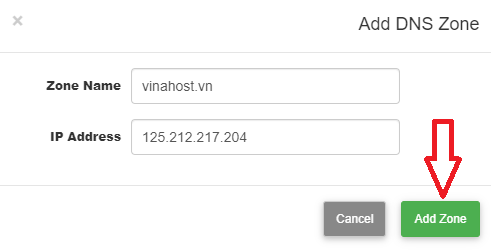

Nhiều Khách hàng thắc mắc nếu tên miền được đăng ký và sử dụng DNS tại VinaHost thì sẽ được quản lý tại đâu và cách sử dụng ra sao, bài viết này VinaHost sẽ hướng dẫn sử dụng **DNS Manager** cũng như quản lý tên miền của VinaHost tại đường dẫn [https://secure.vinahost.vn/ac/clientarea.php](https://secure.vinahost.vn/ac/clientarea.php)

## **1.** **DNS Manager là gì?**

- DMS Manager là trình quản lý DNS được tích hợp vào hệ thống khách hàng để quản lý zones và các records của tên miền.

- Các chức năng chính của DNS Manager:

\+ Quản lý thêm. xóa, sửa zones cho từng tên miền

\+ Quản lý thêm, xóa, sửa records cho từng zones của tên miền đã được tạo

## **2.** **Điều kiện sử dụng**

Trước tiên muốn sử dụng DNS Manager của VinaHost, điều kiện bắt buộc là tên miền phải được sử dụng cặp Nameserver **ns3.vinahost.vn** và **ns4.vinahost.vn** thuộc quản lý của VinaHost.

Nếu tên miền chưa được cấu hình thiết lập về cặp Nameserver này cần phải liên hệ với nhà cung cấp nơi đăng ký tên miền yêu cầu trỏ về ns3.vinahost.vn  và ns4.vinahost.vn .

## **3.** **Quản lý zones**

Đầu tiên, quý khách cần đăng nhập tài khoản truy cập trang quản trị dịch vụ khách hàng tại đường dẫn [https://secure.vinahost.vn/ac/clientarea.php](https://secure.vinahost.vn/ac/clientarea.php)

Trường hợp Quý khách quên mật khẩu có thể sử dụng chức năng **Quên mật khẩu** thông qua đường dẫn [https://secure.vinahost.vn/ac/pwreset.php](https://secure.vinahost.vn/ac/pwreset.php)

Sau khi đã đăng nhập thành công, chọn menu Domains **\=> Manage DNS** (Hình 1)

Xuất hiện giao diện DNS Manager:

_**\* Trường hợp 1:**_ Nếu tên miền đã có Zone sẽ xuất hiện nút Chỉnh sửa Zone như Hình 1. Khách hàng chỉ cần ấn vào nút này để thực hiện thay đổi các Record DNS mong muốn. Chi tiết các chỉnh sửa record có thể tham khảo ở mục 3.

**_\*Trường hợp 2:_** Nếu Zone chưa được cấu hình, khách hàng có thể thực hiện thêm Zone theo các bước sau:

- Bước 1: Nhấn vào nút Add New Zone, nhập thông tin sau:

\+ Zone Name: tên miền cần tạo zone + IP Address: địa chỉ IP của bạn để cập nhật các thông số của bảng ghi

- Bước 2: Nhấn vào nút Add Zone để thêm zone (Hình 2)

Khi Add New Zone cho 1 tên miền thành công, ta có thể thao tác chỉnh sửa hoặc thêm record DNS cho tên miền bằng cách nhấn vào chức năng Edit Zone.

- Để xóa Zone nếu bị sai ấn nút hình thùng rác màu đỏ bên cạnh nút Edit Zone để Delete Zone

## **4.** **Quản lý records**

- Bước 1: Chọn 1 zones tương ứng với tên miền cần thực hiện cấu hình, nhấn vào nút chỉnh sửa.
- Bước 2: Tại trang Edit Zone, nơi bạn có thể xem, thêm, xóa, chỉnh sửa record của bảng ghi DNS.
- Bước 3: Nhấn vào nút Save changes để lưu lại những thay đổi

Các bạn muốn đăng kí tên miền tại VinaHost có thể tham khảo tại [**link sau.**](https://vinahost.vn/bang-gia-ten-mien.html)

Chúc bạn thực hiện thành công!

> **THAM KHẢO CÁC DỊCH VỤ TẠI [VINAHOST](https://vinahost.vn/)**
> 
> **\>>** [**SERVER**](https://vinahost.vn/thue-may-chu-rieng/) **–** [**COLOCATION**](https://vinahost.vn/colocation.html) – [**CDN**](https://vinahost.vn/dich-vu-cdn-chuyen-nghiep)
> 
> **\>> [CLOUD](https://vinahost.vn/cloud-server-gia-re/) – [VPS](https://vinahost.vn/vps-ssd-chuyen-nghiep/)**
> 
> **\>> [HOSTING](https://vinahost.vn/wordpress-hosting)**
> 
> **\>> [EMAIL](https://vinahost.vn/email-hosting)**
> 
> **\>> [WEBSITE](http://vinawebsite.vn/)**
> 
> **\>> [TÊN MIỀN](https://vinahost.vn/ten-mien-gia-re/)**