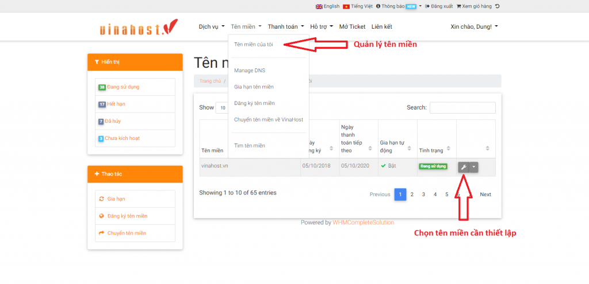
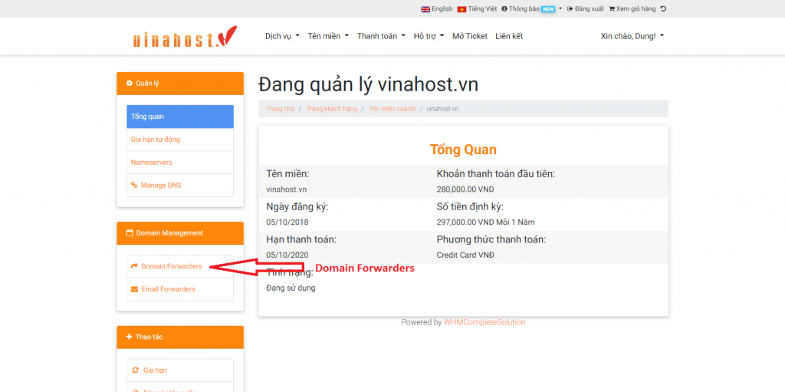
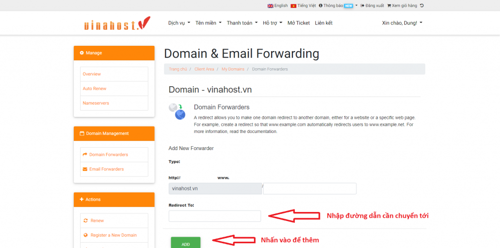
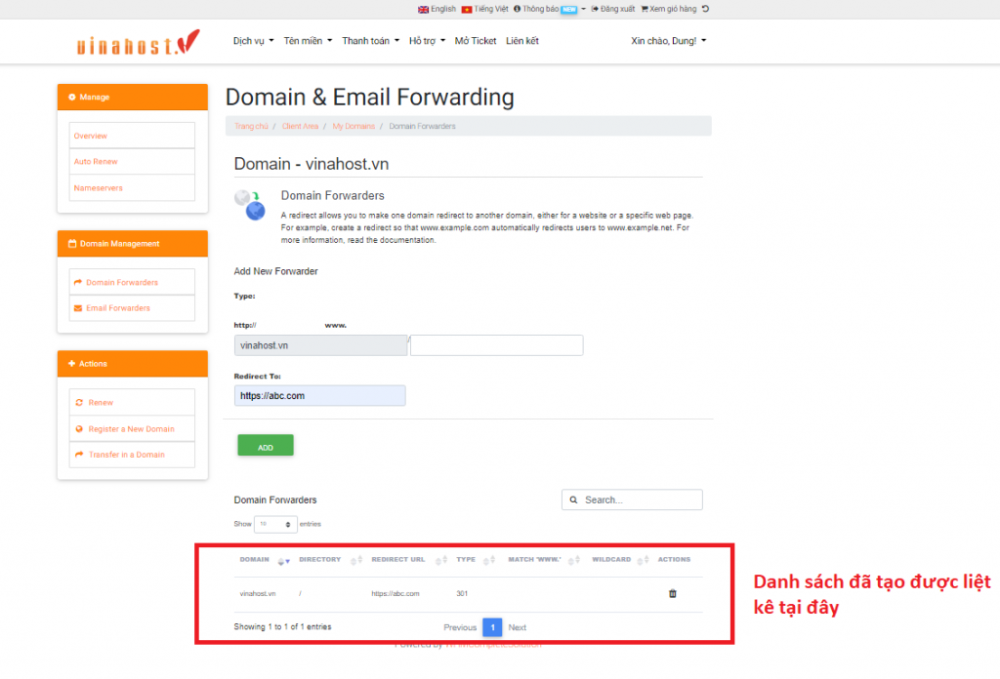
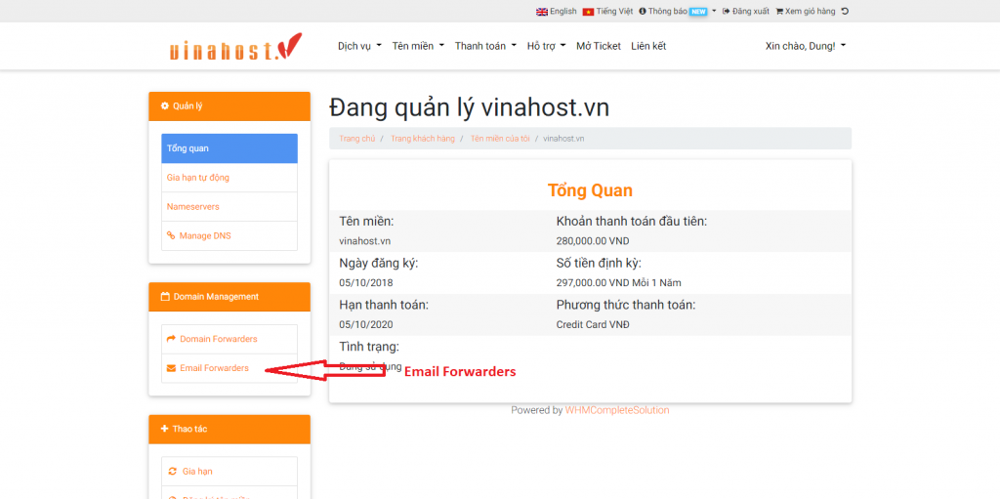
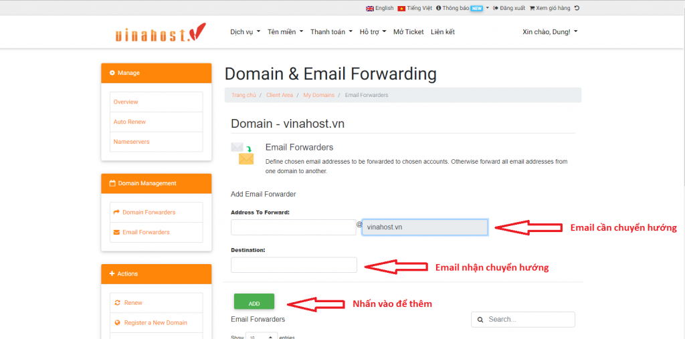
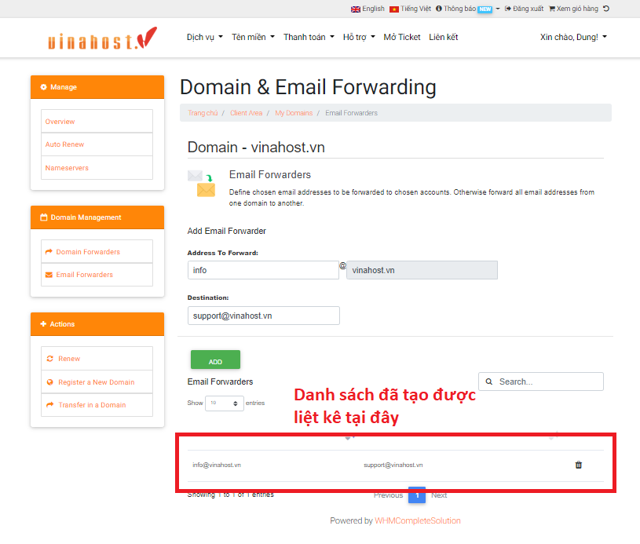

Nhiều Khách hàng thắc mắc nếu tên miền được đăng ký và sử dụng DNS tại VinaHost thì chức năng Domain Redirect và Email Forwarding quản lý tại đâu và cách sử dụng ra sao, bài viết này VinaHost sẽ hướng dẫn sử dụng Domain And Email Forwarding cũng như quản lý tên miền của VinaHost tại đường dẫn https://secure.vinahost.vn/ac/clientarea.php

**1.** **Domain And Email Forwarding là gì**

Domain And Email Forwarding là trình quản lý Domain Redirect và Email Forwarding được tích hợp vào hệ thống khách hàng để quản lý các Domain Redirect và Email Forwarding của tên miền.

Các chức năng chính của 1. Domain And Email Forwarding:

- Quản lý thêm. xóa, sửa Domain Redirect (chuyển hướng tên miền và đường dẫn thư mục của tên miền đến một đường dẫn khách)

- Quản lý thêm, xóa, sửa Email Forwarding (chuyển hướng Email của tên miền đến một email người nhận khác)

**2.** **Điều kiện sử dụng**

Trước tiên muốn sử dụng Domain And Email Forwarding của VinaHost, điều kiện bắt buộc là tên miền phải được sử dụng cặp Nameserver ns3.vinahost.vn và ns4.vinahost.vn thuộc quản lý của VinaHost. Nếu tên miền chưa được cấu hình thiết lập về cặp Nameserver này cần phải liên hệ với nhà cung cấp nơi đăng ký tên miền yêu cầu trỏ về ns3.vinahost.vn (IP: 125.212.217.204) và ns4.vinahost.vn (IP: 123.30.129.238).

**3.** **Quản lý Domain Redirect**

Đầu tiên quý khách cần đăng nhập tài khoản truy cập trang quản trị dịch vụ khách hàng tại đường dẫn [https://secure.vinahost.vn/ac/clientarea.php](https://secure.vinahost.vn/ac/clientarea.php) hoặc sử dụng chức năng Quên mật khẩu nếu đã quên thông tin đăng nhập thông qua đường dẫn [https://secure.vinahost.vn/ac/pwreset.php](https://secure.vinahost.vn/ac/pwreset.php).

- Sau khi đã đăng nhập thành công, chọn vào menu Tên miền => Tên miền của tôi
- Chọn vào một tên miền bạn muốn tạo Domain Redirect, nhấn vào biểu tượng Quản lý tên miền
- Tại menu bên trái, nhấn vào đường dẫn Domain Forwarders và giao diện quản lý Domain Forwarders đã được hiện ra
- Ở chức năng Domain Forwarders:

\+ Bạn nhập thư mục cần được chuyển hướng

\+ Nhập đường dẫn cần được chuyển hướng tới

\+ Nhấn vào nút ADD để thêm 1 Domain Forwarders

**4.** **Quản lý Email Forwarders**

- Tại Tên miền của tôi, chọn vào một tên miền bạn muốn tạo Email Redirect, nhấn vào biểu tượng Quản lý tên miền
- Tại menu bên trái, nhấn vào đường dẫn Email Forwarders và giao diện quản lý Email Forwarders đã được hiện ra
- Ở chức năng Email Forwarders:

\+ Bạn nhập email cần được chuyển hướng + Nhập email cần được chuyển hướng tới

\+ Nhấn vào nút ADD để thêm 1 Email Forwarders

