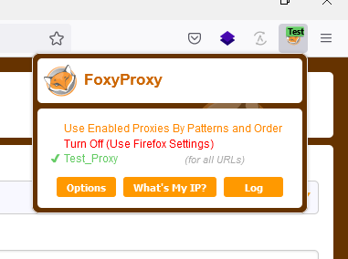

FoxyProxy là một tiện ích mở rộng cho 2 trình duyệt đó là: Chrome và Firefox với các tính năng cực kỳ mạnh mẽ. Bên cạnh đó, người dung sẽ có trải nghiệm tuyệt vời khi thiết lập kết nối internet bằng proxy hết sức đơn giản. Được rồi chúng ta cùng nhau trải nghiệm xem FoxyProxy có những gì nhé!

## **1\. Tải và cài đặt Plugin FoxyProxy**

Chọn vào link bên dưới để add vào Firefox:

[https://addons.mozilla.org/vi/firefox/addon/foxyproxy-standard/](https://addons.mozilla.org/vi/firefox/addon/foxyproxy-standard/)

Chọn vào link bên dưới để add vào Chrome:

[https://chrome.google.com/webstore/detail/foxyproxy-standard/gcknhkkoolaabfmlnjonogaaifnjlfnp](https://chrome.google.com/webstore/detail/foxyproxy-standard/gcknhkkoolaabfmlnjonogaaifnjlfnp)

Trong của sổ cài đặt plugin của Firefox, hãy nhấn chọn Add to FireFox như hình bên dưới:

Sau khi chọn Add to FireFox sẽ xuất hình một bảng như hình bên, ta chọn vào mục “Thêm”:

Đối với Chrome chúng ta cũng thao tác tương tự như trên FireFox để cài đặt FoxyProxy nhé. Bạn nhấn vào Add to Chrome và xác nhận việc Add extension trong phần thông báo.

Như vậy chỉ với 2 click chuột, chúng ta đã hoàn thành được việc cài đặt FoxyProxy cho trình duyệt FireFox và Chrome. Bước tiếp theo, chúng ta sẽ đi vào cấu hình chi tiết hơn.

## **2\. Cấu hình FoxyProxy trên FireFox**

Tại góc bên phải của trình duyệt chúng ta sẽ thấy biểu tượng của FoxyProxy (được khoanh vùng màu đỏ như hình):

Ta click chuột chọn vào biểu tượng FoxyProxy (1) và chọn Option (2) như hình bên dưới:

Sau khi chọn vào phần Option sẽ hiển thị ra một cửa sổ như hình bên:

Ta chọn mục Add:

Ở mục “Title or Description (optional)” ta cần nhập tên dễ nhớ để dễ quản lý nhé

- Ở mục Proxy Type ta chọn “HTTP”
- Proxy IP address or DNS name: nhập vào proxy mà bạn đã mua, định dạng có thể sẽ là IP:PORT hoặc DOMAIN:PORT. Như ở đây tôi nhập IPv6 và Port là 30025
- Username (optional)& Password (optional):

Nếu bạn chọn xác minh bằng username:password, thì bạn hãy nhập chúng vào mục USERNAME:PASSWORD nhé.

Sau đó click Save để lưu thiết lập của bạn.

Bước cuối cùng để sử dụng proxy, bạn cần click vào cấu hình vừa thiết lập. Nếu muốn muốn ngừng sử dụng proxy, bạn click chọn **Turn Off (Use Firefox Setting)**

## **3\. Cấu hình FoxyProxy trên Chrome**

Trên Chrome, FoxyProxy được thiết kế hoàn toàn tương thích và ổn định, tuần theo các chính sách bảo mật khắt khe của Google và khá đơn giản khi sử dụng.

Trước tiên, chúng ta click vào biểu tưởng FoxyProxy (Hình mặt cáo) ở góc bên phải cửa sổ trình duyệt của bạn. Và chọn option.

Tiếp theo chúng ta chọn Add New Proxy

Ở đây ta chọn option “**Manual Proxy Configuration**”

Thông tin ở đây chúng ta có thể điền giống như bên trình duyệt FireFox với cấu trúc như sau: **IP:PORT** hoặc **DOMAIN:PORT**

Đối với việc khi bạn mua hàng tại FoxyProxy, thì họ sẽ cung cấp cho bạn bao gồm cả 2 option đó là HTTP Proxy và SOCK5, và đừng quên tick chọn mục SOCKS Proxy nhé.

Khi đó bạn sẽ điền những thông tin mà FoxyProxy cung cấp cho bạn vào các mục trong hình nhé.

**Kết luận:**

Tại VinaHost bạn có thể kết hợp FoxyProxy với VPS MMO để thực hiện các công việc theo mong muốn của các bạn.

_**VPS MMO** là dịch vụ VPS chuyên cung cấp số lượng proxy IPv6 theo nhu cầu của khách hàng, có **hiệu suất vượt trội** và được kết nối **Internet tốc độ cao**, **ổn định** nhằm **hỗ trợ tốt nhất cho khách hàng chạy các phần mềm/công cụ MMO – Make Money Online (tăng view Youtube, chạy quảng cáo Facebook…)** để kiếm tiền trực tuyến. VPS MMO cung cấp cho bạn số lượng **IPv6 cực lớn**, có thể thay đổi IPv6 liên tục, nhanh chóng và dễ dàng._

- Cấu hình nhỏ gọn, ổn định, chạy được số lượng proxy lớn giúp khách hàng tiết kiệm chi phí
- Bảo mật với hệ thống firewall tự động chặn kết nối bất thường.
- Tương tác tốt nhất với **Youtube, Facebook, Google và các trang kiếm tiền online (MMO) hỗ trợ IPv6**.
- Được cấp **1 dải IPv6 riêng**, tách biệt các khách hàng, tránh bị khóa cả dải do chứa nhiều IP có dấu hiệu bất thường.
- Sử dụng **IPv4 private và IPv6 public,** IPv6 được thay đổi một cách dễ dàng và nhanh chóng chỉ với 1 dòng lệnh.
- Truy cập Internet thông qua **proxy** dễ dàng, tốc độ cao.
- Server cấu hình mạnh với **Network lên đến 10Gbps** tại Tier 3 DC – Cam kết uptime 99.99% – Đảm bảo kết nối luôn thông suốt.

Bạn có thể tham khảo thêm link bên dưới:

<iframe class="wp-embedded-content" title="“VPS MMO” — #1 Hosting Giá Rẻ, VPS Giá Rẻ, Email, Cloud Server | VinaHost.VN" src="https://vinahost.vn/vps-mmo/embed/#?secret=EKpnMFWtsi#?secret=wyvNRk8fK1" width="600" height="235" marginwidth="0" marginheight="0" scrolling="no" sandbox="allow-scripts" data-secret="wyvNRk8fK1" data-mce-fragment="1"></iframe>

Nếu bạn cần hỗ trợ, xin vui lòng liên hệ VinaHost qua Hotline 1900 6046 ext.3, email về support@vinahost.vn hoặc chat với VinaHost qua livechat https://livechat.vinahost.vn/chat.php.

Chúc bạn thực hiện thành công!

> **THAM KHẢO CÁC DỊCH VỤ TẠI [VINAHOST](https://kb.vinahost.vn/)**
> 
> **\>>** [**SERVER**](https://vinahost.vn/thue-may-chu-rieng/) **–** [**COLOCATION**](https://vinahost.vn/colocation.html) – [**CDN**](https://vinahost.vn/dich-vu-cdn-chuyen-nghiep)
> 
> **\>> [CLOUD](https://vinahost.vn/cloud-server-gia-re/) – [VPS](https://vinahost.vn/vps-ssd-chuyen-nghiep/)**
> 
> **\>> [HOSTING](https://vinahost.vn/wordpress-hosting)**
> 
> **\>> [EMAIL](https://vinahost.vn/email-hosting)**
> 
> **\>> [WEBSITE](http://vinawebsite.vn/)**
> 
> **\>> [TÊN MIỀN](https://vinahost.vn/ten-mien-gia-re/)**
