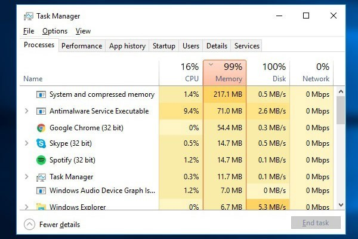
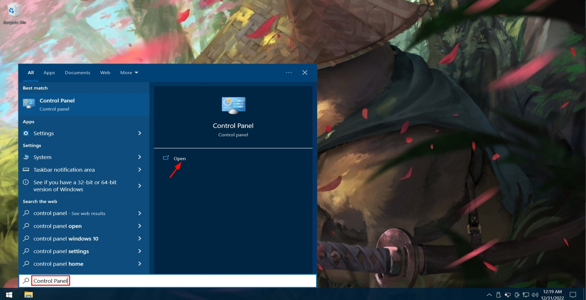
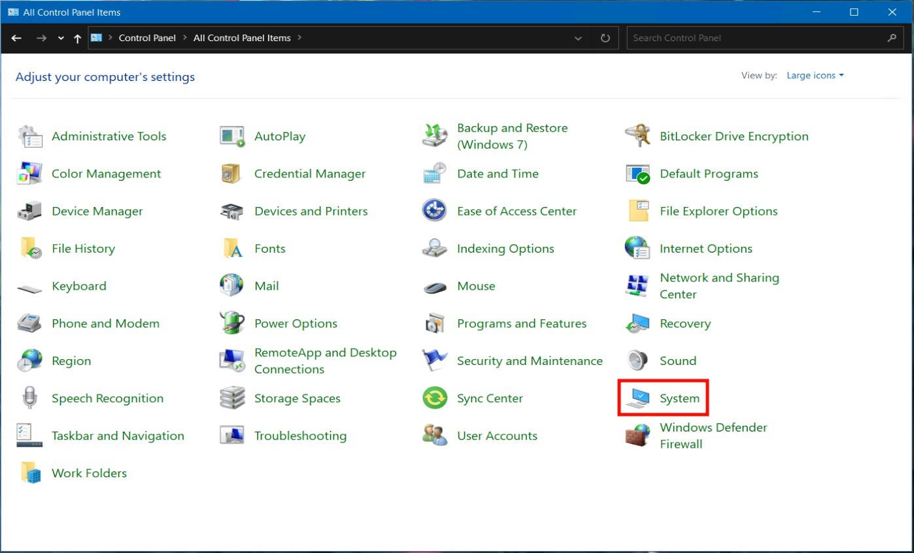
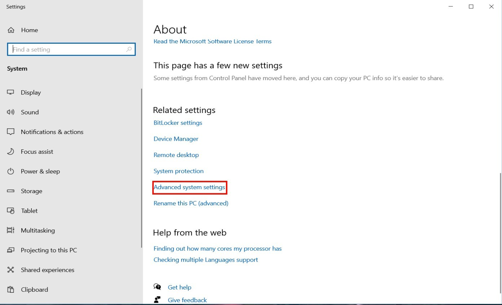
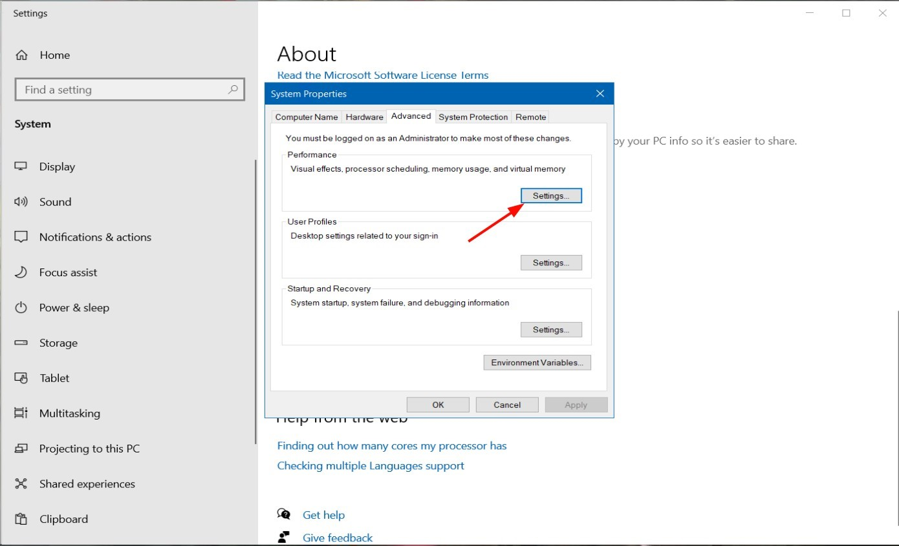
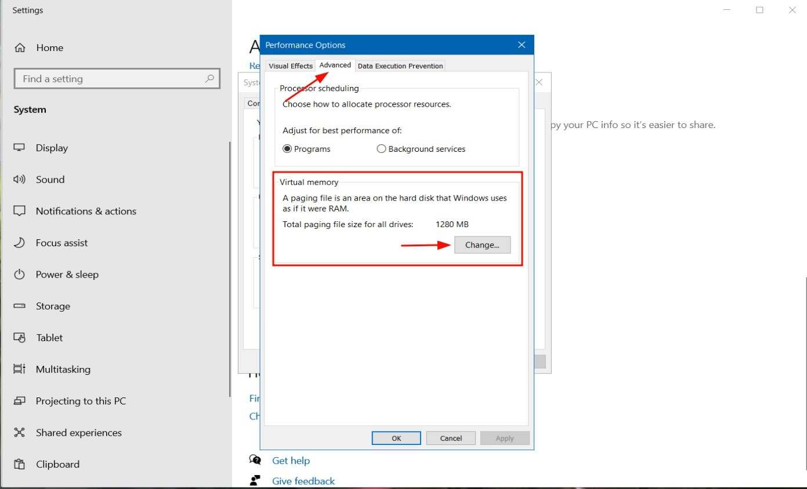
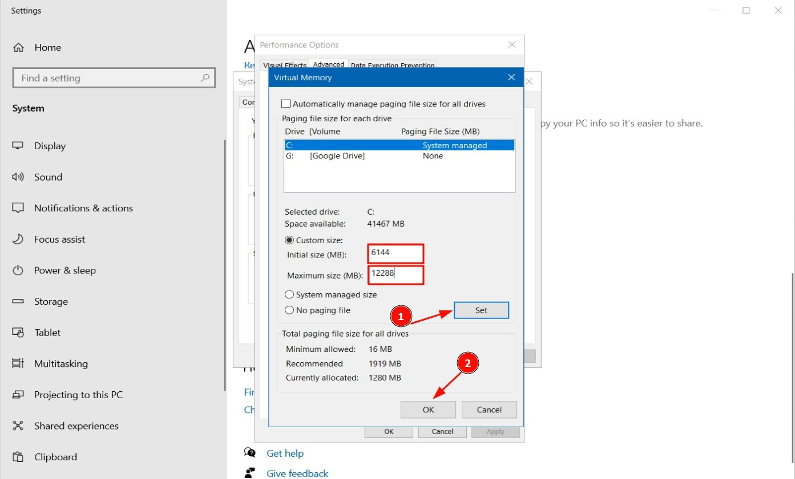
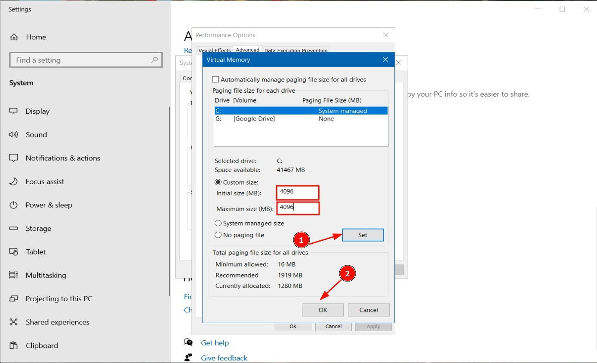

Bài viết này sẽ hướng dẫn bạn cách **Tăng Page File (Swap) Trên Windows**. Nếu bạn cần hỗ trợ, xin vui lòng liên hệ VinaHost qua **Hotline 1900 6046 ext.3**, email về [support@vinahost.vn](mailto:support@vinahost.vn) hoặc chat với VinaHost qua livechat [https://livechat.vinahost.vn/chat.php](https://livechat.vinahost.vn/chat.php).

Trong quá trình sử dụng dịch vụ VPS Windows tại Vinahost chắc hẳn các bạn sẽ gặp qua tình trạng VPS báo full RAM. Nguyên nhân thường là do thông số RAM của VPS thấp, không đáp ứng đủ cho các tác vụ chương trình và dịch vụ chạy trên hệ thống.

Để tạm khắc phục vấn đề trên, hôm nay mình sẽ hướng dẫn các bạn cách cấu hình RAM ảo trên Windows.

## 1\. Page File là gì?

Là một tệp trên ổ cứng máy tính, nó còn được gọi là Swap file, Pagefile hoặc Paging file. Mặc định Page File được tạo ở C:\\pagefile.sys. Về cơ bản, Pagefile là một vùng trên đĩa cứng mà Windows sẽ sử dụng như thể là RAM ảo trong trường hợp RAM thực của bạn không đủ.

Khi hoạt động Windows sẽ lưu trữ các tệp, chương trình và dữ liệu khác mà người dùng đang sử dụng trong bộ nhớ RAM vì tốc độ xử lý ở RAM rất nhanh. Khi RAM đầy, Windows sẽ chuyển các dữ liệu và tác vụ đang chạy nền hoặc không được sử dụng đến vào Page File. Ví dụ bạn mở nhiều tab trên trình duyệt

Theo mặc định, Windows sẽ tự động quản lý các cài đặt pagefile cho bạn, nhưng đôi khi bạn có thể cần phải tự quản lý pagefile của mình theo cách thủ công. Ví dụ:

Khi ổ C:, nơi mà Windows của bạn được cài đặt có dung lượng quá nhỏ, bạn có thể sẽ muốn di chuyển pagefile ra khỏi ổ đĩa đó sang một ổ đĩa khác có nhiều khoảng trống hơn.

Khi đã sử dụng nhiều bộ nhớ, bạn có thể sẽ muốn thêm một pagefile vào ổ đĩa khác để sẵn sàng sử dụng khi cần thiết.

Nếu bạn không sử dụng nhiều bộ nhớ trong khi pagefile của bạn lại có kích thước lớn, bạn có thể sẽ muốn sử dụng kích thước tùy chỉnh nhỏ hơn.

Nếu bạn gặp lỗi **BSOD**

PAGE\_FAULT\_IN\_NONPAGED\_AREA hoặc KERNEL\_DATA\_INPAGE\_ERROR hoặc các lỗi dạng **Low Memory,** bạn có thể sẽ cần phải sử dụng kích thước tùy chỉnh lớn hơn cho các pagefile.

## 2\. Cách set RAM ảo cho máy tính Windows

**Note:** Trong bài hướng dẫn này mình sẽ thực hiện trên Windows 10. Các phiên bản khác như Windows7, 8, 8.1 hay Windows 11 bạn làm tương tự nhé.

⇒ **Bước 1**: Trên thanh **Taskbar**, tìm kiếm từ khóa **Control Panel** \> Chọn **Control Panel**.

**Bước 2**: Chọn **System**

**Bước 3**: Chọn **Advanced system settings**.

**Bước 4:** Chọn **Settings**.

**Bước 5**: Trong cửa sổ **Performance Options**, chọn tab **Advanced** \> Chọn **Change**.

**Bước 6**: Bỏ chọn mục **Automatically manage paging file size for all drives** \> Chọn **Custom size >** Và thiết lập cấu hình như sau:

**Note:** Thực ra thì RAM ảo này chỉ là hỗ trợ thêm cho RAM thực khi máy tính dùng hết RAM thực mà thôi, và tốc độ của RAM ảo cũng không được cao, do đó chúng ta không nên lạm dụng vào RAM ảo. Vậy thiết lập như thế nào cho phù hợp?

Có 2 trường hợp:

 **_Trường hợp 1:_** Nếu bạn đang dùng Win 10 32-bit + dung lượng RAM vật lý nhỏ hơn 3GB/ hoặc đang dùng Win 10 64-bit + dung lượng RAM vật lý nhỏ hơn 4.5GB.

- Mục **Initial size** nhập số gấp 1.5 lần dung lượng RAM vật lý, ở mục **Maximum size** nhập số gấp 3 lần dung lượng RAM vật lý.

Ví dụ: Máy tính có 4GB RAM + Windows 10 64-bit, mình sẽ set RAM ảo win 10 64bit như sau:

+ **Initial size** : 4GB = 4096MB x 1.5 = 6144MB.

+ **Maximum size**: 4GB = 4096MB x 3 = 12288 MB.

 **_Trường hợp 2:_** Nếu bạn đang dùng Win 10 32-bit + dung lượng RAM vật lý lớn hơn 3GB/ hoặc đang dùng Win 10 64-bit + dung lượng RAM vật lý lớn hơn 4.5GB.

- Mục **Initial size và Maximum size** số dung lượng bằng một nửa dung lượng RAM vật lý.

Hiện tại máy tính của mình đang dùng Windows 10 64-bit + RAM 8GB, nên mình sẽ có cách set RAM ảo Win 10 như sau:

+ **Initial size** \= Maximum size : 8GB = 8192MB / 2 = 4096MB.

+ **Maximum size** \= Maximum size : 8GB = 8192MB / 2 = 4096MB. (1GB = 1024MB, 4GB= 4096Mb, 8GB = 8192MB, 16GB = 16384MB).

**Bước 7:** Click vào **Set** \=> **OK.** Windows sẽ yêu cầu restart lại. Các bạn tiến hành Restart lại để Windows nhận cấu hình nhé!

Để vô hiệu hóa RAM ảo, các bạn chỉ cần thực hiện tương tự, đến Bước 6 các bạn chọn:

No paging file > Set > OK.

Hy vọng bài viết này sẽ hữu ích đối với bạn. Chúc bạn thực hiện tăng Page File thành công!

> **THAM KHẢO CÁC DỊCH VỤ TẠI [VINAHOST](https://vinahost.vn/)**
> 
> **\>>** [**SERVER**](https://vinahost.vn/thue-may-chu-rieng/) **–** [**COLOCATION**](https://vinahost.vn/colocation.html) – [**CDN**](https://vinahost.vn/dich-vu-cdn-chuyen-nghiep)
> 
> **\>> [CLOUD](https://vinahost.vn/cloud-server-gia-re/) – [VPS](https://vinahost.vn/vps-ssd-chuyen-nghiep/)**
> 
> **\>> [HOSTING](https://vinahost.vn/wordpress-hosting)**
> 
> **\>> [EMAIL](https://vinahost.vn/email-hosting)**
> 
> **\>> [WEBSITE](http://vinawebsite.vn/)**
> 
> **\>> [TÊN MIỀN](https://vinahost.vn/ten-mien-gia-re/)**
