Bài viết này sẽ hướng dẫn bạn cách **Tạo Auto-Scaling Group Trên vCloud.** Nếu bạn cần hỗ trợ, xin vui lòng liên hệ VinaHost qua **Hotline 1900 6046 ext. 3**, email về [support@vinahost.vn](mailto:support@vinahost.vn) hoặc chat với VinaHost qua livechat [https://livechat.vinahost.vn/chat.php](https://livechat.vinahost.vn/chat.php).

Nếu hệ thống của bạn hay có các lượt truy cập cao thất thường hoặc chạy một dự án nào đó, trong một khoảng thời gian sẽ cần server cấu hình mạnh hơn để đáp ứng lượng Users truy cập, hoặc hạ cấp khi hết dự án, Auto-Scaling Group trên vCloud sẽ giúp bạn thực hiện điều này.

**Bước 1:**

Truy cập vCloud > Resource Center > Resource Pool

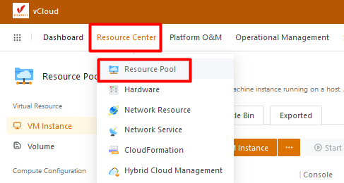

**Bước 2:**

Vào Mục Auto-Scaling Group > Create Auto Scaling-Group

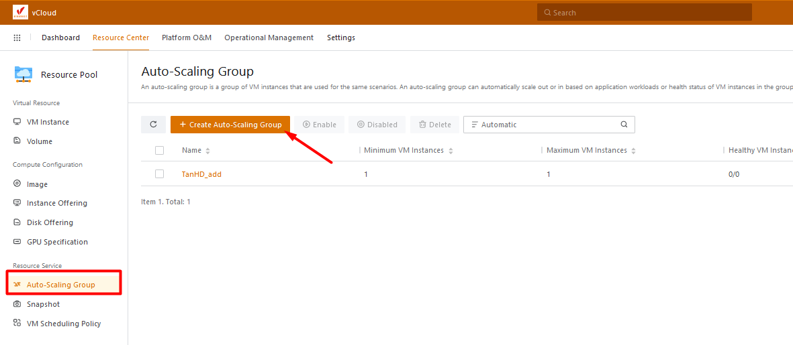

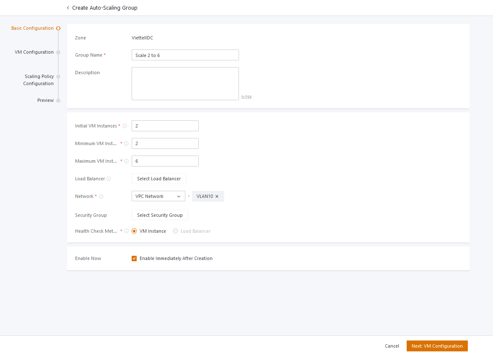

- Initial VM Instances: Số lượng VM khởi tạo
- Minimum VM Instances: Số lượng VM Scale nhỏ nhất
- Maximum VM Instances: Số lượng VM Scale lớn nhất
- Network: Chọn Vlan cho Scaling Group này
- Enable Now để kích hoạt lập tức

**Next: Cấu hình VM Scale**

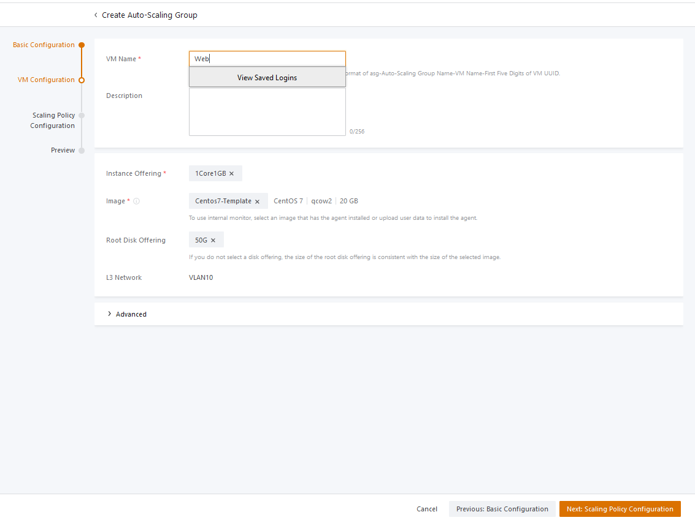

**Next: Cấu hình chính sách Scale VM**

- Scale Out: Tăng VM
- Scale In: Giảm VM

**Policy Type:**

- Resource-based Policy: Tăng/giảm theo resource của VM. Có thể Scale theo CPU hoặc Ram

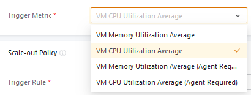

- Periodic Policy: Tăng/giảm theo lịch định kỳ. Có thể Scale theo Phút/Giờ/Ngày/Tháng/Năm

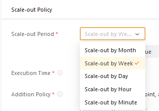

**Trigger:**

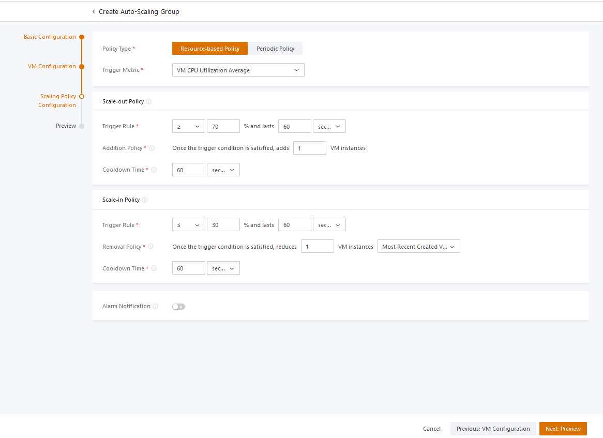

- Trigger Rule: Khi CPU >= 70% trong 60s gần nhất sẽ tăng thêm 1 VM (Addition Policy)
- Cooldown Time: Trong 60s sẽ không thực thiện tạo thêm VM mới

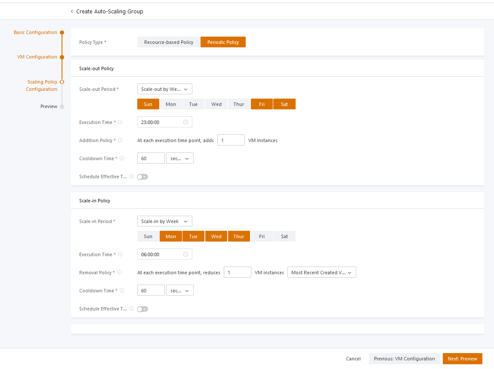

- Tăng VM vào 23:00 vào các ngày T6, T7, CN
- Giảm VM vào 6:00 từ T2 > T5
- Cooldown Time: Trong 60s sẽ không thực thiện tạo thêm VM mới

**Lưu ý:** Khi Scale-In nên chọn Option sau để loại các VM vừa tạo gần đầy nhất

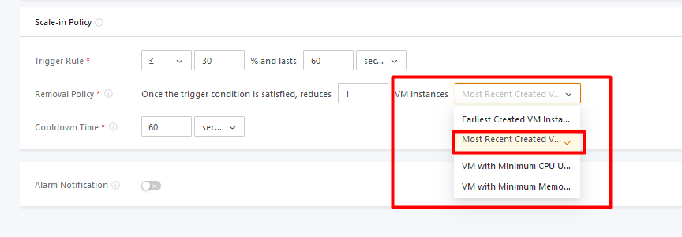

**Preview lại cấu hình và OK**

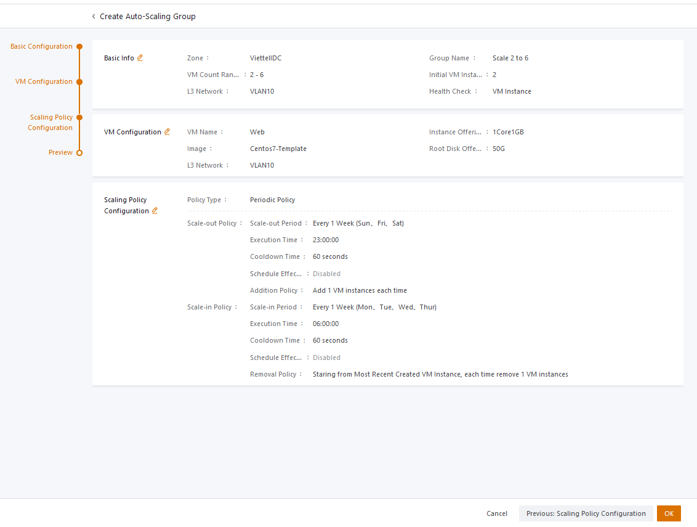

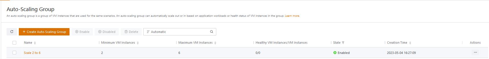

Chúc bạn thực hiện thành công!

> **THAM KHẢO CÁC DỊCH VỤ TẠI [VINAHOST](https://kb.vinahost.vn/)**
> 
> **\>>** [**SERVER**](https://vinahost.vn/thue-may-chu-rieng/) **–** [**COLOCATION**](https://vinahost.vn/colocation.html) – [**CDN**](https://vinahost.vn/dich-vu-cdn-chuyen-nghiep)
> 
> **\>> [CLOUD](https://vinahost.vn/cloud-server-gia-re/) – [VPS](https://vinahost.vn/vps-ssd-chuyen-nghiep/)**
> 
> **\>> [HOSTING](https://vinahost.vn/wordpress-hosting)**
> 
> **\>> [EMAIL](https://vinahost.vn/email-hosting)**
> 
> **\>> [WEBSITE](http://vinawebsite.vn/)**
> 
> **\>> [TÊN MIỀN](https://vinahost.vn/ten-mien-gia-re/)**
