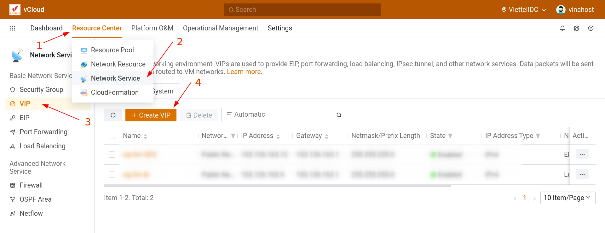

Bài viết này sẽ hướng dẫn bạn cách **hướng dẫn tạo EIP (Elastic IP) trên hệ thống Cloud VinaHost.** Nếu bạn cần hỗ trợ, xin vui lòng liên hệ VinaHost qua **Hotline 1900 6046 ext. 3**, email về [support@vinahost.vn](mailto:support@vinahost.vn) hoặc chat với VinaHost qua livechat [https://livechat.vinahost.vn/chat.php](https://livechat.vinahost.vn/chat.php).

**VIP (Virtual IP Address):** Một địa chỉ IP public chúng ta cần request ban đầu từ nhà cung cấp cloud. Địa chỉ VIP dùng để gán cho địa chỉ EIB từ đó mới gán cho từng ECS.

### **1\. Tạo VIP (Virtual IP Address)**

Sau khi đã login vào hệ thống, các bạn chọn **Resource Center > Network Service > VIP > Create VIP.**

Tiến hành đặt tên và chọn type Network, ở đây mình chọn là Public Network.

Kế đến là chọn Select Network Range.

**Lưu ý**: Các bạn có thể tự chọn và gán địa chỉ VIP vào ô Assign IP hoặc để trống, nếu để trống thì hệ thống sẽ tự chọn địa chỉ VIP. Cuối cùng nhấn Ok để tạo VIP.

Thông tin địa chỉ VIP sau khi đã tạo.

## **2\. Cách tạo EIP (Elastic IP)**

Để biết Elastic IP là gì, các bạn có thể thao khảo [tại đây.](https://vinahost.vn/elastic-ip-address/#:~:text=Elastic%20IP%20Address%20(EIP)%20l%C3%A0,li%C3%AAn%20k%E1%BA%BFt%20th%C3%B4ng%20qua%20NAT.)

Sau khi đã login vào hệ thống, các bạn chọn **Resource Center > Network Service > EIP > Create EIP.**

Tiến hành đặt tên cho EIP, các bạn có thể tạo trực tiếp VIP tại bước này. Tuy nhiên mình đã tạo sẵn VIP ở bước 1 nên mình sẽ chọn **Use Existing VIP.**

Sau khi đã tạo xong EIP, các bạn sẽ thấy thông tin địa chỉ Public IP sẽ giống với địa chỉ VIP vừa tạo lúc nãy 103.126.163.218.

Sau khi đã tạo EIP, bạn có thể assign địa chỉ EIP cho VM Instances theo bài viết [tại đây.](https://kb.vinahost.vn/them-eip-cho-vm-instance-tren-cloud-vinahost/)

Chúc bạn thực hiện thành công!

> **THAM KHẢO CÁC DỊCH VỤ TẠI [VINAHOST](https://kb.vinahost.vn/)**
> 
> **\>>** [**SERVER**](https://vinahost.vn/thue-may-chu-rieng/) **–** [**COLOCATION**](https://vinahost.vn/colocation.html) – [**CDN**](https://vinahost.vn/dich-vu-cdn-chuyen-nghiep)
> 
> **\>> [CLOUD](https://vinahost.vn/cloud-server-gia-re/) – [VPS](https://vinahost.vn/vps-ssd-chuyen-nghiep/)**
> 
> **\>> [HOSTING](https://vinahost.vn/wordpress-hosting)**
> 
> **\>> [EMAIL](https://vinahost.vn/email-hosting)**
> 
> **\>> [WEBSITE](http://vinawebsite.vn/)**
> 
> **\>> [TÊN MIỀN](https://vinahost.vn/ten-mien-gia-re/)**
